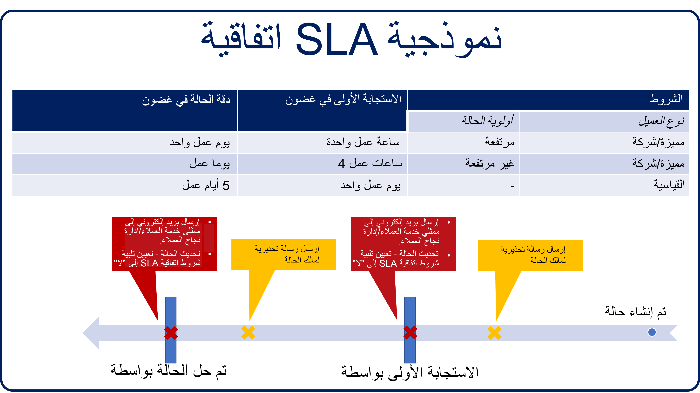

تقوم المؤسسات المستندة إلى خدمة العملاء بتعقب رضا العملاء والتميز عن مؤسسات الخدمات الأخرى بطرق منها تحديد مؤشرات الأداء الأساسية وتعقبها. *مؤشر الأداء الأساسي (KPI)* هي قيمة قابلة للقياس توضح مدى فعالية الشركة في تحقيق أهداف العمل الرئيسية. تستخدم المؤسسات مؤشرات الأداء الأساسية لتقييم نجاحها في الوصول إلى الأهداف.

يمكن أن تختلف مؤشرات الأداء الأساسية المحددة التي تتبعها المؤسسة على نطاق واسع. ومع ذلك، قد تتوفر العديد من مؤشرات الأداء الأساسية الشائعة للشركات لاستخدامها في قياس النجاح وتحسين خدمة العملاء:

-  **درجة مستوى رضا العملاء (CSAT)** - مؤشر الأداء الأساسي هذا هو الأكثر شيوعاً، ويمكنك الحصول عليه من خلال سؤال العملاء عن رضاهم عن عملك أو منتجك أو خدمتك.

-  **Net Promoter Score ‏(NPS)** - يقيس احتمالية قيام عملائك بإحالتك إلى شخص آخر.

-  **وقت الاستجابة الأولى** - يقيس سرعة استجابة العملاء الأولية عند ظهور مشكلة.

-  **وقت حل المكالمة** - يقيس مدى سرعة حل مشكلات العملاء.

-  **معدل الاحتفاظ بالعملاء** - القدرة على الاستمرار في الدفع للعملاء خلال فترة زمنية محددة.

-  **مشاركة الموظف** - يقيس مستوى التزام الموظف واتصاله بمؤسستك.

القائمة السابقة ليست شاملة. ومع ذلك، فإنه يوفر نظرة ثاقبة لما تهتم به مؤسسات خدمة العملاء عادةً.

يتضمن Microsoft Dynamics ‏365 Customer Service القدرة على تحديد اتفاقيات مستوى الخدمة (SLAs) لمساعدة المؤسسات على تلبية مستويات الخدمة المطلوبة عند تقديم الدعم للعملاء. باستخدام اتفاقيات مستوى الخدمة، يمكنك تتبع مؤشرات الأداء الأساسية الشائعة، مثل وقت الاستجابة الأول ووقت حل المكالمة، لكل حالة يتم إرسالها. بالإضافة إلى ذلك، يمكنك إنشاء مؤشرات أداء أساسية مخصصة تتعقب مزيداً من العناصر الخاصة بالأعمال والمهمة لمؤسستك.

كل اتفاقية مستوى خدمة قابلة للتكوين لنمذجة مؤشرات أداء أساسية مختلفة بناءً على سمات الحالة المختلفة. ستتضمن اتفاقية مستوى خدمة واحدة العديد من سطور تفاصيل اتفاقية مستوى الخدمة، التي تصف مؤشر الأداء الأساسي، الذي تقوم بتتبعه والإجراءات المرتبطة به.

يحدد كل سطر تفصيلي المعلمات التالية:

- **مؤشر الأداء الأساسي لاتفاقية مستوى الخدمة** - يحدد مؤشر الأداء الأساسي الذي تقوم بقياسه.

   **مثال**: الاستجابة الأولى بواسطة أو الحل بواسطة

- **يُطبّق في حالة** - يحدد الشروط التي يجب استيفاؤها لكي يتم تطبيق العنصر على الحالة.

   **مثال**: إذا كان **مستوى الخدمة** هو **ذهبي** وتم تعيين **أولوية الحالة** إلى **مرتفعة**

- **معايير النجاح** - تحدد كيف يبدو الحل الناجح لمؤشر الأداء الأساسي.

   **مثال**: إذا تم تعيين حقل **إرسال الاستجابة الأولى** إلى **نعم**

- **إجراءات النجاح** - تحدد إجراءً يجب اتخاذه في حالة الوفاء بمؤشر الأداء الأساسي.

   **مثال**: تحديث سجل الحالة للإشارة إلى أنه تم إرسال استجابة أولى

- **فشل عنصر اتفاقية مستوى الخدمة** - يحدد مدة الانتظار حتى يتم اعتبار العنصر فاشلاً أو لم يتم الوفاء به.

   **مثال**: لا يتم إجراء أي اتصال استجابة أولى خلال ساعة واحدة من إنشاء الحالة

- **إجراءات الفشل** - تحدد الإجراء (الإجراءات) الذي يجب القيام به إذا لم يتم الوفاء بمؤشر الأداء الأساسي.

   **مثال**: تصعيد الحالة إلى **قائمة انتظار التصعيد** وإعلام مدير الخدمة

- **تحذير عنصر اتفاقية مستوى الخدمة** - يحدد مدة الانتظار لتقديم تحذير بأن عنصر العمل معرض لخطر عدم الوفاء به.

   **مثال**: لا يتم إجراء أي اتصال استجابة أولى خلال 30 دقيقة من إنشاء الحالة

- **إجراءات التحذير** - تحدد إجراء (إجراءات) التحذير الذي يجب القيام به، إذا كان مؤشر الأداء الأساسي معرضاً لخطر عدم الوفاء به.

   **مثال**: إرسال رسالة إلكترونية للتذكير إلى المندوب المسؤول

توضح الصورة التالية الشكل الذي قد تبدو عليه اتفاقية مستوى الخدمة النموذجية لأنواع مختلفة من العملاء استناداً إلى مستوى الخدمة الموعود.

> [!div class="mx-imgBorder"]
> 

يوضح المثال السابق اتفاقية مستوى الخدمة التي لها ثلاثة شروط محددة:

- **نوع العميل** - **_متميز/شركة_*_و_* أولوية الحالة** = **_مرتفعة_**

  - **الاستجابة الأولى في غضون** - ساعة عمل واحدة

  - **حل الحالة في غضون** - يوم عمل واحد

- **نوع العميل** - **_متميز/شركة_*_و_* أولوية الحالة** = **_غير مرتفعة_**

  - **الاستجابة الأولى في غضون** - ‏4 ساعات عمل

  - **حل الحالة في غضون** - يوما عمل

- **نوع العميل** - **_قياسي_*_و_* أولوية الحالة** = **_أي_**

  - **الاستجابة الأولى في غضون** - يوم عمل واحد

  - **حل الحالة في غضون** - ‏5 أيام عمل

استناداً إلى نوع العميل الذي يرسل الحالة وأولوية الحالة، فإن اتفاقية مستوى الخدمة سوف:

- ترسل رسالة إلكترونية للتحذير إلى مالك الحالة، إذا كان في خطر عدم الوفاء بـ **الاستجابة الأولى حسب** مؤشر الأداء الأساسي.

   - ترسل رسالة إلكترونية إلى ممثل خدمة العملاء ومدير خدمة العملاء، إذا فشلا في الوفاء بـ **الاستجابة الأولى حسب** مؤشر الأداء الأساسي.

   - تحدث سجل الحالة عن طريق تعيين حقل **إرسال الاستجابة الأولى لاتفاقية مستوى الخدمة** إلى **لا**.

- ترسل رسالة إلكترونية للتحذير إلى مالك الحالة، إذا كان في خطر عدم الوفاء بـ **الحل حسب** مؤشر الأداء الأساسي.

   - ترسل رسالة إلكترونية إلى ممثل خدمة العملاء ومدير خدمة العملاء، إذا فشلات في الوفاء بـ **الحل حسب** مؤشر الأداء الأساسي.

   - تحدث سجل الحالة عن طريق تعيين حقل **حل اتفاقية مستوى الخدمة** إلى **لا**.

بالإضافة إلى ذلك، يمكن لاتفاقيات مستوى الخدمة مراعاة عوامل معينة، مثل ساعات العمل وإغلاق الأعمال، عند تحديد ما إذا كان قد تم الوفاء بمؤشر أداء أساسي أو لا. على سبيل المثال، ضع في اعتبارك سيناريو حيث تكون مؤسستك مفتوحة فقط من 8:00 ص إلى 5:00 م وقد وعدت العميل بوقت استجابة لمدة أربع ساعات.

- قد تعتمد الساعات الأربع على ساعات عمل مؤسستك، لذلك سيتطلب العميل الذي يتصل الساعة 3:00 م معاودة الاتصال بحلول الساعة 10:00 ص في يوم العمل التالي.

- إذا كان العميل مرتبطاً باتفاقية مستوى خدمة سارية المفعول طوال اليوم، كل يوم، فستتم مطالبتك بمعاودة الاتصال بحلول الساعة 7:00 م من ذلك اليوم.

يجب أن تفكر في جميع السيناريوهات التي تدعمها مؤسستك. تأكد من أنه يمكنك إعداد وتعيين اتفاقية مستوى الخدمة الصحيحة لنوع المكالمة المقابل الواردة.

هناك عامل آخر يجب مراعاته وهو الوقت الذي يقضيه في انتظار العميل. إذا حصل العميل على وعد بأنه سيتم حل الحالة في غضون أربع ساعات، فإن كل دقيقة مهمة. إذا كنت تقضي ساعتين من هذه الساعات الأربع في انتظار رد العميل إليك بكلمة مرور، فستحتاج إلى تحديد ما إذا كان يجب احتساب هذا الوقت مقابل الساعات الموعودة أو لا.

تدعم ميزة اتفاقية مستوى الخدمة في Dynamics 365 Customer Service هذه السيناريوهات المختلفة. سيرشدك الجزء المتبقي من هذه الوحدة خلال هذه السيناريوهات المختلفة، ويصف كيفية إعداد اتفاقيات مستوى الخدمة لتلبية تلك الاحتياجات المحددة.
