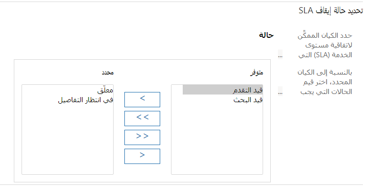

كما ذكرنا سابقاً، اتفاقيات مستوى الخدمة ليست خاصة بالعملاء؛ تم تحديدها على مستوى المؤسسة وتم تطبيقها على الحالات. بشكل جاهز، لا يحتوي سجل الحالة على حقل بحث لكيان اتفاقية مستوى الخدمة، لذا لا يتم تطبيق اتفاقية مستوى الخدمة على حالة، ما لم يتم تعيينها إلى اتفاقية مستوى الخدمة الافتراضية لمؤسستك أو مرتبطة [بالاستحقاق](/dynamics365/customer-service/create-entitlement-define-support-terms-customer/?azure-portal=true).

يوضح الجدول التالي كيفية تطبيق اتفاقيات SLA عند إنشاء حالة جديدة.

| الإجراء | ‏‫‏‏اتفاقية مستوى الخدمة (SLA) القابلة للتطبيق |
|--------|----------------|
| **تم إنشاء الحالة مع عدم وجود استحقاق مرتبط بها** | سيتم تطبيق اتفاقية مستوى الخدمة الافتراضية للمؤسسة على الحالة. في حالة عدم وجود اتفاقية مستوى خدمة افتراضية، لن يتم تطبيق أي اتفاقية مستوى خدمة على الحالة. |
| **الاستحقاق مرتبط بالحالة** | عندما يكون للاستحقاق اتفاقية مستوى خدمة مرتبطة نشطة، فسيتم تطبيق اتفاقية مستوى الخدمة المرتبطة على الحالة. عندما لا يتضمن الاستحقاق اتفاقية مستوى خدمة مرتبطة نشطة، فسيتم تطبيق اتفاقية مستوى الخدمة الافتراضية على الحالة. عندما لا يتضمن الاستحقاق اتفاقية مستوى خدمة مرتبطة نشطة، ولا توجد اتفاقية مستوى خدمة افتراضية، فلن يتم تطبيق أي اتفاقية مستوى خدمة على الحالة. |

لمزيد من المعلومات، راجع [كيفية تطبيق اتفاقيات مستوى الخدمة](/dynamics365/customer-engagement/customer-service/define-service-level-agreements?azure-portal=true#how-is-the-sla-applied) و[تطبيق اتفاقيات مستوى الخدمة حسب الطلب](/dynamics365/customer-engagement/customer-service/define-service-level-agreements?azure-portal=true#apply-sla-on-demand).

لا يمكن تعيين اتفاقية مستوى الخدمة باعتبارها الافتراضية لمؤسسة حتى يتم تنشيطها. يمكن أن يكون لدى المؤسسة اتفاقية مستوى خدمة واحدة تم تعيينها على أنها الافتراضية. سيؤدي تعيين اتفاقية مستوى خدمة أخرى باعتبارها الافتراضية إلى تجاوز الاتفاقية الافتراضية السابقة. إذا كنت بحاجة إلى إلغاء تنشيط اتفاقية مستوى الخدمة الافتراضية لسبب ما، فستحتاج إلى تعريفها على أنها الاتفاقية الافتراضية مرة أخرى بعد إعادة تنشيطها.

يجب إلغاء تنشيط اتفاقيات مستوى الخدمة متى أردت إجراء تغييرات. عند إلغاء تنشيط اتفاقية مستوى الخدمة، ستظل جميع الاستحقاقات المرتبطة باتفاقية مستوى الخدمة نشطة. عندما تكون اتفاقية مستوى الخدمة غير نشطة، لن يتم ملء جميع حقول اتفاقية مستوى الخدمة في الحالات المرتبطة باتفاقية مستوى الخدمة غير النشطة.

لمزيد من المعلومات، راجع [تعطيل اتفاقية مستوى خدمة في تطبيق Customer Service](/dynamics365/customer-engagement/customer-service/define-service-level-agreements?azure-portal=true#disable-the-sla) و[تعيين اتفاقية مستوى خدمة باعتبارها الاتفاقية الافتراضية](/dynamics365/customer-engagement/customer-service/define-service-level-agreements?azure-portal=true#set-the-sla-as-default).

## إيقاف اتفاقيات مستوى الخدمة مؤقتاً واستئنافها

ضع في اعتبارك سيناريو تعمل فيه في حالة مع عميل وتحتاج إلى معلومات محددة منه. أثناء انتظار عودة العميل إليك، قد ترغب في إيقاف وقت عملية الحساب مؤقتاً في اتفاقية مستوى الخدمة لضمان أن الوقت الذي تنتظر فيه العميل لن يؤثر على وقت عملية حساب اتفاقية مستوى الخدمة. على سبيل المثال، تم وعد العميل بوقت استجابة لمدة ساعتين، وبعد 30 دقيقة من الحالة، يتم وضعه في انتظار التفاصيل لمدة 45 دقيقة. عند استئناف المؤقت، سيتم احتساب الـ 30 دقيقة السابقة التي استثمرتها فقط في عملية حساب اتفاقية مستوى الخدمة. عند إنشاء عناصر اتفاقية مستوى الخدمة، يمكنك تحديد ما إذا كنت تريد السماح بإيقاف المؤقت مؤقتاً واستئنافه.

في مركز مسؤولي Customer Service‬، يمكنك تحديد حالتي **إيقاف مؤقتاً** و **استئناف** لجدول محدد، مثل الحالات. تتيح لك هذه الميزة وضع حالة **قيد الانتظار** وعدم احتساب وقت الانتظار مقابل المؤقت. في مركز مسؤولي Customer Service، انتقل إلى **شروط الخدمة**، وحدد **إدارة** بجوار **الإعدادات الأخرى**. من هذه الصفحة، يمكنك التحكم في ما إذا كانت مؤسستك تريد استخدام وظيفة اتفاقية مستوى الخدمة، ويمكنك تحديد الحالات التي سيتم اعتبارها متوقفة مؤقتاً لكل كيان تم تمكينه لاتفاقية مستوى الخدمة. على سبيل المثال، يمكنك اختيار تحديد حالات الإيقاف المؤقت لكيان الحالة باعتبارها **قيد الانتظار** أو **في انتظار التفاصيل**. بعد إعداد تلك الحالات، كلما تم اختيار هذه الحالات، سيتم إيقاف اتفاقية مستوى الخدمة (SLA) بشكل مؤقت تلقائياً.

> [!div class="mx-imgBorder"]
> 

لمزيد من المعلومات، راجع [علامة التبويب خدمة إعدادات النظام](/dynamics365/customer-engagement/admin/system-settings-dialog-box-service-tab?azure-portal=true)، حيث تتم مناقشة المواضيع، بما في ذلك إعداد حالتي الإيقاف المؤقت والاستئناف في إعدادات الخدمة.

## عنصر تحكم المؤقت

يمكنك إضافة عنصر تحكم مؤقت إلى أي كيان من خلال شاشة تخصيص النموذج لتوفير معلومات العد التنازلي لأي مؤشر أداء أساسي محدد في هذا الكيان. عند إضافة عنصر تحكم مؤقت، يمكنك إعداد المعلمات التالية:

-   **حقل وقت الفشل** - يحدد الحقل المستند إلى التاريخ/الوقت الذي سيتم استخدامه لحساب النجاح أو الفشل، مثل حقل **تاريخ الإنشاء**. (مطلوب)

-   **شرط النجاح:** - يحدد الحقل وقيمة الحقل التي تحدد الحل الناجح، مثل تعيين حقل **إرسال الاستجابة الأولى** إلى **نعم**. (مطلوب)

-   **شرط الفشل** - حدد الحقل وقيمة الحقل التي تحدد الفشل للوقت، مثل تعيين حقل **إرسال الاستجابة الأولى** إلى **لا**.

-   **شرط التحذير** - يحدد الحقل وقيمة الحقل التي تحدد متى يجب تشغيل تحذير.

-   **إلغاء الشرط** - يحدد الحقل وقيمة الحقل التي تحدد متى يجب إلغاء المؤقت، مثل تعيين **سبب الحالة** إلى **تم الحل**.

-   **إيقاف الشرط مؤقتاً** - يحدد الحقل وقيمة الحقل التي تحدد متى يجب إيقاف المؤقت مؤقتاً، مثل تعيين **سبب الحالة** إلى **في انتظار التفاصيل**.

يمكنك إضافة وتحديد عناصر تحكم المؤقت، كلما احتجت إلى استخدام إمكانات العد التنازلي. سيتغير لون المؤقت ليعكس الحالات المختلفة، مثل الأخضر للكل جيد، والأصفر للتحذيرات، والأحمر لحالات الفشل.

لمزيد من المعلومات، راجع [إضافة عنصر تحكم مؤقت للكيانات الممكنة لاتفاقيات مستوى الخدمة](/dynamics365/customer-engagement/customer-service/add-timer-control-case-form-track-time-against-sla?azure-portal=true).
