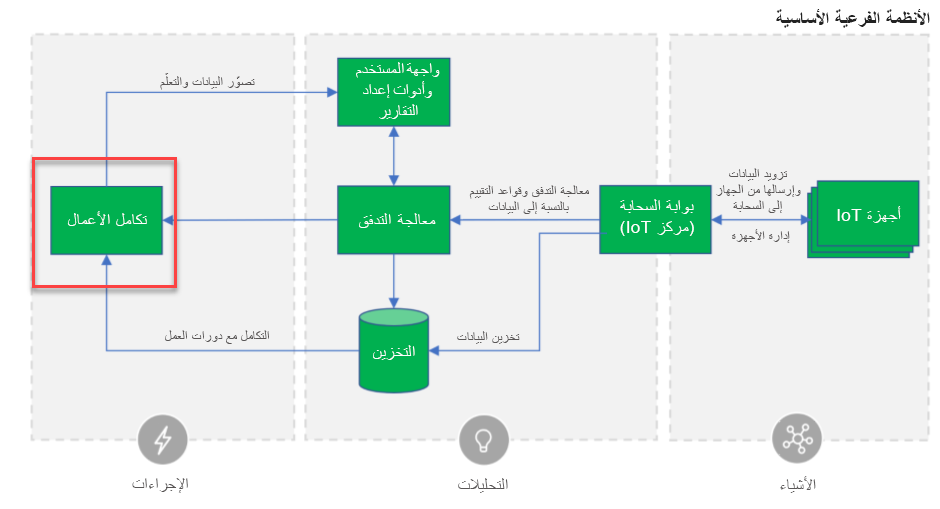

مع كل التكنولوجيا المتاحة للمستهلكين اليوم، فإن كونك عميلاً هو تجربة مختلفة كثيراً عن أي وقت سابق. أحد المجالات التي أثرت علينا بشكل كبير كعملاء هو إنترنت الأشياء. يشير إنترنت الأشياء (IoT) إلى الأجهزة المادية المتصلة بالإنترنت حول العالم. يقوم كل جهاز من هذه الأجهزة بجمع البيانات ومشاركتها. نظراً لرقائق الكمبيوتر الرخيصة والتوافر العالمي للشبكات اللاسلكية، يمكنك التواصل مع أي شيء من شيء صغير مثل حبوب منع الحمل إلى شيء مهم مثل طائرة كبيرة. يضيف توصيل هذه الكائنات وإضافة أجهزة استشعار مستوى من الذكاء الرقمي إلى الأجهزة التي لولا ذلك لن تكون على دراية بالعالم من حولها. الآن يمكن لهذه الأجهزة التواصل في الوقت الفعلي دون إشراك أي إنسان.

تقوم كل أجهزة إنترنت الأشياء هذه بتوليد البيانات. قد يتم تشغيل بعض هذه البيانات بناءً على حدث يقع، مثل أجهزة الاستشعار التي تكتشف شيئاً ما، أو شخص ما بدأ الحدث. على سبيل المثال، قد يتم تشغيل مستشعر درجة الحرارة في الثلاجة الذكية، عندما تزيد درجة الحرارة عن درجة حرارة معينة. اعتماداً على الأجهزة، يمكن أن تكون كمية البيانات القادمة من الأجهزة كبيرة. يمكن تقديم بيانات أخرى من خلال البث المستمر لتفاصيل الحالة. بغض النظر عن كيفية التقاط البيانات وبثها، مع كل تلك البيانات الواردة من الأجهزة التي تدعم إنترنت الأشياء، فمن السهل على المؤسسات التركيز على التفاصيل منخفضة المستوى لاستيعاب البيانات عن بُعد ونسيان كيفية التعامل مع المشكلة التي تم اكتشافها والحصول على فني في الموقع لحلها.

## نظرة عامة على Connected Customer Service

إن Connected Customer Service عبارة عن حل إضافي لـ Dynamics 365 Customer Service الذي يربط بيانات القياس عن بُعد لـ IoT بإجراءات العمل في مركز خدمة العملاء في Dynamics 365 وتطبيقات Customer Service workspace. يمكن أن تأخذ البيانات التي يتم استيعابها وتساعد في تنفيذ إجراءات العمل الفعلية على البيانات. في كثير من الحالات، يسمح هذا للشركات بأن تصبح استباقية بدلاً من كونها تفاعلية، وتحويل نموذج أعمالها الخاص بكيفية عملها مع عملائها.

كيف يعمل هذا؟ تتمثل أبسط طريقة للتفكير في إنترنت الأشياء كجزء من حل إنترنت الأشياء الكامل في تغطية المجالات الرئيسية الثلاثة التالية:

> [!div class="mx-imgBorder"]
> 

مع كل الضجيج حول إنترنت الأشياء، من السهل التركيز على التفاصيل المنخفضة المستوى لاستيعاب القياس عن بُعد ونسيان كيفية التعامل مع المشكلة التي تم اكتشافها وحلها.

## الكشف والتشخيص بشكل استباقي

تعد Connected Customer Service جزءاً مهماً من الإجراءات المستندة إلى الرؤى. نظراً لأنه يتم جمع البيانات من أجهزة إنترنت الأشياء، يمكن عرضها في مركز Dynamics 365 Customer Service وCustomer Service workspace. بمجرد التقاط البيانات، يمكن للمؤسسات بدء إجراءات العمل بناءً على البيانات المستلمة. هذا لا يخلق فقط القدرة على اكتشاف المشكلات وتشخيصها قبل أن يكون العملاء على دراية بها، ولكنه يتيح أيضاً لأجهزة إنترنت الأشياء توفير اتصال أولي مع مؤسسة.

الرسم التخطيطي التالي مأخوذ من البنية المرجعية لإنترنت الأشياء في Microsoft Azure مع تمييز حول تكامل الأعمال حيث تتلاءم Connected Field Service مع البنية المرجعية.

> [!div class="mx-imgBorder"]
> 

على سبيل المثال، عندما يُطلق المستشعر الموجود في تلك الثلاجة الذكية تنبيهاً بأن الفلتر يحتاج إلى الاستبدال، يمكن طلب وتسليم الأجزاء المحددة المطلوبة. إذا كان الفني مطلوباً، فيمكنك استخدام هذه المعلومات لجدولة زيارة في الموقع بشكل استباقي، أو ببساطة أمر تلقائي لإعادة ضبط الجهاز.

مثال آخر سيكون السيارة الذكية. المزيد والمزيد من السيارات يمكنها إجراء التشخيص الذاتي. عند اكتشاف مشكلة، يتم إخطار المالكين، وسؤالهم عما إذا كانوا يريدون تحديد موعد خدمة. باستخدام Dynamics 365 Connected Customer Service، يمكن للمؤسسات تشغيل عمليات الأعمال الفعلية الخاصة بها بناءً على تلك البيانات.
