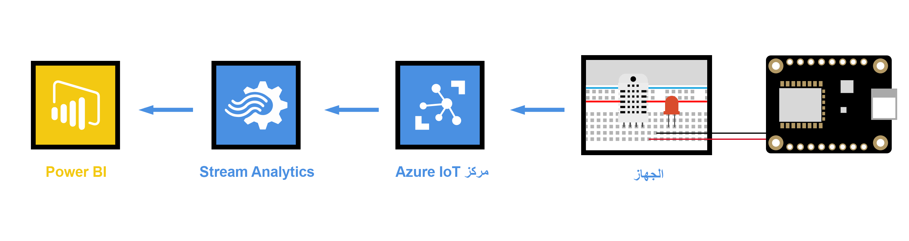
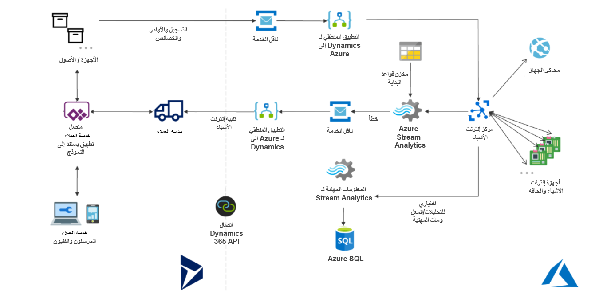
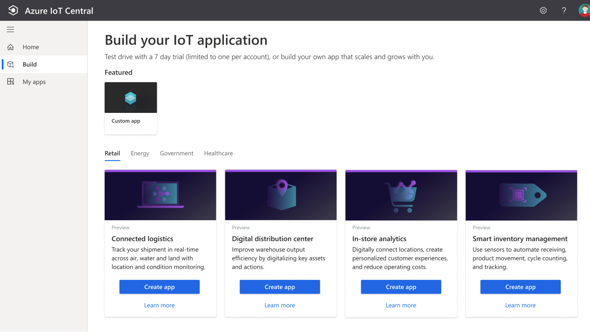
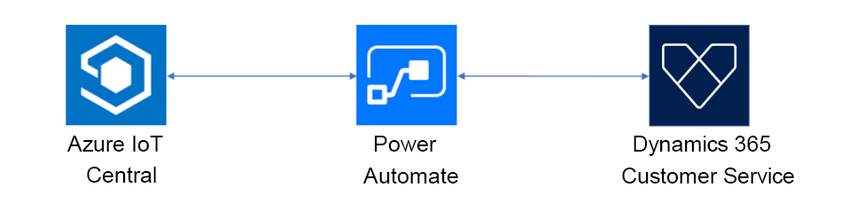

في هذه الوحدة، سنتعرف على خيارات التوزيع المختلفة لـ Connected Customer Service وAzure IoT. 

## خدمات Azure IoT

يحتوي Microsoft Azure على العديد من الخدمات التي تدعم إنشاء حلول مستندة إلى IoT بما في ذلك Azure IoT Hub و‏‫الأجهزة المتماثلة وخدمة تزويد الأجهزة وتحليلات التدفق وتحليلات السلسلة الزمنية وحافة IoT والعديد من الخدمات الأخرى.

تعمل Connected Customer Service مع خدمات Azure IoT لتأسيس اتصال ثنائي الاتجاه آمن مع أجهزة IoT المتصلة وإدارة بيانات تتبع الاستخدام وإصدار أوامر لأجهزة IoT المتصلة.

ومن القرارات المهمة عند نشر حل Connected Customer Service اختيار نوع التوزيع. فيما يلي طريقتان يمكنك من خلالهما توصيل الأجهزة التي تدعم IoT بـ Dynamics 365 Customer Service:

-   Connected Customer Service لـ [Azure IoT Central](https://azure.microsoft.com/services/iot-central/?azure-portal=true)

-   Connected Customer Service لـ [Azure IoT Hub](https://azure.microsoft.com/services/iot-hub/?azure-portal=true)

## Connected Customer Service لـ Azure IoT Hub

مركز Azure IoT Hub هي خدمة مُدارة يتم استضافتها في المجموعة وتعمل كمركز رسائل مركزي للاتصال ثنائي الاتجاه بين تطبيق IoT والأجهزة التي يديرها. يمكنك استخدام Azure IoT Hub لإنشاء حلول IoT من خلال اتصالات موثوقة وآمنة بين الملايين من أجهزة IoT وحل مستضاف على المجموعة. يمكنك توصيل أي جهاز تقريباً بمركز IoT الخاص بك.

تدعم خدمة IoT Hub الاتصالات من الجهاز إلى المجموعة ومن المجموعة إلى الجهاز. كما أنه يدعم أنماط المراسلة المتعددة، مثل قياس تتبع الاستخدام الخاصة بجهاز إلى مجموعة، وتحميل الملفات من الأجهزة وأساليب الطلب والرد للتحكم في أجهزتك من المجموعة. بعد أن يستقبل مركز IoT الرسائل من أحد الأجهزة، يمكنه توجيه هذه الرسالة إلى خدمات Azure الأخرى.

من منظور المجموعة إلى الجهاز، يسمح محور IoT بالأمر والتحكم. وهذا يعني أنه يمكن أن يكون لديك إما تحكم يدوي أو تلقائي عن بعد للأجهزة المتصلة بحيث يمكنك توجيه الجهاز لفتح الصمامات وتعيين درجات الحرارة المستهدفة وإعادة تشغيل الأجهزة العالقة وما إلى ذلك.

تساعدك مراقبة مركز IoT‬ في الحفاظ على صحة الحل الخاص بك عن طريق تعقب الأحداث مثل إنشاء الأجهزة وفشل الأجهزة واتصالات الأجهزة.

غالباً ما يتم دمج محور IoT مع خدمات Azure الأخرى لإنشاء حلول IoT. في الرسم التخطيطي التالي، يمكنك رؤية بيانات تتبع الاستخدام التي تم إرسالها من أجهزة IoT إلى ‏‫مركز IoT‬ قبل التحليل باستخدام Stream Analytics ثم إدخالها إلى Power BI لتمثيل بيانات تتبع الاستخدام بصرياً.

> [!div class="mx-imgBorder"]
> 

Connected Customer Service لـ Azure IoT Hub عبارة عن حل إضافي يوفر نظام Azure IoT الأساسي كعرض خدمة (PaaS) التي تقدم إلى Dynamics 365 Customer Service. باستخدام هذا العرض، يمكنك تشغيل تطبيق توزيع لتجميع كافة خدمات Azure IoT وألغاز Dynamics 365 معاً.

توفر Microsoft قالباً جاهزاً للمؤسسات يمكنك تخصيصه للتوزيع الخاص بك. يقوم القالب بنشر خدمات Azure التالية:

- Azure IoT Hub

- Azure Stream Analytics

- خدمة ناقل Azure

- مساحة تخزين Azure

- Azure Logic Apps

- Azure SQL Server

- رؤى الخدمات الزمنية لـ Azure

يوضح المخطط التالي ذلك.

> [!div class="mx-imgBorder"]
> 

> [!NOTE]
> يتضمن النموذج جهاز محاكاة درجة الحرارة كتطبيق ويب.

لمزيد من المعلومات حول البنية والمكونات، راجع [بنية Connected Customer Service مع IoT Hub](/dynamics365/customer-service/cs-iot-connected-customer-service-architecture?azure-portal=true).

> [!IMPORTANT]
> ستحتاج إلى توفير اشتراك في المجموعة من Azure لنشر خدمات Azure IoT هذه وتشغيلها.

عادةً ما يتم الاستفادة من Azure IoT Hub من خلال مؤسسات الشركات الكبيرة أو في السيناريوهات التي تحتاج فيها المؤسسات إلى تحديد بيانات خاصة للغاية أو المخصصة حول الأجهزة.

## Connected Customer Service لـ Azure IoT Central

يعد Azure IoT Central حلاً مُداراً بالكامل لخدمة تأجير برامج IoT كخدمة (SaaS).
تقوم Azure IoT Central بالبناء عن طريق إضافة لوحة معلومات تتيح لك الاتصال بأجهزة IoT ومراقبتها وإدارتها. تسهل واجهة المستخدم المرئية (UI) الاتصال السريع بالأجهزة الجديدة ومراقبتها بمجرد بدء إرسال بيانات تتبع الاستخدام أو رسائل الخطأ. يمكنك مشاهدة الأداء العام عبر جميع الأجهزة بشكل إجمالي ويمكنك إعداد التنبيهات التي ترسل إخطارات عندما يحتاج جهاز معين إلى صيانة. وأخيراً، يمكنك دفع تحديثات البرامج الثابتة إلى الجهاز.

لمساعدتك على بدء العمل بسرعة، يوفر IoT Central قوالب البدء للسيناريوهات الشائعة عبر مختلف الصناعات مثل البيع بالتجزئة والطاقة والرعاية الصحية والحكومة. يمكنك بعد ذلك تخصيص قوالب بدء التصميم مباشرةً في واجهة المستخدم عن طريق الاختيار من السمات الموجودة أو إنشاء السمة المخصصة الخاصة بك وتعيين الشعار وما إلى ذلك. باستخدام IoT Central، يمكنك تخصيص قوالب البدء للبيانات المحددة التي يتم إرسالها من الأجهزة الخاصة بك والتقارير التي تريد مشاهدتها والتنبيهات التي ترغب في إرسالها.

> [!div class="mx-imgBorder"]
> 

توفر Connected Customer Service لـ IoT Central تكاملاً مباشراً لـ Dynamics 365 Customer Service مع Azure IoT Central.

يمكّن Microsoft Azure IoT Central المنشئين من تكوين القواعد والإجراءات. بناءً على هذه الإجراءات، سيتم إنشاء تنبيهات IoT في Connected Customer Service. بالإضافة إلى ذلك، وفقاً لأنشطة الخدمة في Connected Customer Service، يمكن إعادة إرسال المعلومات إلى IoT Central. يتم تحقيق التفاعل ذهاباً وإياباً بين IoT Central وConnected Customer Service باستخدام Power Automate.

> [!div class="mx-imgBorder"]
> 

يمكن تنفيذ عمليات التكامل الشامل بسهولة استناداً إلى تجربة التكوين الخالصة:

-   يمكن لـ Azure IoT Central إرسال معلومات حول الحالات الشاذة في الجهاز إلى Connected Customer Service (‏‫كتنبيه IoT‬) لإجراء التشخيص.

-   يمكن لـ Connected Customer Service يمكن إنشاء الحالات أو أوامر العمل التي يتم تشغيلها من الحالات الشاذة في الجهاز.

الميزة الأساسية للاستفادة من Azure IoT Central هي أنها لا تتطلب معلومات شامل عن المجموعة أو مهارات الترميز للحصول على حل IoT وتشغيله. من خلال الاستفادة من قوالب [Power Automate](https://flow.microsoft.com/templates/?azure-portal=true)، يمكن للمستخدمين توصيل حساباتهم والاستفادة من القوالب المنشأة مسبقاً وتخصيص التدفقات المجموعة الخاصة بهم في مصمم مرئي سهل دون الحاجة إلى خبرة بالترميز.

> [!NOTE]
> على الرغم من أنه يمكنك استخدام Azure IoT Central بدون اشتراك Azure، لاستخدام مجموعة Power Automate مع IoT Central فأنت بحاجة إلى اشتراك Azure.

## مقارنة أنواع التوزيع

لفهم أفضل للمفاضلة، يعرض الجدول التالي مقارنة بين نوعي التوزيع.

| **‏‫الخصائص**| **مركز IoT** | **IoT Central** |
| ---- | ---- | ---- |
| **الاستخدام الأساسي**| لتسريع تطوير حل IoT مخصص يحتاج إلى أقصى قدر من المرونة. | لتسريع وقت التسويق لحلول IoT المباشرة مثل المراقبة عن بعد للأنظمة. |
| **الوصول إلى خدمات Azure الأساسية**| يمكنه إدارة جميع خدمات Azure. | الوصول فقط عبر مدخل IoT Central دون الوصول إلى خدمات Azure الأساسية. |
| **المرونة**| يمكن تعديل المكونات وتضمين خدمات Azure الإضافية وتغيير التعليمات البرمجية لتلبية متطلبات محددة. يمكن تضمين وظائف Azure لإجراء العمليات الحسابية ويمكن تطبيق نماذج التعلم الآلي لاكتشاف الحالات الشاذة والمشكلات الأخرى المتعلقة بقياس تتبع الاستخدام للجهاز. | يحتوي تطبيق IoT Central على قدرات تخصيص محدودة. تتمحور القدرة على إنشاء تنبيهات من قياس تتبع الاستخدام حول الخرق البسيط لقيم الحد الفاصل. |
| **مستوى المهارة**| يتطلب معرفة Azure ومهارات المطور لتخصيص المكونات التي تقوم بإنشاء الرؤى. | لا توجد مهارات مطور مطلوبة، ويكون مستوى المهارة مكافئاً لتخصيص Dynamics 365. |
| **التسعير**| يتم إنشاء التكاليف بواسطة كل مكون من مكونات Azure الفردية ويمكن ضبطها باستخدام تقنيات إدارة التكلفة في Azure  | تسعير بسيط ومتوقع بناءً على عدد تطبيقات IoT Central والأجهزة المتصلة. |
