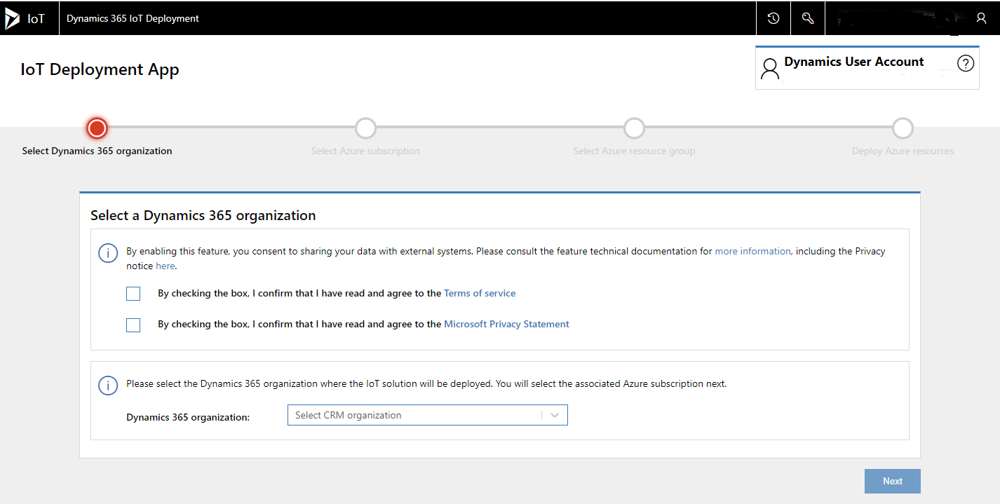
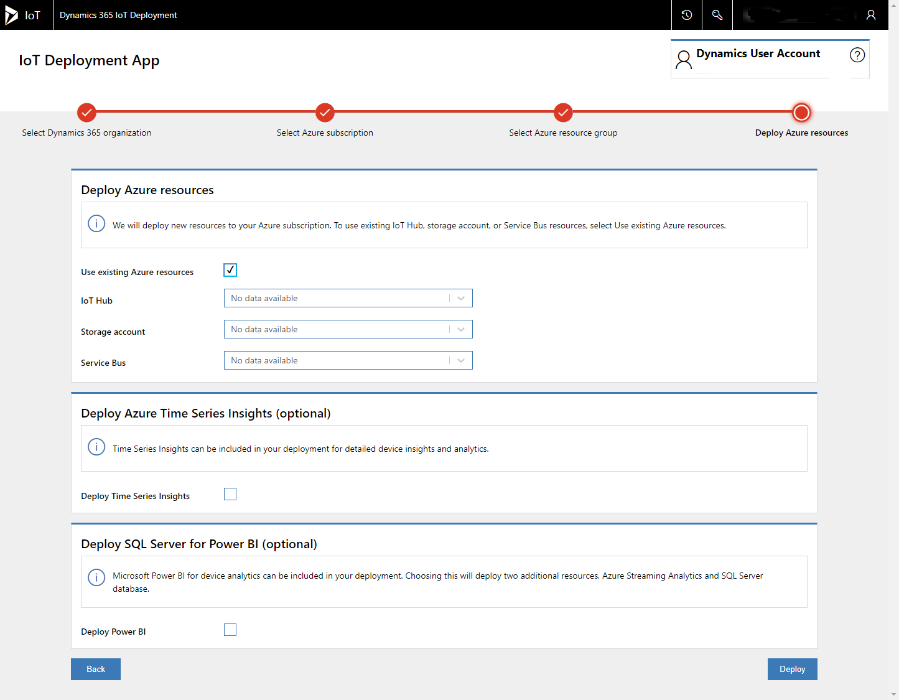
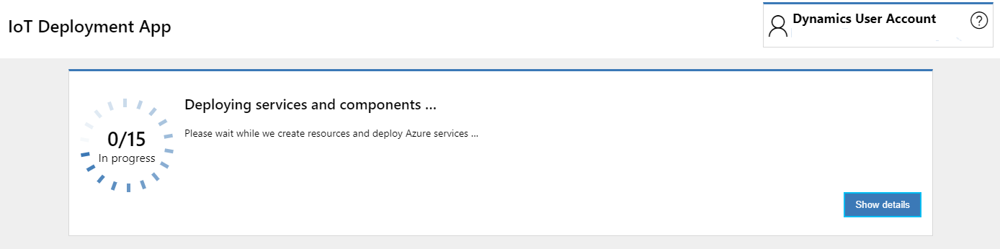
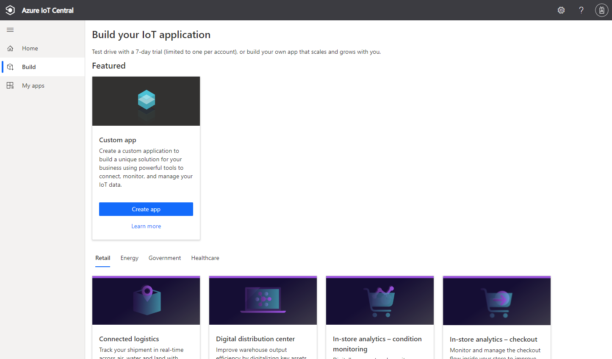
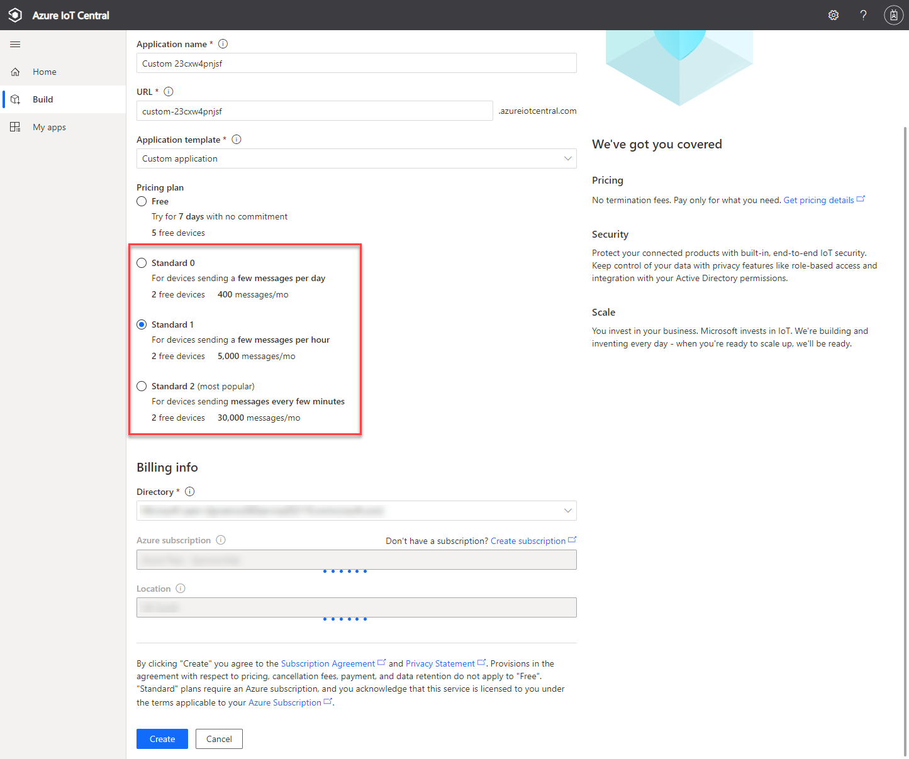
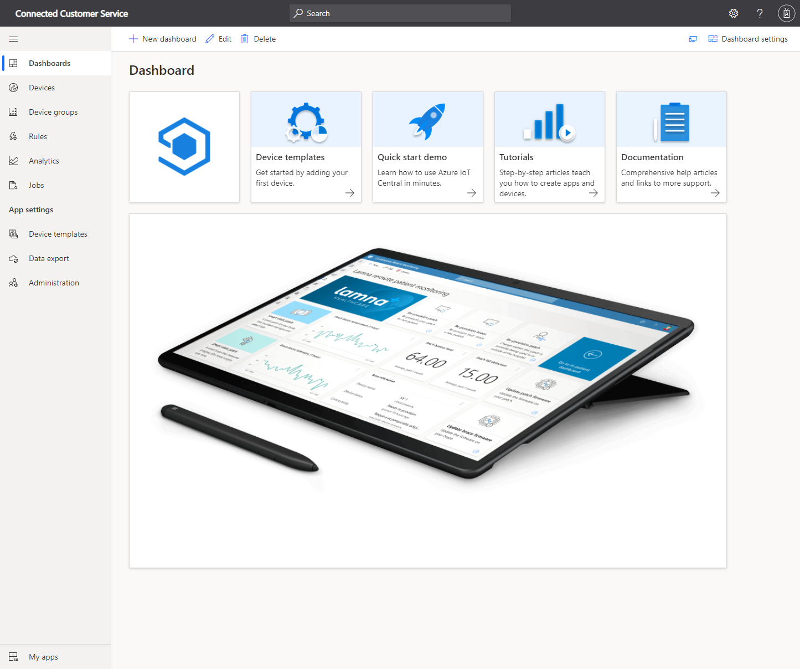

لتثبيت Connected Customer Service، سيلزمك توفير الآتي:

- Dynamics 365 Customer Service مع بيانات اعتماد مسؤول النظام.

- الوصول إلى اشتراك Microsoft Azure.

## تثبيت Connected Customer Service لـ Azure IoT Hub

يمكنك نشر Connected Customer Service لـ Microsoft Azure IoT Hub مع معالج خطوة بخطوة. ابدأ المعالج من خلال الانتقال إلى [تطبيق IoT Deployment](https://iotdeployment.dynamics.com/?azure-portal=true) في متصفح، ثم سجل الدخول باستخدام بيانات اعتماد Microsoft Dynamics 365.

> [!div class="mx-imgBorder"]
> 

في شاشة **تطبيق IoT Deployment**، حدد بيئة Dynamics 365 واشتراك Azure. ثم، حدد موارد Azure الموجودة أو مطالبة التطبيق بتوزيع موارد Azure جديدة من القالب.

> [!div class="mx-imgBorder"]
> 

> [!IMPORTANT]
> لتوزيع Connected Customer Service لـ Azure، ستحتاج إلى بيانات اعتماد حساب المؤسسة لـ Azure مع القدرة على إنشاء مجموعة موارد Azure وموارد Azure.

سيقوم التطبيق بتوزيع الموارد وسوف يعرض تقدم التوزيع، كما هو موضح في لقطة الشاشة الآتية.

> [!div class="mx-imgBorder"]
> 

عندما يتم توزيع الموارد، يمكنك بدء اتصال الأجهزة بـ Dynamics 365 Customer Service.

## تثبيت Connected Customer Service لـ Azure IoT Central

أولاً، يتطلب تثبيت Connected Customer Service لـ Azure IoT Central إنشاء تطبيق Azure IoT Central.

1. انتقل إلى [Azure IoT Central](https://apps.azureiotcentral.com/?azure-portal=true) في مستعرض وقم بتسجيل الدخول باستخدام بيانات اعتماد Dynamics 365. 

2. ضمن منطقة **الإنشاء**، حدد **تطبيق مخصص**.

> [!div class="mx-imgBorder"]
> 

3. حدد الزر **إنشاء تطبيق** والذي سيعرض الشاشة التالية.

> [!div class="mx-imgBorder"]
> 

4. امنح التطبيق اسماً، ثم تأكد من أن عنوان URL فريداً.

> [!IMPORTANT]
> تجنب تحديد خطة الأسعار **مجاناً**. تأكد من اختيار أحد خطط التسعير القياسية لكي تتمكن من توصيل IoT Central بـ Dynamics 365 باستخدام تدفقات سحابة Microsoft Power Automate.

5. اختر خطة التسعير ثم حدد اشتراك Azure.

6. حدد **إنشاء** لتوفير تطبيق IoT Central.

بعد بضع ثوانٍ، سيتم عرض لوحة معلومات التطبيق.

> [!div class="mx-imgBorder"]
> 

أنت الآن على استعداد لإضافة أجهزة إلى Connected Customer Service.
