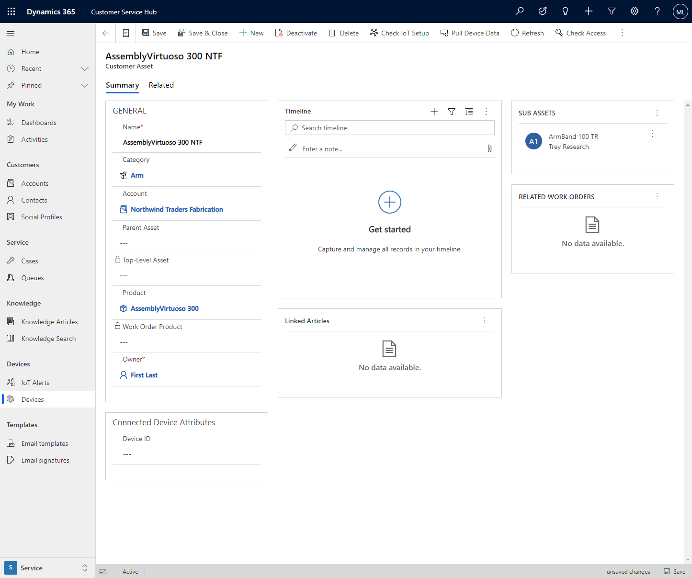

يتم تضمين المكونات اللازمة للتفاعل مع أجهزة IoT في مركز خدمة العملاء وCustomer Service workspace.

لا تحصل Connected Customer Service على البيانات الفعلية من أجهزة IoT.
يتم الحصول على قياس تتبع استخدام البيانات الخاصة بأجهزة IoT في Azure IoT hub أو تطبيق IoT Central Azure. لا تحصل خدمات Azure هذه على قياس تتبع الاستخدام الذي يرسله الجهاز فحسب، بل يمكنها أيضًا التواصل مع جهاز IoT.

تم تضمين الجداول التالية في Connected Customer Service وهي مجموعة فرعية أساسية من الجداول التي تدعم التكامل مع Azure IoT.

| **اسم الجدول**          | **الوصف**                                                                                     |
|-------------------------|-----------------------------------------------------------------------------------------------------|
| **أصل العميل**      | تمثل معدات العملاء المسؤولة عن الدعم.                             |
| **تنبيه IoT**           | يمثل حدثًا بارزًا مُرسَل من IoT Hub أو IoT Central.                                     |
| **جهاز IoT**          | جهاز متصل تم تسجيله في IoT Hub أو IoT Central.                                            |
| **فئة جهاز IoT** | تستخدم لتجميع الأجهزة معًا لتبسيط التعامل مع الأجهزة.                                    |
| **أمر جهاز IoT**  | رسالة أو أمر ، مرسل إلى IoT Hub أو IoT Central لإرسالها إلى جهاز.                     |
| **تعريف الأوامر**  | أوامر منشأة مسبقًا يمكن إرسالها إلى أجهزة IoT المسجلة استجابةً لعناصر مثل تنبيهات IoT. |
| **تعريف الخاصية** | يحدد خاصية جهاز أو معلمة يمكن استخدامها في تعريفات الأوامر.                 |

## الأصول وأجهزة IoT الخاصة بالعميل

تتيح لك أصول العميل تعقب المعدات التي تكون مسؤولاً عن مراقبتها. في أبسط صورها، تشير أصول العملاء إلى المنتجات الموجودة في كل موقع من مواقع العميل. تقوم الأصول أيضًا بتعقب سجل الخدمة لكل أصل.

باستخدام Connected Customer Service، يمكنك ربط أصول العميل بأجهزة IoT التي تراقب سلامة الأصل وتشغيل تنبيهات IoT.

تقترن سجلات أصول العميل في Dynamics 365 Customer Service بسجلات أجهزة IoT في Connected Customer Service.

ترتبط أصول العميل بالعميل من خلال الحساب الخاص به ويمكن تصنيفها. كما يمكن أن توجد في تدرج هرمي مع أصول أساسية وفرعية.

> [!div class="mx-imgBorder"]
> 

بمجرد اقتران جهاز متصل بالأصل الخاص بالعميل، يمكنك عرض أي تنبهيات IoT يتم رفعها للجهاز من نموذج أصل العميل والاطلاع على تفاصيل جهاز IoT وعرض سجل بيانات الجهاز.

## كيفية إنشاء تنبهيات IoT في Connected Customer Service

بمجرد الحصول على بيانات من الأجهزة، تقوم القواعد الموجودة ضمن خدمات Azure بتحديد الوقت الذي يجب فيه تشغيل أحد الأصناف لأحد التنبيهات. وبمجرد تشغيل التنبيه، يجب إرسال البيانات إلى Dynamics 365 بواسطة Logic Apps، وذلك في حالة استخدام IoT Hub وبواسطة تدفقات سحابة Power Automate في حالة استخدام IoT Central.

بعد توفر بيانات IoT في Dynamics 365، يمكنك بناء إجراءات العمل لمعالجتها.
