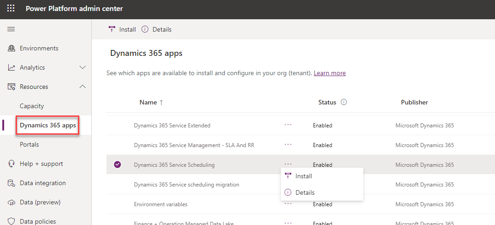

تؤدي العديد من المؤسسات أنشطة قائمة على الخدمة لعملائها، مثل الإصلاحات أو خدمات الصحة والجمال أو عمليات تثبيت المنتجات.
يمكن إرسال العمال إلى الميدان لأداء العمل، استناداً إلى المؤسسة. يتم تنفيذ الخدمات في كثير من الأحيان في مواقع خدمتهم.
على سبيل المثال، كعميل، قد تأخذ حيواناً أليفاً إلى مربية، أو تأخذ سيارة للخدمة، أو تحتاج إلى تغيير قطعة من الملابس، أو تطلب تثبيت عنصر ما بعد البيع. إنهم بحاجة إلى تحديد مواردهم المتاحة وجدولتها لأداء الخدمة، بغض النظر عن نموذج الخدمة الذي تستخدمه المؤسسة. 

تحتاج المؤسسة التي تقدم الخدمات إلى تنفيذ تلك الخدمات بأكثر الطرق فاعلية ممكنة. يتضمن هذا المطلب جدولة الخدمة وتنفيذها في الوقت المناسب. علاوة على ذلك، تحتاج إلى التأكد أن كل من يؤدي الخدمة مؤهل ولديه المعدات الدقيقة للقيام بالمهمة. لن يتمكن من إكمال الخدمة بدون المعدات اللازمة، بغض النظر عن مستوى مهارة الفني.

تساعد Microsoft Dynamics 365 Customer Service المؤسسات على جدولة الخدمات بشكل أكثر فاعلية لعملائها من خلال ميزة جدولة Customer Service.
تستخدم هذه الميزة الحل Universal Resource Scheduling من Dynamics 365. يساعد الحل المؤسسات على جدولة الموارد لأي سيناريو، مثل جدولة مورد لإكمال مهمة أو لتدوين العناصر في جدولها، مثل أنشطة الخدمة وأوامر العمل.

من خلال جدولة Customer Service، يمكن للمؤسسات تحديد متطلبات الجدولة والوفاء بها بكفاءة. عند الحاجة إلى جدولة خدمة ما، سيقوم النظام بفحص ما هو مطلوب لإكمال الخدمة، مثل مقدار الوقت المطلوب، والمرافق والمعدات والموارد اللازمة.
بعد ذلك، سيوفر النظام خيارات جدولة متعددة حتى يتمكن المجدول من تحديد أفضل وقت بناءً على أحمال العمل الحالية للمؤسسة. لا يحتاج المبرمجون لقضاء الوقت في العمل على جداول موارد مختلفة لضمان عدم حجز أي شخص مرتين. ستأخذ جدولة Customer Service في الاعتبار العناصر التي تمت جدولة الفنيين لها بالفعل وستقترح فقط الموارد المتاحة بالفعل لأداء الخدمة.

## نظرة عامة على جدولة Customer Service

أثناء عملية الجدولة، يجب أن تعرف ما يجب القيام به وما هو مطلوب لإنجاز المهمة. تستخدم جدولة Customer Service مكونين رئيسيين لمساعدتك في تحديد ما يجب جدولته ولأي عميل، بما في ذلك مساعدتك في تحديد الموارد المطلوبة لإكمال المهمة:

-    **الخدمات** - تمثل ما تقدمه المؤسسة لعملائها. قد تكون الخدمة هي تغيير الزيت لشركة سيارات أو معالجة لون الشعر في صالون. يحدد سجل الخدمة عدد الموارد التي قد تكون مطلوبة من نوع معين لإكماله. على سبيل المثال، قد يتطلب تغيير الزيت فنياً واحداً وحجرة خدمة واحدة.

-   **أنشطة الخدمة** - سجل النشاط الذي يمثل تسليم خدمة لعميل وتنفيذها. تتضمن أنشطة الخدمة تفاصيل مثل الخدمة التي سيتم تقديمها والعميل الذي تقدمه.

يتم استخدام الخدمات وأنشطة الخدمة بشكل مشترك. على سبيل المثال، قد يستخدم مركز خدمة السيارات الذي يريد توصيل تغييرات الزيت للعملاء العملية التالية لإعداد الخدمة:

1.  **إنشاء خدمة تغيير الزيت** - ستحدد الخدمة نوع وكميات الموارد المطلوبة لتقديم تغيير الزيت. 
    
    > [!IMPORTANT] 
    > لا تحدد الخدمة إلا النوع أو الموارد المطلوبة لإكمالها.
    > ولا تحدد الجهة التي ستقدم الخدمة.

2.  **إنشاء نشاط خدمة** - تمت إضافة خدمة **تغيير الزيت** إلى نشاط الخدمة باعتبارها الخدمة التي سيتم توفيرها. يحتوي سجل نشاط الخدمة أيضاً على تفاصيل إضافية مثل العميل الذي يتم إنشاء النشاط من أجله ومكان حدوث النشاط.

3.  **جدولة نشاط الخدمة** - عند جدولة نشاط الخدمة، يفحص النظام متطلبات الموارد للخدمة المرفقة (مثل **تغيير الزيت**) ثم يحدد الأشخاص المؤهلين والمرافق وموارد المعدات المتاحة لإكمال نشاط الخدمة.

## جدولة أنشطة الخدمة

> [!NOTE] 
> تستخدم "جدولة Customer Service" Universal Resource Scheduling لجدولة أنشطة الخدمة، وهو حل الجدولة الأساسي الذي يسمح للمؤسسات بجدولة العناصر وإرسالها. يوفر وظيفة الجدولة الأساسية وهو المكون الرئيسي في حلول Microsoft Dynamics 365 للطرف الأول الذي يعزز إمكانيات الجدولة مثل Dynamics 365 Customer Service وDynamics 365 Field Service.

أنواع السجلات الثلاثة الأساسية التي يمكنك استخدامها لجدولة عنصر هي:

-   نشاط الخدمة

-   متطلب المَورد

-   حجز الموارد القابلة للحجز

> [!div class="mx-imgBorder"]
> 

### نشاط الخدمة

عندما يحتاج أحد الموارد إلى أداء خدمة لعميل، يمكنك إنشاء نشاط خدمة في Dynamics 365. يتضمن نشاط الخدمة عادةً المعلومات التي ستؤثر في كيفية جدولتها.

يتضمن نشاط الخدمة عادةً أصناف مثل:

-   الخدمة التي يتم توفيرها.

-   العميل الذي يتم العمل من أجله.

-   تفضيلات تقديم الخدمة مثل النوافذ الزمنية والفني المفضل وما إلى ذلك.

### متطلب المَورد

يمكنك إنشاء متطلب مورد، بعد إنشاء نشاط الخدمة.
يمكنك استخدام سجل متطلبات المورد لجدولة العنصر في النظام. يحدد التفاصيل المحددة المطلوبة لجدولة السجل. علاوة على ذلك، يمكنك استخدام سجل المتطلبات لتحديد الموارد المؤهلة التي تفي بالمتطلبات.

قد تتضمن متطلبات نشاط الخدمة ما يلي:

-   النوع أو المورد المطلوب.

-   مركز الخدمة الذي يجب وضع المورد فيه.

-   تفضيلات الموارد.

-   معلومات الجدولة الأخرى ذات الصلة، مثل ما إذا كنت تريد جدولة الفنيين الأقل انشغالاً أولاً.

### حجوزات الموارد القابلة للحجز

يمكنك إنشاء حجز مورد قابل للحجز، والذي يوفر تفاصيل محددة حول المورد المسؤول عن إكمال نشاط الخدمة، بعد جدولة أحد متطلبات الموارد.

يتضمن حجز الموارد لمتطلبات المورد ما يلي:

-   المورد (الشخص) المسؤول عن إكمال الخدمة.

-   الوقت المقدر والفعلي والمعلومات المتعلقة بالحالة.

-   إجمالي الوقت المستغرق في العمل في الصنف.

## نظرة عامة على مكون جدولة Customer Service

يتضمن مركز Dynamics 365 Customer Service منطقة يمكن للمؤسسات استخدامها لأغراض الجدولة. من خلال منطقة **الجدولة**، يمكنك الوصول إلى المحور.

> [!NOTE] 
> يمكنك أيضاً الوصول إلى **الجدولة** في تطبيق Customer Service workspace.

تنقسم مكونات جدولة Customer Service إلى ثلاثة مجالات:

-   **الجدولة** - استخدم هذه المنطقة لإعداد عناصر مثل الموارد والمرافق / المعدات وفئات الموارد والخدمات وتفضيلات التنفيذ.

-   **الأدوات** - تمثل لوحة الجدولة المستخدمة في الجدولة اليدوية للموارد.

-   **الإعدادات** - استخدم هذه المنطقة لإعداد مكونات الجدولة الداعمة، مثل الوحدات المؤسسية وإغلاق الأعمال.

### منطقة الجدولة

وتتضمن منطقة **الجدولة** مكونات الجدولة التالية:

-   **الموارد** - تحدد الأشخاص أو المرافق أو المعدات المحددة التي يمكن جدولتها للعمل على الأصناف. ويمكن للموارد أن تمثل الموظفين الداخليين، أو متعاقدي الطرف الخارجي، أو المرافق، أو المعدات. يمكنك إقرانها بالخدمات التي تقدمها لعملائك، بعد تحديد مواردك.

-   **الخدمات** - تمثل الخدمات التي تقدمها مؤسستك للعملاء. يحدد سجل الخدمة أنواع الموارد وعدد الموارد المطلوبة لإكماله. على سبيل المثال، قد يتطلب فصل الشتاء لمركبة مائية شخصية فنياً بحرياً ومصعداً شخصياً للمركب.

-   **أنشطة الخدمة** - سجل النشاط الذي يمثل تسليم خدمة لعميل وتنفيذها. تتضمن أنشطة الخدمة تفاصيل مثل الخدمة التي سيتم تقديمها والعميل الذي يتم تقديم الخدمة له.

-   **المرافق/المعدات** - تحدد المرافق والمعدات التي قد تحتاج إلى جدولة كجزء من نشاط الخدمة. على سبيل المثال، سيتم إنشاء سجل مرفق لتمثيل مجموعة الخدمات، أو معدات متخصصة تستخدم لإكمال مهمة. يمكنك إنشاء الموارد التي تمثل تلك العناصر ثم إقرانها بسجلات المرافق / المعدات، بعد تحديد تلك المرافق والمعدات.

-   **فئات الموارد** - تحديد الأدوار أو الفئات المختلفة التي قد تمتلكها الموارد في المؤسسة. على سبيل المثال، قد تنشئ المؤسسة فئات موارد لمناصب مثل المطور أو المستشار أو مدير المشروع.

-   **تفضيلات الاستيفاء** - هي كيانات قابلة للتخصيص تتيح لك اختيار كيفية عرض نتائج مساعد الجدولة، مثل المواعيد بالساعة أو نوافذ أوقات الصباح وبعد الظهر.
    على سبيل المثال، بشكل افتراضي، تستند الموارد المتاحة بالكامل إلى أقرب وقت متاح لها، مثل 10:39 صباحاً. باستخدام **تفضيلات الاستيفاء** التي تم تعيينها إلى **كل ساعة**، يظهر توافر المورد نفسه على الشكل 11:00 صباحاً. يعمل هذا الأسلوب على تبسيط عملية الجدولة لعرض وفهم التوافر ثم توصيل هذه المعلومات إلى العميل.

### منطقة الأدوات
تحتوي منطقة **الأدوات** على مكوّن **الجدولة** أو لوحة الجدولة، وهي تقويم تفاعلي يمكنك استخدامه لجدولة موارد محددة لعناصر مختلفة. يمكنك تصفية لوحة الجدولة بحسب الحاجة، ويمكنك عرضها كخريطة للمساعدة في تسهيل جدولة العناصر.

### منطقة الإعدادات

وتتضمن منطقة **الإعدادات** مكونات الجدولة التالية:

-   **الوحدات التنظيمية** - تمثل الحاويات التي يمكن استخدامها لتجميع الموارد معاً. قد تمثل الوحدات التنظيمية موقعاً يمكنك إرسال الموارد منه، أو يمكنك استخدامها لتجميع الموارد استناداً إلى منطقة أو مركز خدمة.

-   **حالات إغلاق الأعمال** - تحديد متى لا تكون المؤسسة مفتوحة مثل أيام العطلات.

## تثبيت جدولة Customer Service

يجب أن تكون جدولة Customer Service متاحة داخل مركز "Customer Service" للبيئات الجديدة. إذا كان لديك تثبيت قديم ولا يمكنك العثور على منطقة **الجدولة** في التطبيق، فانتقل إلى مركز مسؤولي [Microsoft Power Platform](https://admin.powerplatform.microsoft.com?azure-portal=true)، وقم بتوسيع منطقة **الموارد** ثم حدد تطبيقات **Dynamics 365**.

> [!div class="mx-imgBorder"]
> 

إذا لم يتم تثبيت مكون جدولة الخدمة من Dynamics 365، فيمكنك تحديد علامة الطي (**...**) بجانبه وقم بتثبيت المكوّن في بيئة Dynamics 365 الخاصة بك.

## ‏‏أدوار الأمان

ترتبط أربعة أدوار أمان بجدولة Customer Service.
تم ربط اثنين من الأدوار التالية سابقاً بجدولة الخدمة القديمة، والتي تم استبدالها بجدولة Customer Service الممكّنة من Universal Resource Scheduling.

-   **مدير المجدول** - يمكنه إعداد وإدارة تجربة جدولة الخدمة والوصول إلى جميع جداول جدولة الخدمة وإعدادها.

-   **المجدول** - إنشاء أنشطة الخدمة القديمة وجدولتها.

-   **مسؤول جدول Customer Service** - إدارة جدولة الخدمة في Universal Resource Scheduling.

-   **مجدول Customer Service** - يمكنه إنشاء أنشطة الخدمة في Universal Resource Scheduling وجدولتها.

> [!IMPORTANT] 
> للتأكد من أن جميع مديري الجدولة قادرون على إعداد تجربة الجدولة والوصول إلى جداول الجدولة، يجب عليك تعيين أدوار أمان كلّ من مسؤول جدول Customer Service ومدير الجدولة.
