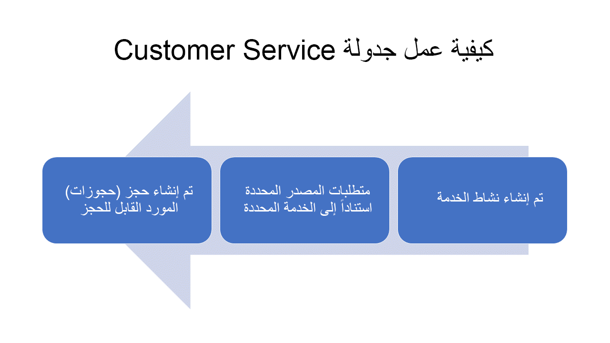

تقوم العديد من المؤسسات بأنشطة قائمة على الخدمة مثل الإصلاحات، أو الصحة والجمال، أو تثبيت المنتجات أو المنتجات المتخصصة لعملائها.
اعتماداً على المؤسسة، يمكن إرسال العمال إلى الميدان لأداء العمل، أو غالباً ما يتم تنفيذ الخدمات في مواقع خدمتهم.
على سبيل المثال، بصفتك عميلاً، يمكنك توصيل حيوان أليف إلى متخصص رعاية الحيوانات الأليفة، أو اصطحاب سيارة للخدمة، أو تغيير قطعة من الملابس، أو تثبيت صنف ما بعد البيع. بغض النظر عن نموذج الخدمة الذي تستخدمه المؤسسة، فهم بحاجة إلى تحديد الموارد المتاحة بسهولة وجدولتها لأداء الخدمة. بصفتنا المؤسسة التي تقدم الخدمات، من المهم تنفيذ تلك الخدمات بأكثر الطرق فعالية ممكنة. هذا لا يعني فقط جدولة الخدمة وأداءها في الوقت المناسب، ولكن أيضاً ضمان أن من يقوم بالخدمة مؤهل ولديه المعدات المناسبة للقيام بالمهمة. بغض النظر عن مدى مهارة الفني، إذا لم يكن لديه المعدات اللازمة المتاحة له، فلن يتمكن من إكمال الخدمة.

تساعد Dynamics 365 Customer Service المؤسسات على جدولة الخدمات بشكل أكثر فاعلية لعملائها من خلال ميزة جدولة Customer Service. إنها تستفيد من Universal Resource Scheduling (URS) الخاصة بـ Dynamics 365 لتزويد المؤسسات بالقدرة على جدولة الموارد لأي سيناريو يحتاج فيه أحد الموارد إلى جدولتها لإكمال العمل أو تسجيل الأصناف في جدولها، مثل أنشطة الخدمة وأوامر العمل.

من خلال جدولة Customer Service، يمكن للمؤسسات تحديد متطلبات الجدولة والوفاء بها بكفاءة. عند الحاجة إلى جدولة خدمة ما، سيقوم النظام بفحص ما هو مطلوب لإكمال الخدمة، مثل مقدار الوقت المطلوب، والمرافق والمعدات اللازمة، والموارد اللازمة. ثم يوفر خيارات جدولة متعددة للسماح للشخص الذي يقوم بالجدولة بتحديد أفضل وقت بناءً على أعباء العمل الحالية للمؤسسات. لا يتعين على المبرمجين قضاء الوقت في العمل على جداول موارد مختلفة لضمان عدم حجز أي شخص مرتين. تأخذ جدولة Customer Service في الاعتبار الأصناف التي تمت جدولة الفنيين لها بالفعل وتقترح فقط الموارد المتاحة بالفعل لأداء الخدمة.

## كيفية عمل جدولة Customer Service

عند جدولة أي شيء، من المهم أن تفهم - ليس فقط - ما يجب القيام به، ولكن أيضاً ما هو المطلوب لإنجازه. تعمل جدولة Customer Service على تعزيز مكونين رئيسيين ليس فقط لتحديد ما يجب جدولته ولأي عميل، بل أيضاً تحديد الموارد المطلوبة لإكمال المهمة.

هذان الصنفان هما:

-   **الخدمات**: تمثل ما تقدمه المؤسسة لعملائها. قد تكون الخدمة هي تغيير الزيت لشركة سيارات أو معالجة لون الشعر في صالون. يحدد سجل الخدمة عدد الموارد التي قد تكون مطلوبة من نوع معين لإكماله. على سبيل المثال، قد يتطلب تغيير الزيت فنياً واحداً وحجرة خدمة واحدة.

-   **أنشطة الخدمة**: سجل النشاط الذي يمثل تسليم الخدمة وتنفيذها للعميل. تتضمن أنشطة الخدمة تفاصيل مثل الخدمة التي سيتم تقديمها والعميل الذي تقدمه.

يتم استخدام الخدمات وأنشطة الخدمات جنباً إلى جنب مع بعضها البعض. على سبيل المثال، قد يقوم مركز خدمة السيارات الذي يريد توصيل تغييرات الزيت للعملاء بإعداده على النحو التالي:

1.  **إنشاء خدمة تغيير الزيت**: تحدد الخدمة نوع الموارد وكمياتها المطلوبة لتقديم تغيير الزيت. (مهم: لا تحدد الخدمة إلا النوع أو الموارد المطلوبة لإكمالها. ولا تحدد الجهة التي ستقدم الخدمة)

2.  **إنشاء نشاط خدمة**: تمت إضافة خدمة تغيير الزيت إلى نشاط الخدمة باعتبارها الخدمة التي سيتم توفيرها. يحتوي سجل نشاط الخدمة أيضاً على تفاصيل إضافية مثل العميل الذي يتم إنشاء النشاط من أجله ومكان حدوث النشاط.

3.  **جدولة نشاط الخدمة**: عند جدولة نشاط الخدمة، ينظر النظام في متطلبات الموارد للخدمة المرفقة (على سبيل المثال، تغيير الزيت) ويحدد الأشخاص المؤهلين والمرافق وموارد المعدات المتاحة لإكمال نشاط الخدمة.

## كيفية جدولة أنشطة الخدمة

> [!NOTE] 
> تعمل جدولة Customer Service على الاستفادة من Universal Resource Scheduling (URS) لجدولة أنشطة الخدمة. URS هو حل الجدولة الأساسي الذي يسمح للمؤسسات بجدولة الأصناف وإرسالها. فهو يوفر وظيفة الجدولة الأساسية. إنه المكون الرئيسي في حلول Dynamics 365 للطرف الأول الذي يعزز إمكانيات الجدولة مثل Dynamics 365 Customer Service وDynamics 365 Field Service.

هناك ثلاثة أنواع من السجلات الأساسية يتم استخدامها لجدولة صنف.

تلك السجلات هي:

-   نشاط الخدمة

-   متطلب الموارد

-   حجز الموارد القابلة للحجز

> [!div class="mx-imgBorder"]
> 

### نشاط الخدمة

عندما يحتاج أحد الموارد إلى أداء خدمة لعميل، يتم إنشاء نشاط خدمة في Dynamics 365. يتضمن نشاط الخدمة عادةً المعلومات التي ستؤثر في كيفية جدولتها.

يتضمن نشاط الخدمة عادةً أصناف مثل:

-   الخدمة التي يتم توفيرها.

-   العميل الذي يتم العمل من أجله.

-   تفضيلات تقديم الخدمة مثل النوافذ الزمنية والفني المفضل وما إلى ذلك.

### متطلب الموارد

بمجرد إنشاء نشاط الخدمة، يتم إنشاء سجل متطلبات الموارد.
يتم استخدام سجل متطلبات الموارد لجدولة الصنف في النظام. يحدد التفاصيل المحددة المطلوبة لجدولة السجل. سجل المتطلبات هو ما يتم استخدامه لتحديد موقع الموارد المؤهلة التي تفي بالمتطلبات.

قد تتضمن متطلبات نشاط الخدمة ما يلي:

-   النوع أو المورد المطلوب.

-   مركز الخدمة الذي يجب وضع المورد فيه.

-   أي تفضيلات من الموارد.

-   معلومات الجدولة الإضافية ذات الصلة، مثل ما إذا كنت تريد جدولة الفنيين الأقل انشغالاً أولاً.

### حجوزات الموارد القابلة للحجز

بعد جدولة أحد متطلبات الموارد، ويتم إنشاء سجل يسمى حجز مورد قابل للحجز يوفر تفاصيل محددة حول المورد المسؤول عن إكمال نشاط الخدمة.

يتضمن حجز الموارد لمتطلبات المورد ما يلي:

-   المورد (الشخص) المسؤول عن إكمال الخدمة.

-   الوقت المقدر والفعلي والمعلومات المتعلقة بالحالة.

-   إجمالي الوقت المستغرق في العمل في الصنف.

## نظرة عامة على مكون جدولة Customer Service

يتضمن تطبيق مركز Dynamics 365 Customer Service منطقة يمكن للمؤسسات استخدامها لأغراض الجدولة. ويمكن الوصول إليها من خلال منطقة الجدولة.

> [!NOTE] 
> يمكنك أيضاً الوصول إلى الجدولة في تطبيق Customer Service workspace.

يتم تقسيم مكونات جدولة Customer Service إلى ثلاثة أنواع من الأصناف:

-   **الجدولة**: تُستخدم لإعداد الأصناف وتكوينها مثل الموارد والمرافق/المعدات وفئات الموارد والخدمات وتفضيلات التنفيذ.

-   **الأدوات**: تمثل لوحة الجدولة المستخدمة في الجدولة اليدوية للموارد.

-   **الإعدادات**: تُستخدم لتكوين مكونات الجدولة الداعمة، مثل الوحدات المؤسسية وإغلاق الأعمال.

### جدولة المكونات

-   **الموارد**: تحدد الأشخاص أو المرافق أو المعدات المحددة التي يمكن جدولتها للعمل على الأصناف. ويمكن للموارد أن تمثل الموظفين الداخليين، أو متعاقدي الطرف الثالث، أو المرافق، أو المعدات. بمجرد تحديد الموارد، يمكن إقرانها بسهولة بالخدمات التي تقدمها لعملائك.

-   **الخدمات**: تمثل الخدمات التي تقدمها مؤسستك للعملاء. يحدد سجل الخدمة أنواع الموارد وعدد الموارد المطلوبة لإكماله. على سبيل المثال، قد تتطلب تهيئة مركبة مائية شخصية (PWC) لفصل الشتاء فنياً بحرياً واحداً ومصعد PWC.

-   **أنشطة الخدمة**: سجل النشاط الذي يمثل تسليم الخدمة وتنفيذها للعميل. تتضمن أنشطة الخدمة تفاصيل مثل الخدمة التي سيتم تقديمها وما هو العميل الذي سيتم تقديمه.

-   **المرافق/المعدات**: تحدد المرافق والمعدات التي قد تحتاج إلى جدولة كجزء من نشاط الخدمة. على سبيل المثال، سيتم إنشاء سجل مرفق لتمثيل مجموعة الخدمات، أو معدات متخصصة تستخدم لإكمال مهمة. وبمجرد تحديدها، يتم إنشاء الموارد التي تمثل هذه الأصناف وترتبط بسجلات المرافق/المعدات.

-   **فئات الموارد**: تحديد الأدوار أو الفئات المختلفة التي قد تمتلكها الموارد في المؤسسة. على سبيل المثال، قد تنشئ المؤسسة فئات موارد لمناصب مثل المطور أو المستشار أو مدير المشروع.

-   **تفضيلات التنفيذ**: تفضيلات التنفيذ هي كيانات قابلة للتخصيص تتيح لك اختيار كيفية عرض نتائج مساعد الجدولة، مثل المواعيد بالساعة أو نوافذ أوقات الصباح وبعد الظهر.
    على سبيل المثال، بشكل افتراضي، تستند الموارد المتاحة بالكامل إلى أقرب وقت متاح لها، مثل 10:39 صباحاً. مع تفضيلات التنفيذ المعينة حسب الساعة، يظهر توافر المورد نفسه على الشكل 11:00 صباحاً. من شأن ذلك أن يسهل على المجدول عرض وفهم التوافر وتبليغ العميل به.

### الأدوات

-   **لوحة الجدولة**: التقويم التفاعلي المستخدم لجدولة موارد محددة لأصناف مختلفة. يمكن تصفية لوحة الجدولة حسب الحاجة ويمكن عرضها كخريطة لتسهيل جدولة الأصناف.

### الإعدادات

-   **الوحدات التنظيمية**: تمثل الحاويات التي يمكن استخدامها لتجميع الموارد معًا. قد تمثل الوحدات المؤسسية موقعاً يمكن إرسال الموارد منه، أو يمكن استخدامها لتجميع الموارد معاً استناداً إلى منطقة أو مركز خدمة.

-   **حالات إغلاق الأعمال**: تحديد وقت إغلاق المؤسسة مثل أيام العطل.

## تثبيت جدولة Customer Service

يجب أن تكون جدولة Customer Service متاحة داخل مركز خدمة العملاء للبيئات الجديدة. إذا كان لديك تثبيت قديم ولا يمكنك رؤية منطقة الجدولة في التطبيق، فيجب عليك الانتقال إلى مركز إدارة [Power Platform](https://admin.powerplatform.microsoft.com?azure-portal=true)، وتوسيع **الموارد**، و **تطبيقات Dynamics 365**.

> [!div class="mx-imgBorder"]
> 

إذا لم يتم تثبيت مكون جدولة الخدمة، فيمكنك النقر على علامات الحذف وتثبيت المكون في بيئة Dynamics 365.

## ‏‏أدوار الأمان

هناك أربعة أدوار أمان مرتبطة بجدولة Customer Service. تم ربط اثنين من هذه الأدوار بجدولة الخدمة القديمة التي تم استبدالها بالجدولة التي تدعمها Universal Resource Scheduling (URS).

-   **مدير المجدول**: يمكنه إعداد وإدارة تجربة جدولة الخدمة والوصول إلى جميع جداول جدولة الخدمة وإعدادها.

-   **المجدول**: يمكنه إنشاء أنشطة الخدمة القديمة وجدولتها.

-   **مسئول جدول Customer Service**: إدارة جدولة الخدمة في URS.

-   **مجدول Customer Service**: يمكنه إنشاء أنشطة الخدمة في URS وجدولتها.

> [!IMPORTANT] 
> للتأكد من أن جميع مديري الجدولة قادرون على إعداد تجربة الجدولة والوصول إلى جداول الجدولة، يجب أيضاً تعيين أدوار أمان كل من مسؤول جدول Customer Service ومدير الجدولة.
