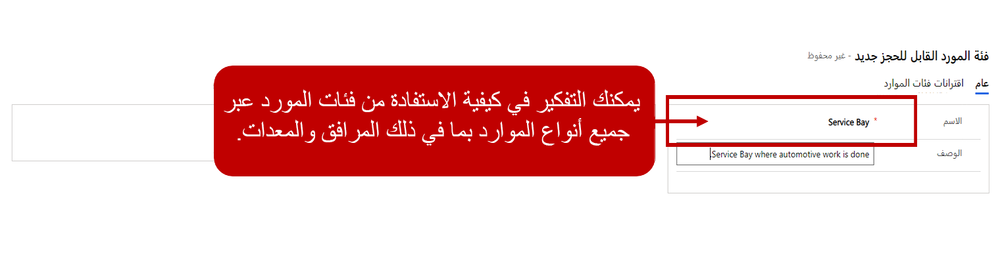

قبل أن تبدأ مؤسستك في جدولة العناصر المتعلقة بالخدمة باستخدام "جدولة Customer Service"، هناك العديد من المكونات التي يجب تكوينها أولاً لضمان إمكانية جدولة الأصناف بشكل فعال وفقاً لاحتياجاتك.

يجب أن تراعي المؤسسات عدة عناصر مثل:

- ما هي أنواع الخدمات التي نقوم بجدولتها؟

  - هل تتطلب موارد متعددة؟

  - هل يتطلب أنواعاً مختلفة من الموارد؟

- كيف يبدو الصنف غير المجدول؟

  - هل يمر نشاط الخدمة بحالات أو مراحل مختلفة قبل جدولته؟

- كيف يبدو الصنف المجدول؟

  - هل هناك فرق بين الصنف الذي تتم جدولته الآن والوقت الذي يعمل فيه شخص ما؟

  - ماذا عن الأصناف مثل أوقات الراحة؟ كيف يؤثر ذلك في حالات الحجز؟

- ما هي العوامل التي يمكن أن تؤثر في جدولة مورد؟

  - أين سيتم تنفيذ الخدمة؟

  - هل هناك نوع معين من الموارد المطلوبة؟

في حين أن القائمة أعلاه لا تُعد قائمة كاملة، إلا أنها تساعد في تحديد أنواع الأصناف التي تحتاج إلى النظر فيها للتأكد من أنك عندما تقوم بتكوين إعدادات الجدولة، فإنك تفكر في كل ما قد يؤثر على كيفية جدولة الأصناف.

## الوحدات المؤسسية

تُستخدم الوحدات المؤسسية لتجميع الموارد معاً في حاويات لأغراض الجدولة. بالنسبة لجدولة Customer Service، عادةً ما تمثل الوحدة المؤسسية الموقع الذي يتم فيه تقديم الخدمات للعملاء. على سبيل المثال، قد يكون لموفر خدمة سيارات كبير مواقع متعددة في جميع أنحاء المدينة.

يتم إنشاء وحدة مؤسسية لكل موقع مركز خدمة فعلي. سيتم بعد ذلك ربط الموارد مثل الأشخاص والمرافق والمعدات بالوحدة المؤسسية لمركز الخدمة الخاص بهم. يساعد هذا في ضمان أنه عند جدولة نشاط خدمة لهذا الموقع، يتم اقتراح الموارد الخاصة بهذه الوحدة المؤسسية فقط.

> [!IMPORTANT]
> يجب أن يكون لكل وحدة مؤسسية عنوان خط عرض وخط طول صالح محدد. لن تعمل الجدولة بشكل صحيح بدونها. لا يتم ترميز جدول الوحدة المؤسسية جغرافياً مثل الجدول الآخر. ستحتاج إلى استخدام موفر الخرائط (على سبيل المثال، Bing) للعثور على عنوان الموقع الفعلي ونسخ معلومات خطوط الطول والعرض إلى الوحدة المؤسسية.

> [!div class="mx-imgBorder"]
> 

## مرات توقف العمل

ستكون هناك حالات يتم فيها إغلاق مركز الخدمة، مثل الإجازات. عند جدولة الأصناف، من المهم معرفة ما هي التواريخ المطلوبة للتأكد من أن أنشطة الخدمة ليست موارد في تلك الأيام.

يتم تحديد تلك الأيام باعتبارها مرات إغلاق الأعمال في جدولة Customer Service. عندما تقوم بإنشاء توقف عمل، يجب تحديد الأمور التالية:

- **الاسم**: اسم وصفي مثل اسم العطلة.

- **‏‫حدث يستغرق يومًا كاملاً‬**: يحدد ما إذا كان حدثاً يستغرق يوماً كاملاً أم لفترة زمنية محددة فقط.

- **وقت البدء**: وقت بدء الإغلاق.

- **وقت الانتهاء**: وقت انتهاء الإغلاق.

عند إعداد عمليات إغلاق الأعمال، لا يمكنك إعداد عمليات إغلاق متكررة. يجب تحديد كل إغلاق عمل بشكل منفصل. على سبيل المثال، إذا كانت مؤسستك دائماً ما تغلق في الأول من يناير، فستحتاج إلى إعداد سجل لإغلاق الأعمال للأول من يناير 2021 و2022 وهكذا.

> [!div class="mx-imgBorder"]
> 

لن تتمكن من جدولة الموارد أثناء إغلاق عمل محدد. ومع ذلك، ستتمكن من جدولة الموارد التي تم تحديد خيار **عدم الملاحظة** لها لإغلاق الأعمال. سوف نفحص تحديد الموارد بشكل أكثر تفصيلاً.

## فئات الموارد

غالباً عند جدولة نوع من الخدمة، قد يتطلب ذلك نوعاً معيناً من الموارد حتى تتمكن من إكمال الخدمة. على سبيل المثال، لاستبدال مجموعة القطع في سيارة، يجب أن يكون المورد الذي تتم جدولته فنياً معتمداً.

للمساعدة في هذه السيناريوهات، تتضمن جدولة الخدمة القدرة على تحديد فئات الموارد. بمجرد الإنشاء، يمكن إضافة الفئات إلى موارد محددة وعناصر قابلة للجدولة مثل خدمة، للتأكد من أن الموارد التي تحتوي على هذا الدور فقط هي التي يتم اقتراحها كأشخاص للعمل على عنصر ما. قد تتضمن أمثلة أدوار الموارد الفني أو مكان الخدمات أو المستشار أو غرفة الاختبار أو المصمم. ويمكن تعيين أدوار متعددة إلى مورد واحد. على سبيل المثال، قد يكون للمورد دور مطور وفني معين لهما.

> [!div class="mx-imgBorder"]
> 

## المرافق والمعدات

بالإضافة إلى الأشخاص، ستقوم المؤسسة باستخدام المرافق والمعدات عند القيام بأعمال الخدمة لأحد العملاء. على سبيل المثال، قد يكون لدى شركة إصلاح سيارات سبعة أقسام خدمة متوفرة في موقع محدد. وينطبق الشيء نفسه على قطع معينة من المعدات. قد تتطلب بعض الخدمات جهاز تشخيص، ولكن يمكن للمؤسسة الحصول على بعضها فقط. عندما تتم جدولة الخدمة، قد يكون من المهم التأكد من توفر مكان للخدمة وجهاز تشخيص وهو ما يضمن توفر فني مؤهل.

وللمساعدة في ذلك، يمكنك تحديد أداة الإنشاء وسجل المعدات في التطبيق. يمكن ربط المرافق والمعدات بسجلات مورد أداة الإنشاء أو المعدات وتتم جدولتها كجزء من الخدمات في التطبيق.

عندما تقوم بإنشاء سجل أداة إنشاء/معدات، ستحتاج إلى تحديد الأصناف التالية:

- **الاسم**: الاسم الذي سيتم استخدامه للإشارة إلى هذه القطعة من المعدات.

- **الوحدة المؤسسية**: تحدد الوحدة المؤسسية التي تقترن بها أداة الإنشاء أو المعدات.

- **وحدة الأعمال**: يحدد وحدة الأعمال التي ينتمي إليها هذا المورد.

- **المنطقة الزمنية**: المنطقة الزمنية التي يوجد بها هذا الصنف.

- **الوصف**: الوصف العام للصنف.

> [!div class="mx-imgBorder"]
> 

بمجرد تحديد التفاصيل الأولية حول سجل أداة الإنشاء/المعدات، يمكنك أيضاً تحديد ساعات العمل المحددة التي يكون هذا الصنف متاحاً لجدولتها. سوف ندرس ساعات العمل بمزيد من التفصيل لاحقاً. سيتم نقل أي إعدادات تم تحديدها تلقائياً إلى أي سجلات موارد مقترنة بهذا الصنف.
