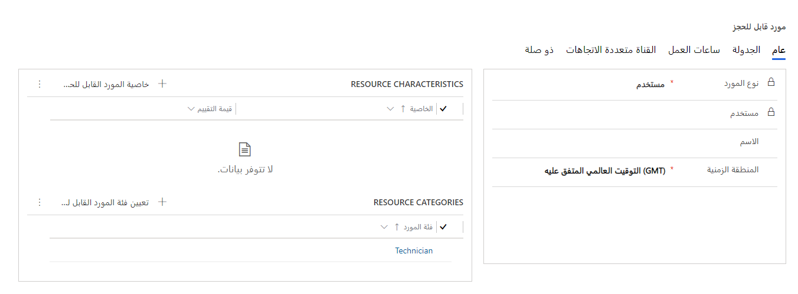
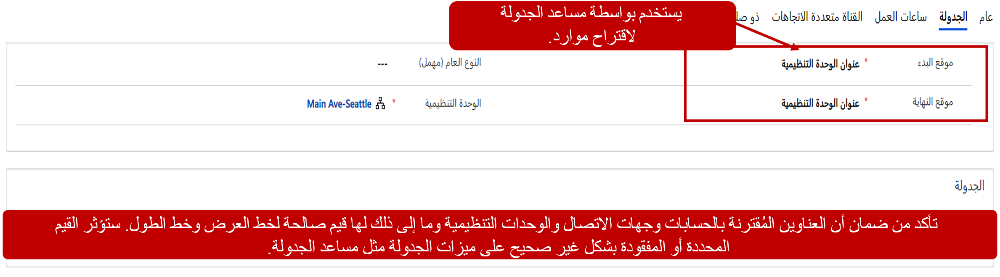
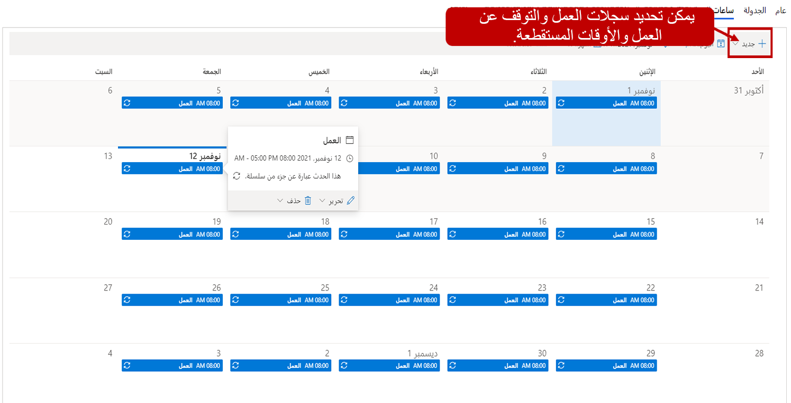
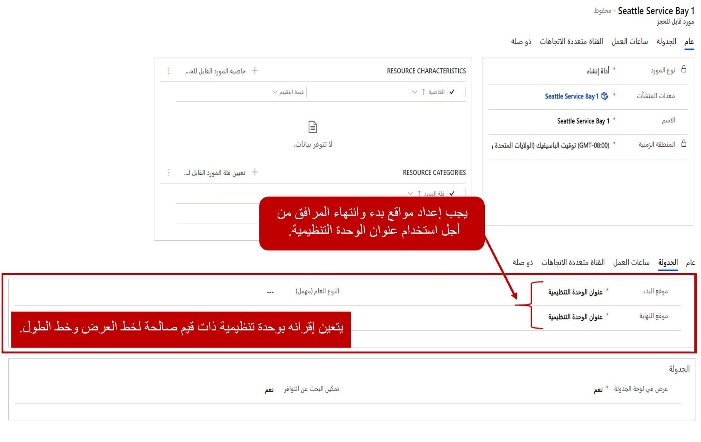

الموارد هي أشخاص أو مَرافق أو أجزاء من المعدات اللازمة لتنفيذ خدمة. واستنادًا إلى المؤسسة، ستُستخدم الموارد بشكلٍ مختلف قليلاً. على سبيل المثال، قد يحدد صالون عناية بالشعر موارد لأصناف مثل المحطات وأسِرة التسمير ومصففي الشعر وما إلى ذلك. ومركز خدمة قد يحدد الموارد للفنيين أو الرافعات أو خُلجان الإرساء أو غيرها من الأجزاء الكبيرة من المعدات التي قد تتوفر لديهم كميات محدودة منها. الموارد هي عنصر أساسي في حل جدولة الخدمة لأنها تمثل الأشخاص و/أو المعدات التي تم تعيينها لتنفيذ خدمة.

ونظرًا إلى أن (URS) Universal Resource Scheduling يعالج الجدولة عبر كافة التطبيقات المحتملة، فإن أي مَورد محدد سيتم استخدامه في تطبيقات أخرى مثل Field Service. وبسبب طبيعة جدولة الخدمة، عندما تحدد موارد الخدمة، ستستخدم عادةً أنواع الموارد الآتية:

- **المستخدم**: يحدد المورد كمستخدم داخلي تم تعيينه لسجل مستخدم Dynamics 365. من المحتمل أن يكون هذا هو النوع الأكثر شيوعًا من الموارد التي سيتم استخدامها مع جدولة الخدمة.

- **عام**: يُستخدم عامةً كحامل نائب لتحديد نوع المورد المطلوب حتى يمكن استخدام مورد مسمى معين في مكانه.

- **جهة الاتصال**: يحدد هذا المورد مقترنًا بسجل جهة اتصال Dynamics 365.

- **الحساب**: يحدد أن هذا المورد مرتبط بسجل حساب Dynamics 365.

- **المعدات**: تحدد الموارد على أنها جزء معين من المعدات.

- **المرفق**: يمثل المرفق الذي يمكن جدولته مثل مبنى أو غرفة.

- **المجموعة**: تُتيح لك جدولة مجموعات الموارد تجميع مجموعات من الموارد المشابهة لإدارة ‏‫القدرة الإنتاجية ومنح المجدولين خيار تعيين موارد محددة في وقت لاحق.

- **الطاقم**: تتيح لك أطقم الموارد إمكانية البحث عن موارد متعددة وجدولتها في آنٍ واحد.

> [!div class="mx-imgBorder"]
> 

اعتمادًا على نوع المَورد الذي تقوم بإنشائه والحلول المختلفة التي قمت بتوزيعها في بيئتك، ستظهر حقول مختلفة في سجل المَورد. وذلك سيسمح لك بربط المَورد بسجلات مثل سجل الحساب أو المستخدم أو جهة الاتصال.

وسيكون لكل مورد تحدده علامتا تبويب يمكن استخدامهما للتكوين. وعلامتا التبويب هاتين هما "عام" و"جدولة". بعد حفظ المَورد للمرة الأولى، ستتوفر أصنافًا إضافية يمكنك ربطها بالمَورد. بالنسبة إلى جدولة Customer Service، يتم استخدام فئات الموارد لتحديد أي أدوار مقترنة بالمَورد. قد توجد علامات تبويب إضافية للمؤسسات التي تستخدم حلول الجزء الأول Dynamics 365 الأخرى مثل Field Service أو القناة متعددة الاتجاهات لخدمة Customer Service.

## علامة تبويب "الجدولة"

علامة تبويب "الجدولة" هي المكان الذي تحدد فيه تفاصيل الجدولة التي ستتحكم في كيفية عرض الموارد في لوحة الجدولة وخيارات الجدولة المتاحة.

من أهم الأصناف التي يجب تحديدها معلومات الموقع التي ستستخدمها لوحة الجدولة للمورد.

الأصناف التي ينبغي تحديدها هي:

- **موقع البدء**: يحدد المكان الذي يبدأ فيه المَورد يومه.

- **موقع الانتهاء**: يحدد المكان الذي يُنهي فيه المَورد يومه.

- **الوحدة التنظيمية**: تحدد الوحدة التنظيمية المحددة التي ينتمي إليها المَورد وسيتم إيقاف جدولتها.

عندما تحدد موقعي البدء والانتهاء، يتوفر لديك ثلاثة خيارات يمكنك تحديدها:

- **عنوان الوحدة التنظيمية**: يستخدم خط الطول وخط العرض المرتبطين بالوحدة التنظيمية التي ينتمي إليها المَورد.

- **عنوان المورد**: يستخدم خط الطول وخط العرض المرتبطين بالسجل المقابل بناءً على نوع المَورد.

- **غير محدد الموقع**: ليس له موقع معين قد تم تحديده. 
  يمكن أن يكون مفيدًا عند عدم توفر موقع بدء وإنهاء محددين بوضوح للموارد.

ما لم تكن موارد مؤسستك تؤدي خدمات في الميدان، فسيتم تعيين موقعي البدء والانتهاء لمعظم الموارد البشرية إلى **عنوان الوحدة التنظيمية**. يجب تعيين موقعي البدء والانتهاء الخاصين بموارد المؤسسة إلى **عنوان الوحدة التنظيمية**.

## ساعات العمل

عند جدولة الموارد للعمل على أنشطة الخدمة، تود التحقق من قيامك بتحديد الموارد المتوفرة. سيحصل كل مَورد على ساعات عمل محددة عند توفره حتى تتم جدولته للعمل على إنجاز المهام. ويمكن أن تختلف ساعات العمل هذه، اعتمادًا على عوامل متعددة مثل نوع المَورد وكيفية تنظيم مناوبات العمل وما إلى ذلك. على سبيل المثال، في مركز الخدمة الذي يعمل لمدة ستة عشر ساعة عمل، قد يوجد موارد بشرية تعمل في ساعات محددة في الصباح أو المساء. وقد يتضمن أيضًا مرافق ومعدات متوفرة على مدار يوم العمل البالغ 16 ساعة بالكامل.

تسمح لك علامة تبويب "ساعات العمل" بتحديد ساعات العمل للموارد الفردية. وهذا تستخدمه لوحة الجدولة ومساعد الجدولة عند تحديد الموارد لجدولتها لأنشطة الخدمة.

في علامة تبويب "ساعات العمل"، يمكنك عرض ساعات العمل لأحد الموارد حسب العام والشهر. يمكنك بسهولة تبديل العام والشهر حسب الحاجة لضمان أنك تحدد ساعات العمل بشكلٍ صحيح استنادًا إلى الإطار الزمني. وهذا مهم بصفة خاصة في مؤسسة لديها موارد قد تعمل في مناوبات عمل يتم تدويرها على أساس منتظم.

يمكنك تحديد ساعات عمل المَورد بالنقر فوق زر **جديد** وتحديد أحد الخيارات الآتية:

- **ساعات العمل**: تحدد تعيين ساعات العمل للمَورد.

- **عدم العمل**: يحدد وقت عدم العمل المحدد للمَورد.

- **زمن التوقف**: يحدد زمن توقف المَورد، مثل العطلة أو الإجازة مدفوعة الأجر.

بعد تحديد نوع الإدخال الذي تقوم بإنشائه، سيتعين عليك تحديد التفاصيل المعينة المرتبطة بسجل ساعات العمل.

استنادًا إلى نوع السجل الذي حددته، ستتوفر لديك الخيارات الآتية:

- **اليوم بأكمله**: مفتاح التبديل الذي يحدد أنه حدث في يوم بأكمله. ويستخدم هذا عادةً عند إعداد إدخالات زمن التوقف لأصناف مثل العطلة.

- **القدرة الإنتاجية**: يعمل على التبديل بين جدولة القدرة الإنتاجية لأحد الموارد. يتوفر ذلك فقط عند إعداد ساعات العمل. عند تمكينه، يمكنك تحديد القدرة الإنتاجية لأحد الموارد بزيادات قدرها واحد.

- **التاريخ**: يحدد اليوم الأول الذي يجب أن يبدأ فيه هذا الصنف.

- **أوقات البدء والانتهاء**: يقوم بتعيين النطاق الزمني لهذا الصنف. على سبيل المثال، سيسمح تحديد الساعة 8:00 صباحًا إلى 5:00 مساءً لساعات العمل بجدولة المَورد خلال ذلك الوقت.

- **التكرار**: يحدد الإطار الزمني للصنف. يمكن تحديد الأصناف كما يأتي:

  - **مطلقًا**: يحدد أن هذا عبارة عن حدث لمرة واحدة.

  - **كل يوم**: يسمح لك بتحديد اليوم الذي يجب أن ينطبق عليه هذا مثل "من الاثنين إلى الجمعة".

  - **كل أسبوع**: يسمح لك بتحديد الأيام على أساس أسبوعي.

- **‏‫ملاحظة توقف العمل‬**: تحدد أن حالات توقف العمل تجب مراعاتها.

إذا كنت تود إنشاء سجل ساعات عمل لمَورد يعمل من الاثنين إلى الجمعة من الساعة 8:00 صباحًا إلى الساعة 5:00 مساءً مع تخصيص ساعة لتناول الغداء، فقد يبدو ذلك مشابهًا للصورة الموضحة أدناه.

> [!div class="mx-imgBorder"]
> 

من المهم قضاء الوقت اللازم للتأكد من تعيين ساعات العمل الصحيحة المحددة لكل مَورد. وإلا فسيؤدي ذلك إلى حدوث مشكلات عند محاولة جدولة الأصناف.

## تحديد موارد المرافق

تكون موارد المرافق مفيدة عند الحاجة إلى حجز مساحة فعلية، مثل غرفة لحدث أو حفلة، أو جزء الإصلاح في متجر ميكانيكي. كما تكون المرافق مفيدة عندما تحتاج إلى جدولة موعد مع شخص في مرفق، مثل موعد لشخص لإصلاح جهاز كمبيوتر محمول في متجر Microsoft للبيع بالتجزئة أو استشارة إدارة الثروات في أحد البنوك.

نظرًا إلى أن المرافق تمثل موقعًا فعليًا مثل غرفة اجتماعات أو مساحة اجتماع، يجب أن تكون مرتبطة بوحدة تنظيمية تحتوي على عنوان خط الطول والعرض الصالحين. يجب تعيين موقعي البدء والانتهاء الخاصين بالمرفق إلى عنوان الوحدة التنظيمية.

> [!div class="mx-imgBorder"]
> 
