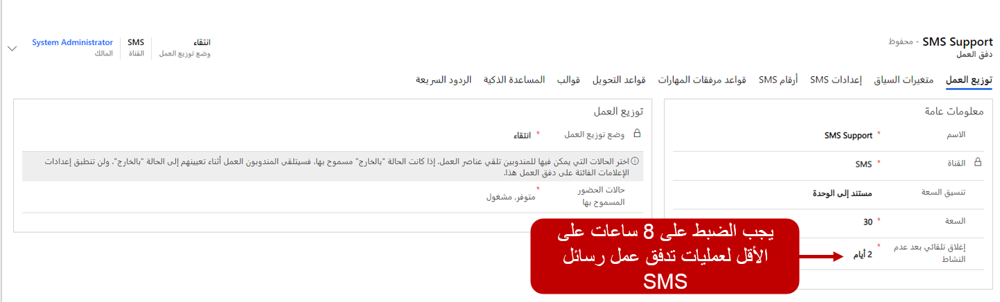
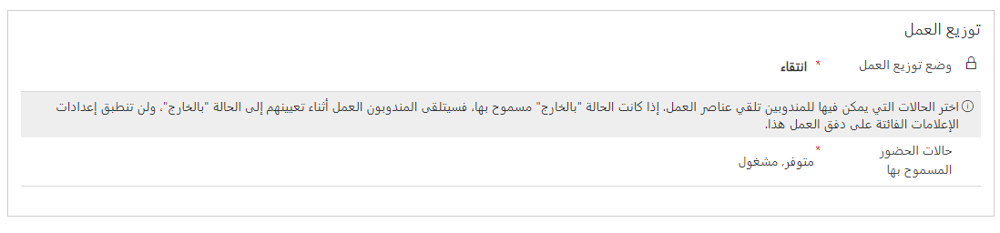
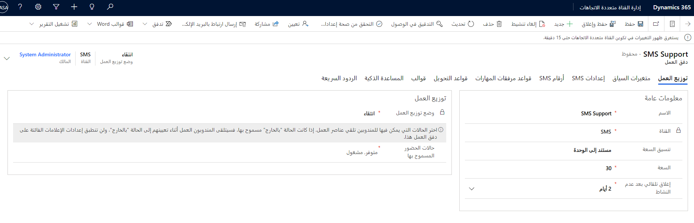

على غرار جميع قنوات الاتصال في القناة متعددة الاتجاهات لـ Customer Service، ستحتاج إلى تدفقات عمل الرسائل القصيرة مخصصة مرتبطة بقنوات الرسائل القصيرة التي سيتواصل المندوبون والعملاء من خلالها. يتم إنشاء تدفقات العمل المتعلقة بـ SMS من منطقة **إدارة توزيع العمل** في تطبيق إدارة القناة متعددة الاتجاهات. بناءً على نوع القناة التي تم تحديدها، ستتطلب معظم تدفقات العمل إعدادات إضافية خاصة بتلك القناة. 

مثل تدفقات العمل الأخرى، تحتاج التدفقات المتعلقة بالرسائل النصية القصيرة إلى المعلومات التالية:

-   **الاسم** - اسم بسيط يُستخدم لتعريف تدفق العمل.

-   **القناة** - نوع قناة الاتصال لتدفق العمل. سيتم تعيين هذا الخيار إلى **الرسائل القصيرة**.

-   **القدرة الإنتاجية** - يحدد مقدار القدرة الإنتاجية الإجمالية للمندوب التي ستستهلكها محادثات الرسائل القصيرة من هذا الدفق. (لا يمكن تغيير هذه المعلمة بعد حفظ تدفق العمل.)

-   **الإغلاق التلقائي بعد عدم النشاط** - تحديد مقدار الوقت الذي يمكن أن ينقضي قبل نقل محادثة من حالة الانتظار إلى حالة الإغلاق بسبب عدم النشاط. (بالنسبة إلى تدفقات عمل الرسائل القصيرة، يجب ضبط هذا الخيار على 8 ساعات على الأقل).

    نظراً لأن محادثات الرسائل القصيرة غير متزامنة، على عكس محادثات المحادثة التي تحدث عادةً في الوقت الفعلي، فمن المحتمل أن تحدث تأخيرات كبيرة بين الاتصالات. يساعد تعيين هذا الخيار لمدة 8 ساعات على الأقل في ضمان عدم إغلاق المحادثات قبل العثور على حل. يتم تعيين القيمة الافتراضية لهذا الحقل إلى يومين.

-   **السماح بالرسائل التلقائية** - تحديد ما إذا كنت تريد أن تكون قادراً على السماح بالرسائل التلقائية. في الوقت الحالي، نوصي بالإبقاء على هذه القيمة معينة إلى **لا**.

> [!div class="mx-imgBorder"]
> 

في قسم **توزيع العمل**، يمكنك تحديد كيفية تعيين عناصر العمل للمندوبين من هذه القناة. 

يتوفر الخياران التاليان: 

-   **وضع توزيع العمل** - يحدد ما إذا كان سيتم دفع عناصر عمل الرسائل القصيرة من هذا الدفق إلى المندوبين تلقائياً أو إذا كان بإمكان المندوبين أن يحددوا يدوياً العناصر التي يريدونها من قوائم الانتظار التي هم أعضاء فيها. 

-   **حالات الحضور المسموح بها** - تحديد حالات حضور المندوبين التي يمكن توجيه الرسائل القصيرة من هذا التدفق إليها. بشكل افتراضي، يتم تعيين هذا الخيار لتوجيه المحادثات إلى المندوبون الذين تم تعيين حضورهم إما إلى **متاح** أو **مشغول**. 

> [!div class="mx-imgBorder"]
> 

تحتوي تدفقات عمل الرسائل القصيرة على علامات تبويب التكوين مثل تدفقات العمل الأخرى: 

-   **متغيرات السياق** - تحتوي على بيانات السياق مثل بيانات ما قبل المحادثة أو معلومات القناة التي يمكن استخدامها للمساعدة في توجيه المحادثات إلى الأماكن المناسبة. 

-   **عناصر قواعد التوجيه** - تم تقييم الشروط التي تتحكم في المكان الذي يتم توجيه العناصر إليه. 

-   **قواعد مرفقات المهارات‬** - بناءً على المهارات المرتبطة بالمحادثة، سيتم توجيه العنصر إلى المندوب الذي يطابق تلك المهارات بشكل أفضل. 

-   **القوالب** - تحدد جلسة العمل المحددة مسبقاً وقوالب الإخطارات التي يجب استخدامها عند إنشاء جلسات العمل وتسليم الإخطارات إلى المندوبين للمحادثات المتعلقة بدفق العمل هذا. 

تتوفر علامتي تبويب إضافيتين يمكنك استخدامهما للتحكم في وظائف الرسائل القصيرة:

-   **إعدادات الرسائل القصيرة** - تحديد إعدادات الحساب التي سيتم استخدامها للتواصل مع مزود خدمة الرسائل القصيرة. 

-   **أرقام الرسائل القصيرة** - تحدد أرقام الهاتف التي تدعم الرسائل القصيرة والتي سيتم استخدامها للتواصل مع العملاء من خلال تدفق العمل هذا. 

> [!div class="mx-imgBorder"]
> 
