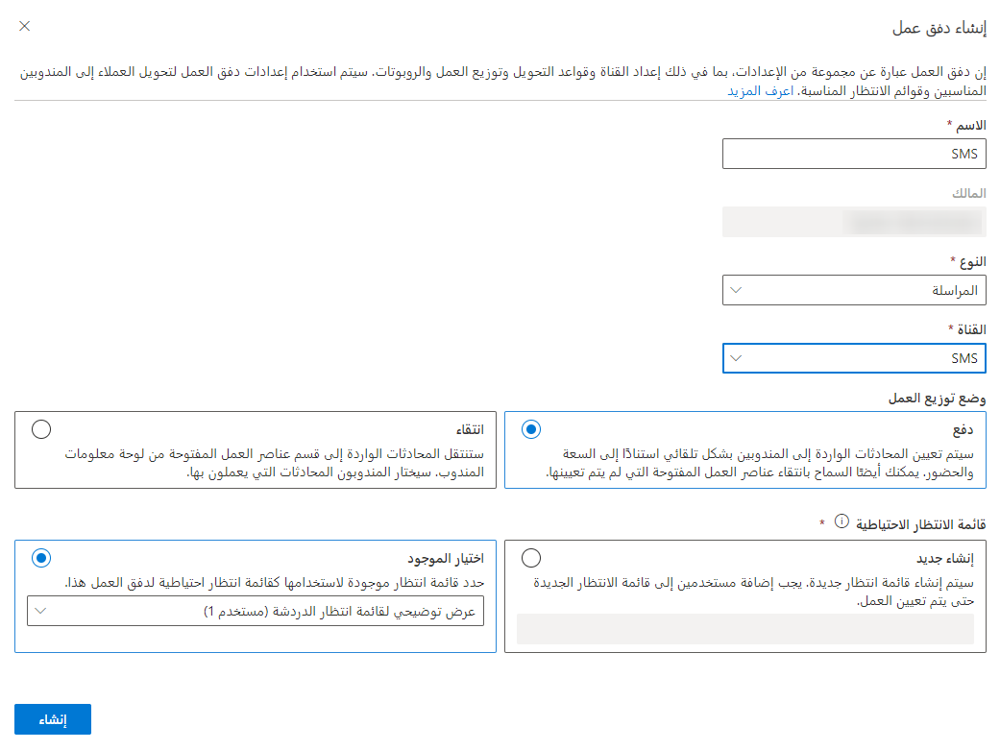

على غرار جميع قنوات الاتصال في القناة متعددة الاتجاهات لـ Customer Service، ستحتاج إلى تدفقات عمل الرسائل القصيرة مخصصة مرتبطة بقنوات الرسائل القصيرة التي سيتواصل المندوبون والعملاء من خلالها. يتم إنشاء تدفقات العمل في **مركز مسؤولي Customer Service**.  

مثل تدفقات العمل الأخرى، تحتاج التدفقات المتعلقة بالرسائل النصية القصيرة إلى المعلومات التالية:

- **الاسم** - اسم بسيط يُستخدم لتعريف تدفق العمل.

- **النوع**: نوع اتصال القناة الذي سيعالجه تدفق العمل. بالنسبة لقنوات رسائل SMS، قم بتعيين النوع إلى **مراسلة**.    

- **القناة** - نوع قناة الاتصال لتدفق العمل. سيتم تعيين هذا الخيار إلى **الرسائل القصيرة**.

- **توزيع العمل**: تحديد كيفية تعيين عناصر العمل من تدفق العمل هذا إلى المندوبين. يمكنك تحديد إما:

    - **الإرسال** : سيتم تعيين المحادثات إلى العوامل تلقائياً استناداً إلى القدرة والوجود.  
    
    - **الانتقاء**: ستنتقل المحادثات إلى قسم عناصر العمل المفتوحة في لوحة معلومات المندوب.  سيختار المندوبون المحادثة التي يعملون عليها.  
    
- **قائمه الانتظار الاحتياطية**: تحديد أي قائمة انتظار لتوجيه العناصر إليها افتراضياً، إذا لم يتم توجيه تلك المحادثة تلقائياً إلى قائمة انتظار أخرى.  

> [!div class="mx-imgBorder"]
> 

