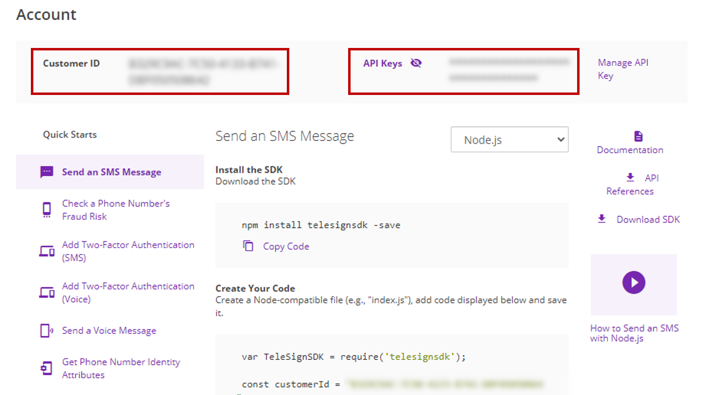
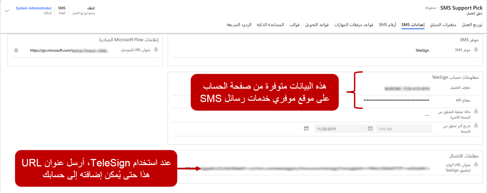

قبل تحديد أرقام الهواتف التي ستستخدمها القناة متعددة الاتجاهات لـ Customer Service للتواصل مع العملاء، تحتاج إلى إعلام الحل بمن يوفر الوظائف. تتيح علامة التبويب **إعدادات SMS** لتدفق العمل معرفة موفر SMS الذي يتم استخدامه لإرسال الرسائل وتلقيها.

عند تحديد موفر SMS للاستخدام، ستتم مطالبتك بتوفير معلومات إضافية مثل تفاصيل الحساب وواجهة برمجة (API) التطبيقات.

إذا قمت بتحديد TeleSign، تحتاج إلى توفير المعلومات التالية:

-   **معرف العميل** - معرف العميل الذي تم إنشاؤه من حساب TeleSign.

-   **مفتاح واجهة برمجة التطبيقات (API)** - مفتاح واجهة برمجة التطبيقات(API) الذي تم إنشاؤه من حساب TeleSign.

يمكن لعملاء TeleSign استرداد هذه المعلومات من الشاشة الرئيسية لحساب TeleSign الخاص بهم.

> [!div class="mx-imgBorder"]
> 

## معايير الاتصال

عندما يرسل العملاء رسائل إلى رقم هاتف الدعم الخاص بالمؤسسة، يحتاج موفر SMS إلى معرفة مكان إرسال هذه الرسائل. تتم معالجة هذه العملية بواسطة عنوان URL الوارد لـ TeleSign. عند تحديد تدفق عمل SMS، يتم إنشاء عنوان URL لرد اتصال وارد لـ TeleSign. يجب إرسال عنوان URL هذا إلى TeleSign حتى يتمكن من إضافة عنوان URL إلى حسابك. يجب أن تتم هذه العملية قبل إضافة رقم هاتف SMS إلى القناة.

انسخ حقل **عنوان URL الوارد لـ TeleSign** وأرسله في رسالة بريد إلكتروني إلى support@telesign.com، حيث سيقوم فريق الدعم بإضافة عنوان URL إلى حسابك. بعد إضافة عنوان URL، يمكن شراء أرقام الهواتف الممكّنة للرسائل القصيرة. عند شراء رقم هاتف، تأكد من شراء رقم هاتف يستخدم وظائف SMS ثنائية الاتجاه.

> [!div class="mx-imgBorder"]
> 

## أرقام SMS

استناداً إلى متطلبات مؤسستك وعوامل أخرى، مثل وحدات تخزين الرسائل، يمكنك شراء أفضل نوع من الأرقام استناداً إلى احتياجاتك. تستخدم أرقام SMS فئات التعليمات البرمجية، وتتوفر ثلاثة أنواع من أرقام هواتف SMS:

-   **رمز طويل** - رقم هاتف فريد مكون من 10 أرقام مرتبط برمز منطقة محدد (+1-XXX-XXX-XXXX).

-   **رمز قصير** - رقم قصير غالباً ما يتراوح بين أربعة إلى ستة أرقام ويُستخدم غالباً في سيناريوهات وحدات التخزين الكبيرة (XXXXX).

-   **الرقم المجاني** - خدمة الرسائل النصية القصيرة التي ترسل رسائل نصية من الأرقام المجانية.

لدى المؤسسات أسباب مختلفة تجعلها تختار نوعاً من الأرقام على نوع آخر، ولكن القرار يستند بشكل أساسي إلى حجم الرسائل التي تحتاج إلى إرسالها. على سبيل المثال، تستخدم المؤسسة التي تقوم بإرسال عدة اتصالات تسويق رسائل قصيرة أو إعلامات أحادية الاتجاه للعملاء رموز قصيرة.

عندما يكون لديك رقم من TeleSign، يمكنك إضافته إلى علامة التبويب **أرقام SMS** على تدفق عمل SMS. إضافة رقم هاتف رسائل قصيرة إلى تدفق العمل أيضاً بإنشاء سجل قناة SMS لرقم الهاتف. يمكن الوصول إلى قناة SMS من علامة التبويب **أرقام هواتف SMS** في دفق العمل وقناة SMS ضمن **القنوات** في تطبيق إدارة القناة متعددة الاتجاهات.

عند إنشاء قناة SMS، قم بتوفير المعلومات التالية:

-   **الرقم** - رقم الهاتف الذي تم شراؤه من TeleSign. يجب أن تتضمن أرقام الهاتف رمز البلد أو المنطقة ورقم الهاتف الكامل مع رمز المنطقة.

    **مثال رقم هاتف الولايات المتحدة:** ‏19875551234

-   **النوع** - يتم دعم الرموز الطويلة فقط اعتباراً من ديسمبر 2019.

-   **الوصف** - وصف اختياري للرقم.

-   **ساعات العمل** - يسمح لك بتحديد ساعات العمل عندما يكون فريق دعم العملاء نشطاً ومتاحاً لخدمة العملاء. يعمل فقط عندما يتم تعيين قيمة حقل **السماح بالرسائل التلقائية** إلى **نعم**.

> [!div class="mx-imgBorder"]
> 

بعد إضافة رقم الهاتف، تأكد من التحقق من صحة مفتاح واجهة برمجة التطبيقات قبل استخدامه. عند التحقق من صحة مفتاح واجهة برمجة التطبيقات، تكون القناة متاحة لك لبدء إرسال واستقبال الاتصالات.

> [!div class="mx-imgBorder"]
> 

## توجيه محادثات SMS

يتم تحديد قواعد توجيه SMS في علامة التبويب **قواعد التوجيه** من سجل تدفق عمل SMS. تعمل قواعد توجيه SMS في حقل **الهاتف المحمول** في كيان **جهة الاتصال**. يتم التعرف على جهة الاتصال من خلال مطابقة رقم الهاتف الذي جاءت منه الرسالة إلى رقم هاتف محمول في كيان **جهة الاتصال**. عند تحديد سجل جهة الاتصال المناسب، يتم ربط سجل المحادثة بسجل جهة الاتصال ويتم تحميل شاشة ملخص العميل في جلسة العمل. 

يمكن لعناصر قواعد التوجيه تقييم شروط العناصر السياقية التالية المرتبطة بسجل المحادثة الذي تم إنشاؤه:

-   **الحساب** - يسمح لك بتقييم البيانات من سجل الحساب المرتبط بالمحادثة.

-   **جهة الاتصال** - يسمح لك بتقييم البيانات من سجل جهة الاتصال المرتبط بالمحادثة.

-   **الحالة** - تسمح لك بتقييم البيانات من سجل جهة الاتصال المرتبط بالمحادثة.

-   **متغيرات السياق** - يسمح لك بتقييم المعلومات المخزنة في متغير السياق المقترن بالمحادثة.

-   **سياق مشاركة الرسائل القصيرة** - يسمح لك بتقييم البيانات السياقية المتعلقة بالرسائل القصيرة مثل مزود خدمة الرسائل القصيرة أو رمز البلد أو البيانات الأخرى.

> [!div class="mx-imgBorder"]
> 

على سبيل المثال، كما يتم تلقي رسالة، يمكن استخدام القاعدة رمز البلد الذي تم التقاطه في حقل **سياق مشاركة الرسائل القصيرة** لتوجيه العناصر إلى صفوف الانتظار لكل من البلدان المختلفة التي تقدم الخدمة فيها.
