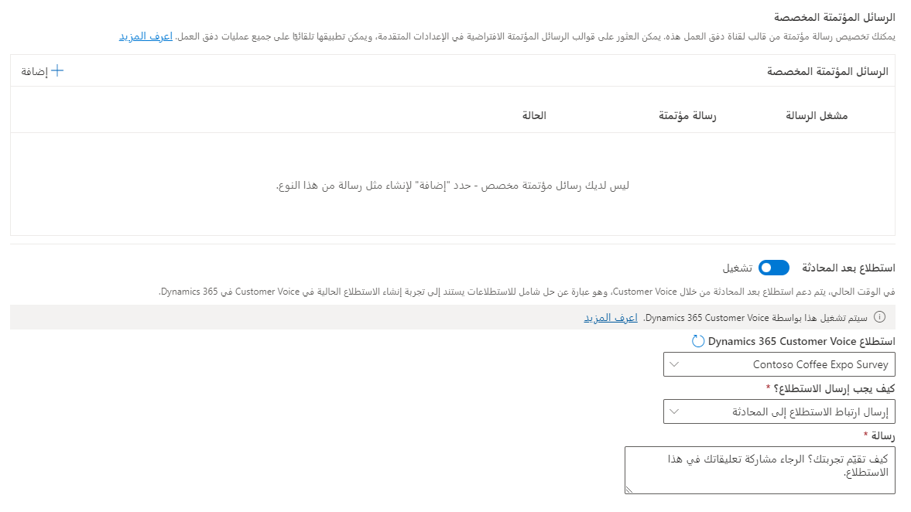
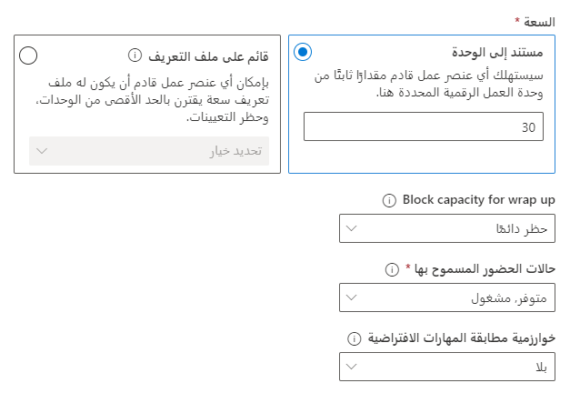

بعد إنشاء مسار العمل، تحتاج إلى إعداد قناة SMS لاستخدام مسار العمل. تتم هذه الخطوة المطلوبة عن طريق تحديد الزر **إعداد SMS**.
  
يمكنك تكوين قناه SMS بالمعلومات التالية:

- **تفاصيل القناة**: الاسم والنوع وتفاصيل القناة. سيتم مسبقاً ملء حقل **النوع** و **القناة** ولا يمكن تغييرهما.
    
- **رقم SMS**: رقم SMS الذي تريد استخدامه مع القناة.  يجب أن يكون لديك إما إعداد رقم هاتف SMS أو حساب رسائل SMS لرقم.  

- **اللغة**: اللغة المقترنة بالقناة.  

- **السلوكيات**: تحديد الميزات التي تريد تنفيذها تلقائياً عندما يبدأ العميل محادثة عبر الرسائل القصيرة.  يمكنك تشغيل السلوكيات التالية:
    
    - **ساعات عمل القناة‬**: تحديد الساعات المحددة التي تريد أن تكون القناة متاحة فيها.  يجب تحديد ساعات العمل أولاً. لمزيد من المعلومات، راجع [إنشاء ساعات العمل](/dynamics365/customer-service/create-operating-hours?tabs=customerserviceadmincenter).   
   
    - **الرسائل التلقائية المخصصة**: تسمح لك بإنشاء الرسائل المخصصة الخاصة بك التي سيتم استخدامها في مواقف مختلفة. على سبيل المثال، عندما يتم تعيين مندوب للمحادثة أو عندما يحاول العميل المشاركة خارج ساعات العمل. لمزيد من المعلومات، راجع [إنشاء الرسائل التلقائية المخصصة](/dynamics365/customer-service/configure-automated-message?tabs=customerserviceadmincenter).  
    
    - **استطلاع ما بعد المحادثة**: تطبيق صوت العميل لإرسال استطلاع إلى العميل حول تجربته بمجرد اكتمال المحادثة. لمزيد من المعلومات، راجع [استطلاعات ما بعد المحادثة](/dynamics365/customer-service/configure-post-conversation-survey?tabs=customerserviceadmincenter).
    
    > [!div class="mx-imgBorder"]
    > 

## تكوين إعدادات توزيع العمل

عند إنشاء مسار العمل لأول مرة، يتم تكوين إعدادات توزيع العمل الأساسية مسبقاً بناءً على الخيارات الأولية التي تحددها. بعد حفظ مسار العمل، يمكنك تعديل إعدادات التوزيع بناءً على احتياجاتك. على سبيل المثال، يمكنك تغيير السعة التي تستهلكها محادثات SMS باستخدام مسار العمل هذا للسماح للمندوبين بمعالجة المزيد من المحادثات في وقت واحد. 
  
يمكنك تعديل إعدادات توزيع العمل باستخدام الزر **معرفة المزيد**. لا يمكنك تعديل وضع توزيع العمل، ولكن ستتمكن من إعداد المعلومات التالية:

- **السعة**: كيف تريد حجب القدرة على المحادثة. يمكنك التحديد من ضمن الخيارات التالية:
    - **مستندة إلى ملف التعريف**: سيتم إقران عناصر العمل الواردة في مسار العمل هذا بملف تعريف سعة معين يحتوي على وحدات قصوى وتعيينات كتلة.
    - **مستندة إلى الوحدة**: ستستهلك عناصر العمل الواردة في مسار العمل هذا قدراً ثابتاً من سعة المندوب.  القيمة الافتراضية هي 30.

- **الإغلاق التلقائي بعد عدم النشاط** - تحديد مقدار الوقت الذي يمكن أن ينقضي قبل نقل محادثة من حالة الانتظار إلى حالة الإغلاق بسبب عدم النشاط. (بالنسبة إلى تدفقات عمل الرسائل القصيرة، يجب ضبط هذا الخيار على 8 ساعات على الأقل).

    نظراً لأن محادثات الرسائل القصيرة غير متزامنة، على عكس محادثات المحادثة التي تحدث عادةً في الوقت الفعلي، فمن المحتمل أن تحدث تأخيرات كبيرة بين الاتصالات. يساعد تعيين هذا الخيار لمدة 8 ساعات على الأقل في ضمان عدم إغلاق المحادثات قبل العثور على حل. يتم تعيين القيمة الافتراضية لهذا الحقل إلى يومين.

- **منع القدرة على التلخيص**: حدد ما إذا كنت تريد حظر قدرة المندوبين أثناء إنهاء المحادثة. على سبيل المثال، تريد الاستمرار في حظر قدرة المندوب لمدة 5 دقائق بعد انتهاء المحادثة لمنحه الوقت لإنهاء ملاحظاته.  يمكنك تحديد **حظر دائماً** أو **عدم الحظر** أو حدد مقدار الوقت الذي تريده لحظر السعة.

- **حالات الحضور المسموح بها** - تحديد حالات حضور المندوبين التي يمكن توجيه الرسائل القصيرة من هذا التدفق إليها. على سبيل المثال، إذا قمت بتعيين هذه القيمة إلى **متاح** و **مشغول** يعني أنه إذا تم تعيين حضور المندوب إلى **متاح** أو **مشغول** والسعة كانت متاحة، يمكن تخصيص عناصر لها من مسار العمل هذا.     

- **خوارزمية مطابقة المهارات الافتراضية**: يتيح لك تحديد خوارزمية مطابقة المهارات التي تريد استخدام عناصر العمل في مسار العمل هذا. قابل للتطبيق فقط في السيناريوهات التي تستخدم فيها المؤسسات التوجيه القائم على المهارات. لمزيد من المعلومات، راجع [‏‫‏‫التوجيه المستند إلى المهارة‬‬](/dynamics365/customer-service/overview-skill-work-distribution). 

> [!div class="mx-imgBorder"]
> 

