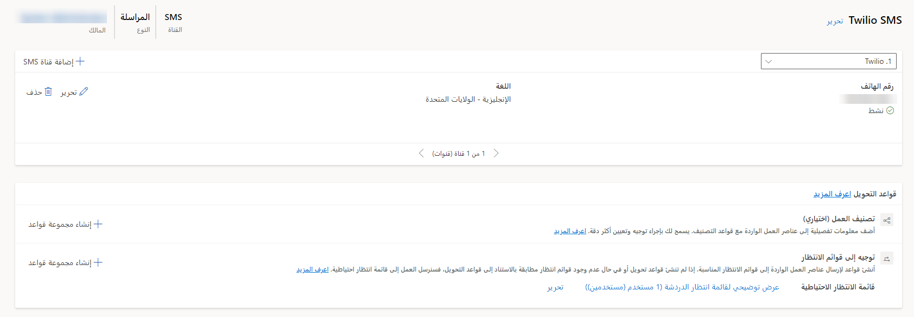
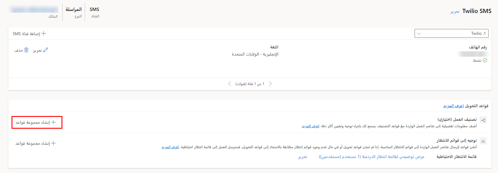
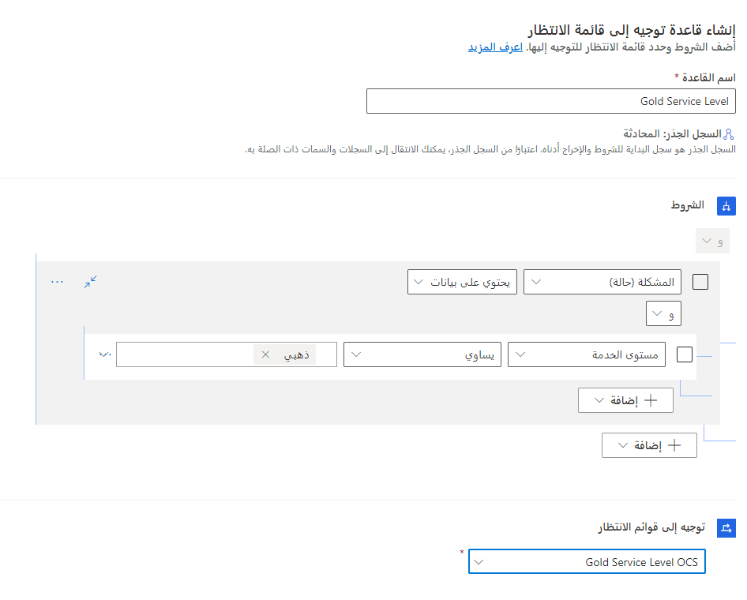

نظراً لأن عناصر عمل SMS الواردة تتم معالجتها بواسطة مسار عمل، فإن الخطوة التالية هي توجيه العناصر الواردة إلى قائمة الانتظار المناسبة حيث سيتم تعيينها في النهاية إلى مندوب. يمكنك إنشاء تصنيف العمل والمسار باستخدام قواعد قائمة الانتظار.

> [!div class="mx-imgBorder"]
> 

## إنشاء تصنيف العمل

بالنسبة للتوجيه الموحد، في تصنيف العمل، يجب عليك تحديد القواعد لإضافة معلومات مفصلة إلى عناصر العمل الواردة التي يمكن استخدامها لتوجيه عناصر العمل وتعيينها على النحو الأمثل. يمكنك إنشاء قواعد تصنيف العمل باستخدام قائمة القرارات التعريفية اليدوية أو باستخدام نماذج التعلم الآلي (MLM).

يمكنك إنشاء مجموعه قواعد تصنيف العمل من داخل تدفقات العمل. حدد **+ إنشاء مجموعة قواعد** من تدفقات العمل لفتح مربع الحوار، كما هو موضح في لقطة الشاشة التالية.

> [!div class="mx-imgBorder"]
> 

عند إنشاء مجموعة قواعد، يمكنك تحديد أحد الخيارات التالية لنوع القاعدة:

- **منطقي** - القواعد التي تستخدم ملفات تعريف السعة أو المهارات أو السمات الخاصة بالسجل الموجه.

- **نموذج التعلم الآلي**: استخدم نماذج التعلم الآلي للمساعدة في تصنيف عناصر العمل. يمكنك اختيار واحد مما يلي: 

    - **تعريف المهارة**

    - **التنبؤ بالتوجه**

    - **تقدير الجهد**

لمزيد من المعلومات حول تصنيف العمل، راجع [تكوين مجموعة قواعد تصنيفات العمل للتوجيه الموحد](/dynamics365/customer-service/configure-work-classification).

## التوجيه إلى قوائم الانتظار

ترسل قواعد تحويل قوائم الانتظار عنصر العمل إلى قائمة الانتظار المناسبة. على سبيل المثال، يمكنك إنشاء قاعدة توجيه تقوم بتوجيه أي حالة يتم فيها تعيين مستوي الخدمة على الحالة الذهبية إلى قائمة الانتظار الذهبية.  

> [!IMPORTANT] 
> على الرغم من أنها موصى بها بشدة، إلا أن قواعد توجيه قائمة الانتظار اختيارية. إذا لم يتم تحديد أي قواعد أو إذا لم تتطابق أي قواعد، فسيتم توجيه عنصر العمل الوارد إلى قائمة الانتظار الافتراضية لنوع القناة المعني.

بالنسبة لتدفق العمل، يتم تشغيل مجموعة قواعد **التوجيه إلى الصف** بعد تشغيل كافة مجموعات قواعد تصنيف العمل. يمكن لتدفقات العمل أن تحتوي على مجموعة قواعد واحدة فقط من **التوجيه إلى الصف**.

يمكنك إنشاء مجموعة قواعد **التوجيه إلى قوائم الانتظار** من داخل تدفق العمل وذلك بتحديد الزر **+ إنشاء مجموعة قواعد**.  تكوين مجموعات القواعد يشبه إلى حد بعيد تكوين قواعد الاستيعاب.  

وسوف تحتوي مجموعة القواعد على العناصر التالية: 

في مربع الحوار **إنشاء قاعدة استيعاب**، أدخل المعلومات التالية: 

- **اسم القاعدة**: الاسم البسيط الذي سيتم استخدامه لتحديد القاعدة.  

- **الشروط**: حدد الشروط المعينة التي تستخدم لتحديد ما إذا كانت قاعدة الإدخال تنطبق أم لا. 
    - يمكن أن تقيم الشروط الحقول من سجل الحالة أو من السجلات المرتبطة في علاقات متعدد بواحد وعلاقة واحد بمتعدد وعلاقة متعدد بمتعدد، مثل حساب العميل. 
    - يمكنك استخدام شروط و/أو متعددة في عنصر قاعدة واحد.

- **التوجيه إلى قائمة الانتظار** - يحدد قائمة الانتظار التي سيتم تعيين العنصر لها.  

تُظهر الصورة أدناه مثالاً على قاعدة توجيه هي المحادثات المتعلقة بحالات الذهب على مستوى الذهب لقائمة انتظار مستوى الخدمة الذهبية.  

> [!div class="mx-imgBorder"]
> 

لمزيد من المعلومات حول التوجيه، راجع[تكوين التوجيه إلى قوائم الانتظار ومجموعات القواعد والقواعد](/dynamics365/customer-service/configure-work-classification).