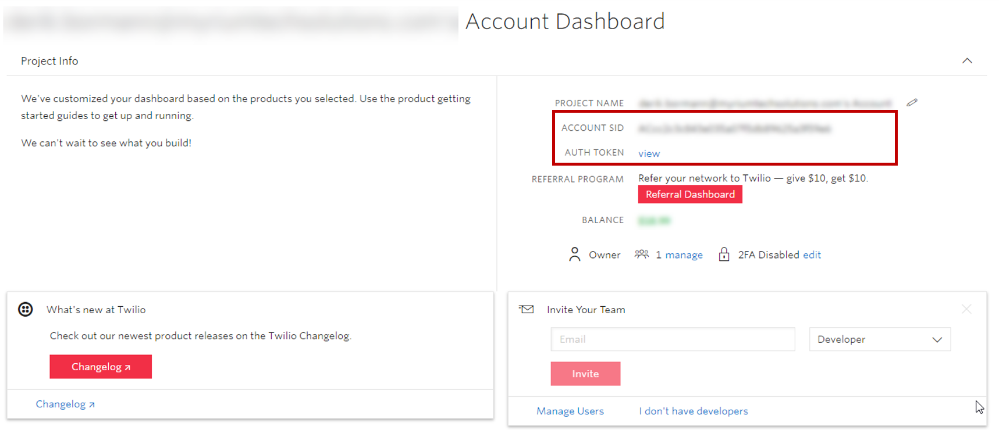
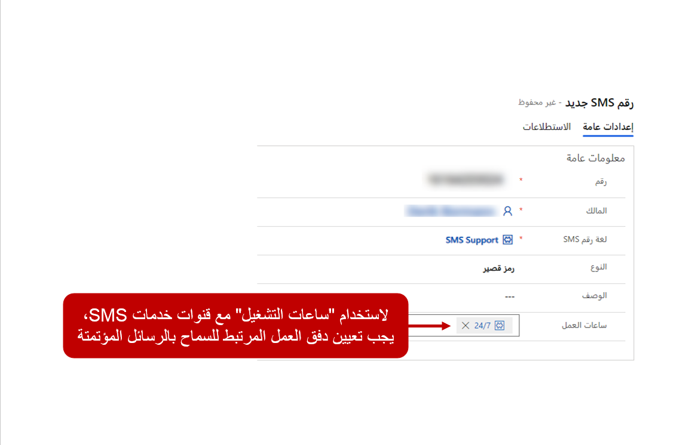
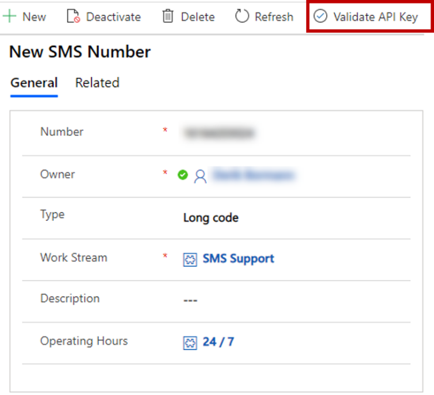
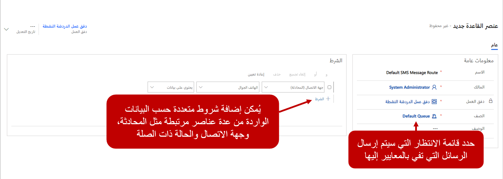

قبل تحديد أرقام الهواتف التي ستستخدمها القناة متعددة الاتجاهات لـ Customer Service للتواصل مع العملاء، تحتاج إلى إعلام الحل بمن يوفر الوظائف. تتيح علامة التبويب **إعدادات SMS** لتدفق العمل معرفة موفر SMS الذي يتم استخدامه لإرسال الرسائل وتلقيها.

عند تحديد مزود خدمة الرسائل القصيرة لاستخدامه، سيُطلب منك تقديم تفاصيل إضافية مثل تفاصيل الحساب وAPI.

إذا قمت بتحديد Twilio، فقم بتوفير المعلومات التالية:

-   **SID الحساب** - رقم SID الحساب الذي تم إنشاؤه من حساب Twilio.

-   **رمز المصادقة** - - رمز المصادقة الذي تم إنشاؤه من حساب Twilio.

يمكن لعملاء Twilio استرداد كلا العنصرين من الشاشة الرئيسية لحساب Twilio الخاص بهم.

> [!div class="mx-imgBorder"]
> 

## معايير الاتصال

نظرًا لأن العملاء يرسلون رسائل إلى رقم هاتف الدعم الخاص بمؤسستك، يحتاج مزود خدمة الرسائل القصيرة الخاص بك إلى معرفة مكان إرسال هذه الرسائل. تتم معالجة هذه العملية من خلال عنوان URL المتجه للداخل Twilio. عندما يتم تحديد دفق عمل SMS، يتم إنشاء عنوان URL للداخل Twilio.

## أرقام SMS

استناداً إلى متطلبات مؤسستك وعوامل أخرى، مثل وحدات تخزين الرسائل، يمكنك شراء أفضل نوع من الأرقام استناداً إلى احتياجاتك. تستخدم أرقام SMS فئات التعليمات البرمجية، وتتوفر ثلاثة أنواع من أرقام هواتف SMS:

-   **رمز طويل** - رقم هاتف فريد مكون من 10 أرقام مرتبط برمز منطقة محدد (+1-XXX-XXX-XXXX).

-   **رمز قصير** - رقم قصير غالباً ما بين أربعة إلى ستة أرقام يستخدم غالباً في سيناريوهات الحجم الكبير (XXXXX).

-   **الرقم المجاني** - خدمة الرسائل النصية القصيرة التي ترسل رسائل نصية من الأرقام المجانية.

لدى المؤسسات أسباب مختلفة لاختيار نوع رقم واحد على آخر، ولكنه يعتمد أساساً على حجم الرسائل التي يجب إرسالها. على سبيل المثال، قد تستخدم المؤسسة التي ترسل العديد من اتصالات التسويق عبر الرسائل القصيرة أو الإخطارات أحادية الاتجاه للعملاء رموزاً قصيرة.

عندما يكون لديك رقم من Twilio، يمكنك إضافته إلى علامة التبويب **أرقام SMS** في دفق عمل الرسائل القصيرة. إضافة رقم هاتف رسائل قصيرة إلى تدفق العمل أيضاً بإنشاء سجل قناة SMS لرقم الهاتف. يمكن الوصول إلى قناة SMS من علامة التبويب **أرقام هواتف SMS** في دفق العمل وقناة SMS ضمن **القنوات** في تطبيق إدارة القناة متعددة الاتجاهات.

عند إنشاء قناة SMS، قم بتوفير المعلومات التالية:

-   **الرقم** - رقم الهاتف الذي اشتريته من Twilio. يجب أن تتضمن أرقام الهواتف رمز البلد ورقم الهاتف الكامل مع رمز المنطقة.

    **مثال رقم هاتف الولايات المتحدة:** ‏19875551234

-   **النوع** - حدد **الرمز الطويل**.

-   **الوصف** - وصف اختياري للرقم.

-   **ساعات العمل** - يسمح لك بتحديد ساعات العمل عندما يكون فريق دعم العملاء نشطاً ومتاحاً لخدمة العملاء. يعمل فقط عندما يتم تعيين قيمة حقل **السماح بالرسائل التلقائية** إلى **نعم**.

> [!div class="mx-imgBorder"]
> 

بعد إضافة رقم الهاتف، تأكد من التحقق من صحة مفتاح API قبل استخدامه. عندما يتم التحقق من صحة مفتاح API، ستكون القناة متاحة لك لبدء إرسال واستقبال الاتصالات.

> [!div class="mx-imgBorder"]
> 

## توجيه محادثات SMS

يتم تحديد قواعد توجيه SMS في علامة التبويب **قواعد التوجيه** من سجل تدفق عمل SMS. تعمل قواعد توجيه SMS في حقل **الهاتف المحمول** في كيان **جهة الاتصال**. يتم التعرف على جهة الاتصال من خلال مطابقة رقم الهاتف الذي جاءت منه الرسالة إلى رقم هاتف محمول في كيان **جهة الاتصال**. عند تحديد سجل جهة الاتصال المناسب، يتم ربط سجل المحادثة بسجل جهة الاتصال ويتم تحميل شاشة ملخص العميل في جلسة العمل. 

يمكن لعناصر قواعد التوجيه تقييم شروط العناصر السياقية التالية المرتبطة بسجل المحادثة الذي تم إنشاؤه:

-   **الحساب** - يسمح لك بتقييم البيانات من سجل الحساب المرتبط بالمحادثة.

-   **جهة الاتصال** - يسمح لك بتقييم البيانات من سجل جهة الاتصال المرتبط بالمحادثة.

-   **الحالة** - تسمح لك بتقييم البيانات من سجل جهة الاتصال المرتبط بالمحادثة.

-   **متغيرات السياق** - يسمح لك بتقييم المعلومات المخزنة في متغير السياق المقترن بالمحادثة.

-   **سياق مشاركة الرسائل القصيرة** - يسمح لك بتقييم البيانات السياقية المتعلقة بالرسائل القصيرة مثل مزود خدمة الرسائل القصيرة أو رمز البلد أو البيانات الأخرى.

> [!div class="mx-imgBorder"]
> 

على سبيل المثال، كما يتم تلقي رسالة، يمكن استخدام القاعدة رمز البلد الذي تم التقاطه في حقل **سياق مشاركة الرسائل القصيرة** لتوجيه العناصر إلى صفوف الانتظار لكل من البلدان المختلفة التي تقدم الخدمة فيها.
