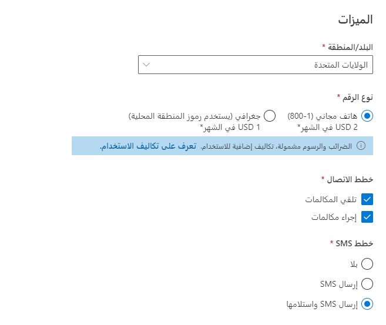
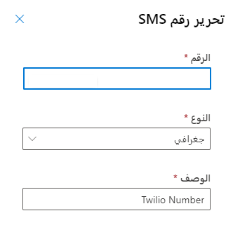
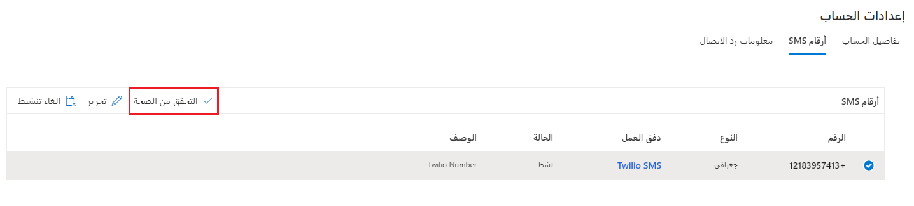

## تحديد أرقام هواتف ACS

تحتاج إلى التأكد من تحديد أرقام الهواتف أو موفري الرسائل الضروريين للاستخدام، قبل تكوين وظيفة الرسائل القصيرة.  يمكنك تكوين أرقام الهواتف وموفري الرسائل فِي تطبيق **مركز إدارة خدمة العملاء**. ستتغير هذه العملية، اعتماداً عَلى المزود الذي تخطط لاستخدامه.   

## إضافة أرقام هواتف جديدة

قبل استخدام Azure Communication Services (ACS) لمحادثات SMS، تحتاج إلى التأكد من توفر أرقام الهواتف للتواصل معها. يمكنك إضافة أرقام الهواتف باستخدام تطبيق **مركز مسؤول خدمة العملاء**. 

1. حدد **القنوات** ضمن **دعم العملاء**.

2. حدد **إدارة** بجوار القسم **أرقام الهاتف**.
  
3. عند إضافة الرقم الجديد، حدد **البلد/المنطقة** من القائمة المنسدلة.  
   استناداً إلى البلد الذي تحدده، يتم سرد قائمة بالخطط المتاحة لذلك البلد / المنطقة. على سبيل المثال، إذا حددت الولايات المتحدة، فسيتم تقديم نوعين من الأرقام.  
    - **الرقم المجاني (1-800)**: هناك خياران متاحان (844 و833).  
    - **جغرافي (يستخدم رموز المنطقة المحلية)**: حدد الولاية والمدينة التي ترغب فِي استخدامهما كأساس للرقم.  ويختلف عدد المدن المتاحة استناداً إلى المنطقة التي قمت بتحديدها.  

حالياً، لا يمكن إضافة خطط الرسائل النصية القصيرة إلا إلى الأرقام المجانية. يجب عليك تمكين القدرة عَلى إرسال واستقبال الرسائل القصيرة، بعد تحديد خيار خطة الاتصال (تلقي مكالمات أو إجراء مكالمات أو كليهما).  
> [!div class="mx-imgBorder"]
> 

بمجرد تخصيص رقم جديد، سيكون لديك 15 دقيقة فقط لشراء الرقم. إذا انقضى الوقت، فسيتعين عليك الشراء مرة أخرى.  بعد شراء رقمك، سيكون لديك رقم هاتف يمكنك استخدامه للاتصال عبر الرسائل القصيرة.  

## الحصول عَلى TeleSign أو حساب TeleSign أو Twilio

تدعم القناة متعددة الاتجاهات لـ Customer Service حالياً الرسائل القصيرة من خلال مزودي الرسائل القصيرة: TeleSign وTwilio. تحتاج المؤسسات التي ترغب فِي تقديم دعم الرسائل القصيرة إلى التسجيل فِي TeleSign أو Twilio قبل إضافة دعم الرسائل القصيرة إلى القناة متعددة الاتجاهات لـ Customer Service. للحصول عَلى هذه الحسابات ليس الغرض من هذه الوحدة، ولكن لمزيد من المعلومات، راجع المعلومات التالية. 

-   تسجيل الاشتراك للحصول عَلى حساب [TeleSign](https://portal.telesign.com/signup/?azure-portal=true)

-   تسجيل الاشتراك للحصول عَلى حساب [Twilio](https://www.twilio.com/try-twilio/?azure-portal=true)

## تكوين دعم الرسائل القصيرة

بمجرد الحصول عَلى حساب ورقم، ستحتاج إلى إضافته كحساب مراسلة فِي تطبيق **مركز مسؤول خدمة العملاء**.  لعرض حسابات المراسلة، انتقل إلى **القنوات** > **حسابات المراسلة**.  

عند تحديد حساب مراسلة جديد، تحتاج إلى تحديد المعلومات التالية: 

- **تفاصيل القناة**  
    - **الاسم** - اسم بسيط يُستخدم لتعريف حساب المراسلة.
    -   **القناة** - نوع قناة الاتصال لحساب المراسلة. سيتم تعيين هذا الخيار إلى **الرسائل القصيرة**.

- **تفاصيل الحساب**:  
    - **المزود** - الحساب الذي ستستخدمه وهو Twilio أو TeleSign. بناءً عَلى **الموفر** الذي تحدده، تحتاج إلى تحديد ما يلي:
      - **TeleSign**: معرّف العميل ومفتاح API
      - **Twilio**: الحساب ورمز التفويض

- **أرقام الرسائل القصيرة**:
    - **الرقم**: الرقم الذي تريد إضافته. ستقدم الرقم الكامل مع رمز البلد دون أي مسافات أو شُرط.  
    - **النوع**: نوع الرقم الذي تريد استخدامه. يمكنك الاختيار مما يلي:  
        - **الرمز الطويل** - رقم هاتف فريد مكون من 10 أرقام ومرتبط برمز منطقة معين (1XXXXXXXXXX).
        - **رمز قصير** - رقم قصير غالباً ما يتكون من أربعة إلى ستة أرقام ويستخدم غالباً فِي سيناريوهات الحجم الكبير (XXXXX).
        - **الرقم المجاني** - خدمة الرسائل النصية القصيرة التي ترسل رسائل نصية من الأرقام المجانية.
    - **الوصف**: وصف موجز للرقم.  

    > [!div class="mx-imgBorder"]
    > 

- **معلومات رد الاتصال**: لتوجيه رسائل SMS الواردة إلى مثيل Dynamics 365 الخاص بك، انسخ عنوان URL إلى الموقع الصحيح عَلى حساب موفر SMS الخاص بك. على سبيل المثال، بالنسبة لحساب Twilio، يلزمك لصق عنوان URL لمعاودة الاتصال فِي **خطاف الويب الخاص بالرسالة** الواردة عَلى رقم الهاتف المستخدم فِي حساب المراسلة.  

## تحقق من صحة رقم SMS

بمجرد إنشاء الرقم، يجب عليك التحقق من صحة الرقم والحساب. في أرقام SMS الخاصة بحساب المراسلة، حدد الرقم وحدد **التحقق من الصحة** للتأكد من صحة الرقم وتكوينه بشكل صحيح.  

> [!div class="mx-imgBorder"]
> 

