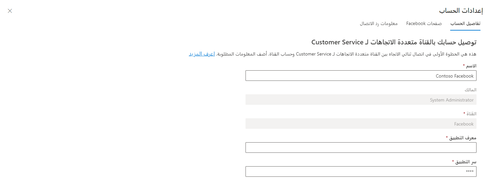

كيفية التطور المتواصل للمؤسسات التي تدعم العملاء. تساعد تطبيقات المراسلة الاجتماعية على الدفع. ونظراً لأنها أصبحت أكثر رسوخاً في الحياة اليومية، تلجأ المؤسسات إليها كقنوات دعم. توفر تطبيقات المراسلة الاجتماعية طريقة فورية للتواصل مع الشركات عبر الإنترنت، وتعمل كقناة دائمة والتي يتحكم فيها العملاء ويمكنهم الدخول والخروج منها. يضمن توفير خيارات التواصل عبر المراسلة الاجتماعية للعملاء إمكانية الاتصال بمؤسستك وفقاً لشروطهم. تمنح الطبيعة غير المتزامنة لهذه القنوات للعملاء الراحة في حل مشكلاتهم عندما يجدون الوقت، على عكس القنوات في الوقت الفعلي مثل الدردشة لـ Dynamics 365 Customer Service، حيث تنتهي الجلسة عند إغلاق نافذة الدردشة. 

تساعدك القناة متعددة الاتجاهات لـ Microsoft Dynamics ‏365 Customer Service على تكوين قنوات اتصال المراسلة الاجتماعية للسماح لمندوبي الخدمة بالتواصل مع العملاء من خلال هذه الأنظمة الأساسية بالإضافة إلى محادثات الدردشة المباشرة. على غرار المحادثات المباشرة، يمكن توجيه المحادثات الواردة من قنوات المراسلة الاجتماعية إلى قائمة الانتظار المناسبة وتوزيعها على المندوبين المتاحين.

الرسائل الواردة من المراسلة الاجتماعية متاحة للمندوبين من خلال لوحة معلومات مندوب القناة متعددة الاتجاهات. يمكن للمندوبين عرض طلبات المراسلة الاجتماعية الواردة بسهولة والرد عليها وفقاً لذلك. نظراً لأن المراسلة الاجتماعية هي شكل غير متزامن من المحادثة، يمكن للمندوبين إغلاق المحادثات والعودة إلى العمل فيها لاحقاً. سيتم عرض أي محادثات في دفق أصناف العمل الخاصة بي على لوحة المعلومات الخاصة بهم.  

## المتطلبات الأساسية لإضافة دعم الرسائل القصيرة

قبل أن تتمكن من تكوين المراسلة الاجتماعية في مؤسستك، يجب أن تفي بشرطين أساسيين. أولاً، يجب تمكين الوظائف الاجتماعية في مؤسسة القناة متعددة الاتجاهات حيث سيعمل المندوبون. ثانياً، يجب أن يكون لدى مؤسستك الصفحات والحسابات المناسبة والعناصر الأخرى المطلوبة لكل موفر خدمة مراسلة اجتماعية سيستخدمونه.    

تدعم القناة متعددة الاتجاهات لـ Customer Service حالياً المراسلة الاجتماعية من موفري الخدمات التاليين: 

- Facebook

- LINE

- Twitter

- WhatsApp

- WeChat

## تمكين المراسلة الاجتماعية

المراسلة الرقمية في Dynamics 365 for Customer Service عبارة عن اشتراك إضافي يمنح للمندوبين القدرة على التواصل مع العملاء من خلال موفري المراسلة الرقمية. إنها خدمة مطلوبة لتمكين قنوات دعم المراسلة الاجتماعية في مؤسسات Dynamics 365. يتم تمكين إمكانيات المراسلة الاجتماعية من خلال صفحة **إدارة مثيلات القناة متعددة الاتجاهات**.  

## تكوين دعم المراسلة الاجتماعية

مثل جميع قنوات الاتصال في القناة متعددة الاتجاهات لـ Customer Service، ستحتاج على الأقل إلى تدفق عمل مخصص واحد على الأقل لكل قناة من قنوات المراسلة الاجتماعية التي سيقوم المندوبون والعملاء بالتواصل من خلالها. يتم إنشاء تدفقات العمل المتعلقة بالمراسلة الاجتماعية من منطقة إدارة توزيع العمل في تطبيق إدارة القناة متعددة الاتجاهات. اعتماداً على نوع القناة، ستحتوي بعض عمليات دفق العمل على إعدادات إضافية خاصة بتلك القناة.    

على غرار تدفقات العمل الأخرى، بالنسبة للتدفقات المتعلقة بالمراسلة الاجتماعية، ستحتاج إلى تحديد المعلومات التالية:

- **الاسم** - اسم بسيط يُستخدم لتعريف تدفق العمل.

- **القناة** - نوع قناة الاتصال لتدفق العمل. يجب تعيين هذه القناة إلى موفر المراسلة الاجتماعية المستخدمة.

- **القدرة الإنتاجية** - تحدد مقدار القدرة الإنتاجية الإجمالية للمندوب التي ستستهلكها محادثات الرسائل القصيرة من هذا الدفق. (لا يمكن تغيير هذه المعلمة بعد حفظ تدفق العمل.)

- **الإغلاق التلقائي بعد عدم النشاط** - تحديد مقدار الوقت الذي يمكن أن ينقضي قبل نقل محادثة من حالة الانتظار إلى حالة الإغلاق بسبب عدم النشاط.

> [!div class="mx-imgBorder"]
> 

في قسم **توزيع العمل**، ستحدد كيفية تعيين عناصر العمل للمندوبين من هذه القناة.

يتوفر لديك خياران لتحديدهما:

- **وضع توزيع العمل** - يحدد ما إذا كان سيتم دفع عناصر عمل الرسائل القصيرة من هذا التدفق إلى المندوبين تلقائياً أو إذا كان بإمكان المندوبين تحديد العناصر التي يريدون العمل عليها من قوائم الانتظار التي هم أعضاء فيها.  

- **حالات الحضور المسموح بها** - تحديد حالات حضور المندوبين التي يمكن توجيه الرسائل القصيرة من هذا التدفق إليها. بشكل افتراضي، يتم تعيين هذا الخيار لتوجيه المحادثات إلى المندوبين الذين تم تعيين حضورهم إما إلى **متاح** أو **مشغول**. 

- **تمكين التحديد من تدفقات العمل المستندة إلى الدفع** - السماح للمندوبين بتحديد المحادثات يدوياً من تدفقات العمل المستندة إلى الدفع.

تحتوي تدفقات عمل المراسلة الاجتماعية على نفس علامات تبويب التكوين المتوفرة مثل تدفقات العمل الأخرى.  

- **متغيرات السياق** - تحتوي على بيانات السياق مثل بيانات ما قبل المحادثة أو معلومات القناة التي يمكن استخدامها للمساعدة في توجيه المحادثات إلى المكان المناسب.

- **قواعد التوجيه** - الشروط التي يتم تقييمها والتي تتحكم في المكان الذي يتم توجيه الأصناف إليه.  

- **قواعد مرفقات المهارات‬** - بناءً على المهارات المرتبطة بالمحادثة، سيتم توجيهها إلى المندوب الذي يطابق تلك المهارات بشكل أفضل.

- **القوالب** - تحدد الجلسة المحددة مسبقاً وقوالب الإخطارات التي يجب استخدامها عند إنشاء جلسات العمل وتسليم الإخطارات إلى المندوبين للمحادثات المتعلقة بتدفق العمل هذا.   
