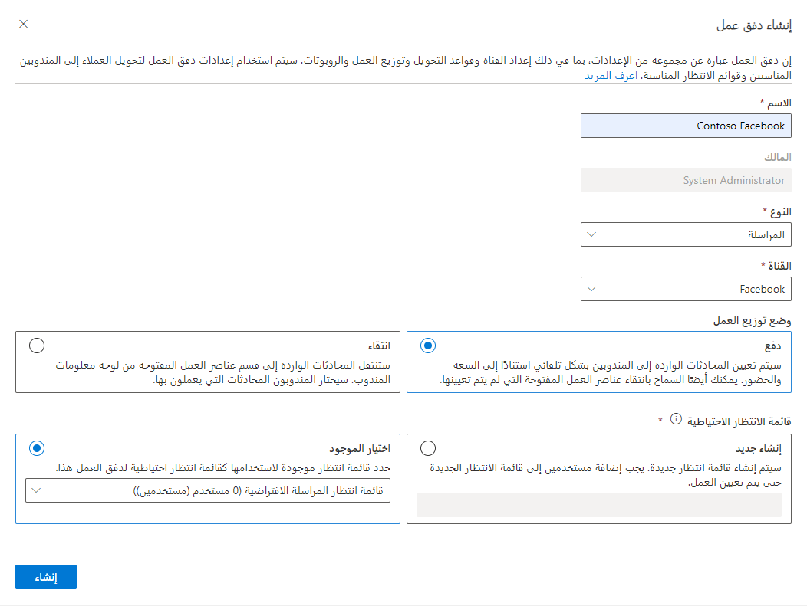
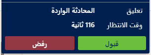
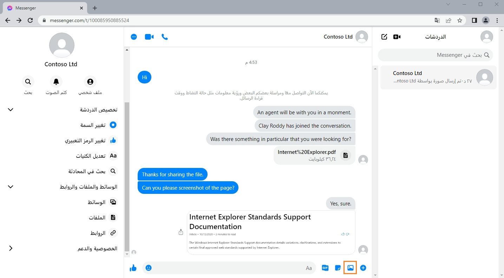

تمكنك القناة متعددة الاتجاهات لـ Dynamics 365 Customer Service من تكوين قنوات اتصال Facebook للاستفادة منصات المراسلة الاجتماعية والتفاعل مع عملائك من خلال تجربة مخصصة.  

## المتطلبات الأساسية لإضافة دعم Facebook

توجد بعض المتطلبات القليلة قبل أن تتمكن من استخدام أي أنظمه مراسلة اجتماعية في القناة متعددة الاتجاهات لخدمة العملاء. يجب إعداد المراسلة الاجتماعية من خلال صفحة إدارة مثيلات القناة متعددة الاتجاهات.  

لمزيد من المعلومات حول تمكين القدرات الاجتماعية، راجع [القناة متعددة الاتجاهات لـ Customer Service](/dynamics365/omnichannel/administrator/omnichannel-provision-license#provision-omnichannel-for-customer-service-application/?azure-portal=true).

لاستخدام Facebook Messenger، يجب أن يكون لدى المؤسسات الإعداد التالي في Facebook:

- صفحة Facebook مع تمكين Messenger. لمزيد من المعلومات، راجع [إنشاء صفحة ومراسلة وإدارتهما](https://www.facebook.com/help/994476827272050/?helpref=hc_fnav)

- تطبيق Facebook. لمزيد من المعلومات، راجع [تطوير التطبيق](https://developers.facebook.com/docs/apps/)

- تمت إضافة Messenger وWebhooks إلى تطبيق Facebook. لمزيد من المعلومات، راجع [إعداد تطبيق Facebook](https://developers.facebook.com/docs/messenger-platform/getting-started/app-setup/)

لمزيد من المعلومات عن كيفية [تكوين قناة Facebook](/dynamics365/omnichannel/administrator/configure-facebook-channel/?azure-portal=true).

## إنشاء قناة Facebook (تطبيق)

تحتاج إلى إنشاء سجل حساب مراسلة لكل منصة مراسلة اجتماعية كنت تنوي استخدامها (Facebook في هذه الحالة). بعد إنشاء حساب مراسلة لـ Facebook، يمكنك إنشاء مسار عمل Facebook، وإضافة حساب المراسلة كقناة. يمكن إنشاء حسابات مراسلة Facebook في **مركز إدارة خدمة العملاء**. انتقل إلى **القنوات**، وحدد **إدارة** بجوار **حسابات المراسلة**.  

في صفحة **إضافة حساب**، ستحتاج إلى تقديم المعلومات التالية:

- **الاسم** - اسم تطبيق Facebook.

- **القناة** - قم بتعيين القناة على Facebook.

- **معرّف التطبيق** - توفير معرّف تطبيق Facebook.

- **سر التطبيق** - سر التطبيق لتطبيق Facebook.

يمكنك الحصول على **سر التطبيق** و **المعرف** من خلال الانتقال إلى **الإعدادات > أساسي** من تطبيق Facebook. وهي موجودة في حقول **معرّف التطبيق** و **سر التطبيق**.

> [!div class="mx-imgBorder"]
> 

بعد حفظ تفاصيل الحساب، يصبح قسم **صفحات Facebook** متاحاً. تسمج لك **صفحاتFacebook Pages** بإضافة صفحات Facebook التي تسمح للعميل بالاتصال بالمندوب.

عند إضافة صفحة جديدة، يمكنك توفير التفاصيل التالية:

- **اسم الصفحة** - الاسم يجعل من السهل تحديد الصفحة، ولكن لا يلزم مطابقة الاسم الفعلي لصفحة Facebook التي تشير إليها.

- **معرّف الصفحة** - إضافة معرّف صفحة Facebook المرتبط بها هذا السجل. يتوفر معرف الصفحة عن طريق تحديد **حول** ثم نسخ القيمة في حقل **معرّف الصفحة**.

- **الرمز المميز للوصول إلى الصفحة** - الرمز المميز للوصول إلى الصفحة من تطبيق Facebook المرفق بالصفحة. يمكنك الحصول على الرمز المميز من تطبيق Facebook الخاص بك عن طريق الانتقال إلى **Messenger > الإعدادات** ثم نسخ قيمة حقل **الرمز المميز للوصول إلى الصفحة**.

> [!div class="mx-imgBorder"]
> 

بعد إضافة الصفحة بنجاح، يتم إنشاء قيم **Callback Uri** و **التحقق من الرمز المميز** تلقائياً. يتم استخدام هذه القيم لتكوين webhooks في تطبيق Facebook.

## مسار عمل العملاء على Facebook 

بعد إنشاء حساب المراسلة على Facebook ستحتاج إلى تكوين مسار عمل جديد لبدء العمل مع رسائل Facebook. يمكنك إنشاء مسار العمل في **مركز إدارة خدمة العملاء.** 

لإنشاء مسار عمل اجتماعي، ستحتاج إلى تحديد المعلومات التالية: 

- **الاسم** - اسم بسيط يستخدم لتحديد مسار العمل.

- **النوع** - نوع اتصال القناة الذي سيقوم مسار العمل بمعالجته. بالنسبة للقنوات الاجتماعية، يجب تعيين النوع إلى **المراسلة**.  

- **القناة** - نوع قناة الاتصال لتدفق العمل. يجب تعيين النوع إلى **Facebook.**

- **توزيع العمل** - كيف سيتم تعيين عناصر العمل من مسار العمل هذا إلى المندوبين. يمكنك تحديد أحد الخيارات التالية: 
    
    - **الإرسال** - سيتم تعيين المحادثات إلى المندوبين تلقائياً استناداً إلى القدرة والوجود.  
    
    - **الانتقاء** - ستنتقل المحادثات إلى قسم عناصر العمل المفتوحة في لوحة معلومات المندوب.  سيختار المندوبون المحادثة التي يعملون عليها.  

- **قائمة انتظار احتياطية** - يحدد قائمة الانتظار التي يجب توجيه العناصر إليها افتراضياً إذا لم يتم توجيه محادثة تلقائياً إلى قائمة انتظار أخرى.  

> [!div class="mx-imgBorder"]
> 

## خيارات تدفق عمل العملاء على Facebook

بعد إنشاء مسار العمل، ستحتاج إلى إعداد قناة Facebook تستخدم مسار العمل. هذه الخطوة مطلوبة ويتم ذلك عن طريق تحديد الزر **إعداد Facebook**.
  
قم بتكوين قناة Facebook بالمعلومات التالية:

- **تفاصيل القناة** - تحديد الاسم والنوع وتفاصيل القناة. سيتم مسبقاً ملء حقل النوع والقناة ولا يمكن تغييرهما.

- **صفحة Facebook** - تحدد صفحة Facebook التي تريد استخدامها مع القناة. ستأتي هذه المعلومات من حساب المراسلة Facebook الذي أنشأته سابقاً.  

- **اللغة** - تحدد اللغة التي ستقترن بالقناة.  

- **السلوكيات** - تحدد السلوكيات التي يجب تنفيذها تلقائياً عندما يبدأ العميل دردشة Facebook. يمكنك تشغيل السلوكيات التالية:

    - **الرسائل التلقائية المخصصة** - يمكنك إنشاء رسائلك المخصصة التي سيتم استخدامها في مواقف مختلفة، مثل عندما يتم تعيين مندوب للمحادثة أو عندما يحاول العميل التفاعل خارج ساعات العمل. لمزيد من المعلومات، راجع [إنشاء الرسائل التلقائية المخصصة](/dynamics365/customer-service/configure-automated-message?tabs=customerserviceadmincenter).
     
    - **استطلاع ما بعد المحادثة** - استخدام صوت العميل لإرسال استطلاع إلى العميل حول تجربته بمجرد اكتمال المحادثة. لمزيد من المعلومات، راجع [استطلاعات ما بعد المحادثة](/dynamics365/customer-service/configure-post-conversation-survey?tabs=customerserviceadmincenter).

## تجارب العملاء والمندوبين

بعد نشر قناة Facebook، يمكن للعملاء بدء محادثة بأي طريقة من الطرق التالية:

- Messenger على صفحة Facebook

- [www.messenger.com](https://www.messenger.com/)

- تطبيق Messenger على جهاز محمول

- عنصر واجهة مستخدم Messenger على موقع ويب مخصص

إذا بدأ أحد العملاء محادثة من صفحة Facebook ثم انتقل لاحقاً إلى الجهاز المحمول، فستستمر المحادثة السابقة، ويمكن للعميل متابعة المحادثة.

يتلقى المندوب إخطاراً بطلب الدردشة الوارد مع تفاصيل العميل.

> [!div class="mx-imgBorder"]
> 

بعد ربط الملف الشخصي الاجتماعي لـ Facebook بسجل عميل أو جهة اتصال من قبل المندوب، يتم ربط محادثات Facebook اللاحقة بسجلات العملاء، ويتم ملء ملخص العميل. إذا لم يتم تعريف العميل استناداً إلى الاسم، يمكن إنشاء سجل جهة اتصال جديد. يمكن للعميل إرسال المرفقات فقط إذا قمت بتمكينها. عندما لا يتم تمكين الخيار للعملاء، لا يزال بإمكانهم محاولة إرسال الملف. ومع ذلك، لن يتلقى المندوبون الملف وسيظهر لهم خطأ.

إذا لم يتم تعريف العميل استناداً إلى الاسم، يمكن إنشاء سجل جهة اتصال جديد.
يمكن للعميل إرسال المرفقات فقط إذا قمت بتمكينها. عندما لا يتم تمكين الخيار للعملاء، لا يزال بإمكانهم محاولة إرسال الملف. ومع ذلك، لن يتلقى المندوبون الملف وسيظهر لهم خطأ.

> [!div class="mx-imgBorder"]
> 
