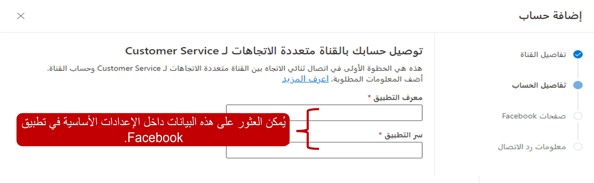
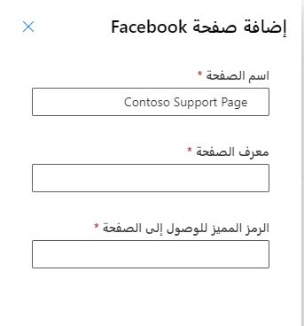
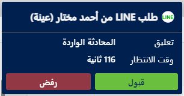

تمكنك القناة متعددة الاتجاهات لـ Dynamics 365 Customer Service من تكوين Facebook messenger للاستفادة من النظام الأساسي للمراسلة الاجتماعية والتفاعل مع عملائك من خلال تجربة مخصصة.

## المتطلبات الأساسية لإضافة دعم Facebook

قبل أن تتمكن من استخدام أي قناة مراسلة اجتماعية في القناة متعددة الاتجاهات لـ Customer Service، يجب توفير هذه القناة في مركز إدارة Microsoft Power Platform في المؤسسة. 

لاستخدام Facebook Messenger،، تحتاج المؤسسات إلى إعداد المعلمات التالية في Facebook:

- صفحة Facebook مع تمكين Messenger

- تطبيق Facebook يحتوي على Messenger وخطاطيف الويب

لمزيد من المعلومات، راجع [تكوين قناة Facebook](/dynamics365/omnichannel/administrator/configure-facebook-channel/?azure-portal=true).

## إنشاء قناة Facebook (تطبيق)

يتعين عليك تكوين مسار عمل لكل منصة مراسلة اجتماعية تريد استخدامه (يجب استخدام Facebook في هذه الحالة). بعد إنشاء تدفق عمل Facebook، يمكنك إنشاء قناة Facebook. عند إنشاء قناة Facebook، ستقوم بتوصيل تطبيق Facebook، الذي سيمنحك القدرة على التفاعل مع صفحات Facebook. تتوفر تطبيقات Facebook عن طريق تحديد **Facebook** ضمن **القنوات**.

في صفحة **تطبيق Facebook** الجديدة، قدم المعلومات التالية:

- **الاسم** - اسم تطبيق Facebook.

- **معرف التطبيق** - توفير معرف تطبيق Facebook.

- **سر التطبيق** - سر التطبيق لتطبيق Facebook.

يمكنك الحصول على "سر التطبيق" و"المعرف" عن طريق الانتقال إلى **الإعدادات > الأساسية** من تطبيق Facebook الخاص بك، ثم الانتقال إلى حقلي **معرف التطبيق** و **سر التطبيق**.

> [!div class="mx-imgBorder"]
> 

بعد حفظ سجل التطبيق، يصبح قسم **صفحات Facebook** متوفراً وسيسمح لك بإضافة صفحات Facebook التي يمكن للعميل من خلالها الاتصال بمندوب. في وقت نشر هذه الدورة التدريبية، يمكنك إنشاء تطبيق Facebook واحد فقط لكل مؤسسة. داخل تطبيق Facebook، يمكنك إضافة صفحات متعددة للتفاعل معها.

عند إضافة صفحة جديدة، يمكنك توفير التفاصيل التالية:

- **معرف الصفحة** - إضافة معرف صفحة Facebook المرتبط بها هذا السجل. يتوفر معرف الصفحة عن طريق تحديد **حول** ثم نسخ القيمة في حقل **معرف الصفحة**.

- **اسم الصفحة** - تساعد هذه المعلومات على تسهيل تحديد الصفحة. يمكن أن يتطابق الاسم مع الاسم الفعلي لصفحة Facebook التي يشير إليها، ولكنه لا يحتاج إلى ذلك.

- **الرمز المميز للوصول إلى الصفحة** - الرمز المميز للوصول إلى الصفحة من تطبيق Facebook المرفق بالصفحة. يمكنك الحصول على الرمز المميز من تطبيق Facebook الخاص بك عن طريق الانتقال إلى **Messenger > الإعدادات** ثم نسخ قيمة حقل **الرمز المميز للوصول إلى الصفحة**.

- **تطبيق Facebook** - تحديد سجل تطبيق Dynamics 365 Facebook المرتبط بهذه الصفحة. يتم ملء هذا الحقل تلقائياً عند إضافة صفحة Facebook.

- **تدفق العمل** - استعرض وحدد تدفق العمل الذي أنشأته لقناة Facebook.

> [!div class="mx-imgBorder"]
> 

بعد إضافة الصفحة بنجاح، يتم إنشاء قيم  **عنوان Uri لرد الاتصال**  و **الرمز المميز للتحقق** تلقائياً. يتم استخدام هذه القيم لتكوين webhooks في تطبيق Facebook.

## تجارب العملاء والمندوبين

بعد نشر قناة Facebook، يمكن للعملاء بدء محادثة بأي طريقة من الطرق التالية:

- Messenger على صفحة Facebook

- [www.messenger.com](https://www.messenger.com/)

- تطبيق Messenger على جهاز محمول

- عنصر واجهة مستخدم Messenger على موقع ويب مخصص

إذا بدأ أحد العملاء محادثة من صفحة Facebook ثم تحول لاحقاً إلى الجهاز المحمول، فستستمر المحادثة السابقة، ويمكن للعميل متابعة المحادثة.

يتلقى المندوب إخطارا بطلب الدردشة الوارد مع تفاصيل العميل.

> [!div class="mx-imgBorder"]
> 

## توجيه محادثات Facebook

عند بدء محادثة Facebook، يتم تحديد العميل استناداً إلى اسمه. سيقوم التطبيق بالبحث في كيان **جهة الاتصال** للعثور على سجل جهة اتصال مطابق. عند العثور على تطابق، يتم ربط المحادثة تلقائياً بسجل جهة الاتصال وتتم تعبئة ملخص العميل. إذا لم يتم تعريف العميل استناداً إلى الاسم، يمكن إنشاء سجل جهة اتصال جديد.

على غرار قواعد التوجيه الأخرى، يمكن إنشاء قواعد توجيه Facebook من علامة التبويب **قواعد التوجيه** لسجل تدفق العمل.

يمكن لعناصر قواعد التوجيه تقييم شروط العناصر السياقية التالية المرتبطة بسجل المحادثة الذي تم إنشاؤه:

- **الحساب** - يسمح لك بتقييم البيانات من سجل الحساب المرتبط بالمحادثة.

- **جهة الاتصال** - يسمح لك بتقييم البيانات من سجل جهة الاتصال المرتبط بالمحادثة.

- **الحالة** - تسمح لك بتقييم البيانات من سجل الحالة المقترن بالمحادثة.

- **متغيرات السياق** - السماح لك بتقييم المعلومات المخزنة في متغير السياق المقترن بمحادثة.

- **سياق المشاركة في Facebook** - السماح لك بتقييم البيانات السياقية المتعلقة برسالة Facebook مثل مزود خدمة الرسائل القصيرة أو رمز البلد أو البيانات الأخرى.

على سبيل المثال، كما يتم تلقي رسالة، سيتم توجيه القواعد كافة الرسائل التي يتم تلقيها من جهة اتصال، مثل عميل مفضل، إلى قائمة انتظار مفضل مخصصة التي يتم ترتيب أولوياتها على قوائم الانتظار الأخرى.
