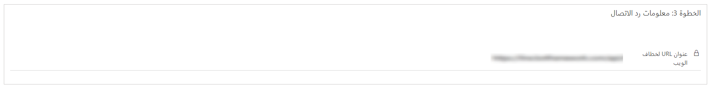
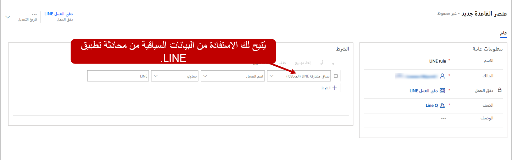

تمكنك القناة متعددة الاتجاهات لـ Dynamics 365 Customer Service من تكوين قنوات اتصال عبر LINE للاستفادة من اتجاه وسائل التواصل الاجتماعية والتفاعل مع عملائك من خلال تجربة مخصصة.  

## المتطلبات الأساسية لإضافة دعم LINE

قبل استخدام أي منصات مراسلة اجتماعية في القناة متعددة الاتجاهات لـ Customer Service، تأكد من استخدامك المراسلة الاجتماعية من خلال صفحة **إدارة مثيلات القناة متعددة الاتجاهات**.

لمزيد من المعلومات حول تمكين القدرات الاجتماعية، راجع [توفير القناة متعددة الاتجاهات لـ Customer Service](/dynamics365/omnichannel/administrator/omnichannel-provision-license?azure-portal=true#provision-omnichannel-for-customer-service-application/).
 
لاستخدام LINE، تحتاج المؤسسات إلى الإعدادات التالية في LINE:

- معالجة LINE

- قناة LINE في وحدة تحكم LINE للمطورين

لمزيد من المعلومات، راجع [إنشاء قناة LINE](https://developers.line.biz/en/docs/messaging-api/getting-started/#creating-a-channel/?azure-portal=true).

## إنشاء قناة LINE

كما ذكرنا سابقاً، يتعين عليك تكوين تدفق عمل لكل منصة مراسلة اجتماعية تريد استخدامه (يجب استخدام LINE في هذه الحالة). بعد إنشاء تدفق عمل LINE، يمكنك إنشاء قناة LINE. عند إنشاء قناة LINE، ستقوم بتوصيل تطبيق LINE، حيث سيمنحك القدرة على التفاعل مع قنوات LINE. تتوفر تطبيقات LINE عن طريق اختيار LINE أسفل القنوات.    

في صفحة **تطبيق LINE الجديد**، ستحتاج إلى تقديم المعلومات التالية:

- **الاسم** - اسم تطبيق LINE.

- **معرّف القناة** - توفير معرّف تطبيق LINE.
    يمكنك الحصول على المعرّف عن طريق الانتقال إلى [مدخل مطور LINE](https://account.line.biz/login?scope=line&redirectUri=https%3A%2F%2Fdevelopers.line.biz%2Fconsole%2F/?azure-portal=true)، وتحديد **الموفر > القناة > الإعدادات الأساسية**، ثم نسخ القيمة من حقل **معرّف القناة**.

- **سر القناة** - سر التطبيق لتطبيق LINE.
    يمكنك الحصول على سر القناة عن طريق الانتقال إلى [مدخل مطور LINE](https://account.line.biz/login?scope=line&redirectUri=https%3A%2F%2Fdevelopers.line.biz%2Fconsole%2F/?azure-portal=true)، وتحديد **الموفر > القناة > الإعدادات الأساسية**. 
    انسخ القيمة من الحقل **سر القناة**.

- **رمز الوصول إلى القناة** - رمز مميز لتطبيق LINE.
    يمكنك الحصول على رمز الوصول إلى القناة عن طريق الانتقال إلى [مدخل مطور LINE](https://account.line.biz/login?scope=line&redirectUri=https%3A%2F%2Fdevelopers.line.biz%2Fconsole%2F/?azure-portal=true)، وتحديد **الموفر > القناة > API للمراسلة**. انسخ القيمة من حقل الرمز المميز **رمز الوصول إلى القناة (ذو العمر الطويل)**.

- **تمكين خطافات الويب** - يجب تمكين خطافات الويب في تطبيق LINE.
    انتقل إلى [مدير حساب LINE](https://manager.line.biz/account/?azure-portal=true)، ثم حدد **الإعدادات > إعدادات الاستجابة**. ضمن **الإعدادات الرئيسية**، حدد **الروبوت** لـ **وضع الاستجابة**، ثم ضمن **الإعدادات التفصيلية**، حدد **تم التمكين لخطافات الويب**.

- **تدفق العمل** - تعيين إلى تدفق عمل LINE الذي قمت بإنشائه مسبقاً.

> [!div class="mx-imgBorder"]
> 

بعد إضافة **الصفحة** بنجاح، يتم إنشاء قيم **عنوان Uri لرد الاتصال** و **رمز التحقق المميز** تلقائياً. يتم استخدام هذه القيم لتكوين خطاطيف الويب في تطبيق LINE.

للتحقق من أن كل شيء تم إنشائه بشكل صحيح، انتقل إلى [مدخل مطور Line](https://account.line.biz/login?scope=line&redirectUri=https%3A%2F%2Fdevelopers.line.biz%2Fconsole%2F). انتقل إلى **موفر > القناة** (تأكد من أنها API للمراسلة) ثم حدد **API للمراسلة**. انسخ عنوان URL لخطاف الويب من القناة متعددة الاتجاهات لـ Customer Service، ثم الصقه في حقل **عنوان URL لخطاف الويب** في وحدة التحكم في مطور LINE. تأكد من تمكين **استخدام خطاف الويب** في لوحة معلومات تطبيق LINE.

> [!div class="mx-imgBorder"]
> 

## تجارب العملاء والمندوبين

بعد نشر قناة LINE، يمكن للعملاء بدء محادثة بطرق مختلفة:

- تطبيق LINE على جهاز محمول

- عن طريق تطبيق LINE على جهاز سطح المكتب

- [Line.me/en/](https://line.me/en/)

إذا بدأ أحد العملاء محادثة من موقع LINE على الويب ثم تحول لاحقاً إلى جهاز محمول، فستستمر المحادثة السابقة، ويمكن للعميل متابعة المحادثة.

يتلقى المندوب إخطارا بطلب الدردشة الوارد مع تفاصيل العميل.

> [!div class="mx-imgBorder"]
> 

## توجيه محادثات LINE

عند بدء محادثة LINE، يتم تحديد العميل استناداً إلى اسمه. سيقوم التطبيق بالبحث في كيان **جهة الاتصال** للعثور على سجل جهة اتصال مطابق. عند العثور على تطابق، يتم ربط المحادثة تلقائياً بسجل جهة الاتصال وتتم تعبئة ملخص العميل. إذا لم يتم تعريف العميل استناداً إلى الاسم، يمكن إنشاء سجل جهة اتصال جديد.

على غرار قواعد التوجيه الأخرى، يمكن إنشاء قواعد توجيه LINE من علامة التبويب **قواعد التوجيه** لسجل تدفق العمل.

يمكن لعناصر **قواعد التوجيه** تقييم شروط العناصر السياقية التالية المرتبطة بسجل المحادثة الذي تم إنشائه:

- **الحساب** - يسمح لك بتقييم البيانات من سجل الحساب المرتبط بالمحادثة.

- **جهة الاتصال** - يسمح لك بتقييم البيانات من سجل جهة الاتصال المرتبط بالمحادثة.

- **الحالة** - تسمح لك بتقييم البيانات من سجل جهة الاتصال المرتبط بالمحادثة.

- **متغيرات السياق** - السماح لك بتقييم المعلومات المخزنة في متغير السياق المقترن بمحادثة.

- **سياق مشاركة LINE** - السماح لك بتقييم البيانات السياقية المرتبطة برسالة LINE.

على سبيل المثال، كما يتم تلقي رسالة، سيتم توجيه القواعد كافة الرسائل التي يتم تلقيها من جهة اتصال، مثل عميل مفضل، إلى قائمة انتظار مفضل مخصصة التي يتم ترتيب أولوياتها على قوائم الانتظار الأخرى.

> [!div class="mx-imgBorder"]
> 
