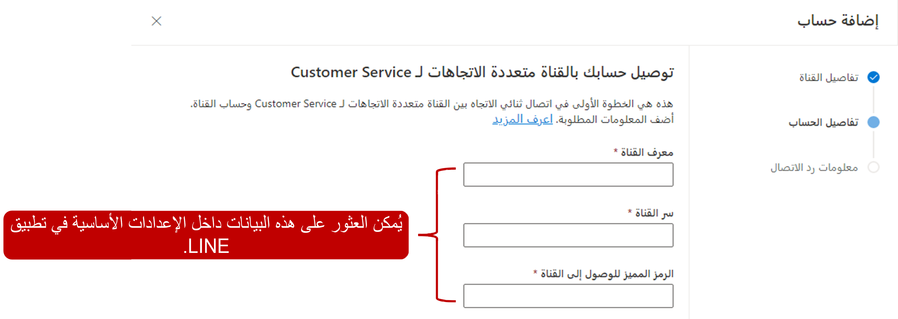
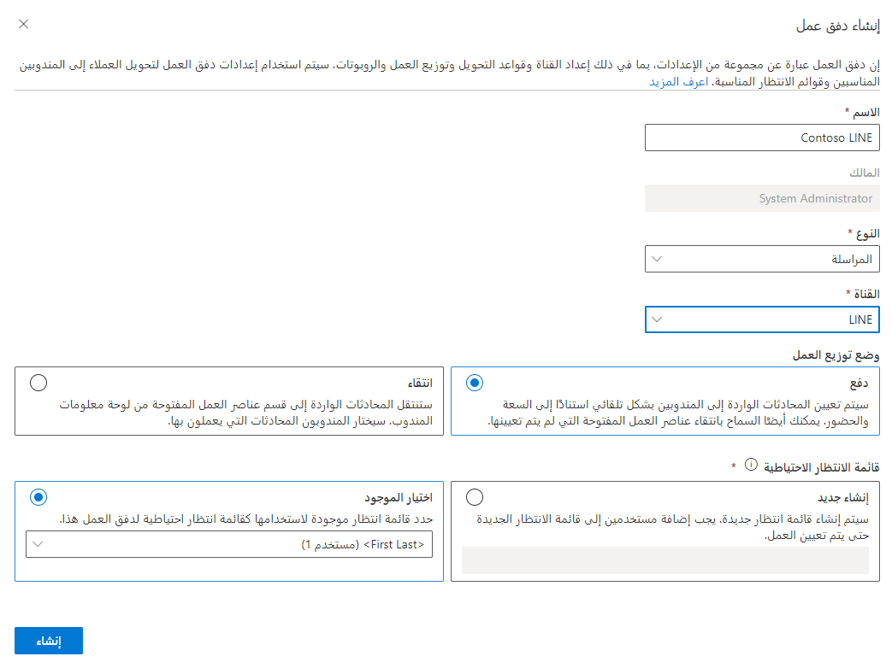

تمكنك القناة متعددة الاتجاهات لـ Dynamics 365 Customer Service من تكوين قنوات اتصال عبر LINE للاستفادة من اتجاه وسائل التواصل الاجتماعية والتفاعل مع عملائك من خلال تجربة مخصصة.  

## المتطلبات الأساسية لإضافة دعم LINE

قبل استخدام أي منصات مراسلة اجتماعية في القناة متعددة الاتجاهات لـ Customer Service، تأكد من استخدامك المراسلة الاجتماعية من خلال صفحة **إدارة مثيلات القناة متعددة الاتجاهات**.

لمزيد من المعلومات حول تمكين القدرات الاجتماعية، راجع [توفير القناة متعددة الاتجاهات لـ Customer Service](/dynamics365/omnichannel/administrator/omnichannel-provision-license?azure-portal=true#provision-omnichannel-for-customer-service-application/).
 
لاستخدام LINE، تحتاج المؤسسات إلى الإعدادات التالية في LINE:

- معالجة LINE

- قناة LINE في وحدة تحكم LINE للمطورين

لمزيد من المعلومات، راجع [إنشاء قناة LINE](https://developers.line.biz/en/docs/messaging-api/getting-started/#creating-a-channel/?azure-portal=true).

## إنشاء حساب مراسلة LINE 

أنت بحاجة إلى إنشاء حساب مراسلة يتصل بتفاصيل حساب LINE الخاص بك. يمكنك، بعد إنشاء حساب المراسلة، إنشاء تدفق عمل LINE وإضافة حساب المراسلة كقناة. يمكنك إنشاء حسابات المراسلة في تطبيق **مركز مسؤولي Customer Service**. انتقل إلى **القنوات**، وحدد **إدارة** بجوار **حسابات المراسلة**.  

في صفحة **إضافة حساب**، ستحتاج إلى تقديم المعلومات التالية:

- **الاسم** - اسم تطبيق LINE.

- **معرّف القناة** - معرّف تطبيق LINE. انتقل إلى [مدخل مطور LINE](https://account.line.biz/login?scope=line&redirectUri=https%3A%2F%2Fdevelopers.line.biz%2Fconsole%2F/?azure-portal=true)، وحدد **الموفر > القناة > الإعدادات الأساسية**، ثم انسخ القيمة من حقل **معرّف القناة**.

- **سر القناة** - سر التطبيق لتطبيق LINE. انتقل إلى [مدخل مطور LINE](https://account.line.biz/login?scope=line&redirectUri=https%3A%2F%2Fdevelopers.line.biz%2Fconsole%2F/?azure-portal=true)، وحدد **الموفر > القناة > الإعدادات الأساسية**. انسخ القيمة من الحقل **سر القناة**.

- **رمز الوصول إلى القناة** - رمز مميز لتطبيق LINE. انتقل إلى [مدخل مطور LINE](https://account.line.biz/login?scope=line&redirectUri=https%3A%2F%2Fdevelopers.line.biz%2Fconsole%2F/?azure-portal=true)، وحدد **الموفر > القناة > API للمراسلة**. انسخ القيمة من حقل الرمز المميز **رمز الوصول إلى القناة (ذو العمر الطويل)**.

- **تمكين خطافات الويب** - يجب تمكين خطافات الويب في تطبيق LINE. انتقل إلى [مدير حساب LINE](https://manager.line.biz/account/?azure-portal=true)، وحدد **الإعدادات > إعدادات الاستجابة**. ضمن **الإعدادات الرئيسية**، حدد **الروبوت** لـ **وضع الاستجابة**، ثم ضمن **الإعدادات التفصيلية**، حدد **تم التمكين لخطافات الويب**.

> [!div class="mx-imgBorder"]
> 

بعد إضافة **تفاصيل قناة Line** بنجاح، يتم إنشاء قيم **عنوان Uri لرد الاتصال** و **رمز التحقق المميز** تلقائياً. يتم استخدام هذه القيم لتكوين خطافات الويب في تطبيق LINE.

للتحقق من إنشاء الحساب بشكل صحيح، 
1. انتقل إلى [مدخل مطور Line](https://account.line.biz/login?scope=line&redirectUri=https%3A%2F%2Fdevelopers.line.biz%2Fconsole%2F). 

1. انتقل إلى **الموفر > القناة** (تأكد من أنها API للمراسلة).

1. حدد **API للمراسلة**. 

1. انسخ **عنوان URL لخطاف الويب** من القناة متعددة الاتجاهات لـ Customer Service، والصقه في حقل **عنوان URL لخطاف الويب** في وحدة التحكم في مطور LINE. تأكد من تمكين **استخدام خطاف الويب** في لوحة معلومات تطبيق LINE.

## تكوين تدفق عمل رسائل LINE

ستحتاج إلى تكوين تدفق عمل جديد لبدء العمل باستخدام رسائل LINE، وذلك بمجرد إنشاء حساب مراسلة LINE. يمكنك إنشاء تدفقات العمل في **مركز مسؤولي Customer Service**. 

عند إنشاء تدفق عمل اجتماعي، ستحتاج إلى تحديد المعلومات التالية: 

- **الاسم** - اسم بسيط يُستخدم لتعريف تدفق العمل.

- **النوع** - يحدد نوع اتصال القناة الذي سيعالجه تدفق العمل. بالنسبة للقنوات الاجتماعية، قم بتعيين النوع إلى **مراسلة**.  

- **القناة** - نوع قناة الاتصال لتدفق العمل. يجب تعيين النوع إلى **LINE.**

- **توزيع العمل** - تحديد كيف سيتم تعيين عناصر العمل من تدفق العمل هذا إلى المندوبين. يمكنك تحديد أحد الخيارات التالية:
  
    - **الإرسال** - سيتم تعيين المحادثات إلى المندوبين تلقائياً استناداً إلى القدرة والوجود.  
    
    - **الانتقاء** - ستنتقل المحادثات إلى قسم عناصر العمل المفتوحة في لوحة معلومات المندوب. سيختار المندوبون المحادثة التي يعملون عليها.  

- **قائمه الانتظار الاحتياطية** - تحديد أي قائمة انتظار لتوجيه العناصر إليها افتراضياً، إذا لم يتم توجيه تلك المحادثة تلقائياً إلى قائمة انتظار أخرى.

> [!div class="mx-imgBorder"]
> 

## خيارات تكوين تدفق عمل LINE

بعد إنشاء تدفق العمل، ستحتاج إلى إعداد قناة LINE التي ستستخدم تدفق العمل. تتم هذه الخطوة المطلوبة عن طريق تحديد الزر **إعداد LINE**.
  
تكوين قناه LINE بالمعلومات التالية:

- **تفاصيل القناة** - تحديد الاسم والنوع وتفاصيل القناة. سيتم مسبقاً ملء حقل النوع والقناة ولا يمكن تغييرهما.

- **Line** - تحديد حساب مراسلة LINE الذي تريد استخدامه مع القناة. 

- **اللغة** - تحدد اللغة التي ستقترن بالقناة.  

- **السلوكيات** - تحديد السلوكيات التي تريد تنفيذها تلقائياً عندما يبدأ العميل محادثة LINE. يمكنك تشغيل السلوكيات التالية:

    - **الرسائل التلقائية المخصصة‬‏‫** - تسمح لك بإنشاء الرسائل المخصصة الخاصة بك التي سيتم استخدامها في مواقف مختلفة، ‬‏‫على سبيل المثال، عندما يتم تعيين مندوب للمحادثة أو عندما يحاول العميل المشاركة خارج ساعات العمل.‬ لمزيد من المعلومات، راجع [إنشاء الرسائل التلقائية المخصصة](/dynamics365/customer-service/configure-automated-message?tabs=customerserviceadmincenter).
     
    - **استطلاع ما بعد المحادثة** - استخدام صوت العميل لإرسال استطلاع إلى العميل حول تجربته بمجرد اكتمال المحادثة. لمزيد من المعلومات، راجع [استطلاعات ما بعد المحادثة](/dynamics365/customer-service/configure-post-conversation-survey?tabs=customerserviceadmincenter).
    
- **ميزات المستخدم‬‏‫** - تحديد الميزات الإضافية التي تريد تمكينها كجزء من قناة LINE.‬ يمكنك تمكين مرفقات الملفات وتكوينها للسماح بالميزات التالية:
    
    - بإمكان العملاء إرسال مرفقات الملفات
    
    - بإمكان المندوبين إرسال مرفقات الملفات

## تجارب العملاء والمندوبين

بعد نشر قناة LINE، يمكن للعملاء بدء محادثة بطرق مختلفة:

- تطبيق LINE على جهاز محمول

- عن طريق تطبيق LINE على جهاز سطح المكتب

- [Line.me/en/](https://line.me/en/)

إذا بدأ أحد العملاء محادثة من موقع LINE على الويب ثم تحول لاحقاً إلى جهاز محمول، فستستمر المحادثة السابقة، ويمكن للعميل متابعة المحادثة.

يتلقى المندوب إخطاراً بطلب الدردشة الوارد مع تفاصيل العميل.

> [!div class="mx-imgBorder"]
> 

