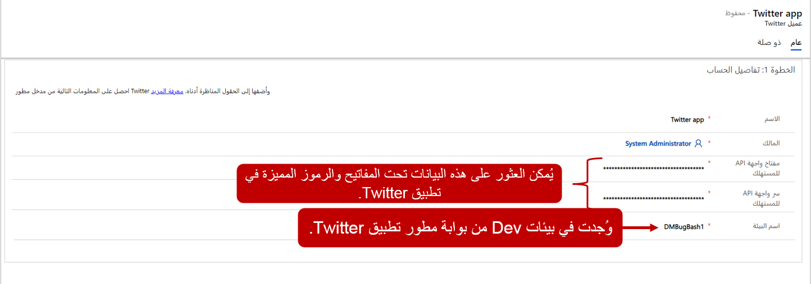
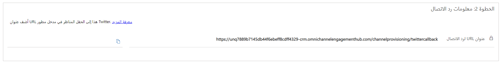
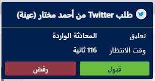
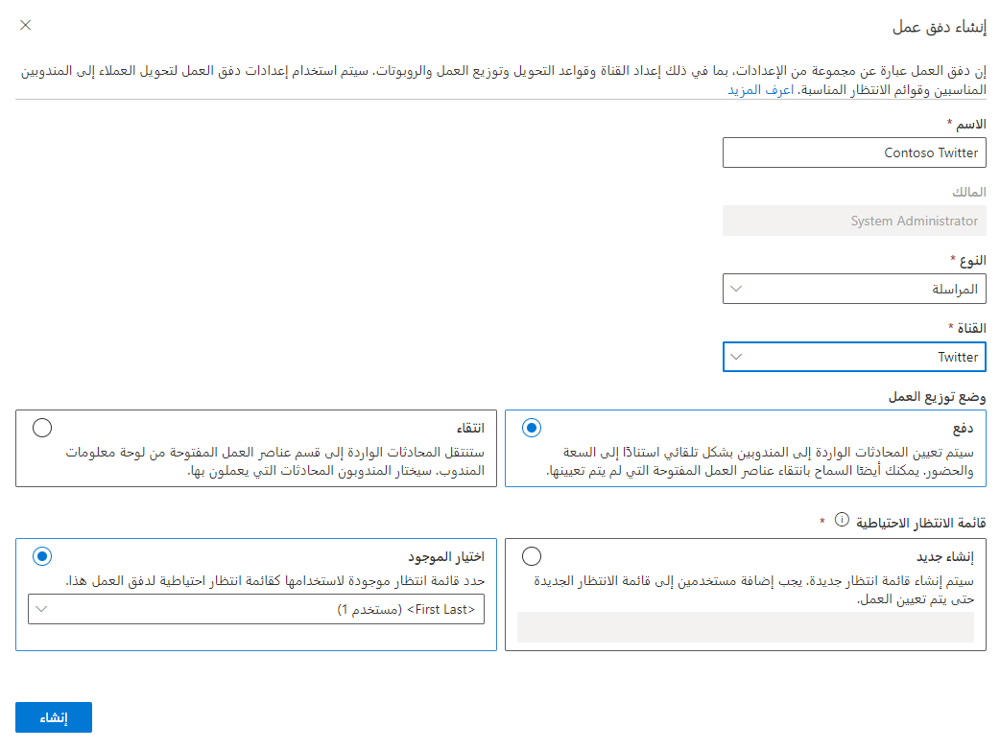
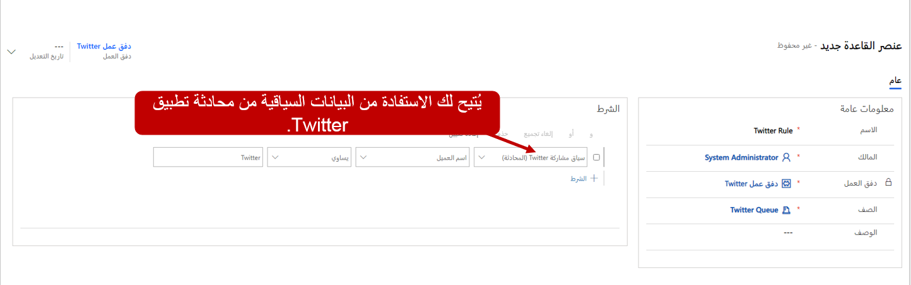

تتيح لك القناة متعددة الاتجاهات لـ Customer Service في Dynamics 365 تكوين قنوات اتصال Twitter للاستفادة من اتجاه الوسائط الاجتماعية والتفاعل مع عملائك في تجربة مُخصّصة.

## المتطلبات الأساسية لإضافة دعم Twitter

قبل أن تتمكن من استخدام أي منصات مراسلة اجتماعية في القناة متعددة الاتجاهات لـ Customer Service، تأكد من إجراء المراسلة الاجتماعية من خلال صفحة **إدارة مثيلات القناة متعددة الاتجاهات**.

لمزيد من المعلومات، راجع [توفير القناة متعددة الاتجاهات لـ Customer Service](/dynamics365/omnichannel/administrator/omnichannel-provision-license?azure-portal=true#provision-omnichannel-for-customer-service-application/).

لاستخدام Twitter، يجب أن يكون لدى المؤسسات المعايير التالية مُعدَّة في Twitter:

- A Twitter handle: [إنشاء وإدارة ملف شخصي لنشاطك التجاري على Twitter](https://business.twitter.com/en/basics/create-a-twitter-business-profile.html/?azure-portal=true)

- تمكين الرسالة الخاصَّة Twitter handle الخاص بك: [تمكين الرسالة الخاصَّة](/dynamics365/omnichannel/administrator/configure-twitter-channel/?azure-portal=true)

- أنشئ تطبيق Twitter: [تطوير تطبيق Twitter](https://developer.twitter.com/en/docs/basics/apps/overview/?azure-portal=true)

- قم بتحديث أذونات تطبيق Twitter لقراءة الرسائل المباشرة وكتابتها والوصول إليها: [أذونات تطبيق Twitter](https://developer.twitter.com/en/docs/basics/apps/guides/app-permissions/?azure-portal=true)

## قم بإنشاء قناة Twitter

ستحتاج إلى تكوين تدفق عمل لكل منصة مراسلة اجتماعية تنوي استخدامها (Twitter، في هذه الحالة). بعد إنشاء تدفق عمل لـ Twitter، يمكنك إنشاء قناة Twitter. عند إنشاء قناة Twitter، ستقوم بتوصيل تطبيق Twitter، والذي سيوفر القدرة على التفاعل مع قنوات Twitter. تطبيقات Twitter متاحة عن طريق تحديد **Twitter** ضمن **القنوات**.

في صفحة **تطبيق Twitter** الجديدة، قدم المعلومات التالية:

- **الاسم** - اسم تطبيق Twitter.

- **مفتاح API المستهلك** - مفتاح تطبيق Twitter.
    انتقل إلى بوابة مطوري Twitter ثم إلى لوحة معلومات تطبيق Twitter، وحدد **التفاصيل > المفاتيح والرموز المميزة**، ثم انسخ القيمة في حقل **مفتاح API**.

- **API السري للمستهلك** - سري تطبيق Twitter. انتقل إلى بوابة مطوري Twitter ثم إلى لوحة معلومات تطبيق Twitter، وحدد **التفاصيل > المفاتيح والرموز المميزة**، ثم انسخ القيمة في حقل **مفتاح سر API**.

- **اسم البيئة** - بيئة تطبيق Twitter.
    انتقل إلى بوابة مطوري Twitter ثم إلى **بيئات التطوير > تسمية بيئة التطوير** (تأكد من إنشاء بيئة التطوير ضمن **APIلنشاط الحساب**).

> [!div class="mx-imgBorder"]
> 

بعد إضافة السجل بنجاح، يتم تمكين قناة Twitter وسيتم إنشاء عنوان URL رد الاتصال. احفظ عنوان URL لرد الاتصال في تطبيق Twitter بالانتقال إلى بوابة مطوري Twitter، والانتقال إلى لوحة معلومات تطبيق Twitter، ثم تحديد **التفاصيل > تفاصيل التطبيق > تحرير**. انسخ عنوان URL لرد الاتصال من القناة متعددة الاتجاهات لـ Customer Service ثم الصقه في حقل **عنوان URL لرد الاتصال**.

> [!div class="mx-imgBorder"]
> 

## أضف a Twitter handle إلى قناة Twitter

قبل تلقي الرسائل من Twitter، يجب إضافة Twitter handle إلى القناة. سيضمن هذا الأسلوب استخدام حساب Twitter الصحيح للتواصل. تتم إضافة أسماء المستخدمين إلى القناة في قسم **تطبيق Twitter**. حدد **+ اسم مستخدم جديد على Twitter** لإضافة اسم مستخدم (أسماء مستخدمين) على Twitter.

ستحتاج إلى توفير المعلومات التالية:

-   **الاسم** - اسم مرجعي في OCS، وليس Twitter handle الخاص بك.\
    \
    للاتصال بـ Twitter، حدد **تسجيل الدخول إلى Twitter**. يجب أن تظهر لك نافذة منبثقة (تحقق من أدوات منع النوافذ المنبثقة) للاتصال بحسابك على Twitter. سجّل الدخول باستخدام اسم المستخدم على Twitter وكلمة المرور اللذين تضيفهما هنا.\
    \
    عندما تقوم بتسجيل الدخول إلى حساب Twitter، ستظهر حقول Twitter.

-   **تدفق العمل** - حدد تدفق عمل Twitter الذي أنشأته مسبقاً.

> [!div class="mx-imgBorder"]
> 

## تجارب العملاء والمندوبين

بعد نشر قناة Twitter، يمكن للعملاء بدء محادثة بعدة طرق:

- عن طريق تطبيق Twitter على جهاز محمول

- عن طريق تطبيق Twitter على جهاز سطح المكتب

- [www.twitter.com](http://www.twitter.com/?azure-portal=true)

إذا بدأ أحد العملاء محادثة من صفحة موقع Twitter على الويب ثم تحول لاحقاً إلى جهاز محمول، فستستمر المحادثة السابقة، ويمكنه متابعة المحادثة.

يتلقى المندوب إخطارا بطلب الدردشة الوارد مع تفاصيل العميل.

> [!div class="mx-imgBorder"]
> 

## توجيه محادثات Twitter

عند بدء محادثة Twitter، يتم تحديد هوية العميل بناءً على اسمه. سيقوم التطبيق بالبحث في كيان **جهة الاتصال** للعثور على سجل جهة اتصال مطابق. عند العثور على تطابق، يتم ربط المحادثة تلقائياً بسجل جهة الاتصال وتتم تعبئة ملخص العميل. إذا لم يتم تعريف العميل استناداً إلى الاسم، يمكن إنشاء سجل جهة اتصال جديد.

على غرار قواعد التحويل الأخرى، يمكن إنشاء قواعد تحويل Twitter من علامة التبويب **قواعد التحويل** لسجل تدفق العمل.

يمكن لعناصر قواعد التوجيه تقييم شروط العناصر السياقية التالية المرتبطة بسجل المحادثة الذي تم إنشائه:

- **الحساب** - يسمح لك بتقييم البيانات من سجل الحساب المرتبط بالمحادثة.

- **جهة الاتصال** - يسمح لك بتقييم البيانات من سجل جهة الاتصال المرتبط بالمحادثة.

- **الحالة** - تسمح لك بتقييم البيانات من سجل جهة الاتصال المرتبط بالمحادثة.

- **متغيرات السياق** - السماح لك بتقييم المعلومات المخزنة في متغير السياق المقترن بمحادثة.

- **Twitter سياق مشاركة** - يسمح لك بتقييم البيانات السياقية ذات الصلة برسالة Twitter.

على سبيل المثال، كما يتم تلقي رسالة، سيتم توجيه القواعد كافة الرسائل التي يتم تلقيها من جهة اتصال، مثل عميل مفضل، إلى قائمة انتظار مفضل مخصصة التي يتم ترتيب أولوياتها على قوائم الانتظار الأخرى.

> [!div class="mx-imgBorder"]
> 
