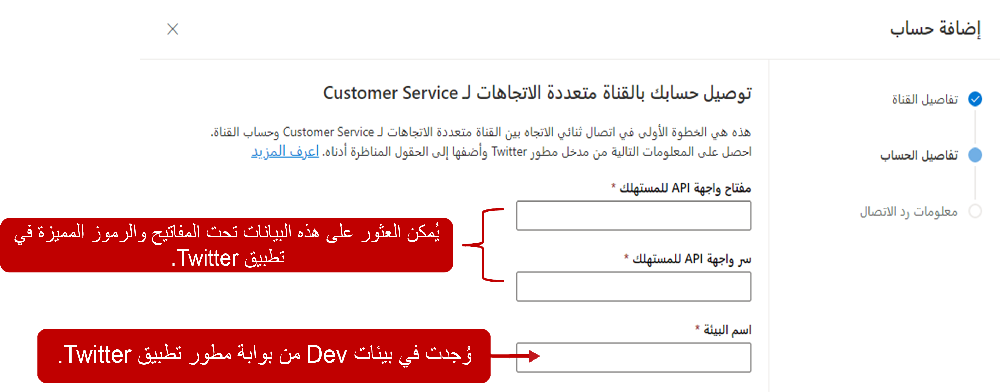

تتيح لك القناة متعددة الاتجاهات لـ Customer Service في Dynamics 365 تكوين قنوات اتصال Twitter للاستفادة من اتجاه الوسائط الاجتماعية والتفاعل مع عملائك في تجربة مُخصّصة.

## المتطلبات الأساسية لإضافة دعم Twitter

قبل أن تتمكن من استخدام أي منصات مراسلة اجتماعية في القناة متعددة الاتجاهات لـ Customer Service، تأكد من إجراء المراسلة الاجتماعية من خلال صفحة **إدارة مثيلات القناة متعددة الاتجاهات**.

لمزيد من المعلومات، راجع [توفير القناة متعددة الاتجاهات لـ Customer Service](/dynamics365/omnichannel/administrator/omnichannel-provision-license?azure-portal=true#provision-omnichannel-for-customer-service-application/).

لاستخدام Twitter، يجب أن يكون لدى المؤسسات المعايير التالية مُعدَّة في Twitter:

- A Twitter handle: [إنشاء وإدارة ملف شخصي لنشاطك التجاري على Twitter](https://business.twitter.com/en/basics/create-a-twitter-business-profile.html/?azure-portal=true)

- تمكين الرسالة الخاصَّة Twitter handle الخاص بك: [تمكين الرسالة الخاصَّة](/dynamics365/omnichannel/administrator/configure-twitter-channel/?azure-portal=true)

- أنشئ تطبيق Twitter: [تطوير تطبيق Twitter](https://developer.twitter.com/en/docs/basics/apps/overview/?azure-portal=true)

- قم بتحديث أذونات تطبيق Twitter لقراءة الرسائل المباشرة وكتابتها والوصول إليها: [أذونات تطبيق Twitter](https://developer.twitter.com/en/docs/basics/apps/guides/app-permissions/?azure-portal=true)

## قم بإنشاء قناة Twitter

أنت بحاجة إلى إنشاء حساب مراسلة يتصل بتفاصيل حساب Twitter الخاص بك. يمكنك، بعد إنشاء حساب المراسلة لـ Twitter، إنشاء تدفق عمل Twitter وإضافة حساب المراسلة كقناة. يمكنك إنشاء حسابات مراسلة Twitter في تطبيق **مركز مسؤول خدمة العملاء**. انتقل إلى **القنوات**، وحدد **إدارة** بجوار **حسابات المراسلة**.  

في صفحة **إضافة حساب**، قدم المعلومات التالية:

- **الاسم** - اسم تطبيق Twitter.

- **مفتاح API المستهلك** - مفتاح تطبيق Twitter. انتقل إلى مدخل مطور Twitter ثم إلى لوحة معلومات تطبيق Twitter. حدد **التفاصيل > المفاتيح والرموز المميزة** وانسخ القيمة في الحقل **مفتاح API**.

- **API السري للمستهلك** - سري تطبيق Twitter. انتقل إلى مدخل مطور Twitter ثم إلى لوحة معلومات تطبيق Twitter. حدد **التفاصيل > المفاتيح والرموز المميزة** وانسخ القيمة في الحقل **مفتاح سر API**.

- **اسم البيئة** - بيئة تطبيق Twitter. انتقل إلى مدخل مطور Twitter ثم إلى **بيئات التطوير > تسمية بيئة التطوير** (تأكد من إنشاء بيئة التطوير ضمن **API لنشاط الحساب**).

> [!div class="mx-imgBorder"]
> 

بعد إضافة السجل بنجاح، يتم تمكين قناة Twitter وسيتم إنشاء عنوان URL لرد الاتصال. احفظ عنوان URL لرد الاتصال في تطبيق Twitter. انتقل إلى مدخل مطور Twitter ثم إلى لوحة معلومات تطبيق Twitter. حدد **التفاصيل > تفاصيل التطبيق > تحرير** وانسخ عنوان URL لرد الاتصال من القناة متعددة الاتجاهات لـ Customer Service ثم الصقه في حقل **عنوان URL لرد الاتصال**.

## تكوين تدفق عمل Twitter

ستحتاج إلى تكوين تدفق عمل جديد لبدء العمل باستخدام رسائل Twitter، وذلك بعد إنشاء حساب مراسلة Twitter. يمكنك إنشاء تدفقات العمل في **مركز مسؤولي Customer Service**. 
  
عند إنشاء تدفق عمل اجتماعي، ستحتاج إلى تحديد المعلومات التالية: 

- **الاسم** - اسم بسيط يُستخدم لتعريف تدفق العمل.

- **النوع** - يحدد نوع اتصال القناة الذي سيعالجه تدفق العمل. بالنسبة للقنوات الاجتماعية، قم بتعيين النوع إلى **مراسلة**.
  
- **القناة** - نوع قناة الاتصال لتدفق العمل. يجب تعيين النوع إلى **Twitter.**

- **توزيع العمل** - تحديد كيف سيتم تعيين عناصر العمل من تدفق العمل هذا إلى المندوبين. يمكنك تحديد أحد الخيارات التالية:

    - **الإرسال** - سيتم تعيين المحادثات إلى المندوبين تلقائياً استناداً إلى القدرة والوجود.  
   
    - **الانتقاء** - ستنتقل المحادثات إلى قسم عناصر العمل المفتوحة في لوحة معلومات المندوب.  سيختار المندوبون المحادثة التي يعملون عليها.  

- **قائمه الانتظار الاحتياطية** - تحديد أي قائمة انتظار لتوجيه العناصر إليها افتراضياً، إذا لم يتم توجيه تلك المحادثة تلقائياً إلى قائمة انتظار أخرى.  

> [!div class="mx-imgBorder"]
> 

## تكوين خيارات تدفق عمل Twitter

بعد إنشاء تدفق العمل، ستحتاج إلى إعداد قناة Twitter التي ستستخدم تدفق العمل. تتم هذه الخطوة المطلوبة عن طريق تحديد الزر **إعداد Twitter**.
  
يمكنك تكوين قناه Twitter بالمعلومات التالية:

- **تفاصيل القناة** - تحديد الاسم والنوع وتفاصيل القناة. سيتم مسبقاً ملء حقل النوع والقناة ولا يمكن تغييرهما.

- **اسم المستخدم على Twitter** - تحديد Twitter الذي تريد استخدامه مع القناة. 

- **اللغة** - تحدد اللغة التي ستقترن بالقناة.  

- **السلوكيات** - تحديد السلوكيات التي تريد تنفيذها تلقائياً عندما يبدأ العميل محادثة Twitter. يمكنك تشغيل السلوكيات التالية:

    - **الرسائل التلقائية المخصصة‬‏‫** - تسمح لك بإنشاء الرسائل المخصصة الخاصة بك التي سيتم استخدامها في مواقف مختلفة، ‬‏‫على سبيل المثال، عندما يتم تعيين مندوب للمحادثة أو عندما يحاول العميل المشاركة خارج ساعات العمل.‬ لمزيد من المعلومات، راجع [إنشاء الرسائل التلقائية المخصصة](/dynamics365/customer-service/configure-automated-message?tabs=customerserviceadmincenter).
     
    - **استطلاع ما بعد المحادثة** - استخدام صوت العميل لإرسال استطلاع إلى العميل حول تجربته بمجرد اكتمال المحادثة. لمزيد من المعلومات، راجع [استطلاعات ما بعد المحادثة](/dynamics365/customer-service/configure-post-conversation-survey?tabs=customerserviceadmincenter).
    
- **ميزات المستخدم‬‏‫** - تحديد الميزات الأخرى التي تريد تمكينها كجزء من قناة Twitter.‬ يمكنك تمكين مرفقات الملفات وتكوينها للسماح بالميزات التالية:
    
    - بإمكان العملاء إرسال مرفقات الملفات
    
    - بإمكان المندوبين إرسال مرفقات الملفات

لمزيد من المعلومات، راجع [تمكين مرفقات الملفات](/dynamics365/customer-service/enable-file-attachments).

## تجارب العملاء والمندوبين

بعد نشر قناة Twitter، يمكن للعملاء بدء محادثة بطرق مختلفة:

- عن طريق تطبيق Twitter على جهاز محمول

- عن طريق تطبيق Twitter على جهاز سطح المكتب

- [www.twitter.com](http://www.twitter.com/?azure-portal=true)

إذا بدأ أحد العملاء محادثة من صفحة موقع Twitter على الويب ثم تحول لاحقاً إلى جهاز محمول، فستستمر المحادثة السابقة، ويمكنه متابعة المحادثة.

يتلقى المندوب إخطاراً بطلب الدردشة الوارد مع تفاصيل العميل.

> [!div class="mx-imgBorder"]
> 

