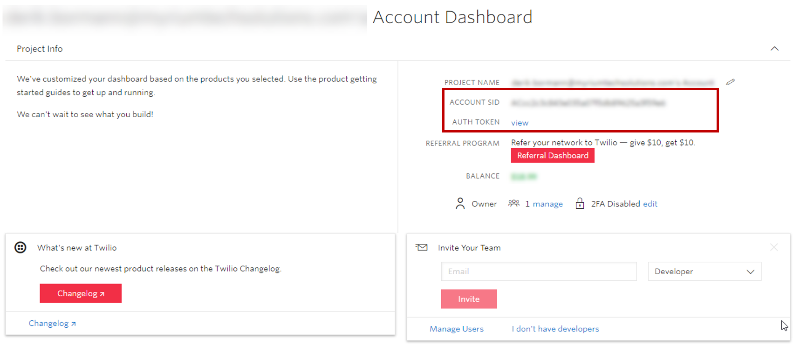
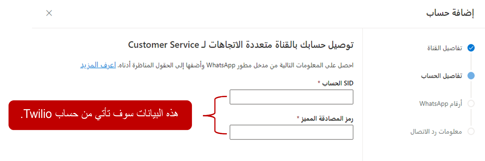
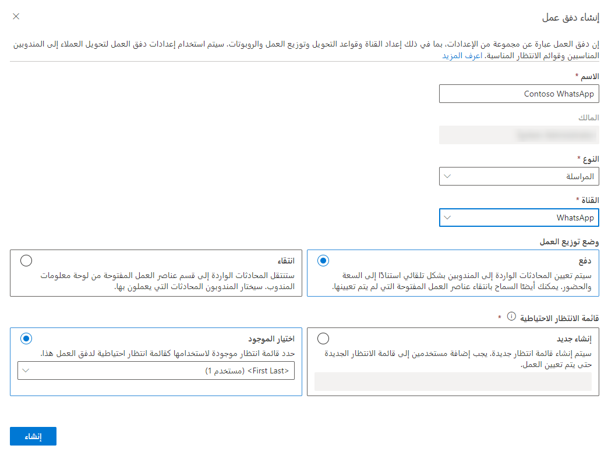

يختلف تكامل WhatsApp عن القنوات الأخرى في أنه يتم إرسال الرسائل بين WhatsApp والقناة متعددة الاتجاهات لـ Customer Service باستخدام Twilio.

## المتطلبات الأساسية لإضافة دعم WhatsApp

قبل أن تتمكن من استخدام أي منصات مراسلة اجتماعية في القناة متعددة الاتجاهات لـ Customer Service، تأكد من إجراء المراسلة الاجتماعية من خلال صفحة **إدارة مثيلات القناة متعددة الاتجاهات**.

لمزيد من المعلومات حول تمكين القدرات الاجتماعية، راجع [القناة متعددة الاتجاهات لـ Customer Service](/dynamics365/omnichannel/administrator/omnichannel-provision-license#provision-omnichannel-for-customer-service-application/?azure-portal=true).

لاستخدام تكامل WhatsApp من خلال Twilio، تحتاج المؤسسات إلى إعداد المعلمات التالية:

- حساب Twilio مع اشتراك مناسب أو حساب وضع الحماية: [ادمج حساب Twilio sandbox مع القناة متعددة الاتجاهات لـ Customer Service.](/dynamics365/omnichannel/administrator/configure-whatsapp-channel#integrate-a-twilio-sandbox-account-with-omnichannel-for-customer-service/?azure-portal=true)

- قم بتوصيل رقم Twilio الخاص بك بملف تعريف WhatsApp Business الخاص بك: [قم بتوصيل رقم Twilio الخاص بك بملف تعريف WhatsApp Business الخاص بك.](https://www.twilio.com/docs/whatsapp/tutorial/connect-number-business-profile/?azure-portal=true)

## نوع رسالة WhatsApp وقاعدة جلسة 24 ساعة

قبل إعداد وتكوين قناة WhatsApp في OCS، ضع في اعتبارك العناصر التالية التي تنفرد بها WhatsApp:

- **رسائل القوالب** - الرسائل الصادرة التي يرسلها المندوبون عبر Twilio باستخدام أحد القوالب المعتمدة مسبقاً. عادةً ما تكون رسائل معاملات، مثل تنبيهات التسليم وتذكير المواعيد، يتم إرسالها إلى المستخدمين الذين اختاروا تلقي الرسائل من مؤسستك.

- **رسائل الجلسات** - وفقاً لـ WhatsApp، رسائل الجلسة هي رسائل واردة من عميل أو ردود صادرة بواسطة مندوب على الرسائل الواردة خلال 24 ساعة. تبدأ جلسة المراسلة عندما يتلقى المندوبون رسالة من أحد العملاء. يستمر لمدة 24 ساعة من آخر رسالة مستلمة. لا تحتاج رسائل الجلسة إلى اتباع نموذج ويمكن أن تتضمن مرفقات وسائط.

- **قاعدة جلسة 24 ساعة** - تبدأ جلسة المراسلة عندما يتلقى المندوب رسالة من العميل أو يرد على الرسالة الواردة من العميل. عندما يرسل العميل رسالة، يكون أمام المندوب 24 ساعة للرد من وقت استلام المندوب لها. بعد 24 ساعة، يمكن للمندوب إرسال رسالة إلى العميل فقط باستخدام نموذج محدد مسبقاً ومعتمد.

## إحضار تفاصيل حساب Twilio

لدمج قناة WhatsApp مع القناة متعددة الاتجاهات لـ Customer Service، انتقل إلى حساب Twilio الخاص بك واحصل على قيم SID الحساب ورمز المصادقة. هاتان القيمتان مطلوبتان لإنشاء قناة WhatsApp في تطبيق إدارة القناة متعددة الاتجاهات. يمكن العثور على هذه المعلومات في **لوحة معلومات حساب Twilio.**

> [!div class="mx-imgBorder"]
> 

## إنشاء حساب مراسلة WhatsApp

أنت بحاجة إلى إنشاء حساب مراسلة يتصل بتفاصيل حساب **WhatsApp** الخاص بك. بعد إنشاء حساب المراسلة، أنت بحاجة إلى إنشاء تدفق عمل **WhatsApp**، وإضافة حساب المراسلة كقناة. يمكنك إنشاء حسابات المراسلة في تطبيق **مركز مسؤولي Customer Service**. انتقل إلى **القنوات**، وحدد **إدارة** بجوار حسابات **المراسلة**.  

في صفحة **إضافة حساب** الجديدة، قدم تفاصيل حساب Twilio الذي تريد استخدامه.

- **الاسم** - ما الذي تريد الاتصال به لقناة WhatsApp في القناة متعددة الاتجاهات لـ Customer Service.

- **SID الحساب** - قيمة مُعرّف الحساب من حساب Twilio الخاص بك.

- **رمز المصادقة** - قيمة رمز المصادقة من حساب Twilio الخاص بك.

> [!div class="mx-imgBorder"]
> 

في صفحة أرقام **WhatsApp**، أضف رقم هاتف Twilio لاستخدامه مع القناة. عند إضافة رقم، ستحتاج إلى تقديم المعلومات التالية:

- **الاسم** - حدد اسماً لقناة WhatsApp.

- **رقم** - حدد رقم هاتف WhatsApp بدون مسافات أو أحرف خاصة.

في صفحة **معلومات رد الاتصال**، انسخ القيمة في المربع **‏‫عنوان URL الوارد لـ Twilio‬**. ستستخدم المعلومات التي تم نسخها لحساب Twilio.

## تكوين تدفق عمل WhatsApp

ستحتاج إلى تكوين تدفق عمل جديد لبدء العمل باستخدام رسائل WhatsApp، وذلك بعد إنشاء حساب مراسلة WhatsApp. يمكنك إنشاء تدفقات العمل في **مركز مسؤولي Customer Service**.  

عند إنشاء تدفق عمل اجتماعي، ستحتاج إلى تحديد المعلومات التالية: 

- **الاسم** - اسم بسيط يُستخدم لتعريف تدفق العمل.

- **النوع** - يحدد نوع اتصال القناة الذي سيعالجه تدفق العمل. بالنسبة للقنوات الاجتماعية، قم بتعيين النوع إلى **مراسلة**.
  
- **القناة** - نوع قناة الاتصال لتدفق العمل. يجب تعيين النوع إلى **WhatsApp.**

- **توزيع العمل** - تحديد كيف سيتم تعيين عناصر العمل من تدفق العمل هذا إلى المندوبين. يمكنك تحديد أحد الخيارات التالية:

    - **الإرسال** - سيتم تعيين المحادثات إلى المندوبين تلقائياً استناداً إلى القدرة والوجود.  

    - **الانتقاء** - ستنتقل المحادثات إلى قسم عناصر العمل المفتوحة في لوحة معلومات المندوب.  سيختار المندوبون المحادثة التي يعملون عليها.
      
- **قائمه الانتظار الاحتياطية**: تحديد أي قائمة انتظار لتوجيه العناصر إليها افتراضياً، إذا لم يتم توجيه تلك المحادثة تلقائياً إلى قائمة انتظار أخرى.  

> [!div class="mx-imgBorder"]
> 

## تكوين خيارات تدفق عمل WhatsApp

بعد إنشاء تدفق العمل، ستحتاج إلى إعداد قناة WhatsApp التي ستستخدم تدفق العمل. تتم هذه الخطوة المطلوبة عن طريق تحديد الزر **إعداد WhatsApp**.
  
يمكنك تكوين قناه WhatsApp بالمعلومات التالية:

- **تفاصيل القناة** - تحديد الاسم والنوع وتفاصيل القناة. سيتم مسبقاً ملء حقل النوع والقناة ولا يمكن تغييرهما.

- **رقم WhatsApp** - تحديد حساب مراسلة رقم WhatsApp الذي تريد استخدامه مع القناة. 

- **اللغة** - تحدد اللغة التي ستقترن بالقناة.  

- **السلوكيات** - تحديد السلوكيات التي تريد تنفيذها تلقائياً عندما يبدأ العميل محادثة WhatsApp. يمكنك تشغيل السلوكيات التالية:

    - **الرسائل التلقائية المخصصة‬‏‫** - تسمح لك بإنشاء الرسائل المخصصة الخاصة بك التي سيتم استخدامها في مواقف مختلفة، ‬‏‫على سبيل المثال، عندما يتم تعيين مندوب للمحادثة أو عندما يحاول العميل المشاركة خارج ساعات العمل.‬ لمزيد من المعلومات، راجع [إنشاء الرسائل التلقائية المخصصة](/dynamics365/customer-service/configure-automated-message?tabs=customerserviceadmincenter).
    
    - **قوالب رسائل WhatsApp** - تسمح لك بتكوين الخيار للمندوبين لإرسال رسائل وافق عليها WhatsApp. لمزيد من المعلومات، راجع [تكوين قوالب رسائل WhatsApp.](/dynamics365/customer-service/configure-whatsapp-channel?tabs=customerserviceadmincenter). 
     
    - **استطلاع ما بعد المحادثة** - استخدام صوت العميل لإرسال استطلاع إلى العميل حول تجربته بمجرد اكتمال المحادثة. لمزيد من المعلومات، راجع [استطلاعات ما بعد المحادثة](/dynamics365/customer-service/configure-post-conversation-survey?tabs=customerserviceadmincenter).
    
- **ميزات المستخدم‬‏‫** - تحديد الميزات الإضافية التي تريد تمكينها كجزء من قناة WhatsApp.‬ يمكنك تمكين مرفقات الملفات وتكوينها للسماح بالميزات التالية:
    
    - بإمكان العملاء إرسال مرفقات الملفات
    
    - بإمكان المندوبين إرسال مرفقات الملفات

لمزيد من المعلومات، راجع [تمكين مرفقات الملفات](/dynamics365/customer-service/enable-file-attachments).