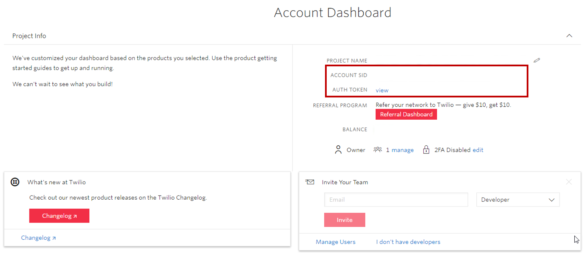

تتيح لك قناة متعددة الاتجاهات لـ Dynamics 365 Customer Service التكامل مع WhatsApp للتفاعل مع العملاء الذين يستخدمون قناة WhatsApp. يختلف تكامل WhatsApp عن القنوات الأخرى في أنه يتم إرسال الرسائل بين WhatsApp والقناة متعددة الاتجاهات لـ Customer Service باستخدام Twilio.

## المتطلبات الأساسية لإضافة دعم WhatsApp

قبل أن تتمكن من استخدام أي منصات مراسلة اجتماعية في القناة متعددة الاتجاهات لـ Customer Service، تأكد من إجراء المراسلة الاجتماعية من خلال صفحة **إدارة مثيلات القناة متعددة الاتجاهات**.

لمزيد من المعلومات، راجع [توفير القناة متعددة الاتجاهات لـ Customer Service](https://docs.microsoft.com/dynamics365/omnichannel/administrator/omnichannel-provision-license#provision-omnichannel-for-customer-service-application/?azure-portal=true).

لاستخدام تكامل WhatsApp من خلال Twilio، تحتاج المؤسسات إلى إعداد المعلمات التالية:

- حساب Twilio مع اشتراك مناسب أو حساب وضع الحماية: [ادمج حساب Twilio sandbox مع القناة متعددة الاتجاهات لـ Customer Service.](https://docs.microsoft.com/dynamics365/omnichannel/administrator/configure-whatsapp-channel#integrate-a-twilio-sandbox-account-with-omnichannel-for-customer-service/?azure-portal=true)

- قم بتوصيل رقم Twilio الخاص بك بملف تعريف WhatsApp Business الخاص بك: [قم بتوصيل رقم Twilio الخاص بك بملف تعريف WhatsApp Business الخاص بك.](https://www.twilio.com/docs/whatsapp/tutorial/connect-number-business-profile/?azure-portal=true)

## نوع رسالة WhatsApp وقاعدة جلسة 24 ساعة

قبل إعداد وتكوين قناة WhatsApp في OCS، ضع في اعتبارك العناصر التالية التي تنفرد بها WhatsApp:

- **رسائل القوالب** - الرسائل الصادرة التي يرسلها المندوبون عبر Twilio باستخدام أحد القوالب المعتمدة مسبقاً. عادةً ما تكون رسائل معاملات، مثل تنبيهات التسليم وتذكير المواعيد، يتم إرسالها إلى المستخدمين الذين اختاروا تلقي الرسائل من مؤسستك.

- **رسائل الجلسة** - وفقاً لـ WhatsApp، رسائل الجلسة هي رسائل واردة من عميل أو ردود صادرة بواسطة مندوب على الرسائل الواردة خلال 24 ساعة. تبدأ جلسة المراسلة عندما يتلقى المندوبون رسالة من أحد العملاء. يستمر لمدة 24 ساعة من آخر رسالة مستلمة. لا تحتاج رسائل الجلسة إلى اتباع نموذج ويمكن أن تتضمن مرفقات وسائط.

- **قاعدة جلسة 24 ساعة** - تبدأ جلسة المراسلة عندما يتلقى المندوب رسالة من العميل أو يرد على الرسالة الواردة من العميل. عندما يرسل العميل رسالة، يكون أمام المندوب 24 ساعة للرد من وقت استلام المندوب لها. بعد 24 ساعة، يمكن للمندوب إرسال رسالة إلى العميل فقط باستخدام نموذج محدد مسبقاً ومعتمد.

## إحضار تفاصيل حساب Twilio

لدمج قناة WhatsApp مع القناة متعددة الاتجاهات لـ Customer Service، انتقل إلى حساب Twilio الخاص بك واحصل على قيم SID الحساب ورمز المصادقة. هاتان القيمتان مطلوبتان لإنشاء قناة WhatsApp في تطبيق إدارة القناة متعددة الاتجاهات. يمكن العثور على هذه المعلومات في لوحة معلومات حساب Twilio.

> [!div class="mx-imgBorder"]
> 

## قم بإنشاء قناة WhatsApp

ستحتاج إلى تكوين تدفق عمل لكل نظام أساسي للمراسلة الاجتماعية تنوي استخدامه (WhatsApp، في هذه الحالة). بعد إنشاء مسار عمل WhatsApp، يمكنك إنشاء قناة WhatsApp. عند إنشاء قناة WhatsApp، ستقوم بتوصيل تطبيق WhatsApp، والذي سيوفر لك القدرة على التفاعل مع قنوات WhatsApp. تطبيقات WhatsApp متاحة عن طريق تحديد **WhatsApp** ضمن **القنوات**.

في صفحة **تطبيق WhatsApp** الجديدة، قدم تفاصيل حساب Twilio الذي تريد استخدامه.

في قسم **الخطوة 1: تفاصيل حساب Twilio**، قم بتضمين المعلومات التالية:

- **الاسم** - ما الذي تريد الاتصال به لقناة WhatsApp في القناة متعددة الاتجاهات لـ Customer Service.

- **SID الحساب** - قيمة مُعرّف الحساب من حساب Twilio الخاص بك.

- **رمز المصادقة** - قيمة رمز المصادقة من حساب Twilio الخاص بك.

> [!div class="mx-imgBorder"]
> 

عد حفظ السجل، سيتم إنشاء حقل **عنوان URL الوارد لـ Twilio** في قسم **الخطوة 2: معلومات رد الاتصال**. تأكد من لصق هذه المعلومات في وحدة تحكم Twilio.

> [!div class="mx-imgBorder"]
> 

انتقل إلى [وحدة تحكم Twilio](http://www.twilio.com/console/?azure-portal=true). اذهب إلى **أرقام الهواتف** وحدد الرقم الذي تستخدمه مع WhatsApp. ضمن **المراسلة**، الصق عنوان URL الذي نسخته من OCS في حقل **عنوان URL الوارد لـ Twilio** .

> [!div class="mx-imgBorder"]
> 

## أضف رقم WhatsApp إلى قناتك على WhatsApp

بعد إضافة عنوان URL لرد الاتصال إلى رقم WhatsApp الخاص بك في Twilio، يجب إضافته كرقم هاتف إلى قناة WhatsApp التي أنشأتها في القناة المتعددة الاتجاهات لخدمة العملاء. يمكنك إكمال هذه المهمة في سجل قناة WhatsApp بالانتقال إلى قسم **رقم هاتف WhatsApp** وتحديد الزر **رقم WhatsApp جديد**.

في قسم **تفاصيل رقم الهاتف**، قدم المعلومات التالية:

- **الاسم** - حدد اسماً لقناة WhatsApp.

- **حساب WhatsApp** - يتم ملء هذا الحقل افتراضياً، ولكن يمكنك تغييره إذا لزم الأمر.

- **رقم WhatsApp** - حدد رقم هاتف WhatsApp بدون مسافات أو أحرف خاصة.

- **تدفق العمل** - حدد ساحة عمل WhatsApp الجاهزة أو دفق آخر قمت بإنشائه.

> [!div class="mx-imgBorder"]
> 

بعد حفظ رقم هاتف WhatsApp، حدد زر الرجوع للانتقال إلى صفحة **قناة WhatsApp**، حيث سترى أنه تمت إضافة رقم الهاتف في قسم **أرقام WhatsApp**. احفظ التكوين وحدد **التحقق من صحة** للتحقق من صحة مُعرّف SID الحساب ورمز المصادقة وأرقام الهواتف.

> [!div class="mx-imgBorder"]
> 
