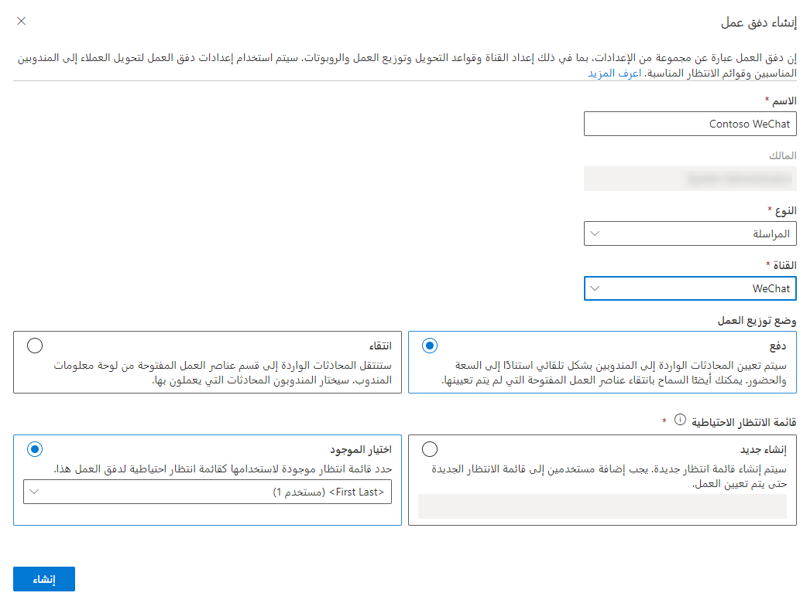

تمكّنك القناة متعددة الاتجاهات لـ Customer Service في Dynamics 365 من تكوين قنوات اتصال عبر WeChat للاستفادة من اتجاه وسائل الاعلام الاجتماعية والتفاعل مع عملائك خلال تجربة مخصصة.

## المتطلبات الأساسية لإضافة دعم WeChat

قبل أن تتمكن من استخدام أي منصات مراسلة اجتماعية في القناة متعددة الاتجاهات لـ Customer Service، تأكد من إجراء المراسلة الاجتماعية من خلال صفحة **إدارة مثيلات القناة متعددة الاتجاهات**.

لمزيد من المعلومات حول تمكين القدرات الاجتماعية، راجع [القناة متعددة الاتجاهات لـ Customer Service](/dynamics365/omnichannel/administrator/omnichannel-provision-license#provision-omnichannel-for-customer-service-application/?azure-portal=true).

لاستخدام WeChat، يتعين على المؤسسات الحصول على اشتراك نشط في حساب خدمة WeChat أو حساب آلية تحديد الوصول (في حالة استخدام آلية تحديد الوصول للاختبار) بحيث يكون متاحاً ويتم تخزينه كجهة اتصال على هاتفك. ستبدأ محادثات WeChat عن طريق الاتصال بحساب الاشتراك. لمزيد من المعلومات، راجع [وثائق WeChat](/dynamics365/omnichannel/administrator/configure-wechat-channel/?azure-portal=true).

## أنشئ قناة WeChat

قبل إنشاء قناة WeChat في القناة متعددة الاتجاهات لـ Customer Service، يجب أن تتوفر لديك المعلومات التالية لتطبيق WeChat:

- **معرف أصلي** - معرف أصلي في خدمة WeChat أو حساب وضع حماية.

- **معرف المطور** - معرف التطبيق المقترن بخدمة WeChat أو حساب sandbox.

- **كلمة مرور المطور** - سر التطبيق المستخدم للمصادقة.

- **الرمز المميز** - سلسلة يحددها العميل.

- **مفتاح تشفير الرسائل** - مفتاح تشفير الرسائل في WeChat. إذا كنت تستخدم حساب WeChat لآلية تحديد الوصول، فاستخدم مفتاحاً من اختيارك.

## إنشاء حساب مراسلة WeChat

أنت بحاجة إلى إنشاء حساب مراسلة يتصل بتفاصيل حساب WeChat الخاص بك. يمكنك، بعد إنشاء حساب المراسلة، إنشاء تدفق عمل **WeChat**، وإضافة حساب المراسلة كقناة. يمكنك إنشاء حسابات المراسلة في تطبيق **مركز مسؤولي Customer Service**. انتقل إلى **القنوات**، وحدد **إدارة** بجوار **حسابات المراسلة**. 
 
في صفحة **إضافة حساب**، ستحتاج إلى تقديم المعلومات التالية:

- **معرف أصلي** - تحديد خدمة WeChat أو رقم حساب آلية تحديد الوصول.

- **معرف المطور (AppID)** - حدد معرف مطور WeChat.

- **كلمة مرور المطور (AppSecret)** - حدد كلمة مرور مطور WeChat.

- **رمز مميز** - حدد رمز WeChat المميز.

- **مفتاح تشفير الرسائل (EncodingAESKey)** - حدد مفتاح تشفير الرسائل من WeChat لحساب الخدمة. إذا كنت تقوم بتكوين حساب WeChat في آلية تحديد الوصول، فاستخدم مفتاحاً من اختيارك.

> [!div class="mx-imgBorder"]
> 

بعد حفظ السجل، سيتم عرض التفاصيل في قسم معلومات رد الاتصال. انسخ المعلومات المعروضة في مربعات **قائمة IP البيضاء** و **عنوان الخادم (URL)**. تتوفر هذه الخطوة فقط لحساب خدمة WeChat.

## تكوين تدفق عمل WeChat

ستحتاج إلى تكوين تدفق عمل جديد لبدء العمل باستخدام رسائل WeChat، وذلك بعد إنشاء حساب مراسلة WeChat. يمكنك إنشاء تدفقات العمل في **مركز مسؤولي Customer Service**. 
  
عند إنشاء تدفق عمل اجتماعي، ستحتاج إلى تحديد المعلومات التالية: 

- **الاسم** - اسم بسيط يُستخدم لتعريف تدفق العمل.

- **النوع** - يحدد نوع اتصال القناة الذي سيعالجه تدفق العمل.  بالنسبة للقنوات الاجتماعية، يجب تعيين النوع إلى **المراسلة**.
  
- **القناة** - نوع قناة الاتصال لتدفق العمل. يجب تعيين النوع إلى **WeChat.**

- **توزيع العمل** - تحديد كيف سيتم تعيين عناصر العمل من تدفق العمل هذا إلى المندوبين. يمكنك تحديد أحد الخيارات التالية:

    - **الإرسال** - سيتم تعيين المحادثات إلى المندوبين تلقائياً استناداً إلى القدرة والوجود.  

    - **الانتقاء** - ستنتقل المحادثات إلى قسم عناصر العمل المفتوحة في لوحة معلومات المندوب.  سيختار المندوبون المحادثة التي يعملون عليها.  

- **قائمه الانتظار الاحتياطية**: تحديد أي قائمة انتظار لتوجيه العناصر إليها افتراضياً، إذا لم يتم توجيه تلك المحادثة تلقائياً إلى قائمة انتظار أخرى.  
 
> [!div class="mx-imgBorder"]
> 

## تكوين خيارات تدفق عمل WeChat

بعد إنشاء تدفق العمل، ستحتاج إلى إعداد قناة WeChat التي ستستخدم تدفق العمل. تتم هذه الخطوة المطلوبة عن طريق تحديد الزر **إعداد WeChat**.
  
يمكنك تكوين قناه WeChat بالمعلومات التالية:

- **تفاصيل القناة** - تحديد الاسم والنوع وتفاصيل القناة. سيتم مسبقاً ملء حقل النوع والقناة ولا يمكن تغييرهما.

- **WeChat** - تحديد حساب مراسلة رقم WeChat الذي تريد استخدامه مع القناة. 

- **اللغة** - تحدد اللغة التي ستقترن بالقناة.  

- **السلوكيات** - تحديد السلوكيات التي تريد تنفيذها تلقائياً عندما يبدأ العميل محادثة WeChat. يمكنك تشغيل السلوكيات التالية:

    - **الرسائل التلقائية المخصصة‬‏‫** - تسمح لك بإنشاء الرسائل المخصصة الخاصة بك التي سيتم استخدامها في مواقف مختلفة، ‬‏‫على سبيل المثال، عندما يتم تعيين مندوب للمحادثة أو عندما يحاول العميل المشاركة خارج ساعات العمل.‬ لمزيد من المعلومات، راجع [إنشاء الرسائل التلقائية المخصصة](/dynamics365/customer-service/configure-automated-message?tabs=customerserviceadmincenter).
    
    - **استطلاع ما بعد المحادثة** - استخدام صوت العميل لإرسال استطلاع إلى العميل حول تجربته بمجرد اكتمال المحادثة. لمزيد من المعلومات، راجع [استطلاعات ما بعد المحادثة](/dynamics365/customer-service/configure-post-conversation-survey?tabs=customerserviceadmincenter).
    
- **ميزات المستخدم‬‏‫** - تحديد الميزات الأخرى التي تريد تمكينها كجزء من قناة WeChat.‬ يمكنك تمكين مرفقات الملفات وتكوينها للسماح بالميزات التالية:
    
    - بإمكان العملاء إرسال مرفقات الملفات
    
    - بإمكان المندوبين إرسال مرفقات الملفات

لمزيد من المعلومات، راجع [تمكين مرفقات الملفات](/dynamics365/customer-service/enable-file-attachments).