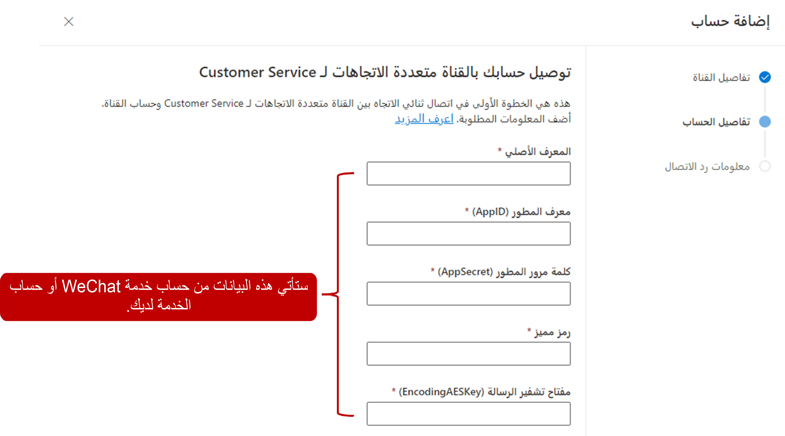

تمكّنك القناة متعددة الاتجاهات لـ Customer Service في Dynamics 365 من تكوين قنوات اتصال عبر WeChat للاستفادة من اتجاه وسائل الاعلام الاجتماعية والتفاعل مع عملائك خلال تجربة مخصصة.

## المتطلبات الأساسية لإضافة دعم WeChat

قبل أن تتمكن من استخدام أي منصات مراسلة اجتماعية في القناة متعددة الاتجاهات لـ Customer Service، تأكد من إجراء المراسلة الاجتماعية من خلال صفحة **إدارة مثيلات القناة متعددة الاتجاهات**.

لمزيد من المعلومات حول تمكين القدرات الاجتماعية، راجع [توفير أومنيتشانيل لخدمه العملاء](/dynamics365/omnichannel/administrator/omnichannel-provision-license#provision-omnichannel-for-customer-service-application/?azure-portal=true).

لاستخدام WeChat، يتعين على المؤسسات الحصول على اشتراك نشط في حساب خدمة WeChat أو حساب sandbox (في حالة استخدام sandbox للاختبار) بحيث يكون متاحاً ويتم تخزينه كجهة اتصال على هاتفك. ستبدأ محادثات WeChat عن طريق الاتصال بحساب الاشتراك. لمزيد من المعلومات، راجع [وثائق WeChat](/dynamics365/omnichannel/administrator/configure-wechat-channel/?azure-portal=true).

## أنشئ قناة WeChat

قبل إنشاء قناة WeChat في القناة متعددة الاتجاهات لـ Customer Service، يجب أن تتوفر لديك المعلومات التالية لتطبيق WeChat:

- **معرف أصلي** - معرف أصلي في خدمة WeChat أو حساب وضع حماية.

- **معرف المطور** - معرف التطبيق المقترن بخدمة WeChat أو حساب sandbox.

- **كلمة مرور المطور** - سر التطبيق المستخدم للمصادقة.

- **الرمز المميز** - سلسلة يحددها العميل.

- **مفتاح تشفير الرسائل** - مفتاح تشفير الرسائل في WeChat. إذا كنت تستخدم حساب WeChat في sandbox، فاستخدم مفتاحًا من اختيارك.

يتعين عليك تكوين مسار عمل لكل منصة مراسلة اجتماعية تريد استخدامه (يجب استخدام WeChat في هذه الحالة). بعد إنشاء مسار عمل WeChat، يمكنك إنشاء قناة WeChat. عند إنشاء قناة WeChat، ستقوم بتوصيل تطبيق WeChat، حيث سيمنحك القدرة على التفاعل مع قنوات WeChat. تتوفر تطبيقات WeChat عن طريق اختيار **WeChat** أسفل **القنوات**.

في صفحة **تطبيق WeChat الجديدة**، قدم المعلومات التالية:

- **الاسم** - حدد اسماً للقناة.

- **المالك** - يمكنك قبول المالك الافتراضي أو التغيير لتحديد مالك آخر.

- **حساب الخدمة** - حدد خدمة WeChat أو رقم حساب وضع الحماية.

- **معرف المطور (AppID)** - حدد معرف مطور WeChat.

- **كلمة مرور المطور (AppSecret)** - حدد كلمة مرور مطور WeChat.

- **رمز مميز** - حدد رمز WeChat المميز.

- **مفتاح تشفير الرسائل (EncodingAESKey)** - حدد مفتاح تشفير الرسائل من WeChat لحساب الخدمة. إذا كنت تقوم بتكوين حساب WeChat في sandbox، فاستخدم مفتاحًا من اختيارك.

> [!div class="mx-imgBorder"]
> 

في منطقة **توزيع العمل**، قم بتعيين مسار العمل إلى مسار عمل WeChat الجاهز أو إلى مسار عمل WeChat آخر.

بعد حفظ السجل، يتم حفظ التفاصيل وسيتم عرضها في قسم **معلومات رد الاتصال**. انسخ المعلومات المعروضة في مربعات **قائمة IP البيضاء** و **عنوان الخادم (URL)**. تتوفر هذه الخطوة فقط لحساب خدمة WeChat.

## تكوين تفاصيل WeChat

إذا كنت تستخدم حساب خدمة WeChat للمراسلة، فتأكد من تسجيل الدخول إلى حساب خدمة WeChat ثم الصق المعلومات في مربعات **قائمة IP البيضاء** و **عنوان الخادم (URL)** التي قمت بنسخها من إدارة القناة متعددة الاتجاهات في الإجراء السابق. لا يتم حظر عنوان IP لتطبيق القناة متعددة الاتجاهات لـ Customer Service في جدار حماية WeChat. يساعد عنوان الخادم على تأسيس الاتصال بين WeChat والقناة متعددة الاتجاهات لـ Customer Service. يجب عليك أيضاً التأكد من تحديد **وضع الأمان** ضمن **طريقة تشفير الرسائل** لتشفير رسائل الدردشة.
