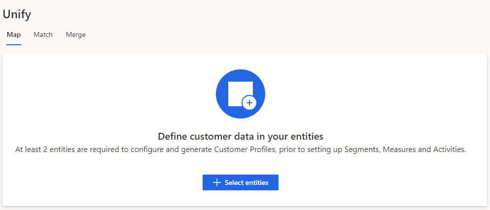
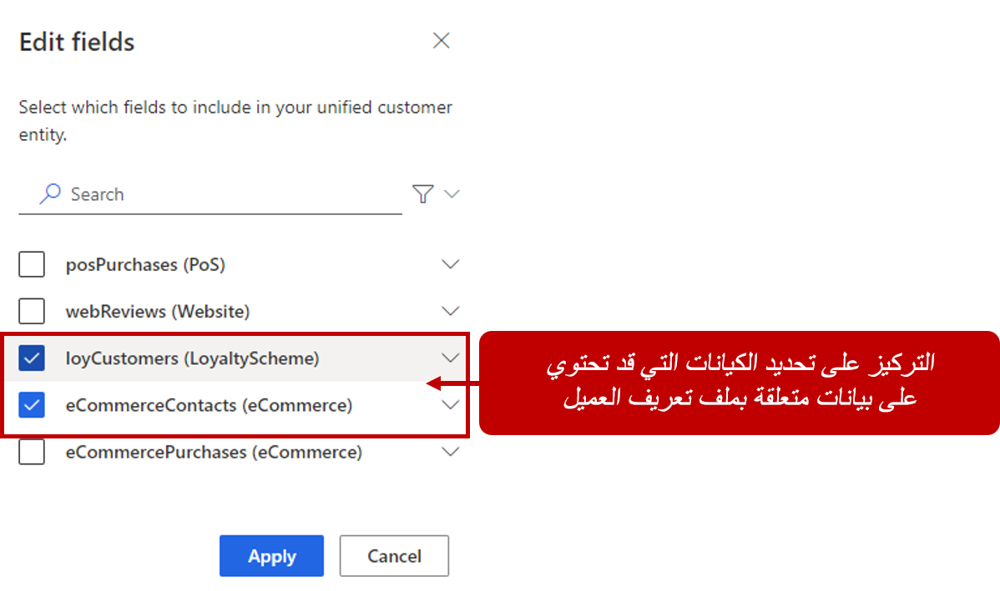
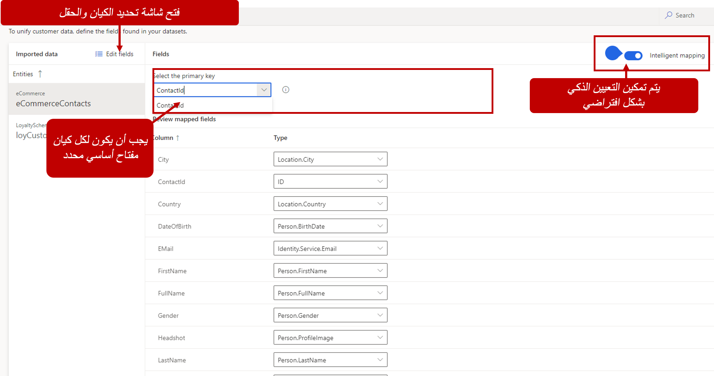
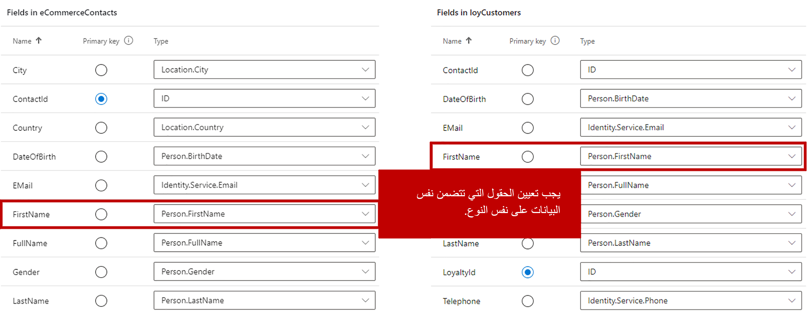

لا تمثل جميع البيانات التي يتم إدخالها في رؤى الجمهور البيانات التي يمكن استخدامها لإنشاء ملف تعريف عميل موحد.  قد تمثل بعض البيانات معلومات المعاملات مثل عمليات الشراء ورسائل البريد الإلكتروني وحالات الدعم وتجديد العضوية والمزيد.  في حين أن هذه المعلومات مهمة، فمن المحتمل أن تُستخدم لتمثيل الأنشطة المتعلقة بالعميل وليس لتعريف بيانات ملف تعريف العميل.  تتضمن بيانات ملف تعريف العميل عادةً بيانات مثل العناوين وأرقام الهواتف وأرقام المعرفات وصور الملف الشخصي وتواريخ الميلاد وما إلى ذلك.

المرحلة الأولى في إنشاء ملف تعريف موحد هي تعيين البيانات.  يحدد مجموعات البيانات من مصادر البيانات التي تم استيعابها والتي سيتم استخدامها لإنشاء ملف تعريف عميل موحد.

الهدفان الرئيسيان لمرحلة الخريطة هما:

- **تحديد الكيان** - يحدد الكيانات التي يمكن دمجها لإنشاء مجموعة بيانات أكثر اكتمالاً بمعلومات عن عملائك.

- **تحديد السمة** - يحدد الأعمدة التي يجب دمجها لكل كيان حتى يمكن التسوية بينها في مرحلتي المطابقة والدمج.

يتم إجراء التعيين من صفحة **توحيد** ضمن قسم **البيانات** في قائمة **رؤى الجمهور**. في المرة الأولى التي تقوم فيها بالوصول إلى مرحلة التعيين، لن تتوفر أي بيانات، لذلك ستحتاج إلى تحديد الخيار **تحديد الكيانات**.

سيتم إدراج كل مصدر بيانات استوعبته في صفحة **توحيد**. ضمن مصادر البيانات، سترى كل استعلام تم تحديده أثناء مرحلة التحويل. إذا تم تحديد استعلامات متعددة، فسترى كل استعلام ضمن مصدر البيانات. ستحتاج إلى تحديد معلومات كل استعلام سيتم استخدامها لإنشاء ملف تعريف العميل. لا يلزم تضمين كل مصدر بيانات في ملف تعريف العميل. تتضمن بعض مصادر البيانات ببساطة الأنشطة أو الأحداث المتعلقة بالعميل ولكن ليس البيانات التي يجب أن تكون جزءاً من الملف الشخصي الموحد.

على سبيل المثال، أثناء مرحلة التحويل، استوعبت مصادر البيانات التالية:

- **eCommerceContacts** - تخزن تفاصيل ملف تعريف العميل المتعلقة بالعملاء الذين يستخدمون نظام التجارة الإلكترونية الخاص بك.

- **LoyaltyCustomers** - تخزن معلومات ملف تعريف العميل المتعلقة بالعملاء الأعضاء في برنامج الولاء الخاص بك.

- **نقطة البيع** - تخزن معلومات الشراء التي قام بها العملاء من نظام نقطة البيع حول عمليات الشراء التي قام بها عملاؤك.

نظراً لأن مصادر بيانات eCommerceContacts وLoyaltyCustomers تحتوي عادةً على التفاصيل المتعلقة بالعميل التي تريد تضمينها في معلومات ملف التعريف، فمن المحتمل أن تقوم بتوحيد مصدري البيانات هذين لتشكيل ملف تعريف العميل. بالنظر إلى أن نظام نقطة البيع يحتوي على معلومات الشراء المرتبطة بالعميل، فإنه عادةً ما يتم استخدامه لتعقب الأنشطة المتعلقة بالشراء المرتبطة بهذا العميل أيضاً؛ لذلك لا يلزم تضمين مصدر البيانات هذا في ملف تعريف العميل.

أثناء مرحلة التعيين، ما عليك سوى تحديد eCommerceContacts وLoyaltyCustomers. قد يكون الاستثناء لهذا السيناريو إذا احتوى كل سجل في مصدر بيانات نقطة البيع على معلومات العنوان التي تحدد مكان شحن المعلومات إليه. في هذه الحالة، قد يكون من المفيد تضمين مصدر بيانات نقطة البيع في ملف تعريف العميل الموحد. تأكد جيداً من مراعاة البيانات المضمنة في كل مصدر بيانات للتأكد من معرفتك للبيانات التي تريد استيعابها. بعد أن تقرر المصادر المراد تضمينها في ملف التعريف، حدد **حفظ**، والتي ستعيد توجيهك إلى شاشة **الخريطة** حتى تتمكن من تقديم مزيد من التفاصيل.

> [!IMPORTANT]
> للاستفادة من عملية توحيد البيانات، تأكد من تحديد كيانين على الأقل. شاشة الخريطة هي المكان الذي ستحدد فيه السمة (الحقل) التي تحتوي على المعرف الفريد لكل سجل. تتكون الشاشة من قسمين.

## العمل مع الكيانات

على الجانب الأيمن من شاشة **تحديد الكيانات**، سترى قائمة الكيانات المضمنة التي قمت بتحديدها. يتم سرد الكيانات حسب الترتيب الأبجدي. لا يؤثر الترتيب في كيفية دمج سجل ملف تعريف العميل، والذي سيتم عند إكمال مرحلة المطابقة. سيتم تحديد الكيان الأول المُدرج تلقائياً بشكل افتراضي. يمكنك التنقل بين الكيانات المختلفة عن طريق تحديد الكيان الذي تريد العمل معه.

يمكنك إجراء تغييرات على الكيانات التي تم تضمينها. على سبيل المثال، إذا كنت قد قمت باستيعاب بيانات من مصدر بيانات جديد تريد تضمينه في ملف تعريف العميل، فيمكنك إضافة مصدر البيانات في ملف تعريف العميل عن طريق اختيار الزر **تحديد**. سيسمح لك هذا التحديد إما بإضافة مصادر البيانات أو إزالتها من ملف تعريف العميل حسب الحاجة.

> [!IMPORTANT]
> يمكنك فقط إزالة الكيانات إذا لم تقم بدمج البيانات. بعد دمج الكيان، سوف يظهر بلون باهت ولن يكون متاحاً للإزالة.

## العمل مع الحقول

عندما تقوم بتحديد كيان، سيتم عرض جميع السمات الخاصة بهذا الكيان في الحقول الموجودة في قسم **اسم الكيان**. على سبيل المثال، إذا قمت بتحديد الكيان **eCommerceContacts**، فسيتم عرض الاسم **الحقول في eCommerceContacts**. سيقوم النظام تلقائياً بتضمين جميع السمات حيث يمكنه تحديد نوع السمة تلقائياً.

يمكنك تحديد السمات المحددة التي تريد تضمينها عن طريق تحديد الزر **تحرير**. سيتم سرد كل حقل متاح في مصدر البيانات هذا. يمكنك استخدام مربع البحث أو التمرير لتحديد موقع السمات. بعد العثور عليها، حدد السمات التي تريد تضمينها. يمكن إضافة جميع السمات عن طريق تحديد الزر **تحديد الكل**. عند تحديد سمة واحدة، سيتحول زر **تحديد الكل** إلى زر **مسح الكل** الذي يمكنك استخدامه لمسح جميع اختياراتك. تأكد من مراجعة السمات التي يتم تضمينها لكل كيان لأنه سيتم استخدامها أثناء مرحلة المطابقة.

## التعيين الذكي

الغرض من عملية التعيين هو التأكد من أن الحقول الصحيحة من مصدر استيعاب البيانات سيتم تعيينها ليتم تعيينها بشكل مناسب على ملف تعريف العميل الموحد.  بينما يمكنك الانتقال خلال عمليه التعيين يدوياً، سيتم أولا تمكين ميزة التعيين الذكي.  يساعد التعيين الذكي في توفير الوقت، عن طريق تحديد نوع البيانات في كل عمود تلقائياً ويقوم بتعيينها للسمات في التطبيق.

بشكل افتراضي، يتم تشغيل التعيين الذكي عند تحديد الكيانات التي تريد تعيينها.  يمكنك إضافة تعيينات يدوية إضافية حسب الحاجة.  إذا قررت لأي سبب إيقاف تشغيل التعيين الذكي، سيتم مسح أي اقتراحات ذكية ولكن ستبقى التغييرات التي تم إجراؤها على الحقول الفردية.  في معظم الأوقات، ستتركه على الأرجح لتوفير الوقت.

## تحديد المفاتيح الأساسية وتعريف أنواع السمات

قبل التعيين، يجب إعداد كل كيان حتى يتمكن التطبيق من تعيين البيانات بشكل أكثر فعالية عند تشغيل عملية الدمج. يجب عليك إكمال تحديدين قبل أن تتمكن من إكمال مرحلة الخريطة.

- **المفتاح الأساسي** - يحتاج كل كيان إلى سمة واحدة تم تعيينها كمفتاح أساسي. لكي تكون السمة مفتاحاً أساسياً صالحاً، يجب ألا تتضمن قيماً مكررة أو قيماً مفقودة أو قيماً فارغة.

    لا يمكنك استخدام حقول متعددة كمفتاح أساسي؛ يتم دعم حقل واحد فقط.

- **نوع السمة** - يحدد فئات السمات الخاصة بك، مثل عنوان البريد الإلكتروني أو الاسم. سيتم تعريف أنواع السمات تلقائياً بواسطة النظام عند إضافة الكيان.

    يمكنك تغيير نوع موجود أو إضافة نوع كيان عميل عن طريق تحديد حقل **النوع** للسمة التي تريد تغييرها ثم إدخال الاسم الذي تريد استخدامه.

تأكد من أن الفئات الخاصة بك متسقة عبر جميع الكيانات التي تقوم بتضمينها في ملف التعريف. يضمن هذا الأسلوب تعيين كل شيء بشكل صحيح عندما يقوم النظام بدمج العناصر في ملف التعريف الموحد. على سبيل المثال، إذا كان لدى كل من eCommerceCustomers وLoyaltyCustomers حقل **FirstName**، فقد ترغب في تعيين كلتا الفئتين على **Person.FirstName**. عندما يتم تحديد السمات تلقائياً، يجب أن تتم محاذاة هذه الفئات، ولكن يجب عليك دائماً التحقق مرتين للتأكد.

بعد تعيين جميع الكيانات والسمات، تكون جاهزاً للتقدم إلى مرحلة المطابقة.

> [!VIDEO https://www.microsoft.com/videoplayer/embed/RWFNQO]
