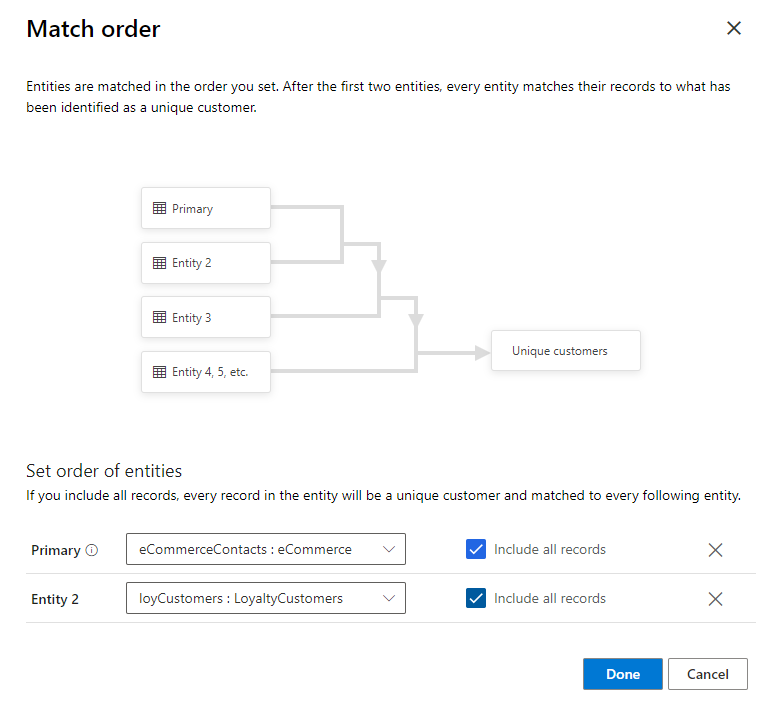
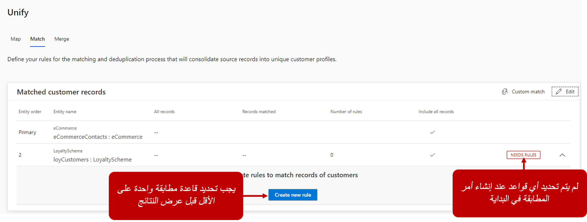
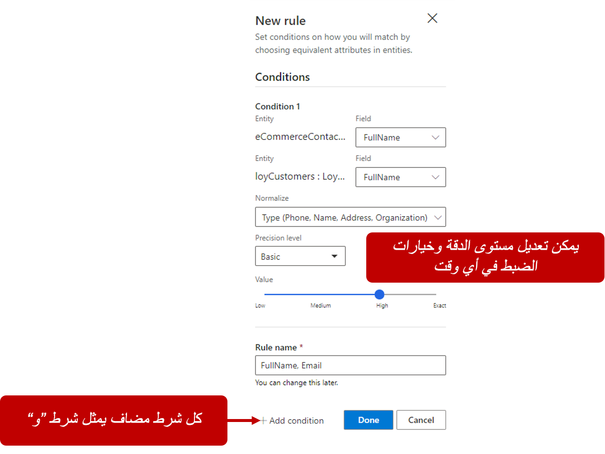
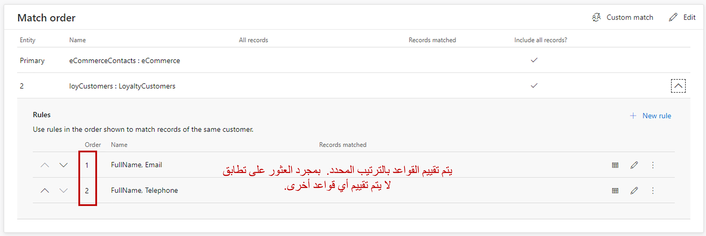
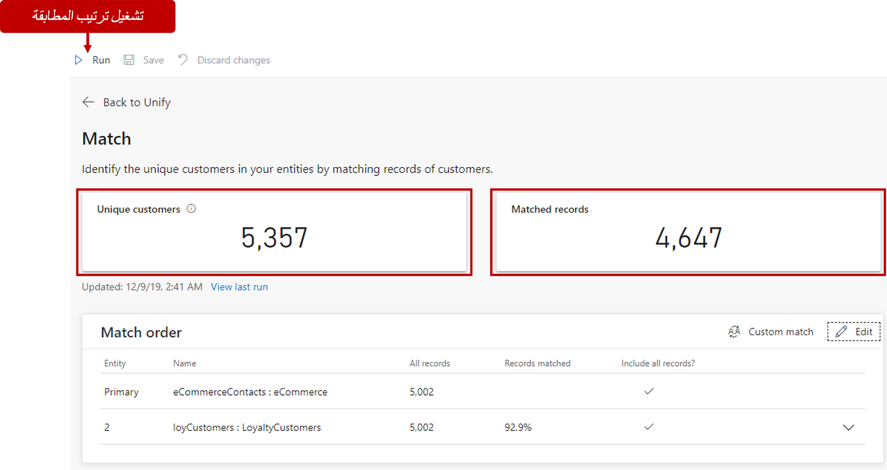
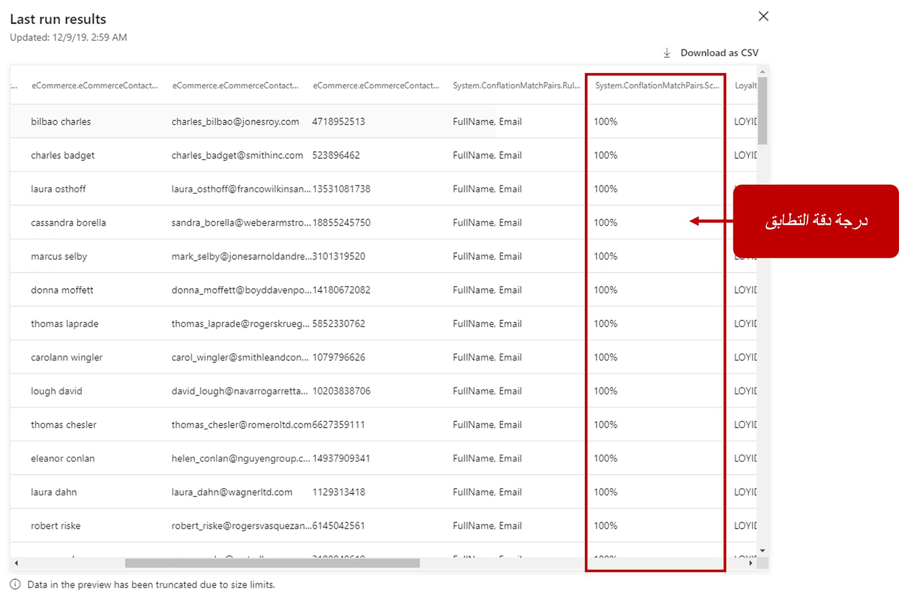

بعد إكمال مرحلة التعيين، تُصبح جاهزاً لمطابقة الكيانات. المطابقة متوفرة ضمن **توحيد > مطابقة**. مرحلة المطابقة يتم فيها تحديد كيفية دمج مجموعات البيانات في مجموعة بيانات ملف تعريف العميل الموحدة. سيُستخدم ملف التعريف هذا لاحقاً لإلغاء قفل رؤى فريدة عن عملائك.

لا يُمكنك إجراء أي مطابقة إلا عند تعيين كيانين على الأقل في أثناء مرحلة التعيين. عند عدم وجود كيانان معينان على الأقل، ستتلقى رسالة للعودة إلى صفحة **الخريطة** وعليك تلبية المتطلبات.

في أول مرة تُجري فيها عملية المطابقة، ستحتاج إلى إكمال الخطوات الإلزامية التالية:

1.  تحديد الترتيب الذي سيتم من خلاله مطابقة الكيانات المعينة.

1.  تعريف قواعد أول زوج مُطابق.

1.  تشغيل المطابقات المحددة.

## تحديد ترتيب المطابقة

تتضمن كل عملية مطابقة توحيد كيانين أو أكثر في كيان واحد مع الحفاظ على كل سجل عميل فريد. عند تحديد أمر مطابقة، ستحتاج إلى تحديد الكيان المطلوب استخدامه على أنه كيان أساسي. الكيان الذي تختاره على أنه أساس لمجموعة البيانات الأساسية الموحدة. بصفة أساسية، ستُضاف أي حقول من كيانات أخرى مُحددة في أثناء مرحلة المطابقة إلى هذا الكيان.
ورُغم ذلك، لن يتضمن الكيان الموحد بالضرورة جميع البيانات المضمنة في هذا الكيان.

هناك اعتباران قد يُساعداك على تحديد الكيان الأساسي:

-   أي كيان غالباً ما يكون لديه البيانات الأكثر اكتمالا وموثوقية بشأن عملائك.

-   إذا كان الكيان يحتوي على سمات مشتركة أيضاً مع كيانات أخرى مثل الاسم أو رقم الهاتف أو عنوان البريد الإلكتروني. كلما زاد عدد السمات المشتركة التي يمتلكها الكيان، كانت النتائج أفضل عند حدوث المطابقة.

    وإذا لم يكن للكيان سمات مشتركة مع الآخرين، فحدد الكيان الثاني الأكثر موثوقية.

عندما تعرف الكيان المُحدد على أنه الكيان الأساسي، حدد ترتيب تقييم الكيانات المتبقية. وسوف تُمثَّل هذه الكيانات على أنها الكيان رقم 2، والكيان رقم 3، وهكذا.

تكون المطابقة بالترتيب التالي:

-   **المطابقة الأولى** - يُطابق الكيان الأساسي مع الكيان رقم 2.

-   **المطابقة الثانية** - تُطابَق نتائج مجموعة البيانات من المطابقة الأولى مع الكيان رقم 3.

-   **المطابقة الثانية** - تُطابَق نتائج مجموعة البيانات من المطابقة الثانية مع الكيان رقم 4.

تستمر هذه العملية لجميع الكيانات المُعرفة في ترتيب المطابقة.

لتوضيح أفضل، فكر في كيانات eCommerceContacts وLoyaltyCustomers المُعينة في الوحدة السابقة.

عند تعريف eCommerceContacts على أنها "أساسي" وLoyaltyCustomers على أنها الكيان رقم 2، عند إجراء المطابقة:

-   ستتم مُطابقة eCommerceContacts مع LoyaltyCustomers.

-   إذا أضفت كياناً ثالثاً، سيتم مطابقة نتائج مطابقة eCommerceContacts/LoyaltyCustomers مع الكيان الثالث.

يجب استخدام الأسئلة المستخدمة لتحديد الكيان الأساسي لمساعدتك في اختيار الكيان رقم 2 أيضاً. حدد الكيان الذي يمتلك ثاني أكثر البيانات موثوقية واكتمالاً. إضافة إلى ذلك، حدد ما إذا كان الكيان الثاني يتضمن حقلاً واحداً على الأقل يشترك فيه الكيان الأساسي وربما حقولاً إضافية تُشاركها كيانات أخرى تم استيعابها. 

بعد تحديد ترتيب المطابقة الذي تريد استخدامه، حدد **تم** لحفظ ترتيب المطابقة.

## تعريف قواعد أول زوج مُطابقة

بعد تحديد ترتيب المطابقة، ستُنقل إلى صفحة **المطابقة** ، التي ستتضمن عمليات المطابقة المحددة. ستجد هذه الصفحة حيثُ يُمكنك الاطلاع على نتائج قواعد المطابقة وستكون فارغة حتى تشغيل أمر مطابقة لاحقاً.

وحتى تعرف قاعدة المطابقة الحقول المطلوب مطابقتها وكيفية مطابقتها، سيعرض ترتيب المطابقة علامة تحذير تُشير إلى أن قاعدة مطابقة واحدة على الأقل (قاعدة إلزامية) ضرورية لزوج المطابقة. تُملي قواعد المطابقة المنطق الذي سيتم من خلاله مطابقة زوج معين من الكيانات. لتعريف قاعدة، افتح جزء "تعريف القاعدة" بتحديد صف المطابقة المقابل في جدول المطابقات ثم حدد **إنشاء قاعدة جديدة**.

جزء "القاعدة الجديدة" هو مكان تحديد الشروط المطلوب تطبيقها على تلك القاعدة. يُمثَّل كل شرط بصفين يتضمنان التحديدات التالية:

-   السمة من الكيان الأساسي المطلوب استخدامه لمطابقة من كيان أول زوج مطابقة مثل الاسم أو الهاتف أو عنوان البريد الإلكتروني.

-   السمة من الكيان الثانوي، ومن المحتمل أن يكون لديه معلومات مشابهة للحقل المحدد في الكيان الأساسي.

من المثال السابق، لأن كل من eCommerceCustomers وLoyaltyCustomers لديهم حقل **FullName**، فمن المحتمل أن تحدد تلك الحقول في الشرط الذي تحدده.

وبما أنك تعرِّف شرطاً، يُمكنك تعريف خيارين إضافيين يؤثران في كيفية تحديد مطابقة السجلات والنتائج التي يتم إرجاعها:

-   **أسلوب الدقة** - يُشير إلى مستوى الدقة الذي يجب أن تستخدمه القاعدة عند تحديد ما إذا كان يمكن العثور على سجل مطابق في الكيان الآخر. الخيارات الأربعة التي يُمكنك تحديدها هي:

    -   **دقيق** - يبحث عن تطابق دقيق بين الحقول.

    -   **عالٍ** - يناسب حالات لا تكون فيها المطابقة بنسبة 100%، ولكن دقة المطابقة أكثر أهمية من الوصول إليها، مثل خدمة مالية لعميل معين.

    -   **منخفض** - يناسب حالات المطابقة المنخفضة. مع هذا الخيار، سوف تهتم أكثر بالوصول إلى المطابقة بدلاً من الدقة. قد يُستخدم هذا الخيار في سيناريوهات مثل حملات التسويق.

    -   **متوسط** - يُعد هذا الخيار منطقة وسطى بين عالٍ ومنخفض.

-   **طريقة التسوية** - تتوفر خيارات تسوية مختلفة قد تساعد على ضمان المطابقات مثل إزالة علامات الترقيم، وعدم النظر في المسافة البيضاء، والتعامل مع القيم على أنها نوع من البيانات مثل عنوان أو رقم هاتف.

إذا لم تتلقى النتائج المتوقعة من القواعد، يُمكنك دائماً العودة لاحقاً وتعديل دقة القاعدة والتسوية لضبط النتائج حسب الحاجة.

في بعض الأحيان، قد ترغب في مطابقة الكيانات فقط إذا تم استيفاء شروط متعددة، مثل مطابقة اسم العميل وعنوان البريد الإلكتروني. لاحتواء هذا السيناريو، يمكنك إضافة عدة شروط مرتبطة معاً. قد يكون لكل شرط دقته الخاصة به وتعريفات التسوية المعرفة. لا تدعم رؤى الجمهور شروط OR، لذلك يتم التعامل مع أي شروط تُضاف على أنها حالات "و". يجب استيفاء كلا الشرطين كي يتم العثور على تطابق. يُمكنك إزالة الشروط حسب الحاجة.

> [!VIDEO https://www.microsoft.com/videoplayer/embed/RWFNQQ]

### إضافة قواعد متعددة

إذا كنت تفكر في شروط القاعدة على أنها زوج واحد من السمات مثل اسم أو مجموعة اسم وعنوان البريد الإلكتروني، فإن القواعد تمثل مجموعات من شرط واحد أو أكثر. 

إذا كنت تعتقد أنه يمكن مطابقة الكيانات استناداً إلى مجموعات مختلفة من السمات، فيُمكنك إنشاء قواعد إضافية. عند تعريف قاعدة ثانية، فإن ترتيب القواعد مهم. تحاول خوارزمية المطابقة العمل استناداً إلى القاعدة الأولى وستستمر إلى القاعدة الثانية إذا لم يتم التعرّف على أي تطابقات ضمن القاعدة الأولى.

مثال، إذا كان لديك عملاء في مصدر البيانات الثاني ليس لديهم عناوين بريد إلكتروني، يُمكنك إضافة قاعدة ثانية تتطابق مع مجموعة من الاسم ورقم الهاتف. عند تطبيق أمر المطابقة، إذا لم يتمكن من العثور على تطابق استناداً إلى الاسم والبريد الإلكتروني، فإنه سينتقل ويحاول المطابقة استناداً إلى الاسم ورقم الهاتف.

### تشغيل ترتيب المطابقة

بعد إكمال الخطوتين 1 و2، يُمكنك تشغيل قاعدة المطابقة.
عند تشغيل قاعدة، وحسب عدد السجلات المضمنة، فمن الممكن أن خوارزمية المطابقة تستغرق بعض الوقت لإكمال المطابقة.

رُغم أنه من غير الممكن استخدام أي من وظائف صفحة **المطابقة** حتى تكتمل عملية المطابقة، إلا أنه يُمكنك الانتقال إلى مناطق أخرى من التطبيق من خلال جزء التنقل الأيسر. مثال، يُمكنك استخدام هذا الوقت لتعريف العلاقات أو الأنشطة.

فوق مخطط الحالة، يعرض إشعار **السجلات المطابقة** لمدة تشغيل خوارزمية المطابقة. عند اكتمال عملية المطابقة، تصبح صفحة **المطابقة** متوفرة مرة أخرى وتظهر رسالة **السجلات المتطابقة**.

بعد اكتمال المطابقة، ينتج عنها كيان رئيسي موحّد. ستؤدي أي عمليات مطابقة لاحقة إلى توسيع هذا الكيان. عند الانتهاء من عملية المطابقة، يُمكنك مشاهدة معاينة كيان العميل الموحّد عن طريق تحديد **عرض آخر تشغيل**.

لكل سجل، سيعرض التطبيق درجة الثقة التي تعكس مدى التأكد من أن السجل تم مطابقته بدقة. تُقدم الأعمدة الأخرى في النتيجة البيانات المأخوذة من الكيانين الأصليين. تعرض الأعمدة الموجودة يسار عمود الثقة البيانات المأخوذة من كيان زوج المطابقة الأول، بينما تعرض الأعمدة الموجودة على يمينه البيانات المأخوذة من كيان زوج المطابقة الثاني.

عند تشغيل المطابقة الأولى بنجاح، يُمكنك أيضاً عرض كيان ملف تعريف العميل الموحّد الذي أُنشئ من صفحة **الكيانات**. سيكون لكيان العميل الموحّد الاسم التالي: ConflationMatchPairs: CustomerInsights.

عند هذه النقطة، لديك الخيار إما المتابعة إلى صفحة **الدمج**، أو يمكنك المراجعة والتحقق من صحة المطابقات وإجراء أي تغييرات ضرورية على ترتيب المطابقة والقواعد. نوصيك بمراجعة بعض نتائج معاينة المطابقة للتحقق من مطابقة السجلات وفقاً لتوقعاتك.
