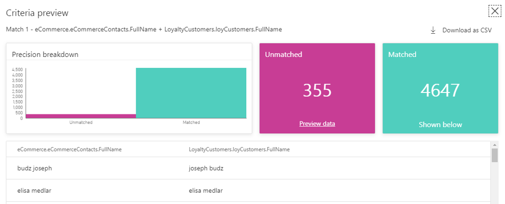
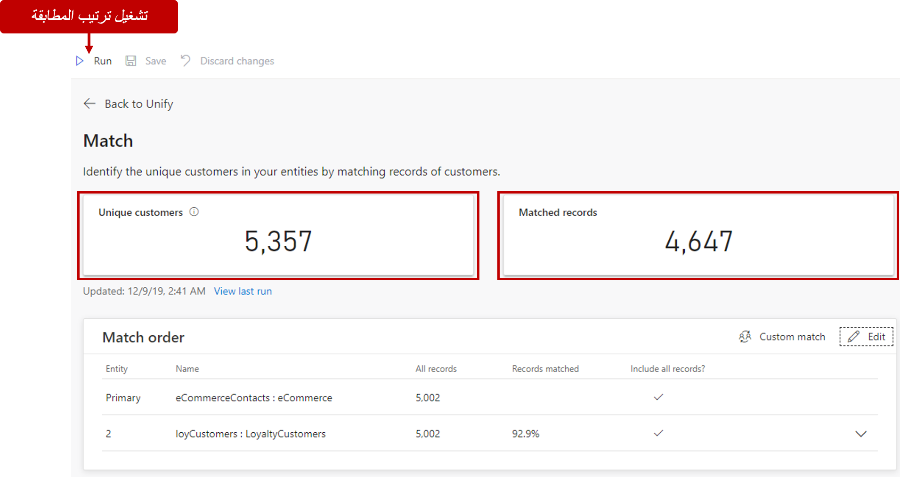

## تعريف إلغاء التكرار على كيان مطابقة

بالإضافة إلى قواعد المطابقة عبر الكيانات، يمكنك أيضاً تحديد قواعد إلغاء التكرارات. عملية إلغاء التكرار هي عملية أخرى عند مطابقة السجلات. إنها تحدد السجلات المكررة وتدمجها في سجل واحد. ترتبط السجلات المصدر بالسجل المدمج باستخدام معرّفات بديلة.

سيتم استخدام السجلات الملغى تكرارها في عملية المطابقة عبر الكيانات. تحدث عملية إلغاء التكرار على كيانات فردية، ويمكن تكوينها على كل كيان يتم استخدامه في أزواج المطابقة.

تحديد قواعد إلغاء التكرار غير إلزامي. إذا لم يتم تكوين مثل هذه القواعد، فسيتم تطبيق القواعد المحددة من قبل النظام. إنها تجمع كافة السجلات في سجل واحد قبل تمرير بيانات الكيان إلى المطابقة عبر الكيانات للحصول على أداء محسّن.

عند تحديد كيفية دمج السجلات المكررة، يمكنك اختيار أحد الخيارات الثلاثة:

- **الأكثر تعبئة:** لتعريف السجل الذي يتضمن حقول السمات الأكثر تعبئة كالسجل الفائز. إنه خيار الدمج الافتراضي.
- **الأحدث:** لتعريف السجل الفائز بالاستناد إلى الأكثر حداثة. يتطلب حقل تاريخ أو حقلاً رقمياً لتعريف الحداثة.
- **الأقل حداثة:** لتعريف السجل الفائز بالاستناد إلى الأقل حداثة. يتطلب حقل تاريخ أو حقلاً رقمياً لتعريف الحداثة.

> [!VIDEO https://www.microsoft.com/videoplayer/embed/RWG130]

## ضبط القواعد وتعديلها

عند تشغيل قاعدة مطابقة لأول مرة، ستجد على الأرجح أن النتائج ليست تماماً كما كنت تتوقع أو قد لا تعرف ما الذي قمت به. لديك العديد من الخيارات لتقييم جودة أزواج المطابقة وتحسين النتائج.

مهمتك الأولى هي فحص الرؤى المتوفرة في صفحة **المطابقة**. في أعلى الصفحة، يمكنك مراجعة السجلات الفريدة والمطابقة من الإطارات المتجانبة. الإطاران المتجانبان المنفصلان اللذان يمكنك فحصهما:

-   الإطار المتجانب الأيسر، والذي يُظهر عدد ملفات التعريف الفريدة التي حددها النظام.

-   الإطار المتجانب الأيمن، والذي يُظهر العدد الإجمالي للمطابقات عبر جميع أزواج المطابقة.

سيوفر لك الإطار المتجانب الأيمن مزيداً من السياق في الرقم الأول.
وكلما اقترب هذا الرقم من الرقم الأول، كان أداء التطبيق أفضل في مطابقة العناصر. إذا كان هذا الرقم منخفضاً بالمقارنة، فقد تحتاج إلى التفكير في إجراء بعض التغييرات على قاعدة المطابقة.

يمكنك استكشاف النتائج بشكل أكبر من خلال فحص عدد من السجلات الواردة من كل زوج مطابقة عن طريق توسيع العنصر لعرض النسب المئوية المطابقة لكل قاعدة تم تحديدها. عادةً، من الجيد مراجعة جزء على الأقل من القاعدة للتحقق من مطابقة السجلات وفقاً لتوقعاتك.

حاول تجربة حدود مختلفة حول شروطك لتحديد الحدود المثلى. استخدم خيار **تحرير** على قاعدة زوج المطابقة التي ترغب في تجربتها. حدد الشرط الذي ترغب في تجربته. يتم تمثيل كل معيار بصف واحد في جزء قاعدة المطابقة.

من خلال قضاء بعض الوقت في تجربة هذه الحدود، ستكتسب فهماً أفضل للتأثيرات لكل مستويات الحد. أثناء قيامك بضبط المستويات، يمكنك مقارنة عدد السجلات التي ستتم مطابقتها تحت كل مستوى من مستويات الحد وعرض السجلات تحت كل خيار.

### إجراء تغييرات لتحسين مطابقاتك

بعد تجربة خيارات مختلفة لفهم صفات المطابقة بشكل أفضل، يمكنك استخدام معرفتك لإعادة تكوين بعض محددات المطابقة. فيما يلي الخيارات المختلفة التي يمكنك التفكير فيها:

-   **تغيير ترتيب القواعد الخاصة بك** - إذا حددت قواعد متعددة، فقد يكون من المفيد تغيير ترتيبها حتى تتمكن من تحقيق جودة أفضل للمطابقة. يمكنك إعادة ترتيب قواعد المطابقة عن طريق تحديد خياري **تحريك لأعلى** و **تحريك لأسفل** المتاحين في شبكة قواعد المطابقة.

-   **تكرار القواعد الخاصة بك** - إذا حددت قاعدة مطابقة وأردت إنشاء قاعدة مماثلة مع التعديلات، فيمكنك إنشاء نسخة دون الحاجة إلى إعادة إنشاء جميع الشروط التي تم تحديدها يدوياً عن طريق تحديد خيار **تكرار** .

-   **تحرير القواعد الخاصة بك** - يتضمن هذا الخيار العديد من التغييرات المهمة التي يجب عليك تجربتها أثناء تحسين جودة المطابقة. يمكن الوصول إلى الخيارات التالية من خلال زر **تحرير** الخاص بالقاعدة:

    -   **تغيير سمات شرط** - يمكن إجراء هذه الطريقة عن طريق إعادة تحديد سمات جديدة داخل صف الشرط المحدد.

    -   **تغيير الحد لشرط** - يمكن تحقيق هذه الطريقة بسرعة من خلال شريط الحد. 
        
    -   **تغيير طريقة التسوية لشرط** - يمكن إجراء هذه الطريقة عن طريق إعادة تحديد طريقة التسوية.

> [!VIDEO https://www.microsoft.com/videoplayer/embed/RWFVrd]
