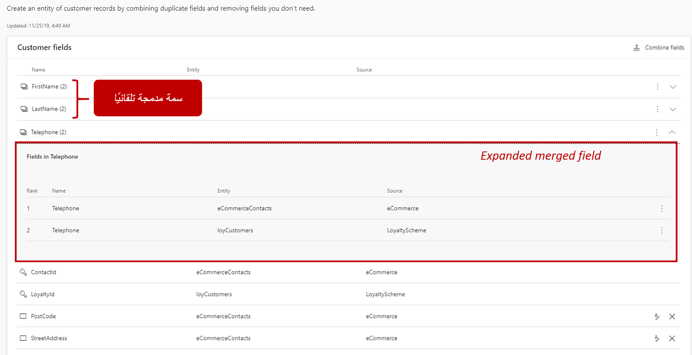
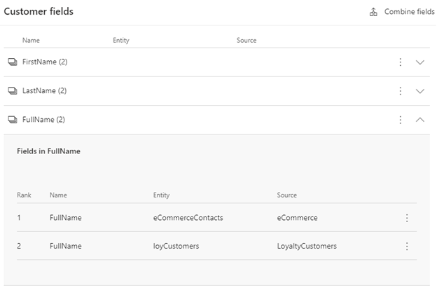
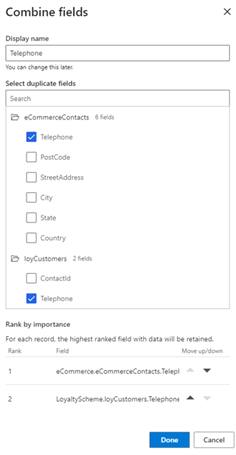
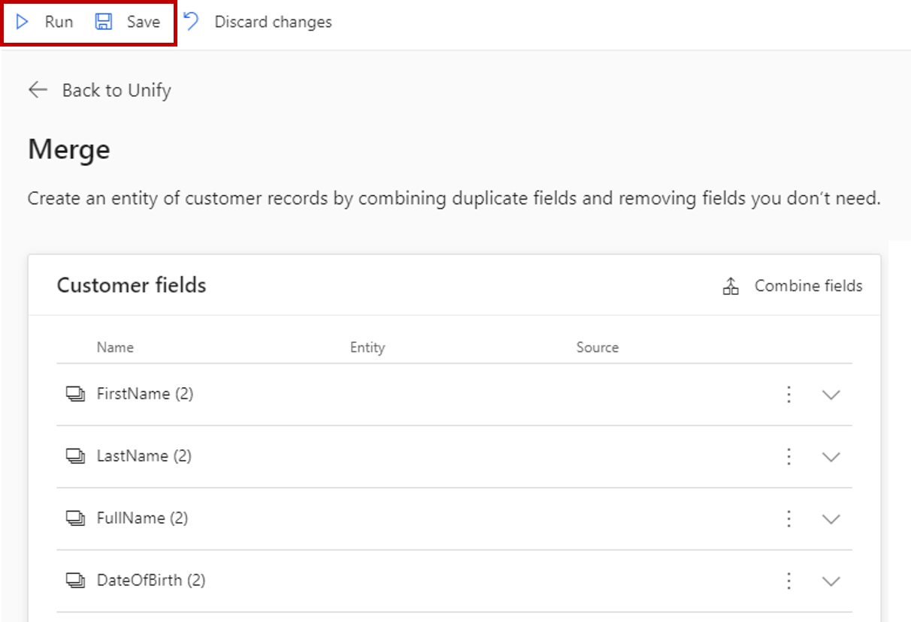

المرحلة الأخيرة في عملية توحيد البيانات هي مرحلة الدمج. الغرض من مرحلة الدمج هو تسوية البيانات المتعارضة. على سبيل المثال، قد تكون البيانات المتعارضة اسم عميل موجود في مجموعتين من مجموعات البيانات الخاصة بك ولكن يظهر بشكل مختلف قليلاً في كل مجموعة. في إحدى المجموعات، قد يُدرج الاسم بالصيغة Grant Marshall مقابل Grant فقط في مجموعة أخرى.
قد تأتي البيانات المتعارضة أيضاً في شكل تنسيقات أرقام الهواتف التي تختلف قليلاً مثل 617-8030-91X مقابل 617803091X. في تلك الحالات، يتم دمج تلك البيانات المتعارضة على أساس كل سمة على حدة. يمكنك الوصول إلى الدمج من صفحة **التوحيد**.

## مراجعة توصيات النظام

في صفحة **الدمج**، ستظهر لك قائمة حقول العملاء.  يمكنك استخدام هذه المنطقة لاختيار السمات التي تريد دمجها في كيان ملف تعريف العميل الموحد.  سيكون كيان ملف تعريف العميل نتيجة لعملية التكوين.   

تُظهر الصورة أدناه مثالاً لما قد يبدو عليه هذا: 

يتم عرض المعلومات التالية الخاصة بالسمة في صفحة **الدمج**:

-   **اسم السمة** - يمثل هذا اسم السمة بعد الدمج.
-  **الكيان** - يمثل الكيان الذي تأتي منه السمة.
-   **المصدر** - يمثل مصدر البيانات الذي تأتي منه السمة.

الحقول المدمجة تلقائياً التي تحتوي على أكثر من سمة مرتبطة بها، سيكون لها رقم بجوار الاسم.  يشير هذا الرقم إلى عدد السمات التي تشكل السمة المدمجة.  على سبيل المثال، FullName (2)، يشير إلى أن السمة FullName المدمجة لها سمتان فعليتان مقترنتان بها.  يمكنك عرض السمات المضمنة في سمة مُدمجة تلقائياً عن طريق تحديد السمة المدمجة.  ستظهر السمات التي تشكّل السمة المدمجة أسفل السمة المدمجة. 

إذا كنت تريد إلغاء دمج أي من السمات المدمجة تلقائياً، فحدد أيقونة علامة الحذف. في القائمة المنسدلة، حدد **حقول منفصلة**. قُم بإزالة السمات من كيان ملف تعريف العميل. إذا كنت تعتقد أنه يجب استبعاد بعض السمات من كيان ملف تعريف العميل النهائي، فحدد الخيار **عدم الدمج** من نفس القائمة المنسدلة.

ستنتقل السمات إلى قسم **تمت الإزالة من سجل العميل**.

## إضافة سمة مدمجة يدوياً

لإضافة سمة مدمجة، حدد **دمج الحقول**. يمكنك إجراء عملية الدمج اليدوي ضمن جزء دمج الحقول، والذي يتكون من أربعة أجزاء: 

-   **الاسم** - أدخل اسماً للسمة. يمكنك التعرّف عليه على صفحة **الدمج** لاحقاً.

-   **اسم العرض** - امنح السمة المدمجة اسماً مألوفاً سيظهر في كيان ملف تعريف العميل الموحد.

-   **تحديد سمات مكررة** - ضمن هذه القائمة، حدد السمات التي تريد دمجها من الكيانات المتطابقة. يمكنك أيضاً استخدام البحث لتحديد موقع السمات.

-   **الترتيب حسب الأهمية** - إعطاء الأولوية لسمة دون السمات الأخرى؛ ستأتي قيم السمة المدمجة من هذا المصدر فقط.

يمكنك تحرير أي حقل مدمج تم إنشاؤه تلقائياً أو يدوياً في أي وقت عن طريق تحديد علامة القطع واختيار "تحرير".  سيؤدي هذا إلى فتح جزء دمج الحقول.  من هنا يمكنك تغيير اسم العرض وتغيير السمات وتعديل ترتيبات الأهمية.  

## تشغيل الدمج

سواء كان يتم دمج السمات يدوياً أو السماح للنظام بالدمج نيابةً عنك، فيمكنك تشغيل الدمج في هذه المرحلة. حدد  **حفظ** ، ثم حدد **تشغيل** في أعلى الصفحة.

إذا كان الخيار **تشغيل** معطّل، فيجب أن تجرّب طريقتين لتمكينه:

-   قُم بتحديث الصفحة في المستعرض لديك لمعرفة ما إذا كان الزر نشطاً.

-   عُد إلى صفحة **المطابقة** وحدد **تشغيل** مرة أخرى. ثم عُد إلى صفحة **الدمج** لمعرفة ما إذا كان ذلك يحل المشكلة.

عندما تختفي رسالة **الدمج قيد التشغيل** ، واكتمل الدمج وحل المتعارضات في بياناتك وفقاً للسياسات التي حددتها. سيتم تضمين كل من السمات المدمجة وغير المدمجة في كيان ملف التعريف الموحد الخاص بك، بينما لن يتم تضمين سماتك المستبعدة.

> [!VIDEO https://www.microsoft.com/videoplayer/embed/RWFIBj]

## الخطوة التالية

تهانينا! لقد أكملت مرحلتي استيعاب البيانات وتوحيد البيانات. أنت الآن جاهز لإكمال إحدى العمليات التالية:

- أكمل المزيد من تكوينات البيانات (**الأنشطة**، أو **العلاقات**، أو **الإثراء**). على الرغم من أن هذه التكوينات اختيارية، إلا أنها يمكن أن تساعدك في الكشف عن رؤى أكثر ثراءً لعملائك.

- استمر في استكشاف الرؤى في أقسام **المقاطع**، و **بطاقة العميل**، و **الموصلات**. سيزودك قسم **المقاطع** برؤى على مستوى مجمع لقاعدة عملائك، بينما سيُتيح لك قسمي **بطاقة العميل**  و **الموصلات** فتح رؤى حول كل عميل من عملائك.

