وقع عليك الاختيار لتكون مدير مشروع لتنفيذ Dynamics 365 Customer Insights في Contoso Coffee. وبصفتك مدير مشروعات متمرسًا، فإنك تضع الخطة التالية:

-   إنشاء إحدى بيئات Customer Insights.

-   استيعاب البيانات من مصادر البيانات ذات الأولوية الأعلى من داخل الشركة:

    -   نقطة البيع (POS)

    -   بيانات الولاء

    -   عملاء التجارة الإلكترونية وعمليات الشراء على الويب

-   تكوين ملف تعريف موحَّد للعملاء من البيانات التي تم استيعابها.

### الأهداف التعليمية

ستتمكن في نهاية هذه التمارين من تحقيق الأهداف التالية:

-   التسجيل في إصدار تجريبي من Dynamics 365 Customer Insights.

-   استيعاب مصادر البيانات المنعزلة.

-   اتباع ميزات التعيين والمطابقة والدمج لإنشاء ملف تعريف موحّد.

-   حساب مؤشرات الأداء الرئيسية (KPI) للأعمال والعملاء الرئيسيين.

-   إنشاء شرائح ليستخدمها قسم التسويق.

## تمرين 1 - إنشاء مثيل من مثيلات Customer Insights

في هذا التمرين العملي، ستسجّل في مثيل من مثيلات Customer Insights وتراجع جولة العرض الإرشادية للتعرّف على التطبيق.

### المهمة 1 - التسجيل في إصدار تجريبي من Customer Insights

1.  افتح مستعرضاً وانتقل إلى [Dynamics 365 Customer Insights](https://dynamics.microsoft.com/ai/customer-insights/?azure-portal=true).

1.  حدّد **الشروع في العمل**.

1.  حدِّد الارتباط **التسجيل في إصدار تجريبي مجاني** بجوار السؤال *هل تفضِّل الشروع في العمل بنفسك؟*.

1.  في صفحة **الشروع في العمل باستخدام Customer Insights**، سجِّل باستخدام عنوان بريدك الإلكتروني للعمل.

    إذا كنتَ لا تمتلك حق الوصول إلى أحد مستأجري Microsoft 365، فيمكنك التسجيل في إصدار تجريبي من Dynamics 365 (والذي سيتضمن أحد مستأجري Microsoft 365)، على النحو الوارد بالتفصيل في المتطلبات الأساسية.

    سيُعاد توجيهك إلى `https://home.ci.ai.dynamics.com`. *(إذا طُلب منك إنشاء بيئة جديدة، فأدخِل اسمًا وحدّد المنطقة التي تريد أن توزع الخدمة فيها.)*

تهانينا! من المفترض الآن أن تكون مسجلاً الدخول إلى Customer Insights، والتي سيكون لك فيها حق الوصول إلى بيئتين هما: بيئة عرض توضيحي والبيئة التي قد وفرتَها.

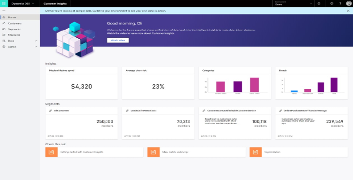

## تمرين 2 - استيعاب البيانات في Customer Insights

ستتعرف في هذا التمرين على استيعاب البيانات من مصادر متعددة.

سبق أن حدّدتَ بوصفك مديرًا للمشروعات في Contoso Retail المصادر الرئيسية للبيانات، بما فيها عملاء التجارة الإلكترونية، وعمليات الشراء عبر الإنترنت، وعمليات الشراء في نقطة البيع داخل المتجر، والبيانات الواردة من نظام بطاقة الولاء في Contoso Retail.

على الرغم من امتلاك Customer Insights لموصلات لأكثر من 30 مصدرًا للبيانات وتطبيقًا (بما في ذلك Dynamics 365 وMicrosoft Dataverse)، فإنك ستستخدم الموصل *نص/CSV* في هذا التمرين العملي.

### مصادر البيانات

| العنصر               | الوصف‏‎                                                                        | التنسيق   | عنوان URL                                                                                  |
|--------------------|------------------------------------------------------------------------------------|----------|--------------------------------------------------------------------------------------|
| جهات اتصال التجارة الإلكترونية | مقتطف من العملاء الذين أجروا عملية شراء عبر الإنترنت                              | نص/CSV | [الارتباط](https://ciaddata.blob.core.windows.net/ciad-sample-data/Contact.txt)          |
| نظام الولاء     | مقتطف للعملاء الذين سجّلوا في نظام بطاقة الولاء من Contoso Retail | نص/CSV | [الارتباط](https://ciaddata.blob.core.windows.net/ciad-sample-data/Customer-Loyalty.txt) |
| عمليات الشراء عبر الإنترنت   | مقتطف لعمليات الشراء التي جرت من خلال موقع ويب Contoso Retail                       | نص/CSV | [الارتباط](https://ciaddata.blob.core.windows.net/ciad-sample-data/OnlinePurchases.txt)  |
| عمليات الشراء في نقطة البيع      | مقتطف لتفاصيل عملية الشراء داخل المتجر                                                | نص/CSV | [الارتباط](https://ciaddata.blob.core.windows.net/ciad-sample-data/POSPurchases.txt)     |
| مراجعات موقع الويب    | مراجعات العملاء لموقع الويب على الإنترنت                                              | نص/CSV | [الارتباط](https://ciaddata.blob.core.windows.net/ciad-sample-data/WebsiteReviews.txt)   |

### المهمة 1 - استيعاب بيانات العملاء من نظام أساسي للتجارة الإلكترونية

1.  سجِّل الدخول إلى Customer Insights وحدِّد **البيئة** الخاصة بك من القائمة المنسدلة في الزاوية العلوية اليمنى. وأنشئ بيئة جديدة إذا طُلب منك ذلك.

1.  داخل Customer Insights، عليك توسيع **البيانات** في القائمة اليسرى ثم تحديد **مصادر البيانات**.

1.  حدِّد **إضافة مصدر بيانات**.

    [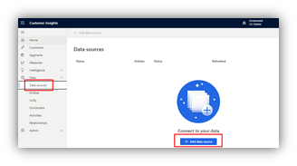](../media/ci-07-08.png#lightbox)

1.  حدد **Microsoft Power Query**، وفي الحقل **حفظ مصدر البيانات كـ**، أدخل **التجارة الإلكترونية**، ثم حدد الزر **التالي**.

1.  سيظهر لك عرض لموصلات مصدر البيانات التي يمكن لـ Customer Insights استيعابها. لاحِظ أنواع الموصلات المتوفرة، بما في ذلك Dataverse. حدِّد الموصل **نص/CSV**.

    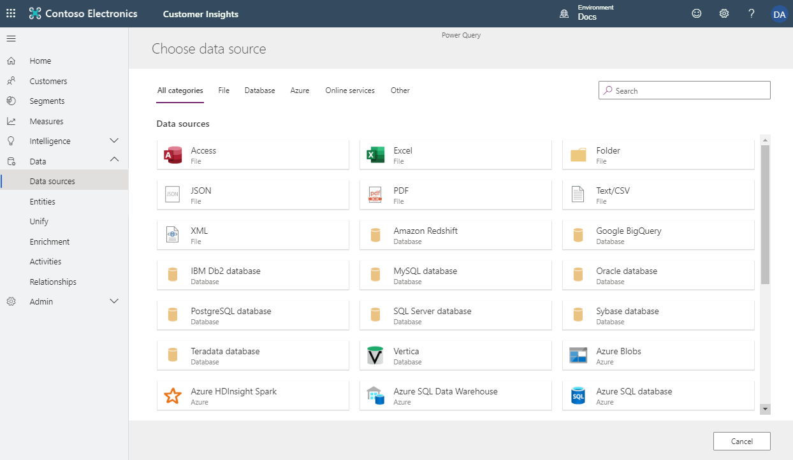

1.  أدخِل عنوان URL لـ Azure BLOB باسم <https://aka.ms/ciadclasscontacts>، ثم حدِّد **التالي**. (يمكنك العثور على عنوان URL في الجدول ضمن مقدمة هذا التمرين العملي.)

    

1. ستظهر لك الآن شاشة **إصدار أولي لبيانات الملف**. يمكنك هنا تغيير نوع المحدِّد أو نوع أصل الملف أو البيانات المُستخدَمة للكشف عن نوع البيانات. يمكنك تحديد الزر **تحويل البيانات**.

11. من المفترض أن ترى الآن جدولة البيانات من المصدر. وبإمكانك الآن تكوين أنواع البيانات والتنسيقات للبيانات التي تستوعبها. لاحِظ ظهور عنوان العمود في الصف الأول من البيانات. لتصحيح هذه المشكلة، حدِّد **تحويل الجدول** ثم حدِّد **‏‏استخدام الصف الأول كعناوين**.

    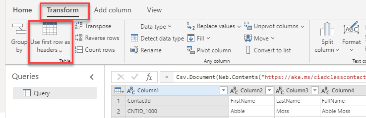

1. عُينت كل الأعمدة افتراضياً على نوع البيانات "نص" نظراً لأنك استوعبتَ بيانات من مصدر بتنسيق نص/CSV. لاستيعاب للبيانات ونمذجتها بنجاح، يمكنك تعيين نوع البيانات للأعمدة غير النصية.

    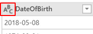

1. حدِّد الرمز **ABC** داخل عنوان العمود لتغيير نوع البيانات.

1. حدِّث نوع البيانات للأعمدة المُدرجة في الجدول التالي.

    | عنوان العمود | نوع بيانات جديد   |
    |----------------|----------------|
    | تاريخ الميلاد    | التاريخ والوقت       |
    | تم الإنشاء في      | التاريخ/الوقت/المنطقة |

1.  في حقل **الاسم** على الجزء الأيمن، أعِد تسمية مصدر بياناتك من **استعلام** إلى **eCommerceContacts**.

    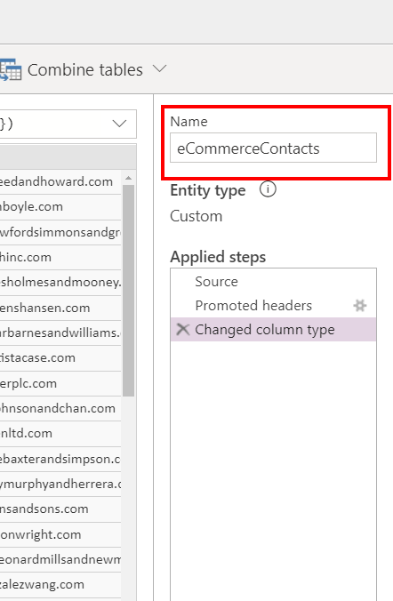

تهانينا! لقد نجحتَ الآن في استيعاب أول مصدر بيانات لك في Customer Insights.

> [!NOTE]
> هناك أمر واحد يجب أن تكون على علم به وهو أن أسماء الأعمدة لا يمكن أن تتضمن إلا الأحرف والأرقام وعلامات التسطير السفلي. ولا يمكن أن تحتوي على مسافة ويجب أن تبدأ بحرف. إذا كانت لديك بيانات يتضمن فيها اسم العمود (أسماء الأعمدة) مسافة أو لا تبدأ بحرف، فستحتاج إلى إصلاح ذلك إما داخل Power Query وإما قبل جلب البيانات إلى Customer Insights.

### المهمة 2 - استيعاب بيانات عملية الشراء عبر الإنترنت

في هذه المهمة التالية، ستستوعب بيانات عملية الشراء عبر الإنترنت، والتي تمثل عمليات الشراء التي أُجريت من خلال موقع الويب لشركة Contoso Coffee.

1.  داخل Customer Insights، عليك توسيع **البيانات** في القائمة اليسرى ثم تحديد **مصادر البيانات**.

1.  من المفترض أن ترى مصدر بيانات **التجارة الإلكترونية** الخاص بك. ضمن **الإجراءات**، حدِّد النقاط العمودية الثلاث، ثم حدِّد **تحرير**.

    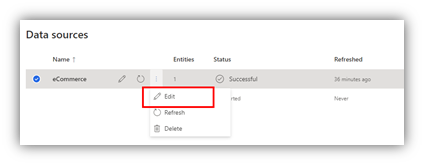

1.  من المفترض أن يظهر لك عرض بيانات eCommerceContacts التي استوعبتها في المهمة 1. في قائمة الإجراء، حدِّد **الحصول على البيانات**.

    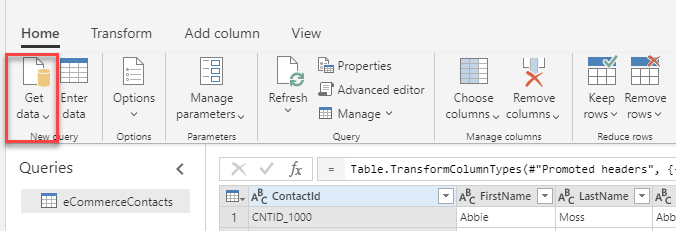

1.  سيظهر لك عرض لموصلات مصدر البيانات التي يمكن أن تستوعبها Customer Insights كما فعلتَ في المهمة 1. حدِّد الموصل **نص/CSV**.

1.  أدخِل عنوان URL لبيانات عمليات الشراء عبر الإنترنت، بيانات <https://aka.ms/ciadclassonline> ثم حدّد **التالي**.

1.  ستظهر لك الآن شاشة **إصدار أولي لبيانات الملف**. يمكنك هنا تغيير نوع المحدِّد أو نوع أصل الملف أو البيانات المُستخدَمة للكشف عن نوع البيانات. يمكنك النقر فوق الزر موافق

1.  حدِّد **تحويل الجدول** ثم حدّد **استخدام الصف الأول كعناوين**.

    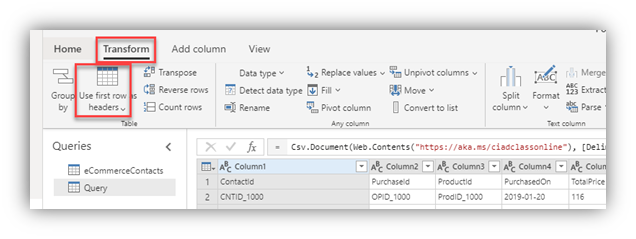

1. حدِّث أنواع البيانات للأعمدة في الجدول التالي.

    | عنوان العمود | نوع بيانات جديد  |
    |----------------|----------------|
    | تم الشراء في    | التاريخ/الوقت/المنطقة |
    | السعر الإجمالي     | العملة       |

1.  قم بتسمية استعلامك **eCommercePurchases** ثم حدِّد **إنشاء**.

### المهمة 3 - استيعاب بيانات العملاء من نظام الولاء، وعمليات الشراء في نقطة البيع، ومراجعات موقع الويب

1.  داخل Customer Insights، عليك توسيع **البيانات** في القائمة اليسرى ثم حدّد **مصادر البيانات**.

1.  حدِّد **إضافة مصدر بيانات**.

1.  حدد **Microsoft Power Query**، وفي الحقل حفظ مصدر البيانات كـ، أدخل **الولاء**، ثم حدد الزر **التالي**.

1.  سيظهر لك عرض لموصلات مصدر البيانات التي يمكن لـ Customer Insights استيعابها. دوّن أنواع الموصلات المتوفرة. حدِّد الموصل **نص/CSV**.

    

1.  أدخِل عنوان URL لـ [جهات اتصال الولاء](https://ciaddata.blob.core.windows.net/ciad-sample-data/Customer-Loyalty.txt) ثم حدّد **التالي**.

1.  ستظهر لك الآن شاشة **إصدار أولي لبيانات الملف**. يمكنك هنا تغيير نوع المحدِّد أو نوع أصل الملف أو البيانات المُستخدَمة للكشف عن نوع البيانات. يمكنك تحديد الزر **تحويل البيانات**.

1.  من المفترض أن ترى الآن جدولة البيانات من المصدر. وبإمكانك هنا تكوين أنواع البيانات والتنسيقات للبيانات التي تستوعبها.

1.  ستلاحظ ظهور عنوان العمود في الصف الأول من البيانات. لتصحيح ذلك، حدِّد **تحويل** ثم حدِّد **‏‏استخدام الصف الأول كعناوين**.

1.  عُينت كل الأعمدة افتراضياً على نوع البيانات "نص" نظراً لأننا استوعبنا بيانات من مصدر بتنسيق نص/CSV. لإجراء عملية استيعاب البيانات ونمذجتها بنجاح، يمكننا تعيين نوع البيانات للأعمدة غير النصية.

1. حدِّد الرمز **ABC** داخل عنوان العمود لتغيير نوع البيانات. وحدِّث نوع البيانات للأعمدة المُدرجة أدناه.

1. استخدِم الصف الأول كعناوين أعمدة.

    | عنوان العمود | نوع بيانات جديد  |
    |----------------|----------------|
    | تاريخ الميلاد    | التاريخ/الوقت      |
    | نقاط المكافآت   | عدد صحيح   |
    | تم الإنشاء في      | التاريخ/الوقت/المنطقة |

1.  في حقل **الاسم** على الجزء الأيمن، أعِد تسمية مصدر بياناتك من **استعلام** إلى **loyCustomers** ثم حدّد **حفظ**.

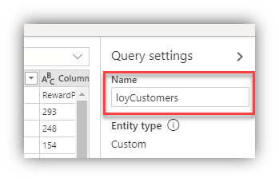

### المهمة 4 - استيعاب بيانات العملاء

1.  داخل Customer Insights، عليك توسيع **البيانات** في القائمة اليسرى ثم حدّد **مصادر البيانات**.

1.  حدِّد **إضافة مصدر بيانات**.

1.  حدد **Microsoft Power Query**، وفي الحقل **حفظ مصدر البيانات كـ**، أدخل **PoS** ثم حدد **التالي**.

1.  سيظهر لك عرض لموصلات مصدر البيانات التي يمكن لـ Customer Insights استيعابها. دوّن أنواع الموصلات المتوفرة. حدِّد الموصل **نص/CSV**.

1.  أدخل عنوان URL لعمليات الشراء في نقطة البيع (PoS) `https://aka.ms/ciadclasspos`.

1.  ستظهر لك الآن شاشة **إصدار أولي لبيانات الملف**. يمكنك هنا تغيير نوع المحدِّد أو نوع أصل الملف أو البيانات المُستخدَمة للكشف عن نوع البيانات. يمكنك تحديد الزر **تحويل البيانات**.

1.  من المفترض أن ترى الآن جدولة البيانات من المصدر. وبإمكانك هنا تكوين أنواع البيانات والتنسيقات للبيانات التي تستوعبها.

1.  ستلاحظ ظهور عنوان العمود في الصف الأول من البيانات. لتصحيح ذلك، حدِّد **تحويل** ثم حدِّد **‏‏استخدام الصف الأول كعناوين**.

1.  عُينت كل الأعمدة افتراضياً على نوع البيانات "نص" نظراً لأننا استوعبنا بيانات من مصدر بتنسيق نص/CSV. لإجراء عملية استيعاب البيانات ونمذجتها بنجاح، يمكننا تعيين نوع البيانات للأعمدة غير النصية.

1. حدِّد الرمز **ABC** داخل عنوان العمود لتغيير نوع البيانات. وحدِّث نوع البيانات للأعمدة المُدرجة أدناه.

1. استخدِم الصف الأول كعناوين أعمدة.

    | عنوان العمود    | نوع بيانات جديد  |
    |-------------------|----------------|
    | تم الشراء في       | التاريخ/الوقت/المنطقة |
    | السعر الإجمالي        | العملة       |
    | نقاط المكافآت المضافة | عدد صحيح    |

1.  في حقل **الاسم** على الجزء الأيمن، أعِد تسمية مصدر بياناتك من **استعلام** إلى **posPurchases** ثم حدّد **حفظ**.

### المهمة 5 - استيعاب بيانات العملاء من مراجعات موقع الويب

1.  داخل Customer Insights، عليك توسيع **البيانات** في القائمة اليسرى ثم حدّد **مصادر البيانات**.

1.  حدِّد **إضافة مصدر بيانات**.

1.  أدخل اسمًا لـ **موقع الويب** المصدر ثم حدد **التالي**.

1.  سيظهر لك عرض لموصلات مصدر البيانات التي يمكن لـ Customer Insights استيعابها. دوّن أنواع الموصلات المتوفرة. حدِّد الموصل **نص/CSV**.

1.  أدخِل عنوان URL لـ [مراجعات موقع الويب](https://ciaddata.blob.core.windows.net/ciad-sample-data/WebsiteReviews.txt) ثم حدِّد **التالي**.

1.  ستظهر لك الآن شاشة **إصدار أولي لبيانات الملف**. يمكنك هنا تغيير نوع المحدِّد أو نوع أصل الملف أو البيانات المُستخدَمة للكشف عن نوع البيانات. يمكنك تحديد الزر **تحويل البيانات**.

1.  من المفترض أن ترى الآن جدولة البيانات من المصدر. وبإمكانك هنا تكوين أنواع البيانات والتنسيقات للبيانات التي تستوعبها.

1.  ستلاحظ ظهور عنوان العمود في الصف الأول من البيانات. لتصحيح ذلك، حدِّد **تحويل** ثم حدِّد **‏‏استخدام الصف الأول كعناوين**.

1.  عُينت كل الأعمدة افتراضياً على نوع البيانات "نص" نظراً لأننا استوعبنا بيانات من مصدر بتنسيق نص/CSV. لإجراء عملية استيعاب البيانات ونمذجتها بنجاح، يمكننا تعيين نوع البيانات للأعمدة غير النصية.

1. حدِّد الرمز **ABC** داخل عنوان العمود لتغيير نوع البيانات. وحدِّث نوع البيانات للأعمدة المُدرجة أدناه.

1. استخدِم الصف الأول كعناوين أعمدة.

    | عنوان العمود | نوع بيانات جديد  |
    |----------------|----------------|
    | مراجعة التقييم   | عدد صحيح   |
    | تاريخ المراجعة     | التاريخ/الوقت/المنطقة |

1.  في حقل **الاسم** على الجزء الأيمن، أعِد تسمية مصدر بياناتك من **استعلام** إلى **webReviews** وحدّد **حفظ**.

بعد استيعاب جميع المصادر، من المفترض أن يكون لديك أربعة مصادر للبيانات، كما هو موضَّح في الشكل التالي.

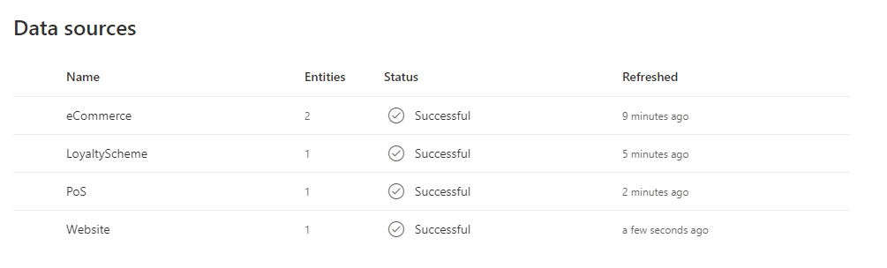

من المفترض أن تتضمن مصادر البيانات الاستعلامات الموضَّحة في لقطة الشاشة التالية.

> [!NOTE]
> إذا سميتَ استعلاماتك تسمية مختلفة، فحينئذٍ ستحتاج إلى إجراء تعديلات أثناء تنقلك عبر المحتوى حيث يفترض هذا المحتوى التسمية المتوفرة في الخطوات أعلاه.

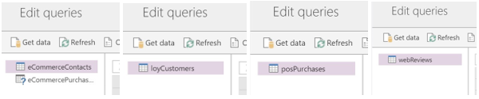

## التمرين 3 - توحيد البيانات

بعد أن استوعبتَ البيانات الأولية من مصادر بياناتك في الكيانات، ستبدأ الآن عملية التعيين والمطابقة والدمج لإنشاء ملف تعريف واحد وموحّد للعميل عن طريق دمج البيانات من كل مصدر لملف تعريف العميل.

لإكمال هذه العملية، عليك أولاً تعيين كياناتك التي تم استيعابها مقابل نموذج قياسي، ثم تحديد **مفتاح أساسي** لكل كيان من كياناتك التي تم إنشاء ملف تعريفي لها. بعد ذلك، عليك إنشاء قاعدة المطابقة الخاصة بك، والتي ستُستخدَم لمطابقة عملاء التجارة الإلكترونية مع عملاء الولاء.

وأخيراً، سيؤدي تشغيل عملية الدمج إلى إنشاء مجموعة واحدة من العملاء الفريدين الذين طابقوا ملفات التعريف من بيانات عملاء التجارة الإلكترونية والولاء باستخدام قواعد المطابقة الخاصة بك.

يتمثل هدفك في معرفة عدد ملفات تعريف العملاء الفريدين التي تمتلكها Contoso Retail عبر بيانات التجارة الإلكترونية والولاء.

### المهمة 1 - تعيين جهات اتصال التجارة الإلكترونية والولاء إلى أنواع البيانات الشائعة

1.  عيّن جهات اتصال بيانات التجارة الإلكترونية والولاء إلى أنواع البيانات الشائعة. وفي القائمة اليسرى، حدد **توحيد.**

1.  ضمن الحقول المصدر، حدد الزر **تحرير**. حدّد الكيانات التي تمثّل ملفات تعريف عملاء **eCommerceContacts** و **loyCustomers** ثم حدّد **تطبيق**.

    > [!div class="mx-imgBorder"]
    > 

1.  ستظهر لك الآن تعيينات كيانك المصدر مقابل أنواع النموذج القياسي. يمكنك مراجعة الأنواع في الجدول. اختر مفتاحًا أساسيًا لكل كيان استوعبتَه. يجب أن يكون المفتاح الأساسي مرجعًا فريدًا. بالنسبة إلى **eCommerceContacts**، حدّد **ContactId** بوصفه المفتاح الأساسي.

    > [!div class="mx-imgBorder"]
    > 

1.  حدِّد **loyCustomers** ضمن **الكيانات** ثم عيّن **LoyaltyID** بوصفه **المفتاح الأساسي**. حدِّد **حفظ** في الزاوية العلوية اليسرى.

    > [!div class="mx-imgBorder"]
    > 

1.  بعد تحديد الحقول المصدر بنجاح، حدد الزر **التالي**.

بعد تحديد زر التالي، سيتم نقلك إلى صفحة السجلات المكررة. هذا هو المكان الذي تقوم فيه بتحديد القواعد التي تريدها لمعالجة السجلات المكررة التي قد توجد في مصادر البيانات الخاصة بك. لا تحتوي مصادر بياناتنا على أي سجلات مكررة، لذا سنقوم بتخطي هذه الخطوة بتحديد الزر **التالي** للانتقال إلى مرحلة **شروط المطابقة**.

### المهمة 2 - تحديد شروط المطابقة

يتعين عليك للمرحلة التالية تحديد ترتيب دمج ملفات التعريف. ستتمكن من دمج السمات لضمان اكتمال ملفات التعريف الموحّدة وأولوية المصادر التي ستُستخدَم لتلك السمات.

1.  وإذا لم تكن قد قمت بذلك بالفعل، فتأكد من أنك في مرحلة شروط المطابقة.

1.  تأكد من تعيين **eCommerceContacts: eCommerce** على أنه الكيان الأول في القائمة وحدد **تضمين كل السجلات** إذا لزم الأمر.

1.  في القائمة المنسدلة **كيان 2**، حدّد **loyCustomers: LoyaltyScheme** ثم حدّد **تضمين كل السجلات**.

    > [!div class="mx-imgBorder"]
    > 

### المهمة 3 - إنشاء قاعدة مطابقة

في هذه الخطوة، عليك إنشاء قاعدة ستُستخدَم لمطابقة السجلات معًا. يمكن أن تتكون القواعد من شرط واحد (استنادًا إلى معرّف مثلاً) أو شروط عدة (الاسم الكامل والرمز البريدي وتاريخ الميلاد مثلاً). في هذا التمرين، عليك إنشاء قاعدة مطابقة استنادًا إلى الاسم الكامل والرمز البريدي والبريد الإلكتروني.

1.  تحت الكيان **loyCustomers: LoyaltyScheme**، حدد الزر **إضافة قاعدة**.

1.  أضفِ شرطك الأول باستخدام **‎FullName**.

1.  بالنسبة إلى الكيان eCommerceContacts، حدِّد **‎FullName** في القائمة المنسدلة **الحقل**.

1.  بالنسبة إلى الكيان loyCustomers، حدِّد **‎FullName** في القائمة المنسدلة **الحقل**.

1.  حدّد القائمة المنسدلة **الضبط** ثم حدِّد **النوع (الهاتف، والاسم)**، والذي سيضبط القيم داخل الحقل **‎FullName**.

1.  عيّن **الدقة** على **أساسي** و **القيمة** على **منخفض**.

    > [!div class="mx-imgBorder"]
    > 

1. أضف شرطًا ثانيًا لعنوان البريد الإلكتروني عن طريق تحديد **+ إضافة**، واختيار **إضافة شرط**.

1.  بالنسبة إلى الكيان eCommerceContacts، حدِّد **البريد الإلكتروني** في القائمة المنسدلة **الحقل**.

1.  بالنسبة إلى الكيان loyCustomers، حدِّد **البريد الإلكتروني** في القائمة المنسدلة **الحقل**.

1.  عيّن **الدقة** على **دقيق**.

    > [!div class="mx-imgBorder"]
    > 

1.  في الحقل **الاسم**، أدخل **FullName، البريد الإلكتروني** للقاعدة الجديدة.

1.  حدد الزر **تم** لحفظ القاعدة.

    تعمل Customer Insights الآن على مطابقة بيانات العملاء من مصدرين لمعلومات العملاء، هما عملاء جهات اتصال التجارة الإلكترونية وعملاء نظام الولاء، لتحديد عدد ملفات تعريف العملاء الفريدة الذي سيكون لديك استنادًا إلى قواعدك.

1.  حدد الزر **التالي** للانتقال إلى مرحلة حقول العملاء الموحّدة.

### المهمة 4 - حقول العملاء الموحّدة

مرحلة حقول العملاء الموحّدة هي المرحلة الأخيرة في عملية توحيد البيانات. ويتمثل الغرض منها في تسوية البيانات المتعارضة وتحديد السمات التي ستُستخدَم في ملف التعريف الموحّد للعميل.

السمة المدمجة هي سمة موجودة في أكثر من مصدر بيانات واحد وتمثل جزء البيانات نفسه. فمثلاً، قد يكون لديك **عنوان البريد الإلكتروني** في كل من مصادر بيانات عملاء الويب وعملاء الولاء.

ستحاول Customer Insights تحديد السمات التي ستُدمج باستخدام تعيينها إلى أنواع البيانات القياسية التي استخدمتَها أثناء مرحلة شروط المطابقة.

1.  وإذا لم تكن هذه السمات موجودة بالفعل، فتأكد من أنك في مرحلة **حقل العميل الموحد**.

    > [!div class="mx-imgBorder"]
    > 

1.  حدّد شارة الرتبة على السمة الظاهرة **FirstName**. من المفترض أن ترى في سمة FirstName أنه قد تم تحديد جهات الاتصال من نفس النوع (مثل FirstName) بوصفها **مدمجة** وأنه قد تم تصنيف Commerce.eCommerceContactsFirstName كرقم واحد. يشير هذا التصنيف إلى أنه عندما يكون لديك ملف تعريف عميل مطابق في كل من الولاء والتجارة الإلكترونية، فإن الاسم الأول المأخوذ من eCommerceContacts سيكون الرئيسي.

1.  نظرًا لأننا لن نقوم بإجراء أي تغييرات على التعيين، حدد الزر التالي للتقدم إلى مرحلة **مراجعة**.

1.  حدد الزر **إنشاء ملفات تعريف العملاء**.

    > [!div class="mx-imgBorder"]
    > 

تهانينا! لقد نجحتَ في استيعاب البيانات وتعيينها ومطابقتها ودمجها من مصادر متعددة داخل Customer Insights لإنشاء ملف تعريف موحّد للعملاء يمكن استخدامه للحصول على رؤى حول قاعدة عملائك بالكامل.
