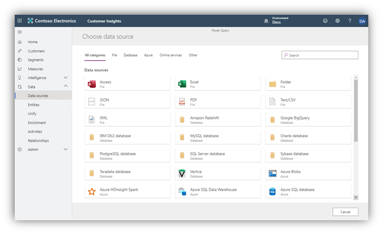

وقع عليك الاختيار لتكون مدير مشروع تنفيذ Dynamics 365 Customer Insights في Coffee Contoso. وبصفتك مدير مشروعات متمرساً، فإنك تضع الخطة التالية:

-   إنشاء إحدى بيئات Customer Insights.

-   استيعاب البيانات من مصادر البيانات ذات الأولوية الأعلى من داخل الشركة:

    -   نقطة البيع (POS)

    -   بيانات الولاء

    -   عملاء التجارة الإلكترونية وعمليات الشراء على الويب

-   تكوين ملف تعريف موحَّد للعملاء من البيانات التي تم استيعابها.

### <a name="learning-objectives"></a>الأهداف التعليمية

ستتمكن في نهاية هذه التمارين من تحقيق الأهداف التالية:

-   التسجيل في إصدار تجريبي من Dynamics 365 Customer Insights.

-   استيعاب مصادر البيانات المنعزلة.

-   اتباع ميزات التعيين والمطابقة والدمج لإنشاء ملف تعريف موحّد.

-   حساب مؤشرات الأداء الرئيسية (KPI) للأعمال والعملاء الرئيسيين.

-   إنشاء شرائح ليستخدمها قسم التسويق.

## <a name="exercise-1---create-a-customer-insights-instance"></a>تمرين 1 - إنشاء مثيل من مثيلات Customer Insights

في هذا التمرين العملي، ستسجّل في مثيل من مثيلات Customer Insights وتراجع جولة العرض الإرشادية للتعرّف على التطبيق.

### <a name="task-1---sign-up-for-a-customer-insights-trial"></a>المهمة 1 - التسجيل في إصدار تجريبي من Customer Insights 

1.  افتح مستعرضاً وانتقل إلى [Dynamics 365 Customer Insights](https://dynamics.microsoft.com/ai/customer-insights/?azure-portal=true).

1.  حدّد **الشروع في العمل**.

1.  حدِّد الارتباط **التسجيل في إصدار تجريبي مجاني** بجوار السؤال *هل تفضِّل الشروع في العمل بنفسك؟*.

1.  في صفحة **الشروع في العمل باستخدام Customer Insights**، سجِّل باستخدام عنوان بريدك الإلكتروني للعمل.

    إذا كنتَ لا تمتلك حق الوصول إلى أحد مستأجري Microsoft 365، يمكنك التسجيل في إصدار تجريبي من Dynamics 365 (والذي سيتضمن أحد مستأجري Microsoft 365)، على النحو الوارد بالتفصيل في المتطلبات الأساسية.

   سيُعاد توجيهك إلى ```https://home.ci.ai.dynamics.com```. *(إذا طُلب منك إنشاء بيئة جديدة، فأدخِل اسماً وحدّد المنطقة التي تريد أن توزع الخدمة فيها.)*

   تهانينا! من المفترض الآن أن تكون مسجلاً الدخول إلى Customer Insights، والتي سيكون لك فيها حق الوصول إلى بيئتين هما: بيئة عرض توضيحي والبيئة التي قد وفرتَها.


### <a name="task-2---familiarize-yourself-with-customer-insights"></a>المهمة 2 - التعرُّف على Customer Insights

ستستكشف في هذه المهمة بيئة العرض التوضيحي المكوَّنة مسبقاً لتتعرف على مركز Customer Insights.

1.  [سجِّل الدخول](https://home.ci.ai.dynamics.com/?azure-portal=true) إلى Customer Insights التي وفّرتَها في المهمة 1.  

1.  في محدِّد **البيئة** في الزاوية العليا اليمنى، حدّد بيئة العرض التوضيحي.

1.  ويمكنك اختيارياً تحديد أي فيديو من مقاطع فيديو **القيام بجولة**.

    

1.  في الصفحة الرئيسية، لاحظ تمييز المحتوى لمفتاح مستخدم **Insights**.

    -   **KPIs** (مقاييس الأعمال) - بما في ذلك **متوسط الإنفاق في مدة البقاء** للعملاء و **متوسط خطر الخسارة**.
    
        
    
    -   **إثراء الجمهور** - يتم سحبه من بيانات Microsoft الخاصة (بما في ذلك Microsoft Bing). يمكنك إثراء ملفات تعريف العملاء وشرائح الجمهور لفتح الصلات للعلامات التجارية وفئات الاهتمام التي قد تكون مشابهة لعملائك من خلال مطابقة البيانات السكانية.
        
        
        
    -   **الشرائح** - يُجمَّع العملاء في مجموعات بناءً على سمات العملاء السكانية أو المتعلقة بالحركات أو السلوكية. يمكنك باستخدام التقسيم استهداف الحملات الترويجية وأنشطة المبيعات وإجراءات دعم العملاء لتحقيق أهداف عملك.
    
        
    
    -   **تحقّق من ذلك** - ارتباطات إلى وثائق Customer Insights وتعليمات تتعلق بالموضوعات الأساسية، مثل استيعاب البيانات وميزات **التعيين والمطابقة والدمج** و **التقسيم**.
    
        

5. استكشف خيارات القائمة اليسرى للتعرف على التنقل.

   

    **الصفحة الرئيسية** - حدِّد هذا الخيار للانتقال إلى الصفحة الرئيسية.

    **العملاء** - عرض البطاقات لملفات تعريف العملاء الموحّدة.

    **الشرائح** - تحديد الشرائح، وهي مجموعات من العملاء تستند إلى سمات سكانية أو متعلقة بالحركات أو سلوكية مشابهة. ويمكنك استخدام الشرائح للتسويق المستهدف باستخدام بيانات منعزلة سابقاً.

    **المقاييس** - تحديد مؤشرات الأداء الرئيسية (KPI) للأعمال والعملاء الرئيسيين، مثل قيمة مدة بقاء العميل، ومتوسط قيمة الشراء وتواتره، ومستوى رضا العميل (CSAT)، وتحديد العملاء ذوي القيمة العالية.

    **الذكاء** - يمكنك هنا إضافة نماذج التعلم الآلي المخصصة من Azure لإجراء تنبؤات تتعلق ببيانات العميل الموحّدة الخاصة بك. 

    **البيانات** - استيعاب البيانات السكانية والمتعلقة بالحركات والسلوكية المنعزلة، ثم تعيين البيانات ومطابقتها ودمجها في ملف تعريف موحّد للعميل. ويمكنك تحديد أنواع الأنشطة وعلاقاتها بعملائك.

    **الإثراء** - يمكنك تخطِّي ملف التعريف الموحّد الخاص بك وإثراء ملفات تعريف العملاء ببيانات Microsoft الخاصة من Microsoft Graph. فتح بيانات تتعلق بصلات لمئات العلامات التجارية وعشرات من فئات الاهتمام. مع العلم بأن هذه الصلات تُستخرج لملفات التعريف التي قد تكون مشابهة لعملائك.

    **المسؤول** - إدارة الأدوار والأذونات ووجهات التصدير لشرائح العملاء.

## <a name="exercise-2---ingest-data-into-customer-insights"></a>تمرين 2 - استيعاب البيانات في Customer Insights

ستتعرف في هذا التمرين على استيعاب البيانات من مصادر متعددة.

سبق أن حدّدتَ بوصفك مديراً للمشروعات في Contoso Retail المصادر الرئيسية للبيانات، بما فيها عملاء التجارة الإلكترونية، وعمليات الشراء عبر الإنترنت، وعمليات الشراء في نقطة البيع داخل المتجر، والبيانات الواردة من نظام بطاقة الولاء في Contoso Retail.

على الرغم من امتلاك Customer Insights لموصلات لأكثر من 30 مصدراً للبيانات وتطبيقاً (بما في ذلك Dynamics 365 وMicrosoft Dataverse)، فإنك ستستخدم الموصل *نص/CSV* في هذا التمرين العملي.

### <a name="data-sources"></a>مصادر البيانات

| العنصر               | الوصف                                                                      | التنسيق   | عنوان URL  |
|--------------------|----------------------------------------------------------------------------------|----------|------|
| جهات اتصال التجارة الإلكترونية | مقتطف من العملاء الذين أجروا عملية شراء عبر الإنترنت                            | نص/CSV | [الارتباط](https://ciaddata.blob.core.windows.net/ciad-sample-data/Contact.txt) |
| نظام الولاء     | مقتطف للعملاء الذين سجّلوا في نظام بطاقة الولاء من Retail Contoso | نص/CSV | [الارتباط](https://ciaddata.blob.core.windows.net/ciad-sample-data/Customer-Loyalty.txt) |
| عمليات الشراء عبر الإنترنت   | مقتطف لعمليات الشراء التي جرت من خلال موقع ويب Retail Contoso                         | نص/CSV | [الارتباط](https://ciaddata.blob.core.windows.net/ciad-sample-data/OnlinePurchases.txt) |
| عمليات الشراء في نقطة البيع      | مقتطف لتفاصيل عملية الشراء داخل المتجر                                              | نص/CSV | [الارتباط](https://ciaddata.blob.core.windows.net/ciad-sample-data/POSPurchases.txt) |
| مراجعات موقع الويب    | مراجعات العملاء لموقع الويب على الإنترنت                                            | نص/CSV | [الارتباط](https://ciaddata.blob.core.windows.net/ciad-sample-data/WebsiteReviews.txt) |

### <a name="task-1---ingest-customer-data-from-an-e-commerce-platform"></a>المهمة 1 - استيعاب بيانات العملاء من نظام أساسي للتجارة الإلكترونية

1.  سجِّل الدخول إلى Customer Insights وحدِّد **البيئة** الخاصة بك من القائمة المنسدلة في الزاوية العلوية اليمنى. وأنشئ بيئة جديدة إذا طُلب منك ذلك.

1.  داخل Customer Insights، عليك توسيع **البيانات** في القائمة اليسرى ثم تحديد **مصادر البيانات**.

1. حدِّد **إضافة مصدر بيانات**.

    [ ](../media/ci-07-08.png#lightbox)

1.  قم بتسمية المصدر **التجارة الإلكترونية**، ثم حدِّد الزر **التالي**.

1.  سيظهر لك عرض لموصلات مصدر البيانات التي يمكن لـ Customer Insights استيعابها. لاحِظ أنواع الموصلات المتوفرة، بما في ذلك Dataverse. حدِّد الموصل **نص/CSV**.

    

1.  أدخِل عنوان URL لـ Azure BLOB باسم [https://ciaddata.blob.core.windows.net/ciad-sample-data/Contact.txt](https://ciaddata.blob.core.windows.net/ciad-sample-data/Contact.txt) ثم حدِّد **التالي**. (يمكنك العثور على عنوان URL في الجدول ضمن مقدمة هذا التمرين العملي.)

    

1. ستظهر لك الآن الشاشة **معاينة بيانات الملف**.  يمكنك هنا تغيير نوع المحدِّد أو نوع أصل الملف أو البيانات المُستخدَمة للكشف عن نوع البيانات. يمكنك ببساطة تحديد الزر **تحويل البيانات**
 
1. من المفترض أن ترى الآن جدولة البيانات من المصدر. وبإمكانك الآن تكوين أنواع البيانات والتنسيقات للبيانات التي تستوعبها. 
    لاحِظ ظهور عنوان العمود في الصف الأول من البيانات. لتصحيح هذه المشكلة، حدِّد **تحويل الجدول** ثم حدِّد **‏‏استخدام الصف الأول كعناوين**.

    

1.  عُينت كل الأعمدة افتراضياً على نوع البيانات "نص" نظراً لأنك استوعبتَ بيانات من مصدر بتنسيق نص/CSV. لاستيعاب للبيانات ونمذجتها بنجاح، يمكنك تعيين نوع البيانات للأعمدة غير النصية.

    

    حدِّد الرمز **ABC** داخل عنوان العمود لتغيير نوع البيانات.
    
    حدِّث نوع البيانات للأعمدة المُدرجة في الجدول التالي.
    
    |  عنوان العمود | نوع بيانات جديد  |
    |----------------|----------------|
    |  تاريخ الميلاد    | التاريخ والوقت       |
    |  تم الإنشاء في      | التاريخ/الوقت/المنطقة |

1.  في حقل **الاسم** على الجزء الأيمن، أعِد تسمية مصدر بياناتك من **استعلام** إلى **eCommerceContacts**.

    

تهانينا! لقد نجحتَ الآن في استيعاب أول مصدر بيانات لك في Customer Insights.

>[!NOTE]
> هناك أمر واحد يجب أن تكون على علم به وهو أن أسماء الأعمدة لا يمكن أن تتضمن إلا الأحرف والأرقام وعلامات التسطير السفلي.  ولا يمكن أن تحتوي على مسافة ويجب أن تبدأ بحرف. إذا كانت لديك بيانات يتضمن فيها اسم العمود (أسماء الأعمدة) مسافة أو لا تبدأ بحرف، فستحتاج إلى إصلاح ذلك إما داخل Power Query أو قبل جلب البيانات إلى Customer Insights.

### <a name="task-2---ingest-online-purchase-data"></a>المهمة 2 - استيعاب بيانات عملية الشراء عبر الإنترنت

في هذه المهمة التالية، ستستوعب بيانات عملية الشراء عبر الإنترنت، والتي تمثل عمليات الشراء التي أُجريت من خلال موقع الويب لشركة Coffee Contoso.

1.  داخل Customer Insights، عليك توسيع **البيانات** في القائمة اليسرى ثم تحديد **مصادر البيانات**.

1.  من المفترض أن ترى مصدر بيانات **التجارة الإلكترونية** الخاص بك. ضمن **الإجراءات**، حدِّد النقاط العمودية الثلاث، ثم حدِّد **تحرير**.

    

1.  من المفترض أن يظهر لك عرض بيانات eCommerceContacts التي استوعبتها في المهمة 1. في قائمة الإجراء، حدِّد **الحصول على البيانات**.

    

1.  سيظهر لك عرض لموصلات مصدر البيانات التي يمكن أن تستوعبها Customer Insights كما فعلتَ في المهمة 1. حدِّد الموصل **نص/CSV**.

1.  أدخِل عنوان URL لبيانات [https://ciaddata.blob.core.windows.net/ciad-sample-data/OnlinePurchases.txt](https://ciaddata.blob.core.windows.net/ciad-sample-data/OnlinePurchases.txt) ثم حدّد **التالي**. (يمكنك العثور على عنوان URL في الجدول ضمن مقدمة هذا التمرين العملي.)

1. ستظهر لك الآن الشاشة **معاينة بيانات الملف**.  يمكنك هنا تغيير نوع المحدِّد أو نوع أصل الملف أو البيانات المُستخدَمة للكشف عن نوع البيانات. يمكنك ببساطة النقر فوق الزر موافق

1. حدِّد **تحويل الجدول** ثم حدّد **استخدام الصف الأول كعناوين**.

    

    حدِّث أنواع البيانات للأعمدة في الجدول التالي.
    
    |  عنوان العمود | نوع بيانات جديد  |
    |----------------|----------------|
    |  تم الشراء في    | التاريخ/الوقت/المنطقة |
    |  السعر الإجمالي     | العملة       |

1.  قم بتسمية استعلامك **eCommercePurchases** ثم حدِّد **إنشاء**.

### <a name="task-3---ingest-customer-data-from-loyalty-scheme-point-of-sale-purchases-and-website-reviews"></a>المهمة 3 - استيعاب بيانات العملاء من نظام الولاء، وعمليات الشراء في نقطة البيع، ومراجعات موقع الويب

1. داخل Customer Insights، عليك توسيع **البيانات** في القائمة اليسرى ثم حدّد **مصادر البيانات**.
 
1. حدِّد **إضافة مصدر بيانات**.

1. قم بتسمية المصدر **‎LoyaltyScheme** ثم حدّد الزر **التالي**.

1. سيظهر لك عرض لموصلات مصدر البيانات التي يمكن لـ Customer Insights استيعابها. دوّن أنواع الموصلات المتوفرة. حدِّد الموصل **نص/CSV**.


1. أدخِل عنوان URL لـ [جهات اتصال الولاء](https://ciaddata.blob.core.windows.net/ciad-sample-data/Customer-Loyalty.txt) ثم حدّد **التالي**.

1. ستظهر لك الآن الشاشة **معاينة بيانات الملف**.  يمكنك هنا تغيير نوع المحدِّد أو نوع أصل الملف أو البيانات المُستخدَمة للكشف عن نوع البيانات. يمكنك ببساطة النقر فوق الزر **تحويل البيانات**.

1. من المفترض أن ترى الآن جدولة البيانات من المصدر. وبإمكانك هنا تكوين أنواع البيانات والتنسيقات للبيانات التي تستوعبها. 

1. ستلاحظ ظهور عنوان العمود في الصف الأول من البيانات. لتصحيح ذلك، حدِّد **تحويل** ثم حدِّد **‏‏استخدام الصف الأول كعناوين**.

1. عُينت كل الأعمدة افتراضياً على نوع البيانات "نص" نظراً لأننا استوعبنا بيانات من مصدر بتنسيق نص/CSV. لإجراء عملية استيعاب البيانات ونمذجتها بنجاح، يمكننا تعيين نوع البيانات للأعمدة غير النصية. 

   انقر فوق الرمز **ABC** داخل عنوان العمود لتغيير نوع البيانات.  وحدِّث نوع البيانات للأعمدة المُدرجة أدناه. 

   استخدِم الصف الأول كعناوين أعمدة.

   |  عنوان العمود | نوع بيانات جديد  |
   |----------------|----------------|
   |  تاريخ الميلاد    | التاريخ/الوقت      |
   |  نقاط المكافآت   | عدد صحيح   |
   |  تم الإنشاء في      | التاريخ/الوقت/المنطقة |

1.  في حقل **الاسم** على الجزء الأيمن، أعِد تسمية مصدر بياناتك من **استعلام** إلى **loyCustomers** ثم حدّد **حفظ**.


### <a name="task-4---ingest-customer-data"></a>المهمة 4 - استيعاب بيانات العملاء 

1. داخل Customer Insights، عليك توسيع **البيانات** في القائمة اليسرى ثم حدّد **مصادر البيانات**.

1. حدِّد **إضافة مصدر بيانات**.

1. قم بتسمية المصدر **PoS** ثم حدّد **التالي**.

1. سيظهر لك عرض لموصلات مصدر البيانات التي يمكن لـ Customer Insights استيعابها. دوّن أنواع الموصلات المتوفرة. حدِّد الموصل **نص/CSV**.

1. أدخل عنوان URL لعمليات الشراء في PoS [https://ciaddata.blob.core.windows.net/ciad-sample-data/POSPurchases.txt](https://ciaddata.blob.core.windows.net/ciad-sample-data/POSPurchases.txt).

1. ستظهر لك الآن الشاشة **معاينة بيانات الملف**.  يمكنك هنا تغيير نوع المحدِّد أو نوع أصل الملف أو البيانات المُستخدَمة للكشف عن نوع البيانات. يمكنك ببساطة النقر فوق الزر **تحويل البيانات**.

1. من المفترض أن ترى الآن جدولة البيانات من المصدر. وبإمكانك هنا تكوين أنواع البيانات والتنسيقات للبيانات التي تستوعبها. 

1. ستلاحظ ظهور عنوان العمود في الصف الأول من البيانات. لتصحيح ذلك، حدِّد **تحويل** ثم حدِّد **‏‏استخدام الصف الأول كعناوين**.

1. عُينت كل الأعمدة افتراضياً على نوع البيانات "نص" نظراً لأننا استوعبنا بيانات من مصدر بتنسيق نص/CSV. لإجراء عملية استيعاب البيانات ونمذجتها بنجاح، يمكننا تعيين نوع البيانات للأعمدة غير النصية. 

   انقر فوق الرمز **ABC** داخل عنوان العمود لتغيير نوع البيانات.  وحدِّث نوع البيانات للأعمدة المُدرجة أدناه. 

   استخدِم الصف الأول كعناوين أعمدة.

   |  عنوان العمود    | نوع بيانات جديد  |
   |-------------------|----------------|
   |  تم الشراء في       | التاريخ/الوقت/المنطقة |
   |  السعر الإجمالي        | العملة       |
   |  نقاط المكافآت المضافة | عدد صحيح    |

1. في حقل **الاسم** على الجزء الأيمن، أعِد تسمية مصدر بياناتك من **استعلام** إلى **posPurchases** ثم حدّد **حفظ**.

### <a name="task-5--ingest-customer-data-from-website-reviews"></a>المهمة 5 - استيعاب بيانات العملاء من مراجعات موقع الويب

1. داخل Customer Insights، عليك توسيع **البيانات** في القائمة اليسرى ثم حدّد **مصادر البيانات**.

1. حدِّد **إضافة مصدر بيانات**.

1. قم بتسمية المصدر **PoS** ثم حدّد **التالي**.

1. سيظهر لك عرض لموصلات مصدر البيانات التي يمكن لـ Customer Insights استيعابها. دوّن أنواع الموصلات المتوفرة. حدِّد الموصل **نص/CSV**.

1.  أدخِل عنوان URL لـ [مراجعات موقع الويب](https://ciaddata.blob.core.windows.net/ciad-sample-data/WebsiteReviews.txt) ثم حدِّد **التالي**.

1. ستظهر لك الآن الشاشة **معاينة بيانات الملف**.  يمكنك هنا تغيير نوع المحدِّد أو نوع أصل الملف أو البيانات المُستخدَمة للكشف عن نوع البيانات. يمكنك ببساطة النقر فوق الزر **تحويل البيانات**.

1. من المفترض أن ترى الآن جدولة البيانات من المصدر. وبإمكانك هنا تكوين أنواع البيانات والتنسيقات للبيانات التي تستوعبها. 

1. ستلاحظ ظهور عنوان العمود في الصف الأول من البيانات. لتصحيح ذلك، حدِّد **تحويل** ثم حدِّد **‏‏استخدام الصف الأول كعناوين**.

1. عُينت كل الأعمدة افتراضياً على نوع البيانات "نص" نظراً لأننا استوعبنا بيانات من مصدر بتنسيق نص/CSV. لإجراء عملية استيعاب البيانات ونمذجتها بنجاح، يمكننا تعيين نوع البيانات للأعمدة غير النصية. 

   انقر فوق الرمز **ABC** داخل عنوان العمود لتغيير نوع البيانات.  وحدِّث نوع البيانات للأعمدة المُدرجة أدناه. 

   استخدِم الصف الأول كعناوين أعمدة.

   |  عنوان العمود | نوع بيانات جديد  |
   |----------------|----------------|
   |  مراجعة التقييم   | عدد صحيح   |
   |  تاريخ المراجعة     | التاريخ/الوقت/المنطقة |

1. في حقل **الاسم** على الجزء الأيمن، أعِد تسمية مصدر بياناتك من **استعلام** إلى **webReviews** وحدّد **حفظ**. 

بعد استيعاب جميع المصادر، من المفترض أن يكون لديك أربعة مصادر للبيانات، كما هو موضَّح في الشكل التالي.


من المفترض أن تتضمن مصادر البيانات الاستعلامات الموضَّحة في لقطة الشاشة التالية.

>[!NOTE]
> إذا سميتَ استعلاماتك تسمية مختلفة، فحينئذٍ ستحتاج إلى إجراء تعديلات أثناء تنقلك عبر المحتوى حيث يفترض هذا المحتوى التسمية المتوفرة في الخطوات أعلاه.


## <a name="exercise-3---data-unification"></a>التمرين 3 - توحيد البيانات

بعد أن استوعبتَ البيانات الأولية من مصادر بياناتك في الكيانات، ستبدأ الآن عملية التعيين والمطابقة والدمج لإنشاء ملف تعريف لعميل واحد وموحّد عن طريق دمج البيانات من كل مصدر لملف تعريف العميل.

لإكمال هذه العملية، عليك أولاً تعيين كياناتك التي تم استيعابها مقابل نموذج قياسي، ثم تحديد **مفتاح أساسي** لكل كيان من كياناتك التي تم إنشاء ملف تعريفي لها. بعد ذلك، عليك إنشاء قاعدة المطابقة الخاصة بك، والتي ستُستخدَم لمطابقة عملاء التجارة الإلكترونية مع عملاء الولاء.

وأخيراً، سيؤدي تشغيل عملية الدمج إلى إنشاء مجموعة واحدة من العملاء الفريدين الذين طابقوا ملفات التعريف من بيانات عملاء التجارة الإلكترونية والولاء باستخدام قواعد المطابقة الخاصة بك.

يتمثل هدفك في معرفة عدد ملفات تعريف العملاء الفريدين التي تمتلكها Retail Contoso عبر بيانات التجارة الإلكترونية والولاء.

### <a name="task-1---map-e-commerce-and-loyalty-contacts-to-common-data-types"></a>المهمة 1 - تعيين جهات اتصال التجارة الإلكترونية والولاء إلى أنواع البيانات الشائعة 

1.  عيّن جهات اتصال بيانات التجارة الإلكترونية والولاء إلى أنواع البيانات الشائعة. في القائمة اليسرى، حدِّد **توحيد > تعيين > تحديد الكيانات**. حدّد الكيانات التي تمثّل ملفات تعريف عملاء **eCommerceContacts** و **loyCustomers** ثم حدّد **تطبيق**.

    

1.  سيظهر لك الآن تعيينات كيانك المصدر مقابل أنواع النموذج القياسي. يمكنك مراجعة الأنواع في الجدول. اختر مفتاحاً أساسياً لكل كيان استوعبتَه. يجب أن يكون المفتاح الأساسي مرجعاً فريداً. بالنسبة إلى **eCommerceContacts**، حدّد **ContactId** بوصفه المفتاح الأساسي.

    

1. تحتوي بيانات **eCommerceContacts** لدينا على عمود باسم **لقطة رأس تتضمن عنوان URL يؤدي إلى صورة جهات الاتصال.  يمكننا استخدام هذا لملء الصورة على بطاقات العملاء لدينا عن طريق تضمينها وتعيينها إلى كيان/نوع CDM المناسب. مرّر لأسفل إلى الحقل **لقطة الرأس**. 

    

1. لإنهاء إعداد **لقطة الرأس**، ستحتاج إلى تحرير النوع إذا لم يكن قد عُيِّن بالفعل. النوع الذي نريده هو **Person.ProfileImage**، وإذا لم يكن في القائمة المنسدلة، فاكتبه ببساطة في المربع. 

1. حدِّد **loyCustomers** ضمن **الكيانات** ثم عيّن **LoyaltyID** بوصفه **المفتاح الأساسي**. حدِّد **حفظ** في الزاوية العلوية اليسرى.

    

1.  حدّد **مطابقة**.

   

### <a name="task-2---specify-match-order"></a>المهمة 2 - تحديد ترتيب المطابقة

يتعين عليك للمرحلة التالية تحديد ترتيب دمج ملفات التعريف. ستتمكن من دمج السمات لضمان اكتمال ملفات التعريف الموحّدة وأولوية المصادر التي ستُستخدَم لتلك السمات.

1.  إذا لم تكن قد فعلت ذلك بالفعل، فحدّد **مطابقة** من القائمة العلوية على الصفحة.

1.  حدِّد مصدر ملف التعريف الأكثر اكتمالاً أو دقة بوصفه المصدر الأساسي. حدِّد **تعيين ترتيب**.

1.  في القائمة المنسدلة **الرئيسية**، حدِّد **eCommerceContacts: eCommerce** بوصفها المصدر الرئيسي ثم حدِّد **تضمين كل السجلات**.

1.  في القائمة المنسدلة **كيان 2**، حدّد **loyCustomers: LoyaltyScheme** ثم حدّد **تضمين كل السجلات**.

    

1.  حدِّد **تم**.

### <a name="task-3---create-a-match-rule"></a>المهمة 3 - إنشاء قاعدة مطابقة

في هذه الخطوة، عليك إنشاء قاعدة ستُستخدَم لمطابقة السجلات معاً. يمكن أن تتكون القواعد من شرط واحد (استناداً إلى معرّف مثلاً) أو شروط عدة (الاسم الكامل والرمز البريدي وتاريخ الميلاد مثلاً). في هذا التمرين، عليك إنشاء قاعدة مطابقة استناداً إلى الاسم الكامل والرمز البريدي والبريد الإلكتروني.

1.  حدِّد **إنشاء قاعدة جديدة**.

    

1.  أدخِل الاسم **‎FullName والبريد الإلكتروني** للقاعدة الجديدة.

1.  أضفِ شرطك الأول باستخدام **‎FullName**.

    -   بالنسبة إلى الكيان eCommerceContacts، حدِّد **‎FullName** في القائمة المنسدلة **الحقل**.
    
    -   بالنسبة إلى الكيان loyCustomers، حدِّد **‎FullName** في القائمة المنسدلة **الحقل**.
    
    -   عيّن **الدقة** على **أساسي** و **القيمة** على **عالٍ**.
    
    -   حدّد القائمة المنسدلة **الضبط** ثم حدِّد **النوع (الهاتف، والاسم)**، والذي سيضبط القيم داخل الحقل **‎FullName**.

    

1.  أضف شرطاً ثانياً لعنوان البريد الإلكتروني عن طريق تحديد **+ إضافة شرط**.

    -   بالنسبة إلى الكيان eCommerceContacts، حدِّد **البريد الإلكتروني** في القائمة المنسدلة **الحقل**.
    
    -   بالنسبة إلى الكيان loyCustomers، حدِّد **البريد الإلكتروني** في القائمة المنسدلة **الحقل**.
    
    -   عيّن **الدقة** على **عالٍ**.

1. أدخِل الاسم ‎FullName، والبريد الإلكتروني للقاعدة الجديدة.

1. أضف شرطاً ثانياً لعنوان البريد الإلكتروني عن طريق تحديد **إضافة شرط**.
   - بالنسبة إلى الكيان eCommerceContacts، حدِّد **البريد الإلكتروني** في القائمة المنسدلة "الحقل".
   - بالنسبة إلى الكيان loyCustomers، حدِّد **البريد الإلكتروني** في القائمة المنسدلة "الحقل".
   - اترك "الضبط" فارغاً
   - عيِّن مستوى الدقة على **أساسي** والقيمة على **عالٍ**

    > [!NOTE]
    > القيمة "تام" الموجودة على الجانب الأيمن من المقياس، سوف تطابق السجلات التي يكون لشرطك فيها تطابق تامّ. حدِّد أحد المستويات الأخرى لمطابقة السجلات غير المتطابقة بنسبة 100%. القيمة "عالٍ" تلائم الحالات التي تكون فيها الدقة أكثر أهمية من الوصول، مثل خدمة مالية لعميل معيّن. القيمة "منخفض" تلائم الحالات التي يكون فيها العكس هو الصحيح، مثل حملة تسويقية. يعمل المستوى المتوسط بمثابة خيار وسط.


1.  في الزاوية العلوية اليمنى، حدِّد **حفظ** ثم حدِّد **تشغيل**.

تعمل Customer Insights الآن على مطابقة بيانات العملاء من مصدرين لمعلومات العملاء، هما عملاء جهات اتصال التجارة الإلكترونية وعملاء نظام الولاء، لتحديد عدد ملفات تعريف العملاء الفريدة الذي سيكون لديك استناداً إلى قواعدك.

### <a name="task-4---precision"></a>المهمة 4 - الدقة

في المهمة 3، عيّنتَ **الدقة** إلى **عالٍ** في قاعدة المطابقة مقابل **‎FullName**. في هذه المهمة، عليك ضبط مستوى الدقة لإنشاء عدد أكبر من التطابقات عن طريق تضمين تطابقات الثقة الأدنى (مما يؤدي إلى انخفاض عدد ملفات التعريف الفريدة).


1.  قم بتوسيع قاعدتك وحدِّد أيقونة القلم الرصاص لتحرير قاعدة المطابقة.

1.  حرِّك شريط تمرير **الدقة** لمطابقة **‎FullName** من **عالٍ** إلى **منخفض**. حدِّد **تم**.

1.  حدِّد **حفظ** ثم **تشغيل**.

1.  عند اكتمال عملية المطابقة، حدِّد الأيقونة لعرض **معاينة مطابقة** لنتائج المطابقة و **درجة الثقة** التي تشير إلى مدى تطابق Customer Insights معينة مع النتائج استناداً إلى القواعد التي حدّدتَها. ستلاحظ أنه تم إنشاء بعض الملفات مع انخفاض الثقة في المطابقة.

    

1.  أغلِق المعاينة وانقر فوق أيقونة القلم الرصاص لتحرير قاعدة المطابقة. انقر فوق الزر **معاينة** أدنى قاعدة البريد الإلكتروني.
    
1. يمكنك هنا معاينة العدد غير المطابق والمطابق لمعايير اسمك الكامل. تُظهر لقطة الشاشة هذه أنه كان هناك 57 غير مطابق و4945 مطابقاً. 

   > [!NOTE]
   > قد يختلف العدد إذا تغيرت مصادر البيانات الأساسية منذ إنشاء المستندات أو إذا كانت الدقة لديك معيَّنة بشكل مختلف.

1. حدّد **معاينة البيانات** ضمن **غير مطابق** أو **مطابق** لمعاينة التطابقات. لاحِظ كيف تستخدم الثقة العالية نفس الهجاء ولكن يمكن أن تتطابق حتى لو كان تنسيق الاسم (الاسم الأول، اسم العائلة / اسم العائلة، الاسم الأول) مختلفاً. مع الثقة المنخفضة، لاحِظ كيف تُجرَى التطابقات حتى عندما لا تتم تهجئة الأسماء بشكل متطابق.

    

1.  أغلِق صفحة **معاينة المعايير**. لاحِظ عدد ملفات تعريف العملاء الفريدة الذي لديك الآن.

### <a name="task-5---merge"></a>المهمة 5: الدمج

مرحلة الدمج هي آخر مرحلة في عملية توحيد البيانات. ويتمثل الغرض منها في تسوية البيانات المتعارضة وتحديد السمات التي ستُستخدَم في ملف التعريف الموحّد للعميل.

السمة المدمجة هي سمة موجودة في أكثر من مصدر بيانات واحد وتمثل جزء البيانات نفسه. فمثلاً، قد يكون لديك **عنوان البريد الإلكتروني** في كل من مصادر بيانات عملاء الويب وعملاء الولاء.

ستحاول Customer Insights تحديد السمات التي ستُدمج باستخدام تعيينها إلى أنواع البيانات القياسية التي استخدمتَها أثناء مرحلة التعيين.

من الشاشة **مطابقة**، حدِّد **عودة إلى التوحيد** للرجوع إلى الشاشة **تعيين > مطابقة > دمج**.


1.  حدّد الخيار **دمج** والذي سينقلك إلى الشاشة **دمج**. تم تحديد السمات من كل من ولاء العملاء وجهات اتصال التجارة الإلكترونية من نفس النوع (FirstName مثلاً) كـ **مدمجة**. 

    

1.  حدّد شارة الرتبة على السمة الظاهرة **FirstName**. من المفترض أن ترى في سمة FirstName أنه قد تم تحديد جهات الاتصال من نفس النوع (مثل FirstName) بوصفها **مدمجة** وأنه قد تم تصنيف Commerce.eCommerceContactsFirstName كرقم واحد. يشير هذا التصنيف إلى أنه عندما يكون لديك ملف تعريف عميل مطابق في كل من الولاء والتجارة الإلكترونية، فإن الاسم الأول المأخوذ من eCommerceContacts سيكون الرئيسي.

1.  حدد الزر الموجود في الصف للسمة المدمجة FirstName ثم حدِّد **تحرير**. يمكنك تغيير اسم العرض وترتيب الأهمية للسمة المدمجة. **اسم العرض** هو الاسم الذي سيُستخدم في ملف التعريف المدمج.

    

    

1. حدِّد **إلغاء**.

1.  لا يمكن دمج المفاتيح الأساسية من المصادر الأصلية، فمثلاً إذا كان لديك **ContactId** كمفتاح أساسي من eCommerceContacts، ولكن لديك أيضاً **ContactId** من بيانات عملاء نظام الولاء.

    يمكنك استبعاد ContactId من بيانات الولاء من ملف التعريف الموحّد نظراً لأن هذه المصادر تمثّل عنصر البيانات نفسه.

    على **ContactId** للكيان **loyCustomers**، حدِّد الزر **تحرير** لإعادة تسمية اسم العرض إلى ContactIdLOYALTY لتمييز العنصر من المعرّفات الأخرى التي تم استيعابها.

1.  حدِّد **حفظ** و **تشغيل** لبدء عملية الدمج.

تهانينا! لقد نجحتَ في استيعاب البيانات وتعيينها ومطابقتها ودمجها من مصادر متعددة داخل Customer Insights لإنشاء ملف تعريف موحّد للعملاء يمكن استخدامه للحصول على رؤى حول قاعدة عملائك بالكامل.