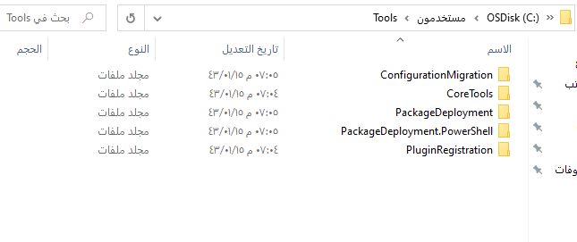
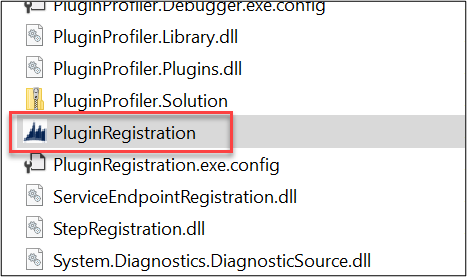
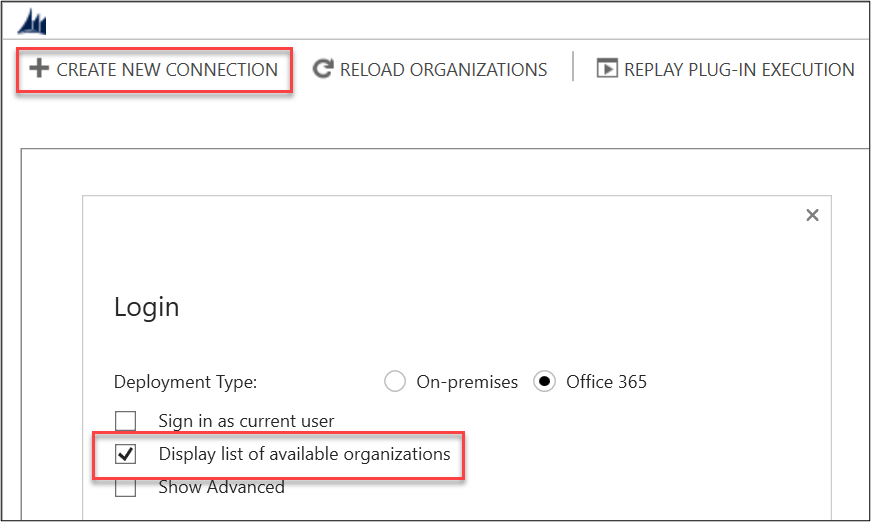
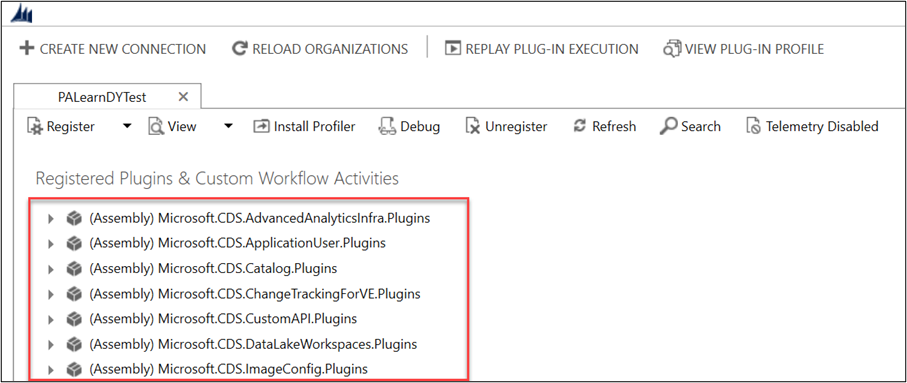
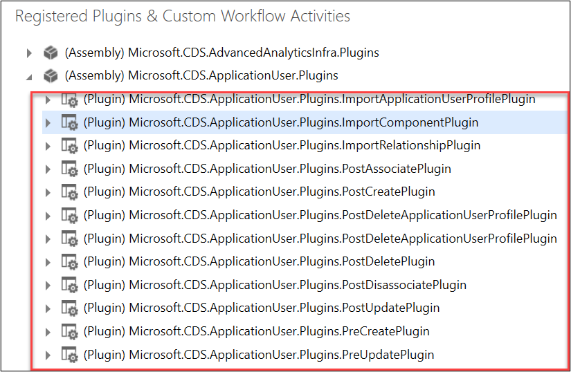
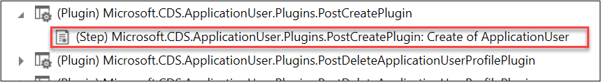
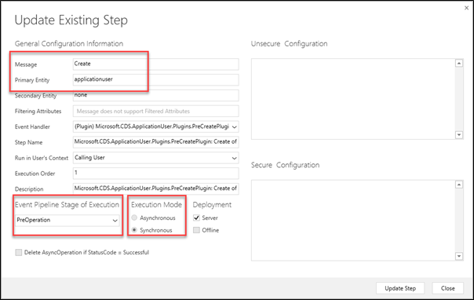

في هذا التمرين، ستقوم بتثبيت بعض أدوات المطور من NuGet.

> [!IMPORTANT]
> استخدام بيئة اختبار مع توفير Microsoft Dataverse. وإذا لم يتوفر لديك، يمكنك الاشتراك في خطة المجتمع [هنا](https://powerapps.microsoft.com/communityplan/?azure-portal=true).

## <a name="task-1-install-developer-tools"></a>المهمة 1: تثبيت أدوات المطور

في هذه المهمة، ستستخدم برنامج PowerShell نصي لتثبيت أدوات من NuGet.

1.  وفي قائمة "بدء تشغيل Windows، اكتب **Windows PowerShell** وافتحه.

1.  انتقل إلى المجلد الذي تريد تثبيت الأدوات إليه. على سبيل المثال، إذا كنت تريد تثبيتها في المجلد devtools على محرك الأقراص C لديك، فاكتب **md C:\devtools** لإنشاء هذا المجلد إذا لم يكن موجوداً.

1.  قم بتغيير الدليل إلى هذا المكان عن طريق كتابة cd **C:\devtools** والضغط على Enter.

1.  انسخ البرنامج النصي PowerShell الآتي والصقه في نافذة PowerShell واضغط على Enter.

    ```powershell
    [Net.ServicePointManager]::SecurityProtocol = [Net.SecurityProtocolType]::Tls12
    $sourceNugetExe = "https://dist.nuget.org/win-x86-commandline/latest/nuget.exe"
    $targetNugetExe = ".\nuget.exe"
    Remove-Item .\Tools -Force -Recurse -ErrorAction Ignore
    Invoke-WebRequest $sourceNugetExe -OutFile $targetNugetExe
    Set-Alias nuget $targetNugetExe -Scope Global -Verbose
    
    ##
    ##Download Plugin Registration Tool
    ##
    ./nuget install Microsoft.CrmSdk.XrmTooling.PluginRegistrationTool -O .\Tools
    md .\Tools\PluginRegistration
    $prtFolder = Get-ChildItem ./Tools | Where-Object {$_.Name -match 'Microsoft.CrmSdk.XrmTooling.PluginRegistrationTool.'}
    move .\Tools\$prtFolder\tools\*.* .\Tools\PluginRegistration
    Remove-Item .\Tools\$prtFolder -Force -Recurse
    
    ##
    ##Download CoreTools
    ##
    ./nuget install  Microsoft.CrmSdk.CoreTools -O .\Tools
    md .\Tools\CoreTools
    $coreToolsFolder = Get-ChildItem ./Tools | Where-Object {$_.Name -match 'Microsoft.CrmSdk.CoreTools.'}
    move .\Tools\$coreToolsFolder\content\bin\coretools\*.* .\Tools\CoreTools
    Remove-Item .\Tools\$coreToolsFolder -Force -Recurse
    
    ##
    ##Download Configuration Migration
    ##
    ./nuget install  Microsoft.CrmSdk.XrmTooling.ConfigurationMigration.Wpf -O .\Tools
    md .\Tools\ConfigurationMigration
    $configMigFolder = Get-ChildItem ./Tools | Where-Object {$_.Name -match 'Microsoft.CrmSdk.XrmTooling.ConfigurationMigration.Wpf.'}
    move .\Tools\$configMigFolder\tools\*.* .\Tools\ConfigurationMigration
    Remove-Item .\Tools\$configMigFolder -Force -Recurse
    
    ##
    ##Download Package Deployer 
    ##
    ./nuget install  Microsoft.CrmSdk.XrmTooling.PackageDeployment.WPF -O .\Tools
    md .\Tools\PackageDeployment
    $pdFolder = Get-ChildItem ./Tools | Where-Object {$_.Name -match 'Microsoft.CrmSdk.XrmTooling.PackageDeployment.Wpf.'}
    move .\Tools\$pdFolder\tools\*.* .\Tools\PackageDeployment
    Remove-Item .\Tools\$pdFolder -Force -Recurse
    
    ##
    ##Download Package Deployer PowerShell module
    ##
    ./nuget install Microsoft.CrmSdk.XrmTooling.PackageDeployment.PowerShell -O .\Tools
    $pdPoshFolder = Get-ChildItem ./Tools | Where-Object {$_.Name -match 'Microsoft.CrmSdk.XrmTooling.PackageDeployment.PowerShell.'}
    move .\Tools\$pdPoshFolder\tools\*.* .\Tools\PackageDeployment.PowerShell
    Remove-Item .\Tools\$pdPoshFolder -Force -Recurse
    
    ##
    ##Remove NuGet.exe
    ##
    Remove-Item nuget.exe
    ```

1.  بعد انتهاء البرنامج النصي من التنفيذ، اكتب **Explorer**، كلمة **Explorer** متبوعة بمسافة ونقطة، واضغط على Enter.

1.  من المفترض أن يظهر مجلداً واحداً بالاسم **Tools**، فانقر نقراً مزدوجاً فوق **Tools**.

1.  ويجب أن ترى الآن المجلدات الخمسة الآتية للأدوات المثبتة:

    > [!div class="mx-imgBorder"]
    > [](../media/exercise-1-1.png#lightbox)

## <a name="task-2-explore-a-registered-plug-in-with-the-plug-in-registration-tool"></a>المهمة 2: استكشاف مكون إضافي مسجل باستخدام أداة تسجيل المكونات الإضافية

1.  انتقل إلى المجلد **PluginRegistration**.

1.  حدد موقع PluginRegistration.exe في القائمة وانقر نقراً مزدوجاً فوقها للبدء.

    > [!div class="mx-imgBorder"]
    > [](../media/exercise-1-2.png#lightbox)

1.  انقر فوق **إنشاء اتصال جديد.**

1.  تحقق من **عرض قائمة بالمؤسسات المتاحة**.

    > [!div class="mx-imgBorder"]
    > [](../media/exercise-1-3.png#lightbox)

1.  انقر فوق **تسجيل الدخول** وسجِّل الدخول باستخدام بيانات اعتماد بيئة Dataverse عند المطالبة بذلك.

1.  في قائمة المؤسسات (البيئات)، اختر بيئة الاختبار الخاصة بك.

1.  سترى قائمة من المكونات الإضافية للنظام، وإذا قمت بذلك في بيئة باستخدام المكونات الإضافية المخصصة، فستراها في القائمة كذلك. (التجميع) هو ‎.NET DLLs التي تقوم بتطبيق المكونات الإضافية.

    > [!div class="mx-imgBorder"]
    > [](../media/exercise-1-4.png#lightbox)

1.  حدد موقع **Microsoft.CDS.ApplicationUser.Plugins** وقم بتوسيعه.

    > [!div class="mx-imgBorder"]
    > [](../media/exercise-1-5.png#lightbox)

1.  يُعد كل عنصر من العناصر الفرعية من المكونات الإضافية التي تم تنفيذها في التجميع. ويمكنك توسيع أحد هذه العناصر لرؤية التسجيلات الخطوة لهذا المكون الإضافي الفردي.

    > [!div class="mx-imgBorder"]
    > [](../media/exercise-1-6.png#lightbox)

1. يقوم تسجيل الخطوة بتوصيل المكون الإضافي بوصفه معالج حدث للحدث. في المثال أعلاه، تُعد هذه طريقة معالجة إنشاء على جدول مستخدم التطبيق.

1. انقر نقراً مزدوجاً فوق الخطوة لرؤية تفاصيل تكوين الخطوة بما في ذلك تعريف الرسالة والكيان ومكان تسجيلها ومرحلة البنية الأساسية التي سيتم فيها استدعاء المكون الإضافي وما إذا كان التنفيذ متزامناً أو غير متزامن وما إلى ذلك.
    
    > [!div class="mx-imgBorder"]
    > [](../media/exercise-1-7.png#lightbox)

1. عند إنشاء المكون الإضافي المخصص الخاص بك، ستستخدم هذه الأداة لتحميل التجميع وتسجيل الخطوات للأحداث التي تريد معالجتها.
