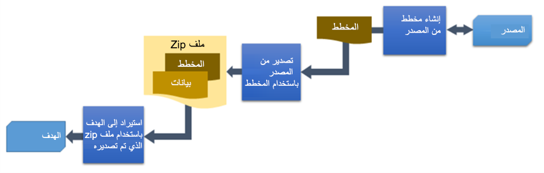

يُتيح Package Deployer للمسؤولين نشر الحزم في بيئات Microsoft Dataverse. كما يستخدم موردي البرامج المستقلين (ISVs) هذه الحزم لنشر حلول معتمدة لبيئات العملاء. يُمكن للمطورين المساعدة في تكوين الحزمة وإنشاء التعليمات البرمجية التي تعمل في أثناء مراحل التثبيت.

تختلف حزمة النشر عن حل Dataverse واحد، حيث إنها تستطيع تثبيت تطبيق كامل مثل حلول وبيانات متعددة وتثبيت منطق مخصص. قد تحتوي الحزمة على أي أو كل ما يلي:

-   ملف أو أكثر من ملفات Dataverse

-   ملفات ثابتة أو ملف بيانات تكوين مصدر من أداة "ترحيل التكوين"

-   التعليمات البرمجية المخصصة التي يُمكن تشغيلها قبل أو في أثناء أو بعد نشر الحزمة إلى مثيل Dataverse

-   محتوى HTML خاص بالحزمة التي يمكن عرضها في بداية عملية النشر ونهايتها. قد يكون هذا مفيد لتوفير وصف للحلول والملفات المنشورة في الحزمة.

## بناء حزمة

توفر Microsoft قالب Visual Studio لإنشاء حزم. قد يختلف مستوى الجهد حسب مقدار التعليمات البرمجية المخصصة المضمنة للتنفيذ في أثناء التثبيت. في كثير من الأحيان، تشمل الحزمة واحد فقط أو أكثر من الحلول والبيانات. فيما يلي خطوات إنشاء حزمة توزيع:

> [!div class="mx-imgBorder"]
> 

لإضافة منطق مخصص، يتضمن القالب ملف PackageTemplate.cs، إذ يُمكنك تجاوز الأساليب التي تريد تطبيقها في منطق مخصص. يُمكنك قراءة المزيد عن إضافة منطق مخصص في [Package Deployer وثائق](/power-platform/alm/package-deployer-tool?azure-portal=true##step-5-define-custom-code-for-your-package) الأداة.

## نشر حزمة

بمجرد تكوين حزمة، يُمكن نشرها إلى بيئات Dataverse باستخدام إحدى الطرق التالية:

-   **بشكل تفاعلي** - يوفر استخدام هذا الأسلوب معالجاً مثل تجربة مستخدم له حق الوصول الإداري إلى البيئة لتثبيت الحزمة. كما أن التثبيت يُخبر المستخدم مرئياً بالتقدم المحرز.

-   **Windows PowerShell** - يسمح استخدام هذا الأسلوب بتثبيت سطر الأوامر. وسيكون ذلك مناسباً للحزم المنشورة كجزء من عملية مؤتمتة.

-   **AppSource** - يُستخدَم هذا النهج عند تحديد عرض ISV للتثبيت من مدخل AppSource.

يُمكنك قراءة المزيد عن كيفية عمل النشر مع هذه الطرق في [نشر الحزم باستخدام Package Deployer وWindows PowerShell](/power-platform/admin/deploy-packages-using-package-deployer-windows-powershell/?azure-portal=true).

## تضمين البيانات

واحدة من الأشياء الرئيسية التي تميز Package Deployer عن مجرد تثبيت الحل هو أنه يمكنك تضمين بيانات المرجع / التكوين على أنه جزء من حزمة التوزيع.

تُستخدم [أداة ترحيل التكوين](/power-platform/admin/manage-configuration-data/?azure-portal=true) لنقل التكوين واختبار البيانات من بيئة إلى أخرى. إذ أنها توفر وسائل التقاط مثل هذه البيانات، وتضمين تلك البيانات في مستودع التحكم في المصدر، واستخدام تلك البيانات لأتمتة الاختبار. يُمكن استخدام هذه الأداة وحدها، ورُغم ذلك يمكن تضمين ملف data.zip الذي يتم تصديره على أنه جزء من حزمة توزيع. الخطوات عالية المستوى هي

1.  تعريف نظام بيانات المصدر المطلوب تصديرها

2.  استخدام النظام لتصدير البيانات

3.  استيراد البيانات المُصدرة

الرسومات التخطيطية التالية لعملية استخدام الأداة:

> [!div class="mx-imgBorder"]
> 

عند استخدامها مع Package Deployer، يُمكن تضمين الملف المضغوط الناتج في حزمة التوزيع.

فيما يلي بعض الفوائد الرئيسية لاستخدام أداة "ترحيل التكوين" لإعداد البيانات:

-   حدد الجداول والأعمدة التي تريد تصدير بيانات التكوين منها.

-   حلّل العلاقات بين السجلات وتشغيل الاستيراد باستخدام الاجتيازات المتعددة لضمان سلامة البيانات.

-   استخدم أي استعلام لتعريف مجموعة فرعية من السجلات لتضمينها في الحزمة.

-   تجنب تكرار السجلات في النظام الهدف بتعريف شرط تفرد لكل جدول بناءً على مجموعة من الأعمدة في الجدول، التي تُستخدم للمقارنة مع القيم الموجودة في النظام الهدف.

-   في حالة عدم وجود قيم مطابقة، يتم إنشاء سجل فريد في النظام الهدف. عند العثور على سجل مطابق، يتم تحديث السجل في النظام الهدف.

-   تحقق من صحة المخطط للجداول المحددة التي سيتم تصديرها للتأكد من وجود جميع البيانات/المعلومات المطلوبة.

-   إعادة استخدام مخطط موجود لتصدير البيانات من نظام مصدر.

-   نقل القيم تلقائياً إلى التاريخ وتحديد الأعمدة عند الاستيراد للحفاظ على تحديث البيانات في بيئات العرض التوضيحي.

يتيح لك استخدام Package Deployer في نشر التطبيقات تضمين ملفات حلول متعددة، وبيانات، وتنفيذ منطق مخصص في أثناء عملية التثبيت. يُمكن للمسؤولين استخدام تجربة مثبّت تشبه المعالج ولا داعي للقلق بشأن كيفية تثبيت المكونات الفردية أو استيراد بيانات التكوين.
