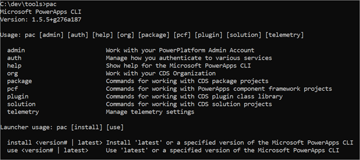

في هذا التدريب، ستقوم بتثبيت ‪Power Apps CLI‬، وإنشاء أول مكون في ‪Power Apps Component Framework (PCF)‬.

> [!IMPORTANT]
> يتم دعم ‪Power Apps CLI‬ حالياً فقط على Windows 10. استخدام بيئة اختبار مع توفير Microsoft Dataverse. وإذا لم يتوفر لديك، يمكنك الاشتراك في خطة المجتمع [هنا](https://powerapps.microsoft.com/communityplan/?azure-portal=true).

## المهمة 1: تثبيت CLI

> [!NOTE]
> يتم تنفيذ الأوامر في هذا التدريب في موجه أوامر Windows، ما لم يتم تحديد خلاف ذلك. يمكنك فتح موجه الأوامر بالضغط على Windows-R، وكتابة **cmd**، والضغط على مفتاح Enter. عند تثبيت المكونات المطلوبة، تأكد من فتح موجه أوامر جديد بعد التثبيت لالتقاط التغييرات في البيئة.

1.  قم بتثبيت [Npm](https://www.npmjs.com/get-npm/?azure-portal=true) إذا لم يكن قد تم تثبيته بالفعل.

1.  قم بتثبيت [.NET Framework 4.6.2 Developer Pack](https://dotnet.microsoft.com/download/dotnet-framework/net462/?azure-portal=true).

1.  إذا لم يكن لديك بالفعل ‪2017‬ Visual Studio أو إصدار لاحق، فاتّبع أحد الخيارَين التاليَين:

    الخيار 1: تثبيت أو إصدار أحدث.
    
    الخيار 2: تثبيت [Tools for‪ Visual Studio 2019‬](https://visualstudio.microsoft.com/downloads/?q=build+tools?azure-portal=true#build-tools-for-visual-studio-2019) أو إصدار أحدث.

1.  تثبيت [‪Power Apps CLI‬](https://aka.ms/PowerAppsCLI/?azure-portal=true).

1.  للاستفادة من أحدث القدرات كلها، عليك تحديث أدوات ‪Power Apps CLI‬‬ إلى أحدث إصدار باستخدام الأمر التالي:

    `pac install latest`

1.  اكتب pac فقط لمعرفة الأوامر المتوفرة:

    `pac`

    > [!div class="mx-imgBorder"]
    > 

1.  يمكنك إدخال pac ثم أمر لمعرفة الخيارات التي يوفرها، على سبيل المثال، يمكنك تجربة ما يلي:

    `pac admin`

1.  انتقل إلى [Power Apps بوابة الشركة المصنّعة](https://make.powerapps.com/?azure-portal=true) وتأكد من وجودك في البيئة الصحيحة.

1.  في الزاوية العليا اليسرى من الشاشة، انقر فوق أيقونة "الإعدادات" واختر "تفاصيل جلسة العمل".

    > [!div class="mx-imgBorder"]
    > 

1. في مربع حوار تفاصيل جلسة عمل Power Apps، حدد قيمة عنوان URL للمثيل وانسخها للاستخدام لاحقاً في التدريب.

    > [!div class="mx-imgBorder"]
    > 

1. اكتب الأمر التالي لإنشاء اتصال من CLI وسجّل الدخول إلى بيئة الاختبار عند مطالبتك بذلك.

    `pac auth create --name Lab --url <Your Instance URL>`

1. اكتب الأمر who التالي الذي سيعرض معلومات البيئة والمستخدمين. وهذا مفيد للتأكّد من أنك في البيئة الصحيحة.

    `pac org who`

## المهمة 2: إنشاء مكون PCF

1.  انتقل إلى المجلد الذي تريد إنشاء المكون فيه. على سبيل المثال، إذا كنت تريد إنشائه في المجلد labPCF على محرك الأقراص C، فاكتب md C:\labPCF.

1.  قم بتغيير الدليل إلى هناك بكتابة cd C:\labPCF.

1.  اكتب الأمر init التالي، ثم اضغط على Enter.

    `pac pcf init --namespace lab --name FirstControl --template field`

1.  اكتب الأمر التالي، ثم اضغط على Enter. يؤدي هذا إلى سحب أي تبعيات من مستودع npm.

    `npm install`

1.  افتح المجلد في ‪Visual Studio Code‬ أو Visual Studio. يمكنك استخدام الأمر التالي مع ‪Visual Studio Code‬.

    `code .`

1.  استكشف الملفات التي تم إنشاؤها.

1.  افتح Index.ts في المجلد FirstControl.

1.  الصق المتغيرَين التاليَين داخل عبارة التصدير.

    `
        private label: HTMLInputElement;
        private _container: HTMLDivElement;
    `

    > [!div class="mx-imgBorder"]
    > 

1.  الصق التالي داخل دالة ‪init()‬ لإنشاء عناصر تحكم HTML وتعيين قيمة التسمية.

    `
            this.label = document.createElement("input");
            this.label.setAttribute("type", "label");
            this.label.value = "My First PCF";
            this._container = document.createElement("div");
            this._container.appendChild(this.label);
            container.appendChild(this._container);
    `

1. احفظ الملف.

1. من موجه الأوامر، اكتب التالي ثم اضغط على Enter. سيبدأ هذا مفعّل الاختبار باستخدام أحدث تعليمات برمجية.

    `npm start`

1. مفعّل الاختبار فعّال جداً للاستخدام في وقت مبكر من المشروع لمعرفة شكل عنصر التحكم بدون الحاجة إلى توزيعه في البيئة. يمكنك تعيين قيم للخاصية لتغيير حجم منطقة التحكم. بعد الانتهاء من استكشاف مفعّل الاختبار، يمكن التبديل والعودة مرة أخرى إلى نافذة موجه الأوامر والضغط على Ctrl-C من نافذة موجه الأوامر لإنهاء تنفيذ مفعّل الاختبار.

1. اكتب أمر solution list التالي، ثم اضغط على Enter.

    `pac solution list`

1. هذه هي الحلول الحالية الموجودة في البيئة الخاصة بك. الخطوة التالية ستضيف واحداً للمكون.

1. اكتب الأمر push التالي لدفع عنصر التحكم الخاص بنا إلى البيئة.

    `pac pcf push --publisher-prefix lab`

1. قم بتشغيل الأمر pac solution list مرة أخرى. من المفترض أن تشاهد الحل PowerAppsTools_lab solution. هذه هي الطريقة التي يتم بها تثبيت المكون الخاص بك في بيئة التطوير لاختبار الوحدة قبل حزمها حتى يختبرها المستخدم أو إنتاجها أو تضمينها كجزء من حل آخر.

## المهمة 3: استخدام المكون في تطبيق (اختياري)

1.  انتقل إلى [مركز مسؤولي Microsoft Power Platform](https://aka.ms/ppac/?azure-portal=true)

1.  حدد البيئة التي تستخدمها للتدريب العملي.

1.  انقر فوق **الإعدادات**.

1.  قم بتوسيع منطقة **المنتج** وانقر فوق **الميزات**.

1.  على الجانب الأيسر، عليك تمكين ميزة **‏‫السماح بنشر تطبيقات اللوحة مع مكونات التعليمات البرمجية‬**.

    > [!div class="mx-imgBorder"]
    > 

1.  انتقل إلى [Power Apps بوابة الشركة المصنّعة](https://make.powerapps.com/?azure-portal=true) وتأكد من وجودك في البيئة الصحيحة.

1.  انقر فوق **الحلول**.

1.  انقر فوق **PowerAppsTools_lab**.

1.  من المفترض أن تشاهد المكون مدرجاً.

1. انقر فوق **+جديد > تطبيق اللوحة > ‏‫عامل تصميم هاتفك‬**.

1. حدد منطقة الإدراج، ثم اختَر "مخصص"، "استيراد المكون".

    > [!div class="mx-imgBorder"]
    > 

1. اختَر علامة التبويب **التعليمات البرمجية**.

1. حدد المكون الخاص بك.

    > [!div class="mx-imgBorder"]
    > 

1. انقر فوق "استيراد".

1. على شريط الأدوات الأيمن، انقر فوق **+** وقم بتوسيع **مكونات التعليمات البرمجية**. اسحب **FirstControl** إلى سطح تصميم الشاشة. من المفترض أن تشاهد الآن أداة التحكم مع ظهور النص "PCF الأول" على اللوحة.
    
    > [!div class="mx-imgBorder"]
    > 

لقد نجحت الآن في إنشاء أول مكون PCF خاص بك واستخدامه في تطبيق اللوحة.
