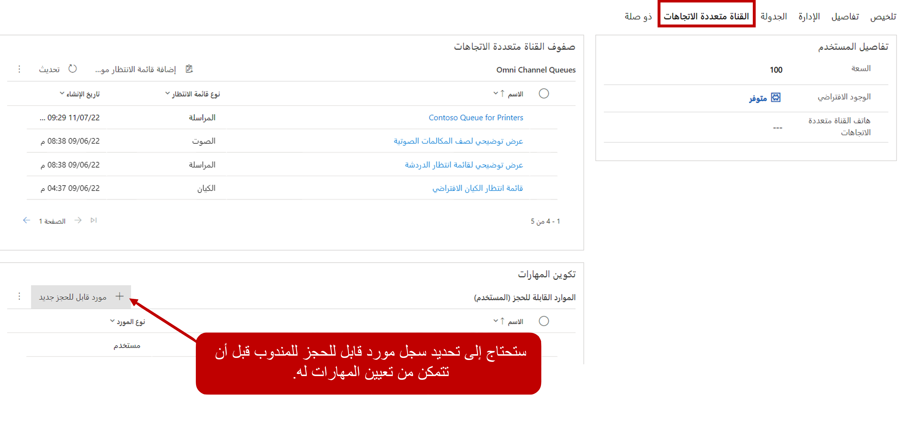
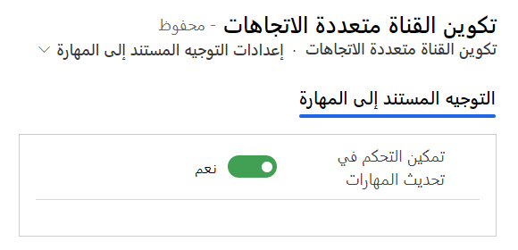

يجب توزيع المحادثات التي تحتوي على مهارات محددة لهم على أنسب المندوبين. =سيحتاج كل مندوب سيتم تطبيقه في التوجيه المستند إلى المهارات إلى سجل موارد قابل للحجز مقترن بحساب المستخدم الخاص به. يوفر لك سجل الموارد القابل للحجز القدرة على إرفاق المهارات ومستويات الكفاءة بالمندوبين الفرديين. 

## تحديد المندوبين كموارد قابلة للحجز

يمكنك الوصول إلى سجل المورد الضروري القابل للحجز أو إنشاؤه لمندوب من مركز مسؤولي Customer Service. حدد موقع المستخدم الذي تريد العمل معه من منطقة **المستخدمين** ضمن **إدارة المستخدم**. بعد تحديد موقع الوكيل الذي تريد العمل معه، يمكنك إعداد مهاراته من علامة التبويب **قناة متعددة الاتجاهات**. قم بإنشاء سجل الموارد القابلة للحجز عن طريق تحديد الزر **+ مورد جديد قابل للحجز** في القسم **تكوين المهارات**.

> [!div class="mx-imgBorder"]
> 

> [!NOTE]
> نظراً لأن تطبيقات متعددة يمكنها استخدام سجل الموارد القابل للحجز، فقد تتوفر العديد من علامات التبويب المرتبطة بتطبيقات أخرى، مثل Microsoft Dynamics 365 Field Service، إذا تم تثبيت هذه التطبيقات في بيئتك. ليست هناك حاجة إلى إعداد إضافي لعلامات التبويب هذه في البداية، حتى تتمكن من ترك السجل كما هو. علامة التبويب الوحيدة المعنية هي علامة التبويب **القناة متعددة الاتجاهات**. وعند إجراء تغييرات علي علامة التبويب هذه، سيتم ملء الأصناف الأخرى وفقاً لذلك.

> [!div class="mx-imgBorder"]
> 

## تعيين المهارات إلى المندوبين

الآن بعد أن أصبح لديك سجل موارد قابل للحجز للمندوب، يمكنك تعيينه إلى المهارات المناسبة بناءً على مؤهلاته. يمكنك تحديد مهارات معينة عن طريق تحديد الزر **خاصية مورد جديد قابل للحجز** على الشبكة الفرعية **للمورد القابل للحجز**. لكل مهارة تحددها لأحد المندوبين، ستحتاج إلى تحديد قيمة التقييم الإجمالية لهذه المهارة.

> [!div class="mx-imgBorder"]
> 

تأكد من تحديد مهارات متعددة بناء على متطلبات المؤسسة، مما يضمن توجيه جميع العناصر بفعالية.

## تمكين المندوبين من تحديث المهارات

بالإضافة إلى إنشاء المهارات وإرفاقها بالمندوبين باستخدام نماذج التصنيف، يمكنك منح المندوبين القدرة على إضافة أو إزالة المهارات لعناصر العمل المعينة لهم في وقت التشغيل. للقيام بذلك، ستحتاج إلى تشغيل مفتاح التبديل **تمكين التحكم في مهارات التحديث** في مركز مسؤولي Customer Service. حدد **التوجيه** ضمن  **دعم العملاء**، وحدد موقع **التوجيه المستند إلى المهارة**، ثم حدد **إدارة**.

> [!div class="mx-imgBorder"]
> 
