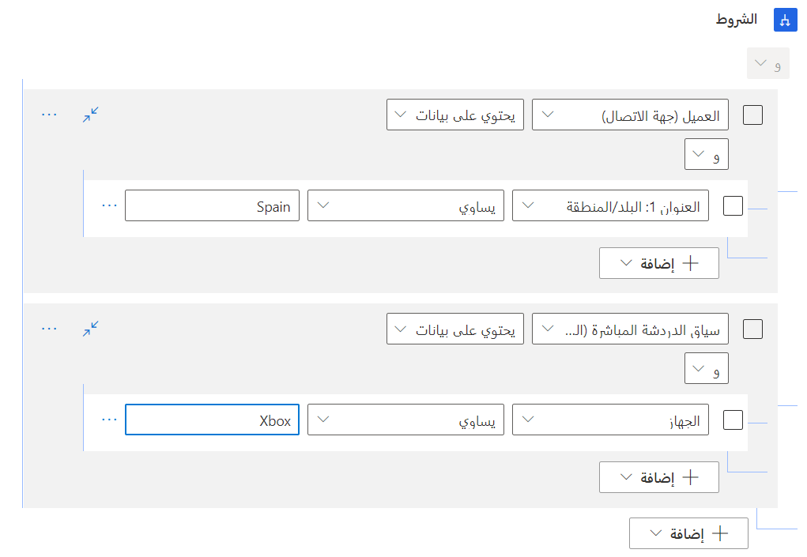
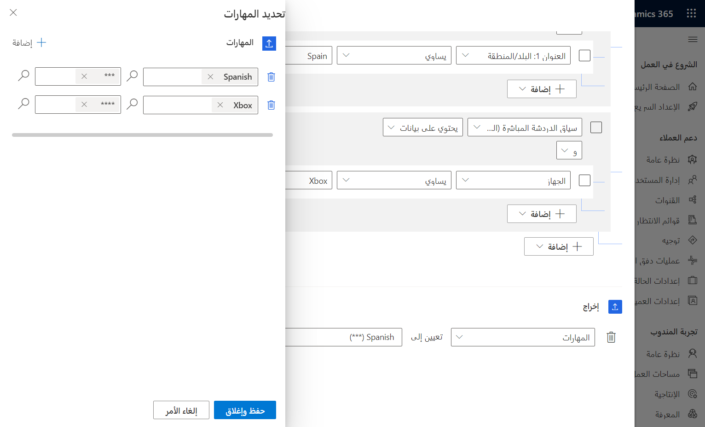
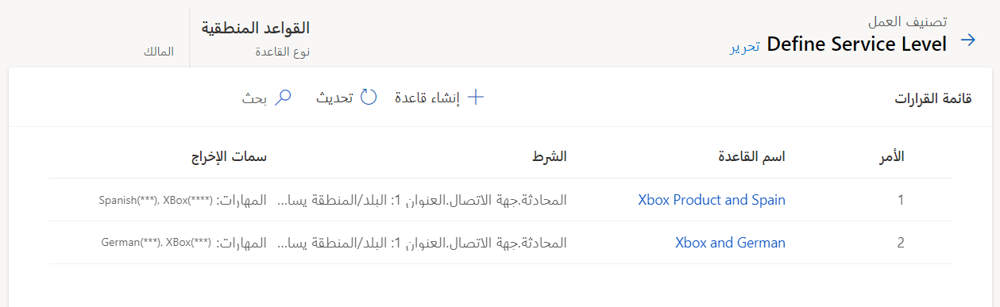

عندما تأتي المحادثات عبر قنوات مختلفة، سيقوم النظام بتقييمها لتحديد المهارات التي يجب تطبيقها على الصنف. يتم الانتهاء من هذه العملية من خلال مجموعات قواعد التصنيف. عند دخول الأصناف إلى قائمة الانتظار، ستقوم قواعد التصنيف بتقييم صنف العمل مقابل شروط محددة. إذا تم استيفاء هذه الشروط، يمكن للقاعدة تعيين حقل معين إلى قيم محددة. على سبيل المثال، قد تتحقق قاعدة التصنيف لتحديد اللغة التي يتحدث بها العميل الذي يرسل الصنف. إذا كان العميل يتحدث الإسبانية ، فستقوم قاعدة التصنيف بإرفاق مهارة إسبانية بالصنف.

نظراً لأن كافة أصناف العمل الواردة، بغض النظر عن القناة التي نشأت منها، يتم توجيهها وتوزيعها استناداً إلى مسارات العمل، يتم تعريف قواعد التصنيف في سجل مسار العمل. يمكنك تعريف قواعد تصنيف العمل ضمن قسم قواعد التوجيه في مسار العمل عن طريق تحديد **+ إنشاء مجموعة قواعد**. يمكنك تحديد ما يصل إلى 10 مجموعات قواعد لكل مسار عمل.

عند إنشاء مجموعة قواعد، يمكنك تحديد أحد الخيارات التالية لنوع القاعدة:

-   **منطقي** - القواعد التي تستخدم ملفات تعريف السعة أو المهارات أو السمات الخاصة بالسجل الموجه.

-   **نموذج التعلم الآلي** - استخدم نماذج التعلم الآلي للمساعدة في تصنيف عناصر العمل. يمكنك الاختيار من بين أحد النماذج التالية: تعريف المهارة أو التنبؤ بالتوجه أو تقدير الجهد.

بعد تحديد قاعدتك، سيتم نقلك إلى قائمة القرارات، حيث ستحدد القواعد المختلفة التي سيتم تضمينها في مجموعة القواعد هذه. لإنشاء قواعد جديدة، حدد الزر **+ إنشاء قاعدة**.

المكونان الأساسيان لقواعد تصنيف العمل هما:

-   **الشرط** - يحدد الظروف التي سيتم فيها تطبيق قاعدة المرفق.

-   **الإخراج** - يحدد المكان الذي يجب إرسال البيانات إليه، مثل تحديث حقل في السجل، أو إرفاق مهارة، أو اتخاذ إجراء آخر.

## العمل مع الشروط

يمكن أن تستند الشروط إلى صنف العمل أو الكيانات المرتبطة بالصنف. استنادا إلى نوع صنف العمل الذي تعمل معه، ستختلف السجلات ذات الصلة. على سبيل المثال، بالنسبة للمحادثات، ستتضمن هذه السجلات **الحساب** أو **الاتصال** أو **الحالة** أو **نتيجة التنبؤ بالجهد** أو **متغير السياق** أو **سياق الدردشة المباشرة**. عندما تبني شرطاً على كيان ذي صلة، سيكون لديك حق الوصول الكامل إلى جميع الحقول الموجودة على الكيان ذي الصلة. على سبيل المثال، لتعيين لغة كمهارة استناداً إلى موقع الشخص الذي بدأ المحادثة، يمكنك تعيين الشرط استناداً إلى الجدول التالي.

|     الكيان                              |     السمة                      |     المشغل    |     القيمة    |
|-----------------------------------------|------------------------------------|-----------------|--------------|
|     الاتصال (محادثة)              |     العنوان 1: البلد/المنطقة    |     يساوي      |     إسبانيا    |
|     سياق الدردشة النشطة (المحادثة)    |     الجهاز                         |     يساوي      |     Xbox     |

لتوفير المرونة، يمكنك تحديد شروط متعددة في قاعدة مرفق واحدة. بالإضافة إلى ذلك، يمكنك استخدام شروط **و/أو** لتجميع الأصناف معاً لمزيد من المرونة. يمكن أن يكون هذا النهج مفيداً في السيناريوهات التي قد تتأثر فيها الكفاءة في المهارة، مثل العمل مع نوع معين من المنتجات، بناءً على عوامل متعددة. على سبيل المثال، إذا بدأ شخص ما محادثة ذات صلة بـ Xbox 360، وكان لديه سؤال عن الحساب، فقد تكون الكفاءة المطلوبة للتعامل مع هذه المشكلة منخفضة. إذا كان شخص ما يستفسر عن مشكلة في الدعم الفني، فقد تتطلب المحادثة شخصاً يتمتع بمستوى كفاءة أعلى.

> [!div class="mx-imgBorder"]
> 

## إرفاق المهارات

بعد تعريف الشرط (الشروط)، يمكنك استخدام جزء الإخراج من القاعدة لتحديد المهارات التي ستتم إضافتها إلى صنف العمل. ستحتاج إلى تحديد مستوى الكفاءة لكل مهارة. يمكنك إضافة مهارات متعددة إلى قاعدة مرفقات استنادا إلى المتطلبات التنظيمية باستخدام الزر **+ إضافة سمة**.

لإرفاق مهارة، قم بتعيين القائمة المنسدلة إلى **المهارات**، ثم حدد مستوى المهارة والكفاءة الذي سيتم تطبيقه. يمكنك إضافة مهارات متعددة إلى كل صنف.

> [!div class="mx-imgBorder"]
> 

## أصناف قاعدة مرفقات متعددة

نظراً لأن مؤسستك قد تدعم العديد من السيناريوهات المختلفة وقد يكون لديها مندوبين لديهم مجموعات مهارات مختلفة، فمن المحتمل أن يكون لديك أصناف قواعد متعددة محددة لمسار عمل واحد. ستتلقى المحادثة مهارات من أي قواعد مرفق تفي بمعاييرها. تأكد من تعريف أصناف القاعدة بتفاصيل كافية لضمان تعيين الأصناف بشكل مناسب.

> [!div class="mx-imgBorder"]
> 

