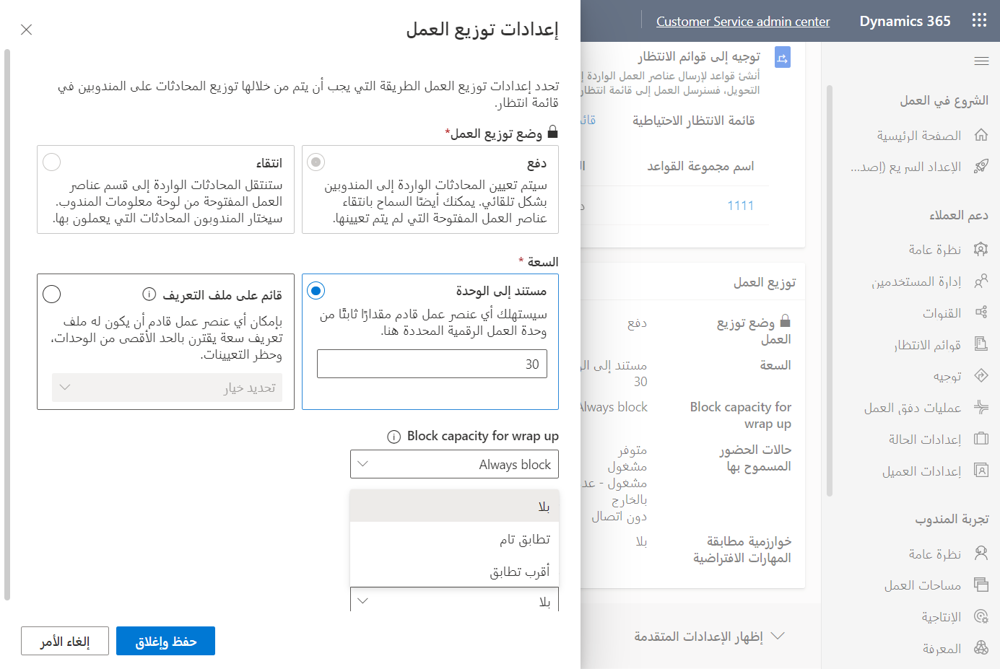

حتى الآن، لقد حددت المهارات التي سيتم استخدامها في مؤسستك وقمت بإرفاق هذه المهارات بالموارد الفردية في مؤسستك. والآن، ستقوم بتحديد كيفية إرفاق المهارات بعناصر العمل بواسطة تعريف معايير مطابقة المهارات. واستناداً إلى نوع المطابقة الذي تم تحديده وقواعد المرفقات التي تم إنشاؤها، سيقوم النظام بإرفاق مهارات معينة إلى المحادثة الواردة ثم توجيهها إلى المندوبين وفقاً لذلك.

كل من نوعي مطابقة المهارات هما *مطابقة دقيقة للمهارات* و *مطابقة لأقرب المهارات*. يتمثل الاختلاف الأساسي بين الإثنين في ما يفعله النظام عندما يتعذر عليه تحديد مندوبين بمستويات إتقان المهارة المناسبة. من الضروري فهم الخطوات التي يستخدمها النظام للتوزيع استناداً إلى نوع مطابقة المهارات الذي تم تحديده لضمان وصول المحادثات إلى الموقع الأكثر كفاءة.

## مطابقة دقيقة للمهارات

تعمل المطابقة الدقيقة للمهارات بالطريقة التي قد تتوقعها. يحدد منطق المرفقات المهارة (المهارات) ومستوى الكفاءة للمهارة التي يجب على المندوب أن يعمل عليها في المحادثة. تمثل المهارات المحددة ومستويات الكفاءة الحد الأدنى من المتطلبات التي يجب أن يمتلكها المندوب لتلقي المحادثة. يبحث نظام التوزيع عن مندوب لديه الحد الأدنى من مستويات الكفاءة للمهارات المرتبطة، كما هو محدد في منطق إرفاق المهارة. إذا كان النظام غير قادر على العثور على مندوب يستوفي الحد الأدنى من معايير الكفاءة، فسيقوم بالبحث عن مندوب يتمتع بمستوى إتقان أعلى. من خلال محاولة العثور أولاً على شخص لديه الحد الأدنى من مستوى الكفاءة، يمكن للنظام أن يحاول إبقاء الفنيين المؤهلين الأعلى متاحين للمكالمات المحتملة التي لا يستطيع الفنيون ذوو المستوى الأدنى العمل عليها. إذا لم يعثر النظام على مندوب بمستوى إتقان أعلى، فلن يوجه المحادثة إلى أي شخص؛ لذلك، ستبقى المحادثة في قائمة الانتظار حتى يحددها مندوب.

يوضح المثال التالي كيفية عمل مطابقة المهارات بدقة في سيناريوهين مختلفين استناداً إلى السيناريو Xbox 360 الذي تم ذكره مسبقاً. في السيناريو الأول، يتم تحديد مهارة وكفاءة واحدة فقط. في السيناريو الثاني، يحتاج النظام إلى مطابقة مهارات Xbox 360 ومهارات اللغات ومهارات الكفاءة.

|     سيناريو المهارات    |     معايير الكفاءة والمهارات    |     الوصف‏‎                                                                                                                                                                                                                                                                                                                                               |
|-----------------------|---------------------------------------|---------------------------------------------------------------------------------------------------------------------------------------------------------------------------------------------------------------------------------------------------------------------------------------------------------------------------------------------------------------|
|     فردي            |     Xbox 360 = 4                          |     يقوم النظام بالبحث عن مندوب باستخدام Xbox 360 = 4، والذي يمثل الحد الأدنى للمعايير.     إذا كان لا يتوفر أي مندوب ذو كفاءة من 4، سيقوم النظام بالبحث عن مندوب ذو كفاءة Xbox 360 أكبر من 4.     إذا لم يتم استيفاء المعايير، فستظل المحادثة (عنصر العمل) في قائمة الانتظار التي تم توجيهها إليها في البداية.    |
|     المضاعف          |     Xbox 360 = 4    الإسبانية = 5           |     يقوم النظام بالبحث عن مندوب باستخدام Xbox 360 = 4و الإسبانية = 5، والذي يمثل الحد الأدنى للمعايير.     وفي حاله عدم استيفاء المعايير، سيقوم النظام بالبحث عن مندوب ذو كفاءة Xbox 360 أكبر من 4 وكفاءة في الإسبانية أكبر من 5.     إذا لم يتم استيفاء المعايير، فستظل المحادثة (عنصر العمل) في قائمة الانتظار.       |

في كلا السيناريوهات، إذا لم يتمكن النظام من العثور على مطابقة، سيبقي عنصر العمل في قائمة الانتظار. هذا السبب هو السبب الأساسي لتحديد المطابقة الدقيقة. عادةً ما تستخدم المطابقة الدقيقة في السيناريوهات التي يكون من المهم فيها أكثر أن يكون لديك المندوب المناسب الذي يعمل على محادثة وعندما تكون على استعداد لقضاء المزيد من الوقت لتوجيه عنصر العمل بدلاً من إرساله إلى أي شخص. يمكنك استخدام هذا الأسلوب عند التعامل مع مشكلات دعم فني أكثر تقدماً. 

## المطابقة لأقرب المهارات

بعكس المطابقة الدقيقة، مع المطابقة لأقرب المهارات، ستنتهي المحادثة دائما بالتوزيع إلى مندوب. وعلى غرار المطابقة الدقيقة، مع المطابقة لأقرب المهارات، يتم تعيين مستوى الكفاءة الذي يحدده منطق مرفقات المهارة على الحد الأدنى من المعايير أثناء بحث النظام عن المندوبين. عندما يعثر النظام على مندوب لديه المهارة والمستوى الأدنى من الكفاءة، فسيقوم بتعيين المحادثة لهذا المندوب. أيضاً، كما هو الحال مع المطابقة الدقيقة، إذا لم يتم استيفاء الحد الأدنى من معايير الكفاءة، فسيقوم النظام بالبحث عن مندوب يتمتع بمستوى إتقان أعلى.

وتختلف المطابقة الأقرب من حيث إنه إذا لم يتمكن النظام من العثور على مندوب بمستوى كفاءة أعلى، فسوف يبحث عن مندوبين يتمتعون بمهارة محددة ولكنه سيقبل مستوى كفاءة أقل من الحد الأدنى من المعايير. سيقوم النظام بتعيين المحادثة إلى مندوب إذا كان لديه على الأقل أحد المهارات التي تطابق المعايير. إذا كان النظام غير قادر على العثور على أي شخص يستوفي معايير مستوى كفاءة المهارة، فسيقوم نظام التوزيع بتعيين المحادثة بناءً على القدرة الإنتاجية للمندوب وتوافره.

يوضح الجدول التالي مدى تأثير المطابقة الأقرب لمثال Xbox 360 السابق.

|     سيناريو المهارات    |     المهارة والكفاءة      |     الوصف‏‎                                                                                                                                                                                                                                                                                                                                                                                                                                                                                                                                                                                                                                                                                                                                                                                                                                      |
|-----------------------|--------------------------------|------------------------------------------------------------------------------------------------------------------------------------------------------------------------------------------------------------------------------------------------------------------------------------------------------------------------------------------------------------------------------------------------------------------------------------------------------------------------------------------------------------------------------------------------------------------------------------------------------------------------------------------------------------------------------------------------------------------------------------------------------------------------------------------------------------------------------------------------------|
|     فردي            |     Xbox 360 = 4                   |     يقوم النظام بالبحث عن مندوب باستخدام Xbox 360 = 4، والذي يمثل الحد الأدنى للمعايير.     وفي حالة عدم استيفاء المعايير، سيقوم النظام بالبحث عن مندوب يتوفر لديه كفاءة Xbox 360 أكبر من 4. إذا تم العثور على المندوب، فسيقوم النظام بتعيين المحادثة إلى المندوب.     وفي حالة عدم استيفاء المعايير، سيقوم النظام بالبحث عن مندوب يتوفر لديه كفاءة Xbox 360 أقل من 4. إذا تم العثور على المندوب، فسيقوم النظام بتعيين المحادثة إلى المندوب.     عندما لا يتم استيفاء المعايير، سيقوم النظام بتعيين المحادثة بناءً على قدرة المندوب الإنتاجية وتوافره.                                                                                                                                                                                                                                                              |
|     المضاعف          |     Xbox 360 = 4    الإسبانية = 5    |     يقوم النظام بالبحث عن مندوب يستوفي معايير Xbox 360 = 4 والإسبانية = 5.     وفي حالة عدم استيفاء المعايير، سيقوم النظام بالبحث عن مندوب لديه كفاءة Xbox 360 أكبر من 4 وكفاءة في الإسبانية أكبر من 5.     وفي حالة عدم استيفاء المعايير، سيقوم النظام بالبحث عن مندوب لديه كفاءة Xbox 360 أقل من 4 وكفاءة في الإسبانية أقل من 5. إذا تم العثور على مندوب، فسيقوم النظام بتعيين المحادثة إلى المندوب.     وفي حالة عدم استيفاء المعايير، سيقوم النظام بالبحث عن مندوب لديه كفاءة Xbox 360 أقل من 4 وكفاءة في الإسبانية أقل من 5. إذا تم العثور على مندوب، فسيقوم النظام بتعيين المحادثة إلى المندوب.     عندما لا يتم استيفاء المعايير، سيقوم النظام بتعيين المحادثة بناءً على قدرة المندوب الإنتاجية وتوافره.    |

يمكنك تحديد خوارزمية المطابقة التي تريد تطبيقها على مستوى تدفق العمل. في قسم **توزيع العمل**، حدد المزيد من الخيارات ثم قم بتعيين **خوارزمية مطابقة المهارات الافتراضية** إلى **المطابقة الدقيقة** أو **المطابقة الأقرب** أو **لا يوجد**.

> [!div class="mx-imgBorder"]
> 
