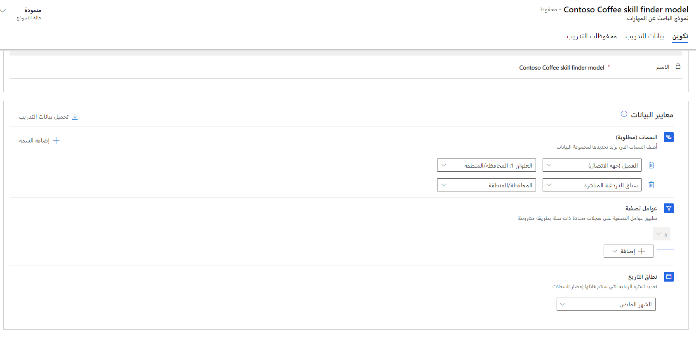

بالإضافة إلى القدرة على تشغيل قواعد منطقية لتحديد وتعيين المهارات لعناصر العمل الجديدة، يمكنك أيضاً إنشاء وتدريب نماذج تعلم الآلي، التي تستخدم الذكاء الاصطناعي لتحديد المهارات اللازمة لعناصر العمل الجديدة. يمكنك إنشاء وتدريب نماذج التدريب هذه باستخدام البيانات في Microsoft Dataverse. بدلاً من ذلك، إذا لم يكن لديك بيانات كافية لتدريب نموذج، يمكنك استيراد البيانات من تطبيق آخر.

ستفحص نماذج الذكاء الاصطناعي البيانات وستبدأ في تعلم المهارات التي يجب إرفاقها بعنصر العمل. على سبيل المثال، قد تشير محادثة واردة إلى رقم نموذج معين لمنتج ما، مثل جهاز Café A-100. يستطيع الباحث عن المهارات الذكية فحص المحادثات السابقة ليعرف أن النظام يجب أن يربط مهارة Café A-100 بالمحادثة، بالإضافة إلى مهارات التدفئة والكهرباء، لأنها غالباً ما تكون مطلوبة عندما يتعامل شخص ما مع الجهاز.

يمكنك إنشاء نماذج الباحث عن المهارات الذكية في مركز مسؤولي Customer Service من خلال الانتقال إلى **الرؤى**، ثم تحديد **الباحث عن المهارات الذكية**.

عند إنشاء نموذج جديد، بالإضافة إلى تحديد الاسم، ستحتاج إلى تحديد معايير البيانات. في قسم **معايير البيانات**، أدخل المعلومات التالية لتشكيل سجلات مجموعة البيانات:

-   **السمات (مطلوبة)** - تمثل الحقول الموجودة في عناصر العمل أو العناصر ذات الصلة التي تريد استخدامها كبيانات الإدخال، التي ستشكل مجموعة بيانات التدريب. على سبيل المثال، يمكنك تضمين عنوان الحالة أو وصفها.

-   **عوامل التصفية** - تسمح لك بتصفية قائمة السجلات التي سيتم تضمينها في النموذج، مثل التقييد لتضمين الحالات التي تم إرسالها بواسطة العملاء في منطقة معينة فقط.

-   **نطاق التاريخ** - يحدد الفترة الزمنية التي يلزم تحميل السجلات فيها. يمكنك الاختيار من بين فترة محددة مسبقاً، أو يمكنك توفير نطاق بيانات مخصص خاص بك.

بعد إنشاء معايير النموذج الخاص بك، حدد **تحميل بيانات التدريب** لبدء تدريب النموذج.

> [!div class="mx-imgBorder"]
> 

في قسم **بيانات التدريب** ، سيتم تزويدك بقائمة من السجلات التي تفي بالمعايير الخاصة بك. سيتضمن كل سجل في القائمة المعلومات التالية:

-   **بيانات الإدخال** - تمثل البيانات من كل سجل يتم تمريره إلى النموذج ليتم تحليله بناءً على السمات التي حددتها.

-   **العلامة** - تمثل المهارات المرتبطة بهذا النص.

-   **حالة الموافقة** - يحدد ما إذا كان قد تمت الموافقة على السجل أو لا.

أثناء عرض بيانات التدريب، يمكنك الموافقة على السجلات أو حذف السجلات التي لا تريد تضمينها أو تعديل السجلات حسب الحاجة لجعل بيانات التدريب أكثر صلةً. على سبيل المثال، إذا كان أحد السجلات في بيانات التدريب لا يتضمن مهارة، يمكنك إضافة واحدة يدوياً حسب الحاجة.

> [!div class="mx-imgBorder"]
> 

عندما تحدد أن أحد السجلات جاهز للتضمين في النموذج، ستحتاج إلى الموافقة عليه. ستحتاج إلى الموافقة على 50 سجلاً كحد أدنى، لكننا نوصي بالموافقة على جميع الصفوف قبل تدريب نموذجك. بعد الموافقة على جميع السجلات التي تريد تضمينها، ستحتاج إلى تدريب نموذجك. بعد ذلك، يمكنك تحديد الصفوف المراد نشرها ثم نشر النموذج.

بعد نشرها، سيتم استخدام هذه السجلات للمساعدة في تحديد المهارات التي يجب إضافتها إلى عناصر العمل الواردة الجديدة.

## إعادة تدريب النماذج المنشورة

مع ظهور مزيد من عناصر العمل وتخصيص المهارات لها، ستبدأ في الحصول على مجموعة عينات أكبر من البيانات للمساعدة في جعل نموذجك أكثر فعالية. بالإضافة إلى ذلك، نظراً لأن المندوبين يعملون على هذه العناصر، فقد يضيفون مهارات إليها. سيتم تخزين تلك المهارات المضافة مع السجل في Microsoft Dataverse. نوصي بشدة أن تعيد تدريب نموذجك المنشور أحياناً لتحسين النموذج، حيث يتم إدخال مزيد من البيانات في Dynamics 365. على سبيل المثال، يمكنك إعادة تدريب نموذجك باستخدام السجلات، التي قام فيها المندوبون بتحديث مهارات السجلات أو المحادثات. عند إعادة تدريب النموذج لتضمين المهارات التي تمت إضافتها من قِبل المندوبين، ستحتاج إلى مراجعة سجلات بيانات التدريب بعد تحميل النموذج لضمان تلبية معايير المهارات المطلوبة.

## استخدام بيانات التدريب التي تم استيرادها من ملف Excel

في السيناريوهات التي لا يكون لديك فيها بيانات كافية لتدريب النموذج الخاص بك، يمكنك ملء المهارات ونسب البيانات إلى ملفات Microsoft Excel. بعد ذلك، يمكنك تحميلها على التطبيق باستخدام ميزة الاستيراد من Microsoft Dataverse.

لاستخدام البيانات من ملفات Excel، تأكد من تلبية المعلمات التالية:

-   يجب أن يتطابق اسم النموذج في التطبيق مع الاسم في عمود **سجل التدريب** من ملف Excel.

-   قم بتسمية الملفين بالاسمين **msdyn_ocsitrainingdata.csv** و **msdyn_ocsitdskill.csv**.

لمزيد من المعلومات، راجع [إنشاء نماذج الباحث عن المهارات](/dynamics365/customer-service/set-up-skill-based-routing?tabs=customerserviceadmincenter?azure-portal=true#create-skill-finder-models).
