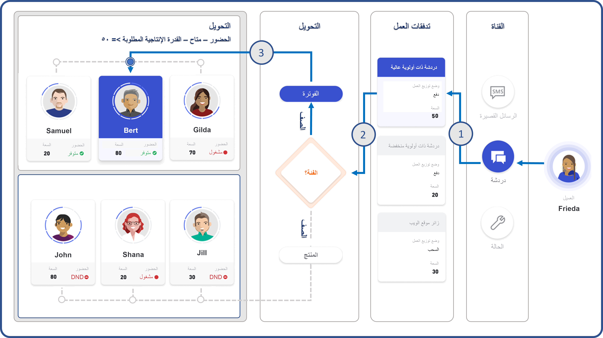
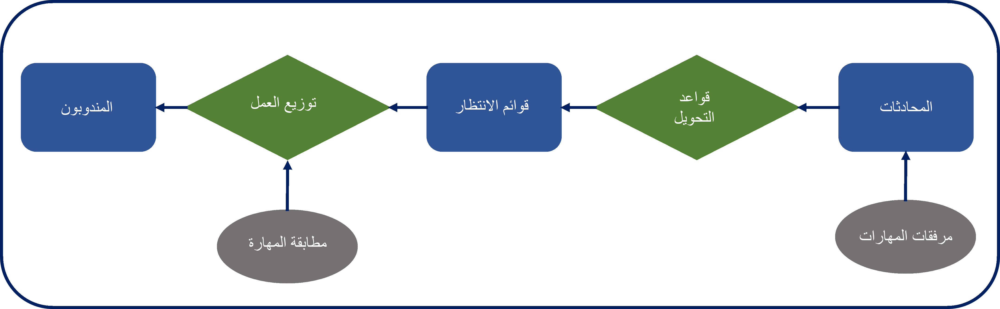

نظراً لأن مؤسسات الدعم توسع العروض التي تقدمها للعملاء، فقد يصبح من الصعب على المندوبين تخصيص الوقت المطلوب للحفاظ على فهم عميق للمجالات التي تدعمها المؤسسة. لهذا السبب، يميل العديد من المندوبين إلى أن يصبحوا أكثر مهارةً في مجالات محددة مقارنةً بغيرها. يعني هذا العامل، جنباً إلى جنب مع عوامل أخرى مثل معدل دوران الوكيل والحاجة إلى دعم العملاء عبر مناطق متعددة، أن المؤسسات بحاجة إلى ضمان اتصال العملاء بمندوبين لديهم المهارات اللازمة لحل مشكلاتهم.

تتضمن ميزة التوجيه الموحد في Microsoft Dynamics ‏365 Customer Service حل توجيه مستند إلى المهارات ويساعد المؤسسات على التعامل مع مشكلات الدعم هذه بشكل أكثر فاعليةً. تساعد واجهته القابلة للتكوين على ضمان توجيه المحادثات إلى المندوبين الذين لديهم المهارات ومستويات الكفاءة التي تتطابق مع تلك المستويات المحددة في المحادثة الواردة.

من خلال التوجيه المستند إلى المهارات، يمكن للمؤسسات أن تصمم بشكل أفضل كيفية دعمها لعملائها استناداً إلى العوامل الرئيسية، مثل المنتجات، والمناطق، والشهادات، والمزيد. على سبيل المثال، قد تقدم مؤسستك دعماً للمنتجات للعملاء في جميع أنحاء أوروبا. أثناء اتصال العملاء بالدعم، ستحتاج إلى التأكد من حصولهم على الدعم بشأن المنتج الأنسب وتوجيههم إلى مندوب يتحدث لغتهم. على سبيل المثال، يجب إرسال عميل من إسبانيا يتصل بمؤسستك بشأن مشكلة Microsoft Teams إلى شخص لديه معرفة بـ Microsoft Teams ومن يتحدث الإسبانية. باستخدام التوجيه المستند إلى المهارات، سيحدد التوجيه الموحد المندوبين، الذين لديهم المهارات المطلوبة، ثم يوزع عنصر العمل على أحدهم.

إن استخدام التوجيه المستند إلى المهارات له مزايا عديدة. نظراً لأنه يمكن للمؤسسات استخدامه مع قوائم الانتظار الحالية وإمكانات التوجيه، فإنها ستختبر تحسينات شاملة واسعة النطاق، بما في ذلك:

-   **حل محادثة أسرع** - يتم تعيين الحالات للمندوبين بشكل أسرع وأكثر كفاءةً من خلال تحديد المندوبين الأكثر تأهيلاً لمعالجة المشكلة.

-   **الحد الأدنى من الصيانة العامة لقائمة الانتظار** - يمكن للمؤسسات قضاء وقت أقل في إدارة مستخدمي قائمة الانتظار وإعداد قواعد التوجيه، لأن المحادثات سيتم توجيهها استناداً إلى مهارات المندوبين.

-   **الإنتاجية المحسَّنة** - نظراً لأن المندوبين يتم تعيين حالات لهم بناءً على مهاراتهم وقدراتهم، فيمكنهم أن يكونوا أكثر إنتاجيةً من خلال العمل على العناصر، التي هم أكثر درايةً بها ومهارةً فيها.

-   **إدارة مؤشرات الأداء الأساسية ورضا العملاء (CSAT)** - من خلال ضمان عمل أكثر المندوبين المؤهلين في العناصر، ستزيد درجات رضا العملاء (CSAT).

## نظرة عامة على التوجيه المستند إلى المهارات

تستعرض الأقسام التالية كيفية إجراء التوجيه والتوزيع باستخدام التوجيه الموحد. تتكون عملية توزيع العمل والتوجيه من خطوتين:

1.  **التوجيه** - يتم توزيع المحادثات على قائمة الانتظار الأنسب استناداً إلى قواعد التوجيه التي تم إعدادها للمؤسسة.

1.  **توزيع العمل** - يتم تخصيص المحادثات للمندوبين الذين هم أعضاء في قائمة الانتظار هذه في الوقت الحقيقي، استناداً إلى السعة المتاحة للمندوب وحضوره الحالي.

## التوجيه الموحد وتوزيع العمل

توضح الصورة التالية مثالاً للتوجيه الموحد وتوزيع العمل على مستوى عالٍ.

> [!div class="mx-imgBorder"]
> 

في المثال السابق، تكون عملية التوجيه الموحد وتوزيع العمل كما يلي:

1.  يبدأ عميل يُسمى Frieda محادثة دردشة. بعد تحديد أن Frieda تتواصل من خلال قناة دردشة، سيقوم النظام بتحديد تدفق العمل كمنتج وفوترة الدردشة الحية. تتطلب عناصر المحادثة في تدفق العمل هذا سعة 50 وحدة. تعيّن مؤسستك سعة 100 لكل مندوب افتراضياً، وسيقل هذا الرقم عند تعيين العناصر إليها. يشير هذا النهج إلى أن النظام لن يأخذ في الاعتبار سوى مندوبين بسعة متاحة تبلغ 50 أو أكثر. عند تعيين هذه المحادثة إلى عامل، سيقوم النظام بحظر (إزالة) 50 وحدة من قدرة المندوب.

1.  سيبدأ منطق توزيع العمل والتوجيه. تساعد متغيرات السياق في تخزين المعلومات السياقية التي يمكن لمحرك التوجيه تطبيقها. 
    باستخدام متغيرات السياق هذه، ستحدد قواعد توجيه تدفق العمل أن هذه المحادثة مرتبطة بالفوترة وسترسل المحادثة إلى قائمة انتظار الفوترة.

1.  بعد وصول المحادثة إلى قائمة انتظار الفوترة، سيخصص النظام المحادثة إلى المندوب الذي يكون عضواً في قائمة انتظار الفوترة والذي يستوفي المعايير التالية:

    -   سعة 50 وحدة أو أكثر

    -   حالة الحضور الحالية متاحة

من بين الأعضاء الذين تم تعيينهم في قائمة انتظار إعداد الفواتير، يمتلك Bert فقط السعة والحضور المطلوبين. نتيجة لذلك، سيقوم النظام بتعيين المحادثة إلى Bert. عندما يبدأ Bert العمل على المحادثة، سيقوم النظام بتغيير حالة حضور Bert إلى مشغول، وتقليل سعة Bert المتبقية من 80 وحدة إلى 50 وحدة، ثم تحديثها إلى 30 وحدة.

## موضع ملائمة التوجيه المستند إلى المهارات

باستخدام التوجيه المستند إلى المهارات، لا يزال يتم توجيه العناصر إلى قائمة انتظار قبل توزيعها على المندوب المناسب. الاختلاف الأساسي هو أن كل محادثة سيكون لها مهارات مرتبطة بها. عندما يحاول النظام تحديد وكيل لإرسال العنصر إليه، فإنه سيبحث عن مندوب تتطابق مهاراته مع المهارات المحددة في عنصر العمل.

يوضح الرسم التخطيطي التالي مثالاً لعملية التوجيه المستندة إلى المهارات.

> [!div class="mx-imgBorder"]
> 

كما هو موضح في الرسم التخطيطي السابق، فإن عملية التوجيه المستند إلى المهارات تكون كما يلي:

1.  عندما يبدأ العميل محادثة، سيقوم النظام بإرفاق المهارات بالمحادثة بناءً على قواعد تصنيف العمل، التي تم تحديدها في التطبيق.
    
    على سبيل المثال، يمتلك عميل من إسبانيا Xbox 360 ويحتاج إلى الحصول على الدعم. عندما يقوم هذا العميل بتسجيل الدخول إلى مدخل العميل ويبدأ محادثة، يمكنك تقديم سؤال استبيان ما قبل الدردشة يطالبه باختيار Xbox 360 كجهاز من قائمة. إذا قمت بتمكين معلومات الموقع، فسيتم تسجيل الموقع الجغرافي لإسبانيا للعميل. باستخدام قواعد إرفاق المهارات، سيقوم النظام بإرفاق منتج Xbox 360 واللغة الإسبانية كمهارات للمحادثة.

1.  استناداً إلى قواعد التوجيه المحددة لتدفق العمل، سيقوم النظام بتوجيه المحادثة إلى قائمة الانتظار المناسبة.

1.  بعد إضافة العنصر إلى قائمة الانتظار المناسبة، سيبدأ نظام توزيع العمل في مطابقة مهارات المندوبين مع تلك المهارات المرتبطة بالمحادثة. بعد العثور على تطابق وفقاً لمهارات المطابقة التامة أو الأقرب، سيقوم محرك توزيع العمل بتعيين المحادثة إلى المندوب.

## نشر التوجيه المستند إلى المهارات

لنشر التوجيه المستند إلى المهارات، تحتاج المؤسسات إلى تحديد المهارات اللازمة والمستويات المختلفة من إتقان المهارة التي يجب على مندوبيها العمل على حلها.

على مستوى عالٍ، إن خطوات نشر التوجيه المستند إلى المهارات هي:

1.  إنشاء نموذج (نماذج) التصنيف.

1.  إنشاء أنواع المهارات والمهارات.

1.  تعيين المهارات إلى المندوبين.

1.  تعيين خوارزمية مطابقة المهارات الافتراضية لتدفق العمل.

1.  تحديد طريقة تصنيف المهارات المراد استخدامها.

1.  تحديد طريقة التعيين التي سيتم استخدامها.

1.  تمكين عنصر تحكم المهارات للمندوبين.

ستدرس الوحدات المتبقية في هذه الوحدة كل خطوة بمزيد من التفصيل. 
