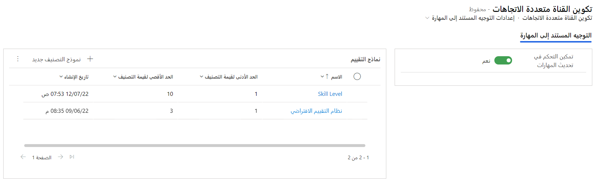
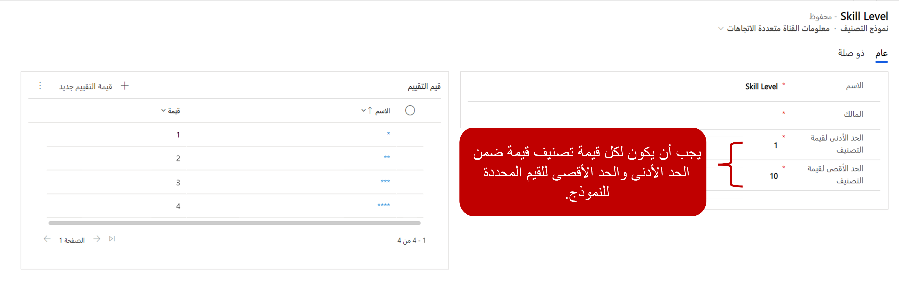

إن الخطوة الأولى التي ستحتاج إلى اتخاذها هي تحديد نموذج تصنيف واحد على الأقل سيتم استخدامه لتوزيع المحادثات. وتُعد هذه الخطوة مهمة لأنه يجب تعيين المهارات لكل مندوب يتم توجيه المحادثات إليه. عندما تضيف مهارة إلى أحد المندوبين، ستحتاج إلى تحديد مدى كفاءة المندوب في تلك المهارة. بإمكان هذا التعريف أن يساعد النظام على توزيع المحادثة بشكل مناسب بالاستناد إلى منطق المطابقة المحدد. على سبيل المثال، يمكنك استخدام نموذج تصنيف للمساعدة في تحديد مدى طلاقة شخص ما في لغة معينة. وكلما ازدادت القيمة التي تم منحها لأحد المندوبين في استخدام لغة ما، ازدادت كفاءته في استخدام هذه اللغة.

لتحديد نماذج التصنيف، انتقل إلى مركز مسؤولي Dynamics 365 Customer Service عن طريق تحديد **الرؤى** ضمن مجموعة **العمليات‏‎**. ضمن إعدادات ميزة الذكاء الاصطناعي‬، حدد **التوجيه المستند إلى المهارة**. ضمن نماذج التصنيف، سيتم عرض نموذج تصنيف افتراضي على الأرجح. يمكنك إضافة المزيد من نماذج التصنيف عن طريق تحديد الزر **نموذج تصنيف جديد**.

> [!div class="mx-imgBorder"]
> 

تتطلب نماذج التصنيف قيمة تصنيف دنيا وقيمة تصنيف قصوى عند تحديدها. وتساعد هذه القيمة في تعيين المقياس حيث يتم تحديد قيم التصنيف الفردية. عندما يكون نموذج التصنيف موجوداً لديك، يمكنك إضافة قيم التصنيف عن طريق تحديد الزر **قيمة تصنيف جديدة**. ستحتاج كل قيمة تصنيف يتم تحديدها إلى اسم وقيمة. يجب أن تقع القيمة بين قيمة التصنيف الدنيا وقيمة التصنيف القصوى المحددة لنموذج التصنيف.

> [!div class="mx-imgBorder"]
> 

## مستوى الكفاءة الموصى به

بالاستناد إلى التعقيد المطلوب وحجم قواعد المطابقة المحتملة التي قد تطبقها مؤسستك، تأكد من أن لديك تنوعاً كافياً في قيم التصنيف لتوفير المرونة أثناء المضي قدماً. ولهذا السبب، ننصحك باستخدام نموذج تصنيف مع قيمة دنيا من 1 وقيمة قصوى من 10 وبتحديد قيم التصنيف وفقاً لذلك.

على سبيل المثال، يمكنك إنشاء نموذج تصنيف يسمى "كفاءة مهارة المندوب"، حيث تكون القيمة الدنيا 1 والقيمة القصوى 10. بعد ذلك، سيتم تحديد كل قيمة تصنيف بالاستناد إلى المخطط التالي.

| اسم قيمة التصنيف    | القيمة |
|----------------------|-------|
| ★★★★★★★★★★           | 10    |
| ★★★★★★★★★            | 9     |
| ★★★★★★★★             | 8     |
| ★★★★★★★              | 7     |
| ★★★★★★               | 6     |
| ★★★★★                | 5     |
| ★★★★                 | 4     |
| ★★★                  | 3     |
| ★★                   | 2     |
| ★                    | 1     |

يوفر نموذج التصنيف هذا المرونة اللازمة التي تحتاجها ويساعدك في التعرف بسهولة على مهارات المندوب باستخدام تصنيف النجوم. بعد تحديد نماذج التصنيف لمؤسستك، يمكنك بدء تحديد المهارات الفردية وأنواع المهارات التي سيتم استخدامها.
