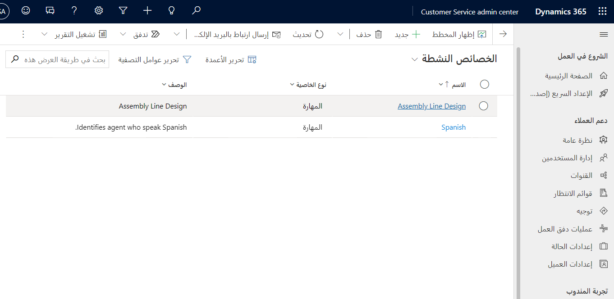
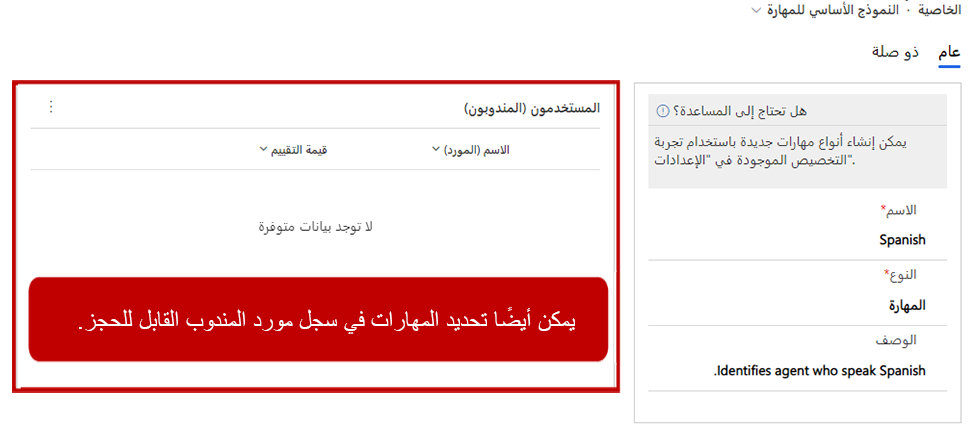

تتبع كل مؤسسة طرقاً مختلفة لتصنيف مهارات المندوب بالاستناد إلى احتياجاتها وإجراءاتها. على سبيل المثال، قد تمثل بعض المهارات شهادة أو إنجازاً، وقد تمثل أيضاً الخبرة في استخدام المنتج. وقد تمثل المهارات الأخرى مهارات جسدية أو مواهب، مثل الخبرة في استخدام لغة برمجة أو لغة فعلية يتحدث بها المندوب. ونظراً لوجود اختلافات بين مؤسسة وأخرى، يسمح لك التوجيه المستند إلى المهارة بتحديد أنواع مهارات متعددة كي تتوافق بشكل أفضل مع احتياجات مؤسستك. يمكنك إضافة أنواع المهارات هذه إلى المهارات كما تم تحديدها للمساعدة في عناصر مثل التحليلات وإعداد التقارير وما إلى ذلك.

## تحديد أنواع المهارات

قبل أن تتمكن من تحديد المهارات، تحتاج مؤسستك إلى نوع مهارة واحد على الأقل تم تحديده في النظام لدى مؤسستك. على سبيل المثال، إذا أردت إضافة اللغة الإسبانية كمهارة، فستحتاج أولاً إلى نوع مهارة يسمى **اللغة**. وبعد ذلك، يضيف النظام نوع المهارة هذا إلى أي مهارة تمثل لغة يتحدث بها المندوب. أولاً، ستحتاج إلى إنشاء نوع مهارة. بعد ذلك، يمكنك تحديد المهارات المقترنة بهذا النوع.

يمكنك تحديد انواع المهارات عبر مجموعة الخيارات **نوع خاصية المورد القابل للحجز‬** في Microsoft Power Apps Maker Portal. لأن هذه الوظيفة ليست فريدة في القناة متعددة الاتجاهات لـ Customer Service، ستحتاج إلى تحديد هذه الأنواع عن طريق تسجيل الدخول إلى [https://make.powerapps.com](https://make.powerapps.com/?azure-portal=true) كشخص لديه حقوق إدارية في البيئة التي تم فيها نشر القناة متعددة الاتجاهات لـ Customer Service. في جزء التنقل في مخطط الموقع، قم بتوسيع **البيانات** وحدد **الاختيارات**. حدد موقع مجموعة الخيارات **نوع خاصية المورد القابل للحجز‬** وافتحها.

> [!div class="mx-imgBorder"]
> 

من المحتمل أن تكون أنواع المهارات قد تم تحديدها بالفعل. ويمكنك إضافة المزيد من أنواع المهارات بالاستناد إلى احتياجات مؤسستك عن طريق تحديد **إضافة عنصر جديد** وتحديد النوع الذي تريد إضافته.

> [!div class="mx-imgBorder"]
> 

## تحديد المهارات

بعد أن تحدد أنواع المهارات اللازمة، يمكنك إنشاء المهارات المعينة التي سيتم تحديدها للمندوبين والمحادثات الواردة. على عكس أنواع المهارات، سيتم تحديد المهارات في تطبيق مركز مسؤولي Customer Service، ويمكنك الوصول إليها في القسم **إدارة المستخدمين‬** عن طريق تحديد **المهارات**.

> [!div class="mx-imgBorder"]
> 

عند إنشاء المهارات، ستحتاج إلى تحديد اسم ونوع مهارة. يمكنك الاختيار من أي نوع مهارة تم تحديده. بعد حفظ المهارة، سيظهر قسم المندوبين، حيث يمكنك تحديد المندوبين الذين يتمتعون بهذه المهارة بالإضافة إلى مستوى كفاءتهم في هذه المهارة.

> [!div class="mx-imgBorder"]
> 

قبل أن تتمكن من تعيين مهارة إلى أحد المندوبين، ستحتاج إلى إقران سجل مورد قابل للحجز به. ستتضمن الوحدة التالية شرحاً لعملية إنشاء سجل مورد قابل للحجز.
