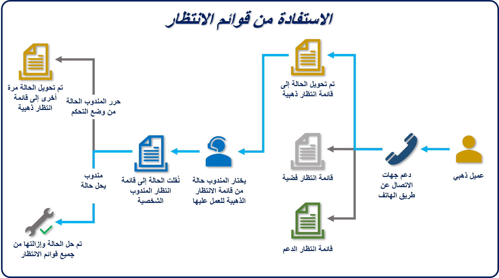

يتوقع العملاء أن تتم معالجة طلباتهم أو مشكلاتهم بطريقة منظمة وفي الوقت المناسب. تخيل أنك تنتظر سيارة أجرة في فندق، وهناك طابور طويل من الاشخاص الآخرين الذين ينتظرون أيضاً سيارات الأجرة. إذا كان الجميع يتنافسون على سيارة الأجرة نفسها، فإن النتيجة ستكون الفوضى. لذلك، من أجل إدارة خطوط ركاب سيارات الأجرة بشكل أفضل، غالباً ما تستخدم الفنادق نظام صف الانتظار، حيث يتم تشكيل خط منظم. عندما يتوفر مورد (سيارة أجرة)، يحصل راكب أو مجموعة من الركاب على سيارة أجرة ويغادر إلى وجهته في الوقت المناسب.

يمكن تطبيق نفس المفهوم على مشكلات العملاء والأسئلة والطلبات. تستخدم العديد من مراكز دعم العملاء صفوف الانتظار لإدارة توجيه الحالات الواردة.

على سبيل المثال، يحق للعميل الذي اشترى عقد دعم ذهبي عادةً الحصول على مستوى خدمة مختلف عن العميل الذي لم يشتر عقد دعم. للمساعدة في ضمان حصول العملاء الذهبيين على مستوى الخدمة التي يدفعون مقابلها، يمكنك استخدام قواعد التوجيه لتوجيه الحالات التي يرسلها هؤلاء العملاء إلى صف انتظار الخدمة الذهبية. قد يتم تجهيز صف الانتظار هذه من قِبل كبار مندوبي الدعم الذين يركزون فقط على دعم العميل الذهبي. يمكن إرسال جميع العملاء الآخرين إلى صف انتظار دعم قياسية بها عدد أكبر من الحالات. لا يزال كلا النوعين من العملاء مدعومين، ولكن من المحتمل أن يحصل العملاء الذهبيين على الدعم بشكل أسرع، لأنهم في صف الانتظار الذهبية ذات الأولوية الأعلى.

يستخدم Microsoft Dynamics 365 صفوف الانتظار لإدارة أصناف العمل مثل الحالات أو الأنشطة أو أنواع السجلات الأخرى.

تتوفر عدة أنواع من صفوف الانتظار في Dynamics 365:

-   **عامة:** ستكون صفوف الانتظار هذه مرئية للمؤسسة بأكملها.

-   **خاص:** ستكون صفوف الانتظار مرئية فقط للمستخدمين الذين تم تعيينهم كأعضاء في صف الانتظار.

-   **شخصي:** ستكون صفوف الانتظار هذه مرتبطة بمستخدم أو فريق معين، وتكون مرئية فقط لهم.

يتم إنشاء صفوف الانتظار العامة والخاصة لدعم احتياجات المؤسسة. بشكل افتراضي، يتم إنشاء صفوف الانتظار الشخصية تلقائياً عند تحديد مستخدم أو فريق جديد. تقوم بتوجيه الأنشطة والسجلات المهمة التي تم تعيينها إلى مستخدم أو فريق معين. يمكن أيضاً استخدام صفوف انتظار إضافية لدعم إدارة الخدمة في بيئة تعاونية صف على الفريق.

يمكن توجيه الحالات إلى صفوف الانتظار بعدة طرق. على سبيل المثال، يمكن للمندوب وضع الحالة يدوياً في صف انتظار محددة. لكن المؤسسة التي تتعامل مع مئات أو آلاف الحالات يومياً قد تجد أن هذه العملية تتطلب عمالة مكثفة للغاية. لذلك، في معظم الحالات، يتم توجيه الحالات إلى صفوف الانتظار كجزء من عملية إدارة الخدمة التلقائية. ستتم تغطية هذه العملية في وحدة لاحقة.

تُظهر الصورة التالية مثالاً نموذجياً لكيفية استخدام صفوف الانتظار في Dynamics 365.

1.  يفتح العميل الذهبي حالة جديدة من خلال الاتصال بالدعم.

1.  يتم توجيه الحالة إلى صف انتظار ذهبية.

    -   السجلات في صف الانتظار الذهبية مرئية فقط لأعضاء صف الانتظار تلك.

1.  يختار مندوب الصنف من صف الانتظار للعمل عليه.

1.  اُدْخَل الصنف في صف انتظار المندوب الشخصية.

1.  بعد أن يحل المندوب الحالة، تتم إزالتها من صف الانتظار الشخصية الخاصة به أو بها.

    -   إذا تعذر على المندوب إنهاء العمل في صنف صف الانتظار، فيمكنه تحرير الصنف. بعد ذلك، يتم وضعه مرة أخرى في صف الانتظار الذهبية، بحيث يمكن لمندوب آخر العمل عليه. في الوحدات المتبقية، سندرس، بمزيد من التفصيل، الدور الذي تلعبه صفوف الانتظار في إدارة الحالات. على سبيل المثال، ستتعرف على كيفية إنشاء صفوف انتظار، والعمل مع الأصناف الموجودة فيها، وإنشاء قواعد التنفيذ التلقائي التي توجه الحالات إليها.