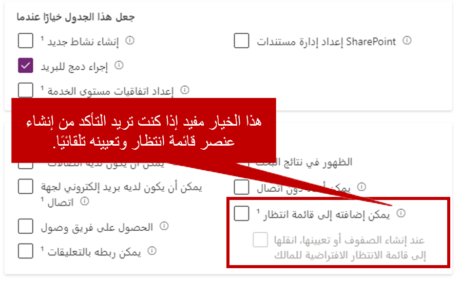

من خارج الصندوق، يتم تكوين قوائم الانتظار مسبقاً للحالات والأنشطة فقط. أنها توفر قيمة هائلة لسيناريوهات الأعمال المحددة في Microsoft Dynamics ‏365. يمكنك استخدام قوائم الانتظار لتحسين الأنشطة المتعلقة بالمبيعات وتبسيطها، أو لتوفير معالجة أفضل وأسرع لعمليات الفحص أو الأعمال الورقية أو التطبيقات.

فيما يلي بعض السيناريوهات التي يمكن تطبيق قوائم الانتظار فيها:

-   **تحسين المبيعات:** يمكن لمدير المبيعات توجيه العملاء المحتملين الجدد إلى صف انتظار  *استعلام*  عام. يمكن بعد ذلك فحص كل قائد في قائمة الانتظار وتوجيهه إلى المدير التنفيذي للحساب الأكثر تأهيلاً للعمل عليه.

-   **معالجة المطالبات:** يمكن لشركة التأمين توجيه مطالبات التأمين إلى صفوف انتظار مختلفة، اعتماداً على نوع المطالبة التي يتم تقديمها (على سبيل المثال، المنزل أو السيارة أو العمل). ويمكن لمندوب المطالبات المتخصص في أحد أنواع المطالبات هذه بعد ذلك تحديد مطالبة للعمل عليها، ونقلها إلى قائمة الانتظار الشخصية الخاصة به.

-   **معالجة الموافقة:** يمكن لموظف القروض توجيه طلبات القروض إلى صف انتظار مدير مختلفة، اعتماداً على نوع القرض المعني. يمكن للمدير بعد ذلك إما الموافقة على القرض أو رفضه، ويمكنه إعادته إما إلى صف الانتظار الشخصية لضابط القرض أو إلى صف انتظار *معتمدة* .

بغض النظر عن سبب العمل، تساعد القدرة على توجيه السجلات من قائمة انتظار إلى أخرى المؤسسات على إدارة الجوانب التشغيلية لأعمالها من حيث صلتها باستراتيجيتها لإدارة علاقات العملاء.

يمكن توجيه معظم أنواع السجلات إلى صفوف الانتظار في Dynamics 365. ولكن بالنسبة للجداول الأخرى بخلاف الحالات والأنشطة، لا يتم تشغيل القدرة على استخدام صفوف الانتظار بشكل افتراضي. للسماح للجداول الأخرى باستخدام صفوف الانتظار، يجب إجراء تخصيص.

> [!IMPORTANT]
> نظراً لأن تخصيص النظام مطلوب لإعداد جداول أخرى لصفوف الانتظار، يجب أن يكون لديك امتيازات التخصيص المناسبة في مؤسسة Dynamics 365 الخاصة بك.

لمزيد من المعلومات حول أدوار أمان Dynamics 365، راجع [امتيازات وأدوار الأمان](/dynamics365/customer-engagement/admin/security-roles-privileges/?azure-portal=true).

## قم بإعداد جدول لاستخدام صفوف الانتظار

لإعداد جدول لاستخدام صفوف الانتظار، ستحتاج إلى استخدام بوابة صانع تطبيقات Power Apps. يمكنك الوصول إلى بوابة صانع التطبيق بالانتقال إلى [Power Apps](https://make.powerapps.com/?azure-portal=true). بمجرد دخولك إلى البوابة الإلكترونية، تأكد من أنك في البيئة التي تحتوي على الجدول الذي تريد تمكينه.

باستخدام التنقل على اليسار، قم بتوسيع البيانات وحدد الجداول. افتح الجدول الذي تريد تمكينه لصفوف الانتظار. بمجرد فتح الجدول، حدد الإعدادات. في قائمة تحرير الجدول على اليمين، قم بتوسيع المزيد من الإعدادات. قم بتوسيع عنوان التعاون وحدد تمكين صفوف الانتظار. يمكنك أيضاً تحديد ما إذا كان يجب إنشاء عنصر صف الانتظار تلقائياً ونقله إلى صف الانتظار الشخصية لمالك السجل. يمكن أن تكون هذه الوظيفة مفيدة إذا كنت تعلم أن الشخص الذي يقوم بإنشاء السجل سيكون مسؤولاً عنها، وتريد التأكد من أن العنصر لن يظهر في صفوف الانتظار التي لا ينبغي أن يكون فيها.

> [!div class="mx-imgBorder"]
> 

بعد الانتهاء من إعداد الجدول لاستخدام قوائم الانتظار، حدد "تم"، ثم حدد الزر "حفظ الجدول".

> [!IMPORTANT]
> بعد إعداد جدول لاستخدام قوائم الانتظار وحفظ التغييرات، لا يمكنك إيقاف تشغيل قوائم الانتظار.
