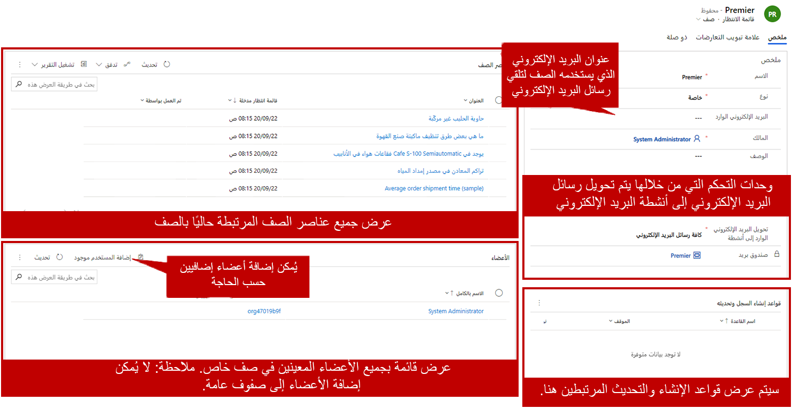

عندما تكون المؤسسة جاهزة للبدء في استخدام قوائم الانتظار، يمكن إنشاؤها استنادا إلى احتياجات تنظيمية محددة. قبل إضافة الصفوف إلى مؤسسة، خذ بعض الوقت للنظر في العدد الإجمالي للصفوف المطلوبة وما سيتم استخدامها من أجله.

لإنشاء الصفوف، افتح **إدارة الخدمات** في مركز خدمة العملاء. ضمن العنوان إعدادات الحالة، حدد الصفوف.

عند إنشاء صف جديد، يكون الاسم ونوع الصف مطلوبين. يمكنك تحديد معلومات أخرى أيضا، ولكن لا يمكن حفظ قائمة الانتظار ما لم يتم تحديد هاتين الخصائص.

تتوفر أنواع مختلفة من قوائم الانتظار:

-   **الشخصية:** ترتبط الصفوف هذه بمستخدم أو فريق معين. يتم إنشاؤها بواسطة النظام.

    -   يتم إنشاء قوائم الانتظار الشخصية تلقائيا بواسطة النظام عند إضافة مستخدم أو فريق إلى Dynamics 365. لا يمكن إنشاؤها يدوياً.

    -   يتعذر تحرير العضوية في قائمة الانتظار يدوياً. بإضافة أعضاء الفريق وإزالتها، يمكنك ضبط العضوية لقوائم الانتظار المقترنة بفريق.

-   **عام:** يمكن لجميع المستخدمين مشاهدة الصفوف هذه والوصول إليها، اعتماداً على دور الأمان الخاص بهم.

    -   يختار المستخدمون العناصر من قائمة الانتظار. بعد ذلك، يتم نقل العناصر التي يختارها المستخدم إلى قائمة انتظار المستخدم الشخصية.

-   **خاص:** يتم تعيين الوصول إلى الصفوف هذه لمستخدمين محددين. (يتم تحديد الأعضاء في سجل قائمة الانتظار.)

    -   يختار المستخدمون العناصر من قائمة الانتظار. بعد ذلك، يتم نقل العناصر التي يختارها المستخدم إلى قائمة انتظار المستخدم الشخصية.

## اعتبارات البريد الإلكتروني

إذا كان قائمة الانتظار ستتلقى بريداً إلكترونياً، فيجب أن يكون لها اسم مستعار بريد إلكتروني مقترن. يجب أن يقترن هذا الاسم المستعار للبريد الإلكتروني بسجل علبة بريد عامل في Dynamics 365. يمكن استخدام إعدادات النظام لتحديد ما إذا كان قد تمت الموافقة على قائمة انتظار تحتوي على اسم مستعار للبريد الإلكتروني لقبول عناصر البريد الإلكتروني الواردة.

لمزيد من المعلومات حول إعداد صناديق بريد Dynamics 365، راجع [توصيل Dynamics 365 (online) بـ Exchange Online](/dynamics365/customer-engagement/admin/connect-exchange-online?azure-portal=true).

بالإضافة إلى تحديد سجل صندوق بريد لقائمة انتظار، يمكنك تحديد رسائل البريد الإلكتروني التي تأتي إلى قائمة الانتظار التي سيتم تحويلها إلى أنشطة البريد الإلكتروني.

لديك عدة خيارات:

-   جميع رسائل البريد الإلكتروني

-   رسائل البريد الإلكتروني رداً على البريد الإلكتروني من Dynamics 365

-   رسائل البريد الإلكتروني من عملاء Dynamics 365 المتوقعين أو جهات الاتصال أو الحسابات

-   رسائل البريد الإلكتروني من سجلات Dynamics 365 التي تم تمكينها للبريد الإلكتروني

يعد تحديد خيار البريد الإلكتروني أمراً مهماً لأنه يحدد ما سيتم تعريفه على أنه أنشطة البريد الإلكتروني وما هي أنشطة البريد الإلكتروني التي يمكن تحويلها تلقائياً إلى سجلات حالة في النظام. على سبيل المثال، قد تتلقى قائمة انتظار الدعم رسائل بريد إلكتروني من العملاء الموجودين في تطبيق Dynamics 365، ولكنها قد تتلقى أيضاً بريداً إلكترونياً من العملاء غير عملاء Dynamics 365. في هذا السيناريو، قد تحتاج إلى استخدام إعداد *جميع رسائل البريد الإلكتروني*.

> [!IMPORTANT]
> قبل أن تتمكن قائمة الانتظار من تلقي البريد الإلكتروني، يجب الموافقة على علبة البريد المقترنة بقائمة الانتظار ثم تشغيلها. وبهذه الطريقة، تشير إلى أنه لا بأس أن يتلقى صندوق البريد الإلكتروني رسالة البريد الإلكتروني، وأنه جاهز للقيام بذلك. حدد الزر **فتح صندوق البريد** على شريط الأوامر، وحدد **الموافقة على صندوق البريد**، ثم حدد الزر **اختبار وتمكين**.

لمزيد من المعلومات حول الموافقة على صناديق البريد وتشغيلها، راجع [الموافقة على البريد الإلكتروني](/dynamics365/customer-engagement/admin/connect-exchange-online?azure-portal=true#approve-email).

بعد حفظ قائمة انتظار للمرة الأولى، إذا تم تعيينها كقائمة انتظار خاصة، يمكنك تعريف أعضائها. يمكن للأعضاء الذين تعينهم لقائمة انتظار خاصة العمل معها. بالإضافة إلى ذلك، عند توجيه العناصر إلى قائمة الانتظار، يمكنك مشاهدة العناصر الموجودة في قائمة الانتظار. يمكنك أيضاً مشاهدة أي قواعد تتعلق بإنشاء سجل وتحديث القواعد المقترنة بالصف.

> [!div class="mx-imgBorder"]
> 

لمزيد من المعلومات حول قواعد إنشاء السجلات وتحديثها، راجع [إعداد القواعد لإنشاء السجلات أو تحديثها تلقائياً](/dynamics365/customer-engagement/customer-service/set-up-rules-to-automatically-create-or-update-records).

بعد إنشاء صف، يكون بحالة *نشط*. إذا لم يتم استخدام قائمة الانتظار لسبب ما، يمكنك تعطيلها. إذا وجدت أن قائمة الانتظار مطلوبة مرة أخرى لاحقا، يمكنك إعادة تنشيطها.

> [!IMPORTANT]
> يمكن حذف قوائم الانتظار فقط إذا لم تكن هناك عناصر قائمة انتظار فيها. يجب إزالة جميع العناصر الموجودة في قائمة انتظار (الانتهاء أو حذفها أو نقلها إلى قائمة انتظار أخرى) قبل حذف قائمة الانتظار.

لمزيد من المعلومات حول إنشاء صفوف في Dynamics 365، راجع [إنشاء صف (مركز خدمة العملاء)](/dynamics365/customer-engagement/customer-service/set-up-queues-manage-activities-cases?azure-portal=true#create-a-queue-customer-service-hub).

بعد إنشاء قائمة انتظار وتعيين الأعضاء إليها، تكون جاهزة لاستخدامها للمساعدة في تنظيم المعلومات، ويمكن توجيه الحالات إليها.
