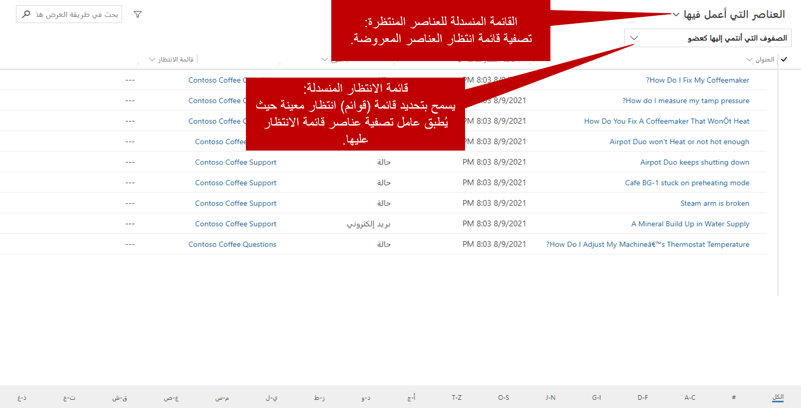

كما ذكرنا في تكوين الكيانات وصفوف الانتظار، يمكن إعداد معظم أنواع السجلات لاستخدام صفوف الانتظار في Microsoft Dynamics 365. ولكن يتم تكوين أنواع سجلات النشاط والحالات فقط مسبقاً لدعم صفوف الانتظار. بعد إعداد نوع السجل لاستخدام صفوف الانتظار، يمكن وضع الأصناف في صفوف الانتظار.

يمكن للمؤسسات استخدام صفوف الانتظار الشخصية والخاصة والعامة لدعم عمليات المبيعات والخدمة. على سبيل المثال، قد يوجه مدير المبيعات العملاء المحتملين إلى صف انتظار عامة ويفحص أصناف صف الانتظار ويحدد بعضها ليتم توجيهها إلى صف الانتظار الشخصية للمستخدم. من خلال توجيه السجلات من صف انتظار إلى أخرى، يمكن للمؤسسات إدارة الجوانب التشغيلية لأعمالها من حيث صلتها باستراتيجيتها لإدارة علاقات العملاء.

> [!NOTE] 
> توفر الصورة السابقة صورة مرئية للمثال الموضح سابقاً. على الرغم من أن التركيز الأساسي لهذه الوحدة هو استخدام صفوف الانتظار لإدارة الحالة، تذكر أنه يمكن استخدام صفوف الانتظار لدعم سيناريوهات متعددة متعلقة بالمبيعات أو متعلقة بالخدمة.

## أصناف صف الانتظار

عندما يتم توجيه سجل مثل حالة أو نشاط إلى صف انتظار، يتم إنشاء سجل منفصل يسمى *صنف صف انتظار*. صنف صف الانتظار هو تمثيل للحالة والنشاط والعميل المتوقع وما إلى ذلك في صف الانتظار. بشكل أساسي، هناك علاقة رأس برأس بين صنف صف الانتظار والسجل المرتبط به (على سبيل المثال، الحالة أو النشاط أو العميل المتوقع المذكور سابقاً).

أصناف صف الانتظار هي ما يراه المندوبون في صف الانتظار، وهي الأصناف التي يستخدمها المندوبون لتحديد سجلات معينة والعمل عليها.

> [!IMPORTANT] 
> يمكن أن يحتوي السجل (على سبيل المثال، الحالة) على صنف صف انتظار في صف انتظار واحدة فقط في كل مرة. 

يمكن إنشاء أصناف صف الانتظار لسجلات الحالة ووضعها في صف انتظار محددة بعدة طرق:

- **يدوياً:** يختار المندوب **إضافة إلى صف الانتظار** أو **حفظ وتوجيه** على شريط الأوامر.
    - **إضافة إلى صف الانتظار:** يختار المندوب يدوياً صف الانتظار لتوجيه السجل إليها.
    - **حفظ وتوجيه:** يستخدم Dynamics 365 قواعد تحويل محددة مسبقاً لتقييم التفاصيل في الحالة وتوجيهها إلى صف انتظار مناسب.

- **تلقائي:** عندما يتم إنشاء حالة تلقائياً، يطبق Dynamics 365 تلقائياً قواعد تحويل محددة مسبقاً لتقييم التفاصيل في الحالة وتوجيهها إلى صف انتظار مناسب.

> [!IMPORTANT]
> ينطبق التوجيه التلقائي فقط إذا تم إنشاء حالة تلقائياً (على سبيل المثال، بواسطة سير عمل أو قاعدة إنشاء سجل أو Power Automate).

> [!NOTE] 
> ستتم مناقشة تحديد قواعد التحويل بمزيد من التفصيل في مجموعات قاعدة التحويل.

## العمل مع صفوف الانتظار وأصناف صف الانتظار

للعمل مع صفوف الانتظار، يجب على المندوبين فتحها أولاً. يمكنهم استخدام إما مخطط الموقع أو دفق لوحة المعلومات الذي تم إعداده لإظهار صف انتظار. تعد مخطط الموقع هي الطريقة الأكثر شيوعًا لفتح صفوف الانتظار.

تعمل شبكة أصناف صف الانتظار بشكل مختلف عن الشبكات الأخرى في Dynamics 365. يقدم خيارين لتصفية البيانات الموجودة فيه:

- **القائمة المنسدلة لأصناف صف الانتظار**: يمكنك التصفية حسب خصائص أصناف صف الانتظار. على سبيل المثال، يمكنك التصفية للحالات التي تعمل عليها أو الحالات المتاحة للعمل فيها أو كافة الأصناف.
- **صف الانتظار المنسدلة:** يمكنك تحديد صف الانتظار التي سيتم تطبيق الفلتر عليها. على سبيل المثال، يمكنك تطبيق المرشح على جميع صفوف الانتظار أو جميع صفوف الانتظار العامة أو صف انتظار معينة.

تعمل هذه القوائم المنسدلة معاً لتحديد أصناف صف الانتظار التي سيتم عرضها في الشبكة. لذلك، يتمتع المندوبون بالمرونة للتأكد من أنهم يرون ما هو مطلوب.

على سبيل المثال، إذا حددت *الأصناف التي أعمل عليها* في قائمة **أصناف صف الانتظار** و *Gold* في قائمة **صف**، ستعرض الشبكة الحالات فقط من صف الانتظار الذهبي التي اخترتها للعمل عليها.

بعد وضع أصناف صف الانتظار في صف انتظار، يكون لدى المندوبون العديد من الخيارات التي يمكنهم استخدامها لإدارتها.

## العمل على واختيار الأزرار

يحتوي كل صنف صف انتظار على حقل **تم العمل بواسطة** يُستخدم لتعيين مسؤولية العمل لصنف صف الانتظار إلى مستخدم. عندما يعمل مستخدم أو فريق معين على صنف صف انتظار، فإن القيمة الموجودة في الحقل **تم العمل بواسطة** تشير إلى صنف صف الانتظار فقط. لم يتأثر مالك السجل الأساسي. الحالة نفسها تحتفظ بنفس المالك. إذا لم يتمكن المندوب من إنهاء العمل الضروري على صنف ما، فيمكنه تحرير الصنف.

## إزالة أصناف صف الانتظار

يمكن *إزالة* أصناف صف الانتظار من صف انتظار في أي وقت بواسطة المستخدمين الذين لديهم أذونات أمان كافية. عندما يقوم مندوب بإزالة صنف صف انتظار من صف انتظار، فإن السجل المرتبط (على سبيل المثال، حالة) لا يتأثر. تتم إزالة صنف صف الانتظار فقط.
> [!IMPORTANT] 
> لا تخلط بين الإزالة وإجراء الحذف.
- **إزالة:** يؤدي هذا الإجراء فقط إلى إزالة صنف صف الانتظار من صف الانتظار.
- **حذف:** يزيل هذا الإجراء صنف صف الانتظار من صف الانتظار **و** يحذف السجل الأصلي (على سبيل المثال، حالة).

## تحرير أصناف صف الانتظار

يؤدي تحرير صنف صف انتظار من صف انتظار إلى إزالة اسم الشخص الذي يعمل حالياً في سجل صنف صف الانتظار.

على سبيل المثال، ستكون كوني واتسون في إجازة لمدة أسبوعين. على الرغم من أنها يمكن أن تمنح حالات Coho Winery الخاصة بها إلى مندوب معين، إلا أنها يمكنها أيضاً الإفراج عن الحالات، حتى يتمكن الأشخاص الآخرون في فريق دعم المستوى 1 الذي يدير صف الانتظار من العمل عليها. في هذا المثال، ستفرج كوني عن الحالات وتحذف اسمها باعتباره الشخص الذي يعمل عليها. الآن، سيرى أي شخص لديه حق الوصول إلى صف انتظار دعم المستوى 1 أن الحالات متاحة ويمكنه البدء في العمل عليها.

الآن بعد أن ناقشنا تقنيات، انظر إلى الصورة التالية لترى عملية دقة الحالة النموذجية تستخدم صفوف الانتظار.

> [!VIDEO https://www.microsoft.com/videoplayer/embed/RE2IJmr]
