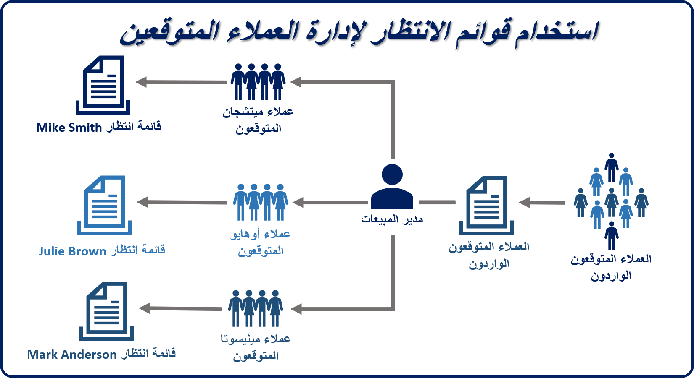
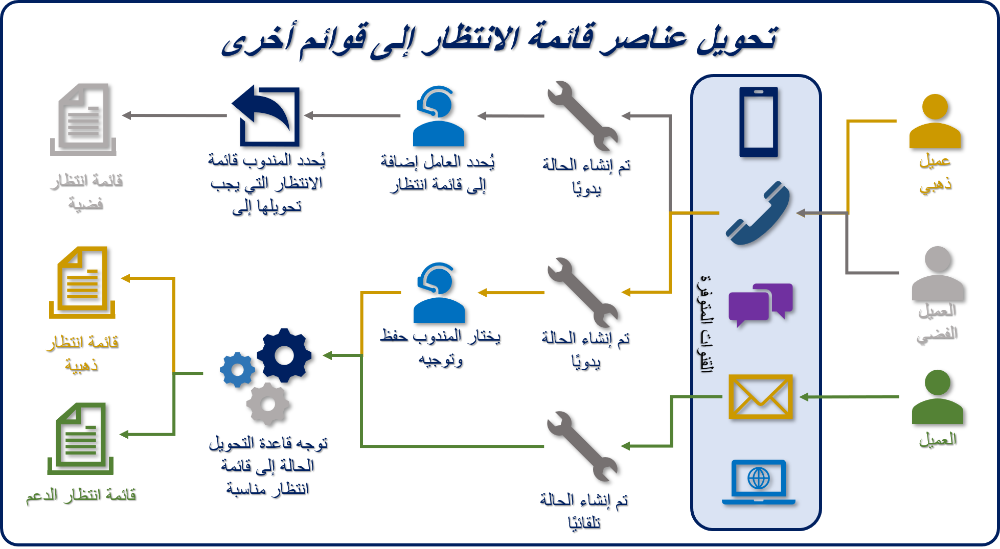
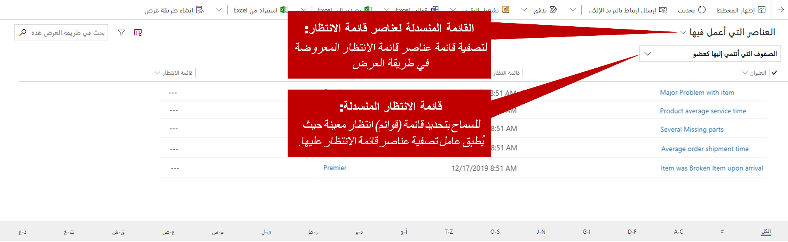
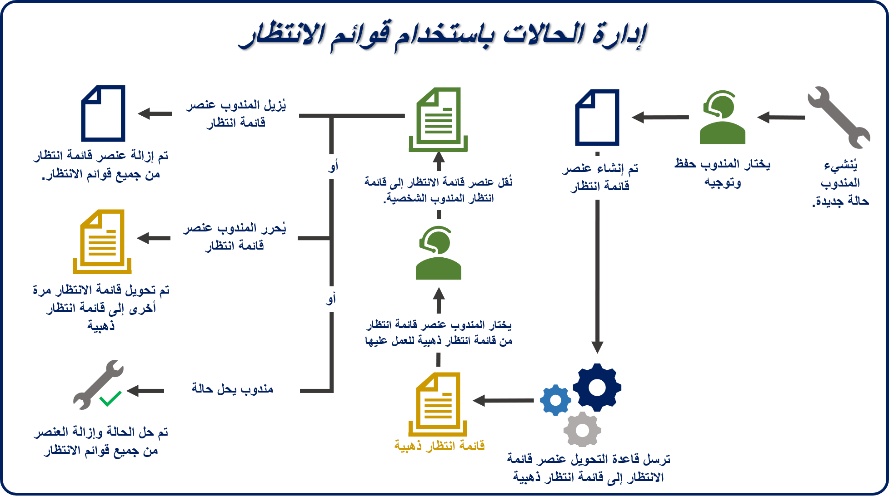

كما ذكرنا في تكوين الجداول وقوائم الانتظار، يمكن إعداد معظم أنواع السجلات لاستخدام قوائم الانتظار في Microsoft Dynamics 365. ولكن يتم تكوين أنواع سجلات النشاط والحالات فقط مسبقاً لدعم قوائم الانتظار. بعد إعداد نوع السجل لاستخدام قوائم الانتظار، يمكن وضع العناصر في قوائم الانتظار.

يمكن للمؤسسات استخدام قوائم الانتظار الشخصية والخاصة والعامة لدعم عمليات المبيعات والخدمة. على سبيل المثال، قد يوجه مدير المبيعات العملاء المتوقعين إلى قائمة انتظار عامة ويفحص عناصر قائمة الانتظار ويحدد بعضها ليتم توجيهها إلى قائمة الانتظار الشخصية للمستخدم. من خلال توجيه السجلات من قائمة انتظار إلى أخرى، يمكن للمؤسسات إدارة الجوانب التشغيلية لأعمالها من حيث صلتها باستراتيجيتها لإدارة علاقات العملاء.

> [!NOTE]
> توفر الصورة السابقة صورة مرئية للمثال الموضح سابقاً. على الرغم من أن التركيز الأساسي لهذه الوحدة هو استخدام قوائم الانتظار لإدارة الحالة، تذكر أنه يمكن استخدام قوائم الانتظار لدعم سيناريوهات متعددة متعلقة بالمبيعات أو متعلقة بالخدمة.

## عناصر قائمة الانتظار

عندما يتم توجيه سجل مثل حالة أو نشاط إلى صف انتظار، يتم إنشاء سجل منفصل يسمى *عنصر صف انتظار*. عنصر قائمة الانتظار هو تمثيل للحالة والنشاط والعميل المتوقع وما إلى ذلك في قائمة الانتظار. بشكل أساسي، هناك علاقة واحد إلى واحد بين عنصر قائمة الانتظار والسجل المرتبط به (على سبيل المثال، الحالة أو النشاط أو العميل المتوقع المذكور سابقاً).

عنصر قائمة الانتظار هي ما يراه المندوبون في قائمة الانتظار، وهي العناصر التي يستخدمها المندوبون لتحديد سجلات معينة والعمل عليها.

> [!IMPORTANT]
> يمكن أن يحتوي السجل (على سبيل المثال، الحالة) على عنصر قائمة انتظار في قائمة انتظار واحدة فقط في كل مرة.

يمكن إنشاء عناصر قائمة الانتظار لسجلات الحالة ووضعها في قائمة انتظار محددة بعدة طرق:

-   **يدوياً:** يحدد المندوبون **إضافة إلى صف الانتظار** أو الزر **حفظ وتوجيه** على شريط الأوامر.

    -   **إضافة إلى صف الانتظار:** يختار المندوب يدوياً صف الانتظار لتوجيه السجل إليها.

    -   **حفظ وتوجيه:** يستخدم Dynamics 365 قواعد تحويل محددة مسبقاً لتقييم التفاصيل في الحالة وتوجيهها إلى صف انتظار مناسبة.

-   **تلقائي:** عندما يتم إنشاء حالة تلقائياً، يطبق Dynamics 365 تلقائياً قواعد تحويل محددة مسبقاً لتقييم التفاصيل في الحالة وتوجيهها إلى صف انتظار مناسبة.

> [!IMPORTANT]
> ينطبق التوجيه التلقائي فقط إذا تم إنشاء حالة تلقائياً (على سبيل المثال، بواسطة سير عمل أو قاعدة إنشاء سجل أو Power Automate).

> [!NOTE]
> ستتم مناقشة تحديد قواعد التحويل بمزيد من التفصيل في مجموعات قاعدة التحويل.

## العمل مع قوائم الانتظار وعناصرها

للعمل مع قوائم الانتظار، يجب على المندوبين فتحها أولاً. يمكنهم استخدام إما مخطط الموقع أو دفق لوحة المعلومات الذي تم إعداده لإظهار قائمة الانتظار. تعد مخطط الموقع الطريقة الأكثر شيوعًا لفتح قوائم الانتظار.

تعمل شبكة عناصر قائمة الانتظار بشكل مختلف عن الشبكات الأخرى في Dynamics 365. يقدم خيارين لتصفية البيانات الموجودة فيه:

-   **القائمة المنسدلة لعناصر قائمة الانتظار**: يمكنك التصفية حسب خصائص عناصر قائمة الانتظار. على سبيل المثال، يمكنك التصفية للحالات التي تعمل عليها أو الحالات المتاحة للعمل فيها أو كافة الأصناف.

-   **صف الانتظار المنسدلة:** يمكنك تحديد صف الانتظار التي سيتم تطبيق عامل التصفية عليها. على سبيل المثال، يمكنك تطبيق عامل التصفية على جميع قوائم الانتظار أو جميع قوائم الانتظار العامة أو قائمة انتظار معينة.

تعمل هذه القوائم المنسدلة معاً لتحديد عناصر قائمة الانتظار التي سيتم عرضها في الشبكة. لذلك، يتمتع المندوبون بالمرونة للتأكد من أنهم يرون ما هو مطلوب.

على سبيل المثال، إذا حددت *العناصر التي أعمل عليها* في **عناصر صف الانتظار** وحددت *ذهبية* في **صف الانتظار** ، فستعرض الشبكة فقط الحالات من صف الانتظار الذهبية التي اخترتها للعمل عليها.

> [!div class="mx-imgBorder"]
> 

بعد وضع عناصر صف الانتظار في صف انتظار، بإمكان المندوبين استخدام خيارات كثيرة لإدارتها.

## أزرار العمل والانتقاء

يحتوي كل عنصر في صف الانتظار على حقل **تم العمل بواسطة** يُستخدم لتعيين مسؤولية العمل لعنصر صف الانتظار إلى مستخدم. عندما يعمل مستخدم أو فريق معين على عنصر صف انتظار، تشير القيمة الموجودة في الحقل **تم العمل بواسطة** إلى عنصر صف الانتظار فقط. لم يتأثر مالك السجل الأساسي. الحالة نفسها تحتفظ بنفس المالك. إذا لم يتمكن المندوب من إنهاء العمل الضروري على صنف ما، فيمكنه تحرير الصنف.

## إزالة عناصر قائمة الانتظار

يمكن *إزالة‏‎* عناصر صف الانتظار من صف انتظار في أي وقت بواسطة المستخدمين الذين لديهم أذونات أمان كافية. عندما يقوم مندوب بإزالة عنصر قائمة انتظار من قائمة انتظار، لن يتأثر السجل المرتبط (على سبيل المثال، حالة). يُزال عنصر قائمة الانتظار فقط.

> [!IMPORTANT]
> لا تخلط بين الإزالة وإجراء الحذف.

-   **إزالة:** يؤدي هذا الإجراء فقط إلى إزالة عنصر صف الانتظار من صف الانتظار.

-   **حذف:** يزيل هذا الإجراء عنصر صف الانتظار من صف الانتظار **و** يحذف السجل الأصلي (على سبيل المثال، حالة).

## تحرير عناصر قائمة الانتظار

يؤدي تحرير عنصر قائمة انتظار من قائمة انتظار إلى إزالة اسم الشخص الذي يعمل حالياً في سجل عنصر قائمة الانتظار.

على سبيل المثال، ستكون Connie Watson في إجازة لمدة أسبوعين. وعلى الرغم من أنه بإمكانها أن تمنح حالات Coho Winery الخاصة بها إلى مندوب معين، يمكنها أيضاً تحرير الحالات، حتى يتمكن الأشخاص الآخرون في فريق دعم المستوى 1 الذي يدير قائمة الانتظار من العمل عليها. في هذا المثال، ستفرج كوني عن الحالات وتحذف اسمها باعتباره الشخص الذي يعمل عليها. الآن، سيرى أي شخص لديه حق الوصول إلى قائمة انتظار الدعم من المستوى 1 أن الحالات متاحة ويمكنه بدء العمل عليها.

الآن بعد أن ناقشنا الآليات، انظر إلى الصورة التالية كي ترى عملية نموذجية لدقة الحالة تستخدم قوائم الانتظار.

