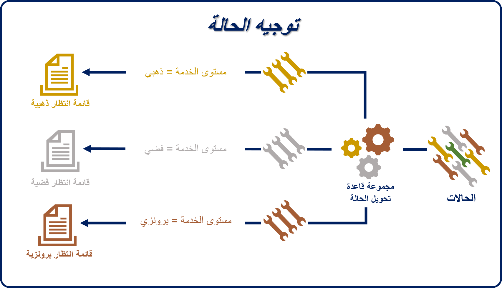
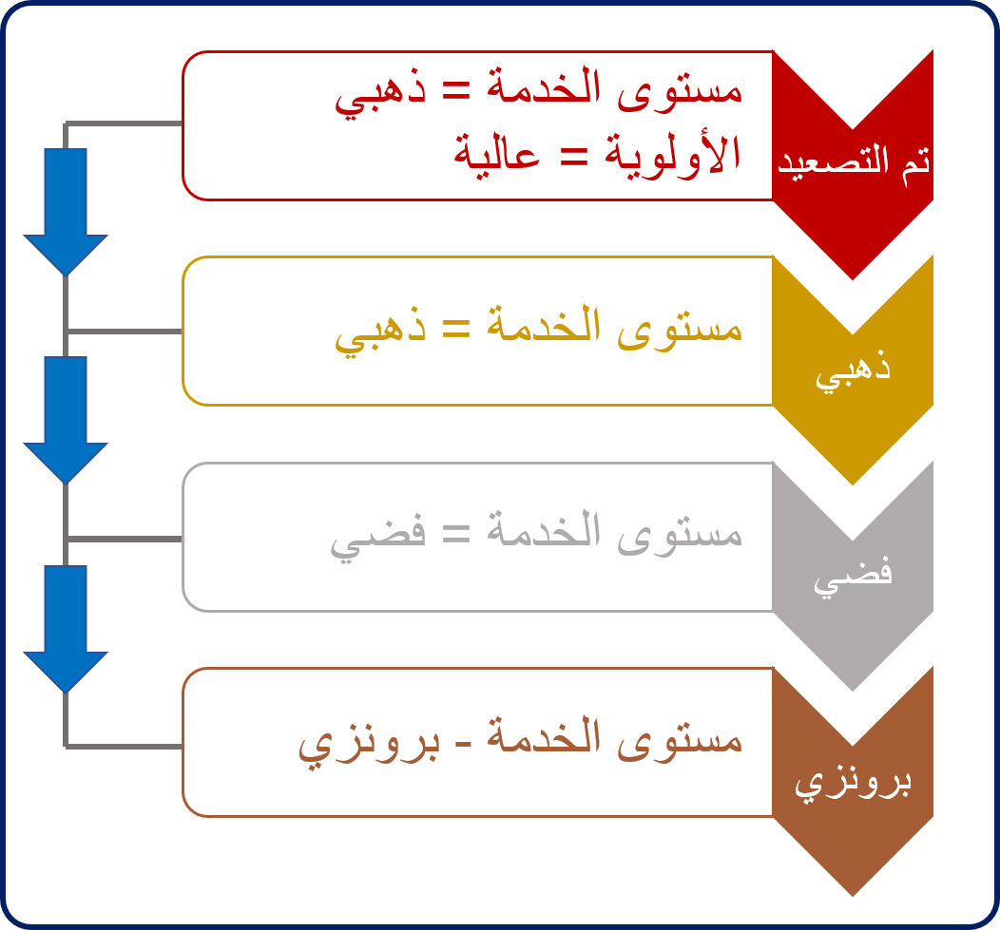

اعتماداً على مؤسستك، يمكن أن تختلف طريقة معالجتك لتوجيه عناصر العمل وتوزيعها على المندوبين. قد تقوم مؤسسة أصغر بأخذ حالة جديدة مرتبطة بسؤال الفوترة ونقلها إلى قائمة انتظار الفوترة حتى يقوم مندوب فعلياً بتحديد الحالة أو انتقائها وبدء العمل عليها. من ناحية أخرى، قد تكون لمركز اتصال حاجة ملحة بحيث لا يقتصر فقط على الرغبة في توجيه العناصر المتعلقة بالفوترة إلى قائمة انتظار الفوترة، ولكن قد يرغب أيضاً في تعيين العنصر أو دفعه تلقائياً لعضو في قائمة الانتظار هذه لديه إمكانية للعمل عليه. ويضمن ذلك أنه قد تم تعيين جميع العناصر، مع عدم فقدان أي شيء.  

يوفر Dynamics 365 Customer Service للمؤسسات خيارين مختلفين للتوجيه يمكن تطبيقهما لتلبية احتياجات التوجيه الخاصة بأي مؤسسة، بغض النظر عما إذا كانت مؤسسة صغيرة أو مؤسسة كبيرة.  

- **التوجيه الأساسي**: يُستخدم عادة لتوجيه السجلات، مثل الحالات، والعملاء المحتملين، والبريد الإلكتروني، وغير ذلك إلى الأفراد، أو الفِرق، أو قوائم الانتظار استناداً إلى معايير القواعد المختلفة المحددة.  وعادة ما تكون المعايير المستخدمة مع ميزة التوجيه الأساسي أساسية وبسيطة.  (ستقوم بدراسة التوجيه الأساسي بمزيد من التفصيل لاحقاً في هذه الوحدة.)
- **التوجيه الموحد (التوجيه المتقدم)**: يوفر قدرات توجيه أكثر تقدماً لتوجيه العمل الوارد إلى المندوب وقائمة الانتظار الأكثر ملاءمة.  يوفر التوجيه الموحد قدرات توجيه أكثر تقدماً.  

التوجيه الموحد ليس محور التركيز الأساسي لهذه الوحدة. يمكنك معرفة المزيد حول التوجيه الموحد في [الشروع في العمل باستخدام التوجيه الموحد](/training/modules/unified-routing/).

يمكن تطبيق ميزات التوجيه الأساسي المتوفرة في Dynamics 365 Customer Service عندما ترغب في تعيين السجلات مثل الحالات إلى الأفراد، أو الفِرق، أو قوائم الانتظار.  سيقوم التوجيه الأساسي بتعيين العناصر استناداً إلى منطق محدد مسبقاً يستند إلى خصائص السجل لتحديد قائمة الانتظار التي سيتم توجيه الحالة إليها.

يمكنك إنشاء مجموعات قواعد التوجيه في **مركز مسؤولي Customer Service** لتوجيه الحالات تلقائياً. انتقل إلى **دعم العملاء**، وحدد **التوجيه**، ثم حدد **مجموعات قواعد التوجيه (الأساسية).**  

> [!NOTE]
> ترتبط مجموعات قواعد التحويل الجاهزة بسجلات الحالات. ومع ذلك، يمكنك إعداد نفس النوع من السلوك لأنواع السجلات الأخرى التي تستخدم قوائم الانتظار.  في هذه الحالات، يمكنك استخدام خيارات أخرى مثل Power Automate.  

عند إنشاء قاعدة لأول مرة، يكون تحديد اسم للقاعدة. بعد تحديد اسم للقاعدة وحفظها، يمكن إضافة أصناف إلى القاعدة. تحدد أصناف القاعدة "ماذا" و"أين" لمجموعة القواعد. يحدد عنصر القاعدة الشروط التي سيتم تقييمها لتوجيه الحالات إلى قائمة انتظار أو مندوب أو فريق.

على سبيل المثال، عند إنشاء الحالات، يمكن تعيين الحقل مستوى الخدمة يدوياً أو تلقائياً استناداً إلى احتياجات المؤسسة. لضمان توجيه الحالات إلى قائمة الانتظار الصحيحة استناداً إلى مستوى الخدمة الخاص بها، قد تحتوي مجموعة قواعد التوجيه المسماة *توجيه الحالة* على عناصر القواعد الثلاثة التالية:

- **المسار الذهبي:** يمكنك توجيه أي حالة تتميز بمستوى خدمة ذهبي إلى صف الانتظار الذهبية.

- **المسار الفضي:** يمكنك توجيه أي حالة تتميز بمستوى خدمة فضي إلى صف الانتظار الذهبية.

- **المسار الفضي:** يمكنك توجيه أي حالة تتميز بمستوى خدمة فضي إلى صف الانتظار الفضية.

يحتوي كل صنف قاعدة على قسمين: **الحالات الشرطية If** و **الحالات الشرطية Then**.

- **الحالات الشرطية If (إذا):** تحديد الحالات المعينة لتحديد ما إذا كان صنف القاعدة ينطبق أم لا. يمكن للحالات تقييم الحقول من سجل الحالة، أو من السجلات ذات الصلة مثل الحساب المرتبط. يمكن استخدام حالات **و** أو **أو** متعددة في صنف قاعدة واحد. (بشكل افتراضي، تكون الحالات هي حالات **و**.)

- **الحالات التالية:** حدد المكان الذي يجب توجيه الصنف إليه:

    - **صف الانتظار:** يمكنك توجيه الصنف إلى صف انتظار معينة (عامة أو خاصة).

    - **المستخدم/الفريق:** يمكنك توجيه الصنف إلى مستخدم معين أو فريق.

> [!div class="mx-imgBorder"]
> 

يتم تطبيق أصناف القاعدة بالترتيب المحدد في مجموعة القواعد. يتم تطبيق أصناف قاعدة المطابقة الأول التي تم العثور عليها ضمن الحالة. لا تقوم مجموعة القواعد بتقييم أصناف القاعدة المتبقية لمحاولة إيجاد تطابق أفضل. نوصي بشدة بوضع عناصر قاعدة أكثر تحديداً بمستوى أعلى ضمن مجموعة القواعد، بحيث يتم التحقق منها أولاً.

على سبيل المثال، في الصورة التالية، تشير أصناف قاعدة "التصعيد" و"الذهبية" إلى مستوى الخدمة الذهبية. نظراً لأن أصناف قاعدة التصعيد ذات أولوية عالية، يجب تقييمها قبل القاعدة الذهبية. وإلا، فلن يتم التحقق من صنف قاعدة التصعيد.

